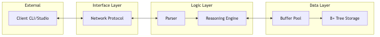

# KBMS (Knowledge Base Management System) - V3.4 Stable

[](https://opensource.org/licenses/MIT)
[]()
[]()

**KBMS** là một hệ quản trị cơ sở tri thức (Knowledge Base Management System) hiện đại, được thiết kế để lưu trữ, truy vấn và suy diễn các mô hình tri thức phức tạp. Hệ thống hỗ trợ mô hình tri thức thực thể và tính toán (COKB), cho phép giải quyết các bài toán từ hình học, tài chính đến chẩn đoán y tế thông qua ngôn ngữ **KBQL**.


*Hình: Kiến trúc thực thi phân tầng của KBMS*

---

## Tính năng Cốt lõi

* **Bộ máy Suy diễn Mạnh mẽ:** Hỗ trợ suy diễn tiến (Forward Chaining) và giải hệ phương trình đa biến (Brent's Method, Newton-Raphson).
* **Lưu trữ Hiệu suất cao:** Sử dụng cây B+ Tree trên Slotted Pages, quản lý bộ nhớ đệm (Buffer Pool LRU) và đảm bảo an toàn dữ liệu với Write-Ahead Logging (WAL).
* **Bảo mật Công nghiệp:** Mã hóa mật khẩu SHA-256 kèm Salt, phân quyền người dùng (RBAC) và đặc quyền trên từng KB.
* **Ngôn ngữ KBQL:** Ngôn ngữ truy vấn mạnh mẽ, hỗ trợ DDL (CREATE), DML (INSERT/UPDATE), và DQL (SELECT/INFER).
* **Giao tiếp Nhị phân:** Giao thức TCP nhị phân tùy chỉnh (Binary Protocol) tối ưu hóa cho tốc độ truyền tải và xử lý dòng (Streaming).

---

## Hướng dẫn Hệ thống Tài liệu (Documentation)

Bộ tài liệu chi tiết của KBMS được tổ chức khoa học để giúp bạn tiếp cận hệ thống từ mọi cấp độ:

### 1. Bắt đầu nhanh (Getting Started)
* [Giới thiệu tổng quan](docs/01-getting-started/01-introduction.md) - Cách cài đặt và chạy truy vấn đầu tiên.
* [Thuật ngữ & Khái niệm](docs/01-getting-started/02-glossary.md) - Giải thích GT, KL, FClosure, Fact...
* [Triển khai & Tối ưu](docs/01-getting-started/03-deployment-tuning.md) - Docker, `kbms.ini` và cấu hình Production.

### 2. Kiến trúc & Bảo mật (Architecture)
* [Tổng quan Kiến trúc](docs/02-architecture/01-overview.md) - Sơ đồ Use Case và Layered Architecture.
* [Các thành phần lõi](docs/02-architecture/02-components.md) - Parser, Reasoning, Storage Engine.
* [Quản trị & Bảo mật](docs/02-architecture/03-security.md) - Cơ chế Auth và Privileges.

### 3. Tham chiếu Ngôn ngữ KBQL
* [Tài liệu Ngôn ngữ](docs/03-kbql-reference/) - Chi tiết cú pháp DDL, DML, DQL và quy tắc suy diễn.

### 4. Kỹ thuật Chuyên sâu (Internals)
* [Storage Engine](docs/04-storage/01-overview.md) - B+ Tree, Paging, Buffer Pool & WAL.
* [Reasoning Engine](docs/05-reasoning/01-reasoning-engine.md) - Forward Chaining & Equation Solving.
* [Network Layer](docs/06-network/01-protocol.md) - Đặc tả Giao thức nhị phân và Packet Handling.

### 5. Thực hành & Mở rộng
* [Gói Tri thức Mẫu](docs/08-use-cases/03-samples.md) - Các template về Tài chính, Động vật, Quản lý kho.
* [Ví dụ Hình học](docs/08-use-cases/01-geometry.md) & [Ví dụ Y tế](docs/08-use-cases/02-medical-diagnosis.md).
* [Developer Guide](docs/10-developer/01-extensibility.md) - Cách mở rộng Function và Operator mới.

---

## ️ Cài đặt & Chạy thử

Yêu cầu: **.NET 8.0 SDK** đã được cài đặt trên máy tính của bạn.

```bash
# 1. Clone repository
git clone https://github.com/tranphat1506/KBMS.git
cd KBMS

# 2. Khởi chạy Server
cd KBMS.Server
dotnet run

# 3. Kết nối bằng CLI (trong một Terminal mới)
cd KBMS.CLI
dotnet run
```

---

## Ví dụ KBQL nhanh

```sql
-- Định nghĩa Khái niệm hình học
CREATE CONCEPT Triangle (
 VARIABLES ( a: DOUBLE, b: DOUBLE, c: DOUBLE, s: DOUBLE ),
 CONSTRAINTS ( a + b > c, a + c > b, b + c > a ),
 EQUATIONS ( s = (a + b + c) / 2 )
);

-- Thêm dữ liệu và yêu cầu suy diễn
INSERT INTO Triangle ATTRIBUTE ( a: 3, b: 4, c: 5 );
SELECT s FROM Triangle; -- Hệ thống sẽ tự động tính s = 6.0
```

---
*© 2026 Phát triển bởi GeminiCanCode. Tất cả các quyền được bảo lưu.*
