# KBMS (Knowledge Base Management System) - Full Documentation

# 01 Introduction

## File: 01-trinh-bay-de-tai.md
# Giới thiệu đề tài

## 1. Lý do chọn đề tài

Trong kỷ nguyên chuyển đổi số, nhu cầu về việc quản trị và khai thác tri thức đã trở nên cấp thiết hơn bao giờ hết. Các hệ quản trị cơ sở dữ liệu truyền thống (RDBMS) mặc dù rất mạnh mẽ trong việc lưu trữ và truy xuất dữ liệu có cấu trúc, nhưng vẫn còn nhiều hạn chế trong việc tự động suy diễn ra các tri thức mới từ tập dữ liệu hiện có. 

Việc tích hợp trí tuệ nhân tạo, cụ thể là các hệ thống dựa trên tri thức (Knowledge-based systems), vào tầng lưu trữ dữ liệu giúp rút ngắn khoảng cách giữa "Dữ liệu thô" và "Tri thức hữu ích" [1]. Đề tài "Xây dựng Hệ quản trị Cơ sở tri thức (KBMS) dựa trên mô hình COKB" được lựa chọn nhằm giải quyết bài toán này.

## 2. Mục tiêu nghiên cứu

Mục tiêu chính của đề tài là xây dựng một hệ thống KBMS hoàn chỉnh, có khả năng:
1.  **Biểu diễn tri thức chuyên sâu**: Sử dụng mô hình COKB [1], [3] để định nghĩa các thực thể có khả năng tính toán.
2.  **Suy diễn tự động hiệu năng cao**: Áp dụng thuật toán F-Closure để tìm tập đóng tri thức một cách tối ưu [2], [4].
3.  **Lưu trữ bền vững và an toàn**: Phát triển công cụ lưu trữ nhị phân hỗ trợ chỉ mục B+ Tree [5], [10] và nhật ký Write-Ahead Logging (WAL) [5].
4.  **Giao diện phát triển trực quan**: Cung cấp Studio IDE giúp người dùng thiết kế và kiểm chứng tri thức.

## 3. Đối tượng và Phạm vi nghiên cứu

*   **Đối tượng**: Các mô hình biểu diễn tri thức, thuật toán suy diễn tiến (Forward Chaining) và các kỹ thuật quản lý CSDL.
*   **Phạm vi**: 
    *   **Quản lý tri thức**: Thực hiện các thao tác thêm, sửa, xóa và tìm kiếm tri thức chuyên sâu qua ngôn ngữ KBQL.
    *   **Suy diễn tri thức**: Xây dựng bộ máy suy duyễn dựa trên tập luật và sự thật hiện có để sinh ra tri thức mới.
    *   **Lưu trữ**: Nghiên cứu phương pháp lưu trữ tri thức bền vững dưới cấu trúc mô hình đối tượng tính toán (COKB).

## 4. Ý nghĩa khoa học và thực tiễn

Đề tài góp phần chuẩn hóa phương pháp xây dựng hệ thống tri thức có khả năng mở rộng (Scale-out) và tính linh hoạt cao trong việc thay đổi luật mà không cần can thiệp vào mã nguồn ứng dụng. Đây là nền tảng quan trọng cho việc phát triển các hệ chuyên gia và hệ trợ giúp quyết định thông minh.

## 5. Bố cục đề tài

Báo cáo được tổ chức thành 05 chương trọng tâm với nội dung chi tiết như sau:

*   **Chương 1  Giới thiệu và Cơ sở lý thuyết**: Trình bày lý do chọn đề tài, mục tiêu nghiên cứu, đồng thời phân tích tổng quan về mô hình Đối tượng Tính toán (COKB) và nền tảng logic suy diễn đại số.
*   **Chương 2  Phân tích và Thiết kế hệ thống**: Khảo sát hiện trạng, phân tích các yêu cầu chức năng (Truy vấn, Suy diễn) và phi chức năng để phác thảo kiến trúc tổng thể.
*   **Chương 3  Kiến trúc hệ thống và các tầng xử lý**: Chương trọng tâm mô tả chi tiết kiến trúc 4 tầng (Mạng, Máy chủ, Suy diễn, Lưu trữ) cùng các thành phần Lexer/Parser và công cụ CLI/Studio.
*   **Chương 4  Cài đặt và Kiểm thử hệ thống**: Hướng dẫn triển khai môi trường, cài đặt các phân hệ và trình bày kết quả thực nghiệm, đánh giá hiệu năng vận hành thực tế.
*   **Chương 5  Kết luận và Hướng phát triển**: Tổng kết các kết quả đạt được, chỉ ra những hạn chế hiện tại và đề xuất lộ trình nâng cấp hệ thống trong tương lai.


---

## File: 02-theory.md
# Cơ sở lý thuyết

## Mô hình Đối tượng Tính toán

Mô hình **COKB (Computational Objects Knowledge Base)** [1] là sự mở rộng của các hệ thống logic truyền thống, tích hợp khả năng tính toán mạnh mẽ vào các cấu trúc đối tượng, phục vụ như là định dạng lưu trữ và biểu diễn bộ não cốt lõi của hệ thống KBMS.

### 1. Thành phần Hệ thống tri thức

Một cơ sở tri thức COKB được xác định bởi bộ 6 thành phần [1], [3]:
$$COKB = (C, H, R, Ops, Funcs, Rules)$$

Trong đó:
- **C (Concepts)**: Tập hợp các khái niệm hoặc lớp đối tượng tính toán.
- **H (Hierarchy)**: Các quan hệ phân cấp đặc biệt hóa giữa các khái niệm (quan hệ IS-A).
- **R (Relations)**: Tập các quan hệ ngữ nghĩa giữa các lớp đối tượng (ví dụ: song song, vuông góc).
- **Ops (Operators)**: Các toán tử tính toán trên các miền giá trị (Số thực, Vector, Ma trận).
- **Funcs (Functions)**: Các hàm xác định ánh xạ giữa các thuộc tính.
- **Rules (Rules)**: Tập hợp các luật dẫn để suy diễn ra tri thức mới.

### 2. Mô hình Đối tượng Tính toán

Mỗi thực thể (Object) trong hệ thống được biểu diễn bởi bộ ba thành phần [2]:
$$O = (Attrs, Facts, Rules)$$

- **Attrs (Attributes)**: Tập các thuộc tính của đối tượng. Mỗi thuộc tính bản thân nó cũng có thể là một đối tượng tính toán khác (cấu trúc đệ quy) [4].
- **Facts**: Các sự thật, giá trị hoặc tính chất vốn có của đối tượng đã được xác định.
- **Rules (Internal Rules)**: Các quy tắc, phương trình nội tại ràng buộc mối quan hệ giữa các Attrs bên trong đối tượng đó.

### 3. Phân cấp Khái niệm (Concept Levels)

Trong mô hình COKB, các khái niệm được phân tầng dựa theo độ phức tạp của cấu trúc attributes:
- **Cấp 0 (Base Concepts)**: Các kiểu dữ liệu cơ sở (Số thực - ℝ, Điểm - Point).
- **Cấp 1**: Các khái niệm xây dựng trực tiếp từ cấp 0 (Đoạn thẳng, Góc).
- **Cấp n**: Các khái niệm phức tạp hình thành từ các lớp thấp hơn (Tam giác, Tứ giác, Động cơ).

Việc phân cấp này giúp hệ thống quản lý tri thức theo hướng mô-đun hóa và hỗ trợ lan truyền kế thừa tri thức một cách tự động.


## Cơ chế Suy luận và Giải quyết vấn đề

Dựa trên cấu trúc mô hình COKB, quá trình giải quyết bài toán thực chất là quá trình mở rộng tập sự thật thông qua cơ chế lan truyền dữ kiện trên mạng lưới thực thi phi tuần tự, cho phép hệ thống tự động phát sinh tri thức dẫn xuất từ tập giả thiết ban đầu.

### 1. Các Quy tắc Suy luận (Reasoning Rules)

Hệ thống KBMS vận hành dựa trên 6 loại quy tắc suy luận chính (RC1 - RC6), được ánh xạ trực tiếp vào các nút trong mạng lưới suy diễn [6]:

*   **RC1 (Vốn có)**: Dẫn xuất sự kiện từ các thuộc tính định nghĩa của đối tượng.
*   **RC2 (Mặc nhiên)**: Các phép biến đổi đồng nhất và bắc cầu giữa các thực thể tri thức.
*   **RC3 (Thay thế quan hệ)**: Sử dụng các quan hệ tính toán để xác định giá trị biến thông qua các nút so khớp điều kiện.
*   **RC4 (Luật dẫn)**: Thực thi các luật logic dạng mệnh đề thông qua cấu trúc nốt Terminal.
*   **RC5 (Giải hệ phương trình)**: Phối hợp các ràng buộc toán học để giải quyết các hệ phương trình phi tuyến đa biến.
*   **RC6 (Hành vi nội bộ)**: Suy diễn dựa trên cấu trúc thành phần (PART-OF) và phân bậc tri thức.

---

# 02 Analysis And Design

## File: 01-survey-and-objectives.md
# 03.1. Khảo sát Hiện trạng & Mục tiêu

Dự án KBMS (Knowledge Base Management System) được xây dựng nhằm thu hẹp khoảng cách giữa các hệ quản trị CSDL truyền thống và các hệ thống chuyên gia dựa trên tri thức.

## 1. Khảo sát Hiện trạng

Dựa trên phân tích so sánh với các hệ thống hiện có, chúng tôi nhận thấy các giới hạn sau:

### 2.3.2 Jess (Java Expert System Shell)
Jess [22] là phiên bản Java của CLIPS. Dự án đã ngừng phát triển tích cực và không còn được cập nhật cho các nền tảng hiện đại.

### 2.3.3 Drools (JBoss Rules Engine)
Drools [23] sử dụng giải thuật Rete cải tiến (Phreak), được ứng dụng rộng rãi trong quản lý quy tắc kinh doanh (Business Rule Management). Drools được thiết kế chủ yếu cho business logic, không tối ưu cho suy luận toán học.

### 2.3.4 SWI-Prolog
SWI-Prolog [24] hỗ trợ mạnh suy luận lùi (Backward Chaining) thông qua cơ chế unification. Nhược điểm là thiếu kiến trúc Client-Server và thiếu lưu trữ vĩnh cửu.

### 2.3.5 Protégé
Protégé [25] là công cụ của Đại học Stanford dùng để chỉnh sửa Ontology theo chuẩn OWL. Protégé chủ yếu là trình soạn thảo, không phải hệ quản trị tri thức hoàn chỉnh.

### 2.3.6 Cyc
Cyc [40] là dự án AI tham vọng nhất trong lịch sử, khởi động từ năm 1984 bởi Douglas Lenat nhằm mã hóa toàn bộ tri thức thường thức (common sense). Cyc sử dụng ngôn ngữ CycL dựa trên logic vị từ bậc nhất. Mặc dù quy mô tri thức rất lớn (hơn 1.5 triệu assertions), Cyc thiếu khả năng tính toán định lượng trên đối tượng và không được thiết kế cho các bài toán kỹ thuật có tính toán phức tạp.

### 2.3.7 Bảng Tổng hợp So sánh Các Hệ thống Quản trị Tri thức

| Tiêu chí | CLIPS [21] | Jess [22] | Drools [23] | SWI-Prolog [24] | Protégé [25] | Cyc [40] | **KBMS COKB** |
| :--- | :--- | :--- | :--- | :--- | :--- | :--- | :--- |
| **Suy luận tiến** | Có | Có | Có | Không | Hạn chế | Có | **Có** |
| **Suy luận lùi** | Không | Không | Không | Có | Hạn chế | Có | **Có** |
| **Tính toán số học** | Hạn chế | Hạn chế | Hạn chế | Hạn chế | Không | Không | **Mạnh** |
| **Lưu trữ** | Không | Không | DBMS ngoài | Không | File OWL | Có | **B+ Tree + WAL** |
| **Mã hóa dữ liệu** | Không | Không | Không | Không | Không | Không | **AES-256** |
| **Client-Server** | Không | Không | Có | Không | Không | Có | **Có (TCP)** |
| **Ngôn ngữ truy vấn** | CLIPS DSL | Jess DSL | DRL | Prolog | SPARQL | CycL | **KBQL** |


### Ưu thế vượt trội của KBMS

1.  **Sự kết hợp giữa Persistence và Reasoning**: KBMS tích hợp **Rete Network** trực tiếp trên tầng **Physical Storage**, cho phép suy diễn thời gian thực trên hàng triệu thực thể được lưu trữ bền vững thông qua cơ chế lan truyền dữ kiện gia tăng.
2.  **Giao diện Phát triển (Studio IDE)**: Cung cấp môi trường trực quan hóa đồ thị tri thức và hỗ trợ IntelliSense, giúp rút ngắn thời gian thiết kế bài toán.
3.  **Hiệu năng Truyền tin (Network Layer)**: Sử dụng giao thức nhị phân (Binary Protocol) giúp đạt tốc độ xử lý cao với độ trễ tối thiểu.

**Kết luận:** Cần có một hệ thống kết hợp được cả **Hiệu năng lưu trữ (Indexing/WAL)** và **Khả năng suy diễn (Inference Engine) dựa trên mô hình sự kiện**.

---

## 2. Mục tiêu Nghiên cứu

Dự án KBMS hướng tới việc xây dựng một hệ quản trị tri thức toàn diện với các mục tiêu cụ thể:
1.  **Storage Engine:** Phát triển cấu trúc cây B+ Tree nhị phân và cơ chế ghi nhật ký phục hồi (WAL) để quản lý hàng triệu thực thể tri thức bền vững [5], [10].
2.  **Reasoning Engine:** Xây dựng bộ máy suy diễn tiến (Forward Chaining) tiên tiến dựa trên mạng lưới Rete và thuật toán bao đóng F-Closure, đảm bảo tốc độ phản hồi tối ưu thông qua so khớp luật phi tuần tự [1], [6], [9].
3.  **Language Compiler:** Thiết kế ngôn ngữ KBQL (Knowledge Base Query Language) và bộ biên dịch (Parser/Lexer) hỗ trợ KDL (Định nghĩa) và KQL (Truy vấn) [6].
4.  **Integrated IDE:** Phát triển môi trường Studio IDE chuyên nghiệp giúp trực quan hóa và thiết kế tri thức dễ dàng.

---

## File: 02-user-and-roles.md
# 03.2. Tác nhân & Vai trò Hệ thống

Hệ thống KBMS được thiết kế để phục vụ các nhu cầu khác nhau từ học tập, nghiên cứu đến triển khai hệ thống công nghiệp.

## 1. Phân loại Người dùng

### Học viên / Nghiên cứu sinh
*   **Nhu cầu**: Thiết kế các mô hình tri thức lý thuyết (Hình học, Y học, Hóa học).
*   **Công cụ**: Sử dụng **KBMS Studio** làm môi trường chính để vẽ đồ thị tri thức và định nghĩa tập luật.
*   **Hành động**: CREATE CONCEPT, INSERT FACT, SOLVE bài toán.

### Quản trị viên
*   **Nhu cầu**: Giám sát sức khỏe hệ thống và duy trì tính toàn vẹn của dữ liệu lớn.
*   **Công cụ**: Sử dụng **System Dashboard** trong Studio và **CLI Management commands**.
*   **Hành động**: REINDEX, CHECKPOINT, Quản lý Roles (GRANT/REVOKE), Giám sát RAM/Disk.

### Nhà phát triển
*   **Nhu cầu**: Tích hợp KBMS làm lõi thông minh cho các ứng dụng Expert System khác.
*   **Công cụ**: Sử dụng **KBMS CLI** và tương tác trực tiếp qua **Binary Protocol**.
*   **Hành động**: Bulk Insert, Tự động hóa qua Script (.kbql), Xử lý luồng kết quả Streaming.

## 2. Mô hình Phân quyền

Hệ thống sử dụng cơ chế **Role-Based Access Control** để bảo mật tri thức:
*   **Admin**: Toàn quyền trên mọi Cơ sở tri thức (KB) và quản lý người dùng.
*   **Researcher**: Quyền đọc/ghi/suy diễn trên các KB được cấp phép.
*   **Guest**: Chỉ có quyền đọc (Read-only) trên các KB công khai.

- Mọi hành động thao tác dữ liệu của người dùng đều được ghi nhận lại trong **Audit Logs** để phục vụ công tác kiểm soát và quản lý.

---

## File: 03-visual-overview.md
# 03.3. Sơ đồ Hoạt động Tổng quát

Tài liệu này trình bày cấu trúc chi tiết và quy trình vận hành phân tầng của hệ thống KBMS.

## 1. Sơ đồ Use Case Hệ thống

Mô tả sự tương tác giữa tác nhân người dùng và các module chức năng chính bên trong hệ thống:

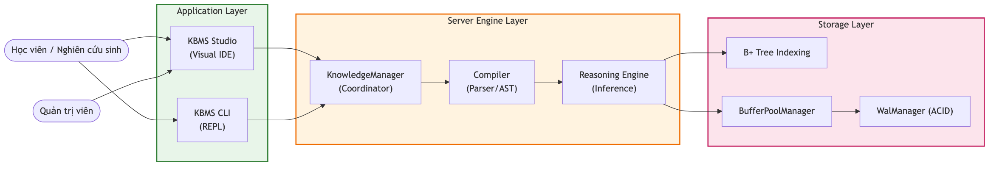
*Hình 3.1: Sơ đồ Use Case tổng quát sự tương tác giữa người dùng và các dịch vụ lõi.*

---

## File: 04-system-requirements.md
# 03.4. Đặc tả Yêu cầu Hệ thống KBMS

Phần này trình bày tóm tắt các yêu cầu cốt lõi của hệ thống KBMS, tập trung vào các khả năng chức năng chính và đề xuất khung công nghệ phù hợp để hiện thực hóa kiến trúc 4 tầng đã đề xuất.

---

## 1. Yêu cầu Chức năng Tổng quát

Hệ thống được thiết kế để đáp ứng các nhóm chức năng chính sau đây, tương ứng với mô hình phân tầng:

*   **Quản trị và Tương tác (Application Layer)**: Cung cấp môi trường soạn thảo tri thức chuyên sâu (IDE), hỗ trợ trực quan hóa đồ thị và giao diện dòng lệnh (CLI) để thực thi các kịch bản KBQL phức tạp.
*   **Giao thức và Truyền tải (Network Layer)**: Thiết lập cơ chế giao tiếp nhị phân tối ưu, cho phép truyền tải dữ liệu theo thời gian thực (Streaming) giữa máy khách và máy chủ.
*   **Xử lý và Suy luận (Server Engine Layer)**: Đóng vai trò hạt nhân điều phối, chịu trách nhiệm phân tích cú pháp, tối ưu hóa truy vấn và thực thi các thuật toán suy luận logic (như F-Closure) trên cơ sở tri thức.
*   **Lưu trữ bền vững (Storage Layer)**: Đảm bảo dữ liệu tri thức được tổ chức khoa học dưới dạng phân trang vật lý, hỗ trợ chỉ mục (Indexing) và cơ chế phục hồi sau sự cố (WAL).

---

## 2. Công nghệ sử dụng

Để đạt được hiệu năng và độ ổn định cao nhất, hệ thống KBMS được triển khai dựa trên các nền tảng công nghệ hiện đại sau:

-   **Lõi hệ thống (Server Engine)**: Sử dụng nền tảng **.NET Core** [41] của Microsoft. Đây là khung làm việc đa nền tảng, hỗ trợ các tính năng hiện đại như Garbage Collection (GC) tối ưu, quản lý bộ nhớ an toàn và thư viện lập trình bất đồng bộ (Async/Await) mạnh mẽ, giúp hệ thống xử lý hàng ngàn kết nối đồng thời với độ trễ tối thiểu.
-   **Giao diện Quản trị (KBMS Studio)**: Được phát triển dựa trên thư viện **React** [42] kết hợp với ngôn ngữ **TypeScript**. Việc sử dụng mô hình Component-based giúp giao diện Studio có tính linh hoạt cao và dễ dàng mở rộng. Đặc biệt, hệ thống tích hợp **Monaco Editor** [43] (bộ lõi của VS Code) để cung cấp môi trường soạn thảo tri thức chuyên nghiệp với các tính năng như Highlight cú pháp và IntelliSense.
-   **Giao thức Truyền tải (Network Protocol)**: Hệ thống hiện thực hóa giao thức nhị phân tùy chỉnh trên nền **TCP Socket** dựa trên các nguyên lý mạng máy tính tiêu chuẩn [44]. Giao thức này được thiết kế để tối giản hóa kích thước gói tin, giảm thiểu chi phí Overhead so với các giao thức dạng văn bản như JSON hay XML, từ đó tối ưu hóa băng thông truyền tải tri thức.
-   **Lưu trữ và Truy xuất (Storage Engine)**: Xây dựng bộ máy lưu trữ tự quản dựa trên cấu trúc **Cây B+** (B+ Tree) [5, 10] và cơ chế ghi nhật ký trước (**WAL**) [5] để đảm bảo tính bền vững (Durability) và tuân thủ các tính chất ACID trong giao dịch tri thức.

---

## 3. Yêu cầu Phi chức năng

Bên cạnh các chức năng nghiệp vụ, hệ thống cần hướng tới các mục tiêu chất lượng sau:

*   **Tính toàn vẹn**: Đảm bảo mọi thao tác trên tri thức đều tuân thủ các tính chất Nguyên tố, Nhất quán, Cô lập và Bền vững.
*   **Hiệu năng cao**: Tối ưu hóa tốc độ suy luận và truy xuất dữ liệu với độ trễ thấp, hỗ trợ xử lý đồng thời hàng trăm kết nối.
*   **Bảo mật**: Triển khai cơ chế phân quyền (RBAC) và mã hóa dữ liệu tĩnh (Encryption at Rest) để bảo vệ tài sản tri thức.
*   **Khả năng mở rộng**: Kiến trúc được thiết kế dạng module hóa, cho phép dễ dàng tích hợp thêm các bộ máy suy luận hoặc giao thức lưu trữ mới trong tương lai.


---

# 03 Architecture

## File: 01-system-overview.md
# Tổng quan Kiến trúc và Mô hình Điều phối Hệ thống

Hệ quản trị cơ sở tri thức **KBMS** được xây dựng dựa trên kiến trúc phân lớp (Layered Architecture), cho phép tách biệt các tầng chức năng nhằm tối ưu hóa quá trình xử lý tri thức và quản trị dữ liệu. Kiến trúc này hỗ trợ việc chuyển đổi mô hình lý thuyết **COKB** [1] thành một hệ thống thực thi ổn định, đảm bảo tính mở rộng và khả năng bảo trì mã nguồn trong dài hạn.

Nội dung chương này tập trung phân tích cấu trúc tổng thể của hệ thống, luồng dữ liệu giữa các tầng và các giải pháp công nghệ cốt lõi được áp dụng trong quá trình triển khai.

## 1. Kiến trúc Phân lớp Chức năng

Hệ thống được chia thành bốn lớp chức năng chính, mỗi lớp đảm nhiệm một vai trò cụ thể trong chu trình xử lý tri thức từ mức ứng dụng đến mức lưu trữ vật lý:


*Hình 4.1: Sơ đồ kiến trúc phân lớp chức năng của hệ thống KBMS.*

Đặc tả các lớp chức năng:

-   **Lớp Ứng dụng (Application Layer)**: Cung cấp giao diện tương tác cho người dùng. Phân hệ này bao gồm **KBMS Studio** (môi trường phát triển tích hợp dựa trên React và Electron) và **KBMS CLI** (giao diện dòng lệnh). Các ứng dụng này hỗ trợ biên tập tri thức, trực quan hóa mô hình và quản trị hệ thống.
-   **Lớp Mạng (Network Layer)**: Thực hiện truyền dẫn dữ liệu giữa Client và Server thông qua các gói tin nhị phân. Lớp này quản lý việc tuần tự hóa đối tượng (Serialization), thiết lập phiên làm việc (Session) và đảm bảo an toàn dữ liệu bằng các giao thức socket bất đồng bộ.
-   **Lớp Xử lý Server (Server Engine Layer)**: Là thành phần điều phối trung tâm của hệ thống. Tại đây, các câu lệnh ngôn ngữ **KBQL** được phân tích cú pháp để tạo thành Cây cú pháp trừu tượng (**AST**). Dựa trên AST, hệ thống điều hướng yêu cầu tới bộ máy suy diễn (**Inference Engine**) hoặc bộ phân tích truy vấn dữ liệu.
-   **Lớp Lưu trữ (Storage Layer)**: Đảm nhiệm việc lưu trữ và truy xuất dữ liệu từ các thiết bị lưu trữ thứ cấp. Sử dụng cấu trúc **Slotted Page** và chỉ mục **B+ Tree** [5, 10], lớp này đảm bảo các thuộc tính **ACID** cho giao dịch và sử dụng nhật ký ghi trước (**WAL**) [5] để phục hồi dữ liệu khi xảy ra sự cố.

## 2. Quy trình Điều phối và Luồng Xử lý Dữ liệu

Quy trình xử lý một yêu cầu trong KBMS bắt đầu từ việc tiếp nhận chuỗi ký tự từ lớp ứng dụng và chuyển hóa thành các tác vụ thực thi tại hạ tầng. Đối tượng trung tâm xuyên suốt quá trình này là Cây cú pháp trừu tượng (AST).

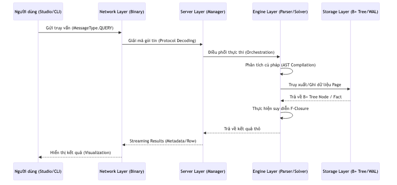
*Hình 4.2: Sơ đồ tuần tự mô tả luồng xử lý và điều phối dữ liệu qua các lớp.*

Khi một lệnh được gửi đến, luồng xử lý diễn ra theo các bước:
1.  **Tiếp nhận**: Lớp mạng nhận gói tin và giải mã nội dung lệnh.
2.  **Phân tích**: Bộ phân tích (Parser) xây dựng AST từ câu lệnh.
3.  **Điều hướng**: Hệ thống kiểm tra loại lệnh trong AST. Nếu là lệnh suy diễn, thông tin sẽ được đưa vào mạng lưới **Rete** [9]. Nếu là lệnh quản trị dữ liệu, hệ thống sẽ thực hiện truy xuất trực tiếp các trang dữ liệu (Pages) thông qua Buffer Pool [5].
4.  **Phản hồi**: Kết quả thực thi được đóng gói và gửi ngược lại phía người dùng.

## 3. Các Phân hệ Phụ trợ và Quản trị Hệ thống

Bên cạnh các luồng xử lý tri thức chính, hệ thống triển khai các phân hệ phụ trợ để đảm bảo an ninh và chẩn đoán trạng thái vận hành.

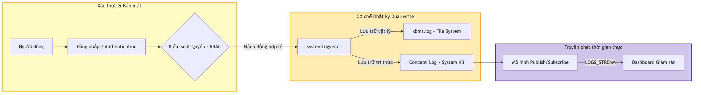
*Hình 4.3: Sơ đồ luồng chẩn đoán và kiểm soát an ninh hệ thống.*

Các phân hệ này bao gồm:
-   **Kiểm soát truy cập (RBAC)**: Xác thực người dùng và phân quyền dựa trên vai trò trước khi thực thi các lệnh đặc quyền.
-   **Ghi nhật ký (Logging)**: Lưu trữ nhật ký kiểm toán (Audit Log) để theo dõi các hành vi tác động đến cơ sở tri thức.
-   **Giám sát (Monitoring)**: Theo dõi các chỉ số tài nguyên như CPU, bộ nhớ RAM và trạng thái của các tệp tin lưu trữ.

## 4. Tổng hợp Công nghệ và Thuật toán Nền tảng

Bảng dưới đây tóm tắt các giải pháp công nghệ chính được ứng dụng trong quá trình cài đặt hệ thống:

*Bảng 4.1: Đặc tả công nghệ và thuật toán tại các phân lớp*
| Lớp kiến trúc | Phân hệ triển khai | Công nghệ và Thuật toán cốt lõi |
| :--- | :--- | :--- |
| **Ứng dụng** | `kbms-studio-ui`, `KBMS.CLI` | React, Electron, TypeScript, Monaco Editor |
| **Mạng** | `KBMS.Server.Network` | Asynchronous Sockets, AES-256, Binary Protocol |
| **Server** | `KBMS.Parser`, `KnowledgeManager`| Phân tích cú pháp LL(k), TAP (Multithreading) |
| **Suy luận** | `KBMS.Reasoning.InferenceEngine`| Suy diễn tiến (Forward Chaining) [6], Mạng Rete [9] |
| **Lưu trữ** | `KBMS.Storage.V3` | Slotted Page, Cây B+ (B+ Tree) [5, 10], WAL [5] |


---

## File: 01-kbms-models.md
# Đặc tả Mô hình Tri thức Hình thức COKB

Mô hình **COKB (Computational Objects Knowledge Base)** [1], [3] là sự giao thoa giữa mô hình lập trình hướng đối tượng và hệ thống logic toán học, cho phép biểu diễn các thực thể tri thức có khả năng tự tính toán và suy luận logic. Hệ quản trị cơ sở tri thức **KBMS** được xây dựng dựa trên hạt nhân là bộ sáu thành phần hình thức cốt lõi:

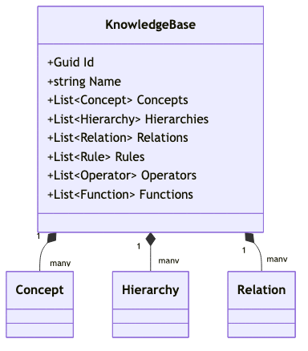
*Hình 4.6: Cấu trúc bộ sáu thành phần hình thức của cơ sở tri thức (C, H, R, Ops, Funcs, Rules).*

Mô hình toán học của cơ sở tri thức được định nghĩa như sau:
$$COKB = (C, H, R, Ops, Funcs, Rules)$$

## 1. Thành phần Khái niệm (C - Concepts)

Khái niệm (**Concept**) là thành phần quan trọng nhất trong hệ thống, đóng vai trò định nghĩa cấu trúc cho các lớp đối tượng tri thức [1], [3]. Mỗi khái niệm $c \in C$ được đặc tả bởi một bộ thành phần cấu trúc nội tại phức hợp:

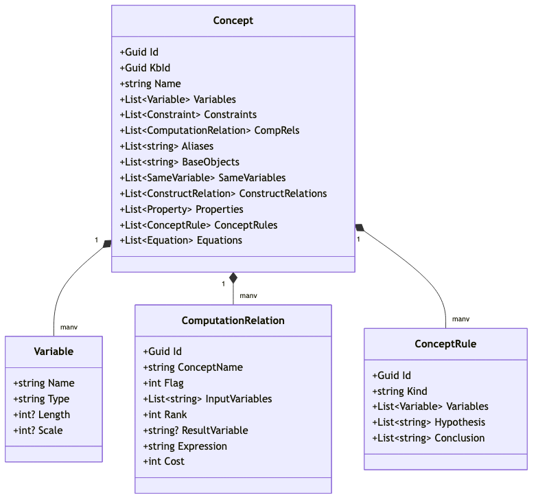
*Hình 4.7: Sơ đồ lớp đặc tả cấu trúc nội tại của một khái niệm (Concept).*

1.  **Biến số (Variables)**: Tập hợp các thuộc tính xác định đặc tính của đối tượng. Mỗi biến bao gồm tên định danh, kiểu dữ liệu, độ dài và mức độ chính xác thập phân.
2.  **Ràng buộc (Constraints)**: Các điều kiện logic (**Expression**) mà đối tượng phải thỏa mãn để đảm bảo tính hợp lệ và toàn vẹn của tri thức hình thức.
3.  **Phương trình (Equations)**: Các công thức toán học xác định mối liên hệ định lượng giữa các biến số bên trong phạm vi khái niệm.
4.  **Quan hệ Tính toán (Computation Relations)**: Đặc tả khả năng tính toán của khái niệm thông qua các tham số về thứ tự (**Rank**), trạng thái (**Flag**) và chi phí thực thi tính toán (**Cost**).
5.  **Luật dẫn Nội tại (Concept Rules)**: Các quy tắc suy diễn cục bộ (Giả thiết $\rightarrow$ Kết luận) có phạm vi áp dụng giới hạn trong nội bộ khái niệm.
6.  **Cấu trúc Mở rộng**: Bao gồm các định danh thay thế (**Aliases**), đối tượng cơ sở (**BaseObjects**), biến tương đương (**SameVariables**) và các quan hệ tạo lập (**ConstructRelations**).

## 2. Thành phần Phân cấp (H - Hierarchy)

Thành phần $H$ đảm nhiệm vai trò quản lý các mối quan hệ cấu trúc giữa các khái niệm thông qua thực thể **Hierarchy**:

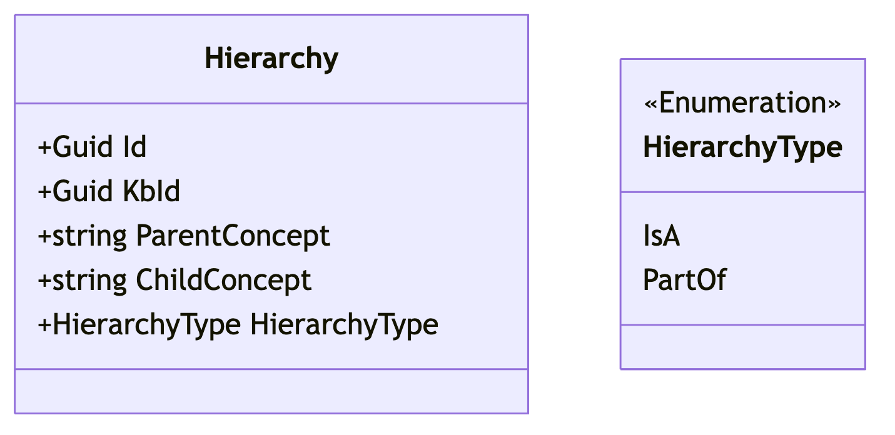
*Hình 4.8: Sơ đồ minh họa quan hệ cha-con thông qua các loại hình phân cấp tri thức.*

-   **Khái niệm Cha và Khái niệm Con**: Xác định điểm đầu và điểm cuối của liên kết phân cấp trong không gian không gian tri thức.
-   **Loại hình Phân cấp (Hierarchy Type)**: Bao gồm quan hệ kế thừa tri thức (**IsA**) và quan hệ cấu trúc thành phần (**PartOf**).

## 3. Thành phần Quan hệ Ngữ nghĩa (R - Relations)

Quan hệ ngữ nghĩa $R$ trong hệ thống KBMS không chỉ đơn thuần là các liên kết tĩnh mà còn mang đặc tính toán học và logic thực thi:

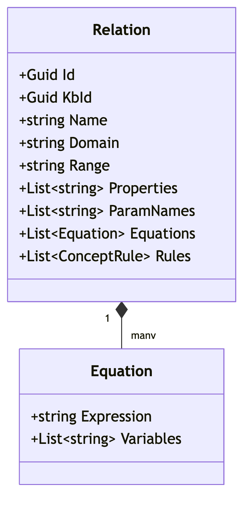
*Hình 4.9: Sơ đồ lớp đặc tả quan hệ ngữ nghĩa với miền xác định, miền giá trị và tri thức nội tại.*

-   **Miền xác định (Domain) và Miền giá trị (Range)**: Xác định phạm vi tác động và biên giới của quan hệ giữa các thực thể tri thức.
-   **Tính chất Quan hệ**: Các đặc tính toán học hình thức như đối xứng (Symmetry), phản xạ (Reflexivity) và tính bắc cầu (Transitivity).
-   **Hợp nhất Tri thức**: Mỗi quan hệ có khả năng tích hợp các phương trình và luật dẫn độc lập để hỗ trợ các quy trình suy diễn phức tạp.

## 4. Thành phần Luật dẫn và Hệ thống Logic (Rules & Logic)

Bộ máy suy diễn sử dụng các luật dẫn toàn cục để thực hiện bao đóng tri thức (Closure) [6]. Mỗi luật dẫn (**Rule**) được cấu tạo từ các tham số kỹ thuật chặt chẽ:

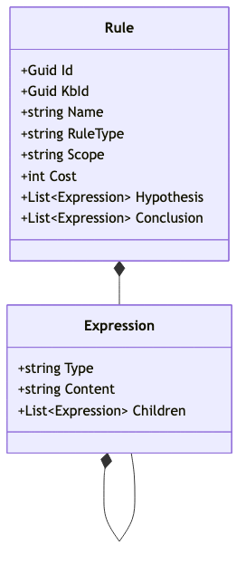
*Hình 4.10: Sơ đồ lớp đặc tả cấu trúc luật dẫn (Rule) và cấu trúc đệ quy của biểu thức logic.*

-   **Phân loại Luật (Rule Type)**: Bao gồm các nhóm luật suy diễn (Deduction), luật mặc định (Default), luật ràng buộc (Constraint) và luật tính toán (Computation).
-   **Phạm vi (Scope)**: Xác định danh mục các khái niệm chịu tác động trực tiếp của luật dẫn.
-   **Giả thiết và Kết luận**: Tập hợp các biểu thức logic (**Expression**). Cấu trúc đệ quy của biểu thức cho phép biểu diễn các công thức toán học và logic với độ phức tạp không giới hạn.

## 5. Thành phần Thực thi (Ops & Funcs)

Đây là các thành phần trực tiếp đảm nhiệm vai trò thực thi các tính toán động trong chu trình vận hành hệ thống:

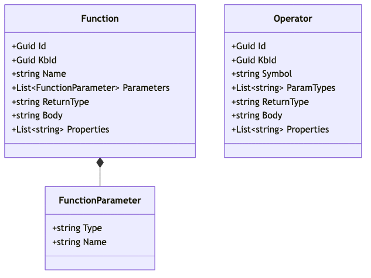
*Hình 4.11: Sơ đồ lớp đặc tả thành phần hàm số và toán tử hệ thống.*

-   **Toán tử (Operators)**: Được đặc tả qua biểu tượng định danh, kiểu tham số đầu vào và khối mã nguồn thực thi tương ứng.
-   **Hàm số (Functions)**: Bao gồm tập hợp tham số, kiểu dữ liệu trả về và logic xử lý nội tại của hàm.

## 6. Thực thể Đối tượng (Object Instances)

Thực thể (**ObjectInstance**) là các thể hiện cụ thể mang giá trị dữ liệu thực tế của một khái niệm trong quá trình vận hành thực tế [4]:

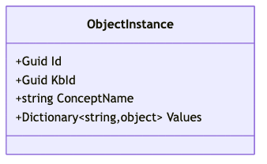
*Hình 4.12: Sơ đồ lớp đặc tả thực thể đối tượng và cơ chế lưu trữ dữ liệu động.*

-   **Định danh Khái niệm**: Tên của khái niệm gốc mà thực thể được khởi tạo.
-   **Tập giá trị (Values)**: Sử dụng cấu trúc từ điển dữ liệu để lưu trữ tập hợp các cặp (**Thuộc tính, Giá trị**). Cơ chế này đảm bảo tính linh hoạt tối đa trong việc quản trị dữ liệu thực thể và tối ưu hóa tài nguyên bộ nhớ đệm.

## 7. Kịch bản Minh họa Thực nghiệm

Để cụ thể hóa các khái niệm lý thuyết, xét mô hình tri thức **Hình học phẳng** tập trung vào thực thể hình thức là **Tam giác**.

### 7.1. Đặc tả Khái niệm (Concept)
Định nghĩa khái niệm `Triangle` trong hệ thống:
- **Biến số**: `a, b, c` (độ dài ba cạnh), `p` (nửa chu vi), `S` (diện tích).
- **Ràng buộc**: $a + b > c, a + c > b, b + c > a$ (Điều kiện tồn tại hình học).
- **Phương trình**: $p = (a + b + c) / 2$ và $S = \sqrt{p(p-a)(p-b)(p-c)}$ (Công thức thực thi Heron).

### 7.2. Đặc tả Phân cấp (Hierarchy)
- **Kế thừa (IsA)**: `RightTriangle` kế thừa `Triangle` (Sở hữu toàn bộ thuộc tính và phương trình của lớp cha nhưng được bổ sung ràng buộc $a^2 + b^2 = c^2$).
- **Thành phần (PartOf)**: Khái niệm `Vertex` (Đỉnh) được xác định là một thành phần cấu trúc của khái niệm `Triangle`.

### 7.3. Đặc tả Quan hệ Ngữ nghĩa (Relation)
- **Quan hệ**: `Similarity(t1: Triangle, t2: Triangle)`.
- **Tính chất**: Đối xứng và Bắc cầu.
- **Logic suy diễn**: Nếu tỷ lệ giữa các cạnh tương ứng đạt mức tương đương thì hệ thống xác lập kết luận đồng dạng giữa $t1$ và $t2$.

### 7.4. Đặc tả Luật dẫn (Rule)
- **Luật**: `R1: Triangle(a==b, b==c) -> Triangle{Type="Equilateral"}`.
- **Ý nghĩa**: Nếu các cạnh có giá trị tương đương, hệ thống tự động xác lập nhãn thực thể là tam giác đều.

### 7.5. Thực thể Đối tượng (Object Instance)
 Một thể hiện cụ thể của khái niệm `Triangle` trong bộ nhớ hệ thống:
 - **ID**: `550e8400-e29b-41d4-a716-446655440000`
- **Khái niệm gốc**: `Triangle`
- **Giá trị thực tế**: `{ "a": 3, "b": 4, "c": 5 }`.


---

## File: 01-architecture-overview.md
# Kiến trúc Tầng Lưu trữ

Tầng Lưu trữ là phân hệ thấp nhất của hệ quản trị KBMS, chịu trách nhiệm quản lý việc ghi dữ liệu tri thức xuống các thiết bị lưu trữ vật lý. Phân hệ này đảm bảo tính bền vững (Durability) và khả năng truy xuất ngẫu nhiên hiệu quả thông qua cấu trúc phân trang.

## 4.4.1. Sơ đồ Cấu trúc Phân hệ Storage

Kiến trúc tầng lưu trữ được tổ chức thành các thành phần chính sau:

1.  **Disk Manager**: Thành phần giao tiếp trực tiếp với hệ điều hành để thực hiện các thao tác đọc/ghi byte thô trên tệp tin `.kdb`.
2.  **Buffer Pool Manager**: Bộ quản lý vùng đệm trên RAM, giúp giảm thiểu số lượng thao tác I/O bằng cách giữ các trang dữ liệu thường xuyên truy cập trong bộ nhớ.
3.  **Page Management**: Định nghĩa cấu trúc vật lý của các khối dữ liệu 16KB, bao gồm Header và vùng dữ liệu Slotted Page.
4.  **Log Manager (WAL)**: Ghi lại mọi thay đổi vào tệp nhật ký trước khi thực hiện ghi lên đĩa, đảm bảo an toàn dữ liệu kể cả khi hệ thống gặp sự cố mất điện.

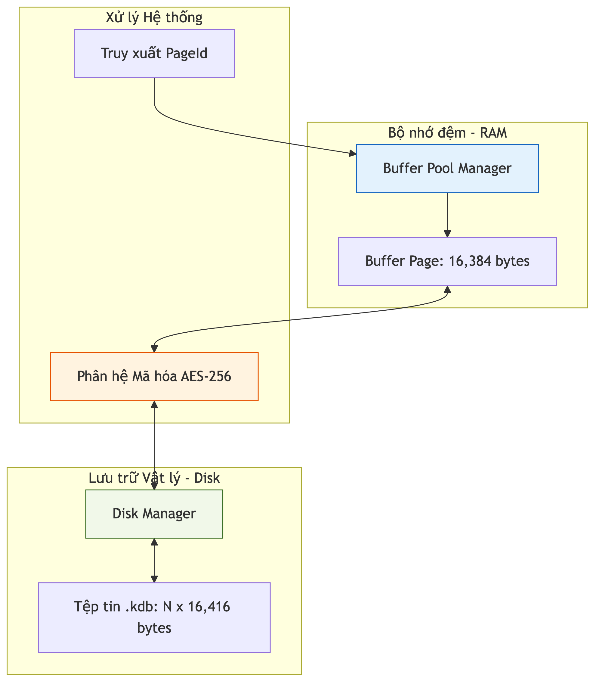
*Hình 4.9: Cấu trúc phân lớp và điều phối luồng dữ liệu tại Tầng Lưu trữ.*

## 4.4.2. Nguyên lý Truy xuất theo Trang (Page-based Access)

Hệ thống không đọc dữ liệu theo dòng (Stream) mà đọc theo từng khối cố định. Mỗi yêu cầu truy xuất dữ liệu từ các tầng trên đều được ánh xạ về một `PageId` cụ thể. 

Công thức tính toán vị trí vật lý trên đĩa (Offset):
$$Offset = PageId \times 16416$$

Kích thước 16,416 byte bao gồm 16KB dữ liệu logic và 32 byte dành cho phần bù mã hóa AES. Việc sử dụng kích thước cố định cho phép hệ thống thực hiện phép nhảy trực tiếp (`Seek`) đến vị trí cần thiết với độ phức tạp $O(1)$, không phụ thuộc vào kích thước tệp tin.

Cấu trúc này là nền tảng để triển khai các thuật toán chỉ mục phức tạp như Cây B+ và quản lý không gian trống một cách hiệu quả.


---

## File: 02-page-management.md
# Quản lý Trang Dữ liệu

Trang dữ liệu (Page) là đơn vị nhỏ nhất trong tiến trình đọc/ghi của KBMS. Chương này phân tích cấu trúc vật lý và logic của một khối dữ liệu 16KB khi lưu trữ trên đĩa cứng.

## 4.4.3. Cấu trúc vật lý của Trang Dữ liệu

KBMS định nghĩa một cấu trúc phân cấp cho một trang dữ liệu để đảm bảo việc bóc tách dữ liệu nhanh chóng và an toàn:

### Cụm trang vật lý (Physical Page Layout)

Mỗi trang khi được lưu trữ trên đĩa có kích thước thực tế là **16,416 byte**, được chia thành các phần sau:

1.  **Dữ liệu logic**: 16,384 byte (16KB) chứa các bản ghi tri thức và siêu dữ liệu của hệ thống.
2.  **Phần bù AES (IV & Padding)**: 32 byte bổ sung phục vụ cho quá trình mã hóa AES-256 (bao gồm 16 byte Vector khởi tạo IV và 16 byte phần bù dữ liệu).

### Cấu trúc nội bộ của Trang logic (16KB)

Bên trong 16,384 byte dữ liệu logic, KBMS chia thành 3 vùng chức năng chính:
-   **Page Header (24B)**: Chứa các thông tin quản trị như `PageId`, `LSN` (Log Sequence Number), và các con trỏ trang liên kết (`PrevPageId`, `NextPageId`).
-   **Slot Array**: Danh sách các con trỏ (Offset và Length) trỏ tới vị trí thực tế của từng bản ghi dữ liệu trong trang.
-   **Data Area**: Vùng chứa các chuỗi nhị phân (Tuples) đại diện cho các thực thể tri thức.

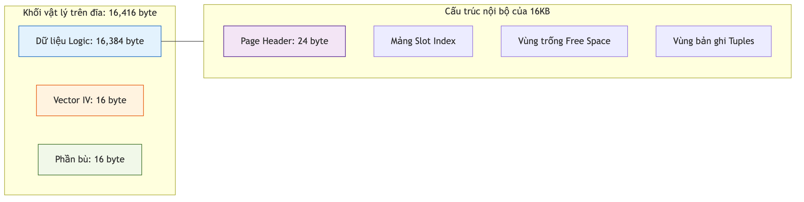
*Hình 4.10: Sơ đồ phân rã các vùng chức năng trong một trang dữ liệu 16KB.*

## 4.4.4. Phân rã Kích thước vật lý

Bảng dưới đây đặc tả chi tiết dung lượng chiếm dụng của từng thành phần trong một trang khi ở trạng thái lưu trữ tĩnh:

*Bảng 4.1: Đặc tả kích thước vật lý của một trang dữ liệu nhị phân*
| Thành phần | Kích thước (Bytes) | Vai trò |
| :--- | :--- | :--- |
| **Logic Data** | 16,384 | Dữ liệu tri thức thực tế (Slotted Page). |
| **AES IV** | 16 | Vector khởi tạo cho thuật toán AES-256. |
| **AES Padding** | 16 | Phần bù để đảm bảo kích thước khối 16 bytes. |
| **Tổng thể** | **16,416** | **Kích thước thực tế trên đĩa cứng**. |

Việc tách biệt rõ ràng giữa kích thước logic và vật lý cho phép `DiskManager` quản lý tệp tin một cách đồng nhất, trong khi `Encryption` có thể thực hiện bảo mật dữ liệu ở mức độ trang một cách độc lập.


---

## File: 03-data-layout-slotted-page.md
# Bố cục Dữ liệu và Slotted Page

KBMS sử dụng mô hình Slotted Page để quản lý các bản ghi (Tuples) có độ dài biến thiên trong một trang cố định 16KB. Chương này cung cấp ví dụ thực tế về cách dữ liệu được ánh xạ vào các ô nhớ nhị phân.

## 4.4.5. Cơ chế Ánh xạ Ô nhớ (Slotted Page Mapping)

Trong mô hình Slotted Page, dữ liệu bản ghi được ghi từ cuối trang ngược lên phía đầu trang. Vùng không gian trống (Free Space) nằm ở giữa Header và các bản ghi:

-   **Header**: Chứa thông tin về số lượng bản ghi và con trỏ vùng trống.
-   **Slot Array**: Các cặp `[Offset, Length]` trỏ đến dữ liệu thực tế.
-   **Tuples**: Dữ liệu tri thức nhị phân của các đối tượng.

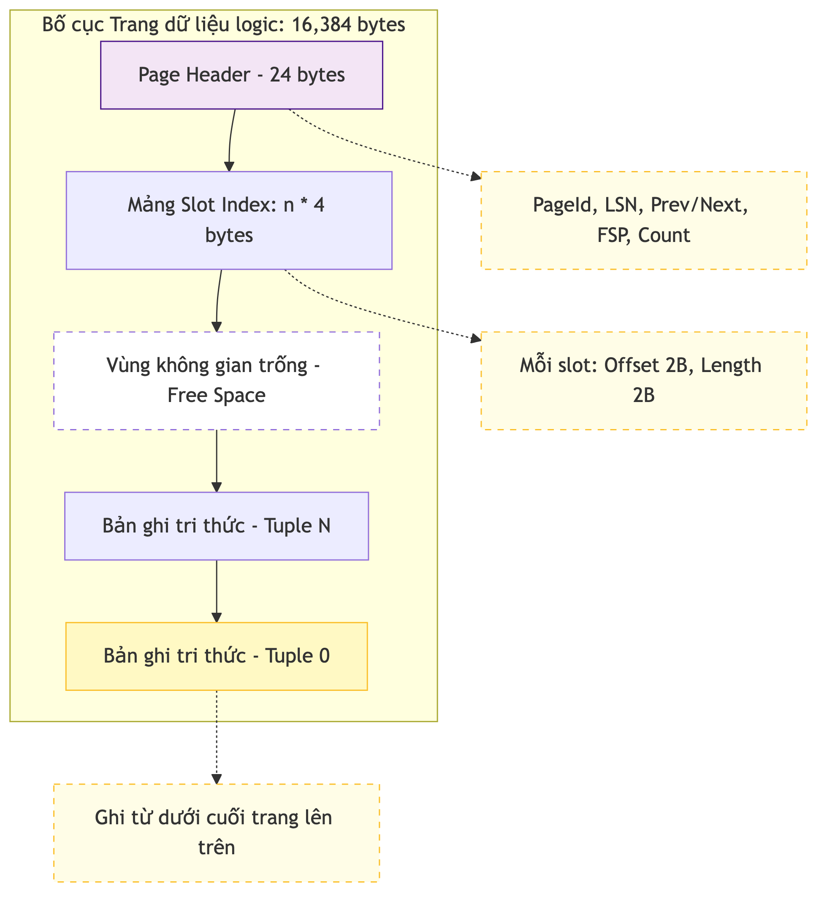
*Hình 4.11: Minh họa vị trí thực tế của một thực thể tri thức trong bộ nhớ nhị phân.*

## 4.4.6. Ví dụ Phân rã mã Hex (Hex Dump)

Giả sử một trang dữ liệu (`PageId=101`) chứa một thực thể `Employee` có kích thước 43 byte. Dưới đây là mô phỏng 64 byte đầu tiên của trang (khi đã giải mã):

```text
Offset    00 01 02 03 04 05 06 07 08 09 0A 0B 0C 0D 0E 0F    Giải mã
-------------------------------------------------------------------------
; --- Header của Trang (Bắt đầu trang) ---
00000000  65 00 00 00 00 00 00 00 FF FF FF FF FF FF FF FF    ........
          [ PageId: 101 ] [ LSN: 0  ] [ PrevPageId: -1    ]
00000010  FF FF FF FF D5 3F 00 00 01 00 00 00 D5 3F 00 00    .....?.......?..
          [ Next: -1  ] [ FSP:16341] [ Count: 1 ] [Slot0: Off=16341, Len=43]

[...] (Vùng trống điền giá trị 0x00)

; --- Dữ liệu Tuple (Cuối trang, tại Offset 16341) ---
00003FD0  00 00 00 00 00 04 00 1A 00 28 00 2A 00 2B 00 99    ................
          [ T-Head (Len=4) ][ F0 Off ][ F1 Off ][ F2 Off ][ F3 Off ]
00003FE0  99 99 99 88 88 77 77 66 66 55 55 55 55 55 55 61    .....wwffUUUUUUa
          [ Field 0: ObjID GUID (16 bytes)                ]
```

### Phân tích cấu trúc Hex (Storage Logic)

Phân đoạn Hex trên mô tả cách KBMS lưu trữ tri thức một cách "linh hoạt trong sự cố định":

- **Page Header**: Trường `0x65` (Hex) tại Offset 0 xác định định danh trang ($101_{10}$). Trường `FSP = 16341` (Hex: `D5 3F`) đặc biệt quan trọng: nó báo hiệu rằng dữ liệu bản ghi tiếp theo sẽ được ghi vào vùng trống bắt đầu từ byte thứ 16341, đảm bảo không ghi đè lên Header hoặc Slot Array.
- **Slot Array (Offset 28)**: Chứa giá trị `[D5 3F 2B 00]`. Điều này có nghĩa: bản ghi số 0 (Slot 0) nằm tại Offset 16341 (Hex: `D5 3F`) và có độ dài 43 byte (Hex: `2B`). 
- **Dữ liệu Tuple (Offset cuối trang)**: Bản ghi Employee không nằm ngay sau Header mà nằm ở cuối cùng của trang logic ($16383 - 42$). Cách bố trí "đầu Header - cuối Data" cho phép không gian trống ở giữa co dãn linh hoạt khi số lượng bản ghi thay đổi, tối ưu hóa dung lượng lưu trữ đĩa.

### Giải thích các con số:
-   **Page Header**: `PageId=65` (101 trong hệ thập phân), `FSP=16341` (Vị trí bắt đầu vùng trống).
-   **Slot Array**: `Slot0` chỉ ra rằng bản ghi đầu tiên nằm ở vị trí 16341 và dài 43 byte.
-   **Tuple Payload**: Chứa mã GUID định danh đối tượng và các giá trị thuộc tính đã được tuần tự hóa.

Cấu trúc Slotted Page giúp KBMS có thể thực hiện các thao tác thêm, xóa và cập nhật tri thức một cách linh hoạt mà không cần phải di chuyển toàn bộ dữ liệu trong tệp tin lưu trữ.


---

## File: 04-indexing-btree.md
# Chỉ mục Cây B+ (B+ Tree) [5], [10]

Hệ thống KBMS sử dụng cấu trúc chỉ mục Cây B+ để tăng tốc độ truy xuất các thực thể tri thức. Chỉ mục này giúp ánh xạ các khóa tìm kiếm (như `ObjectId` hoặc tên thuộc tính) về đúng mã trang (`PageId`) chứa dữ liệu.

## 4.4.7. Cấu trúc Hình học của Cây B+

Cấu trúc Cây B+ trong KBMS bao gồm hai loại trang:

1.  **Trang trong (Internal Page)**: Chứa các khóa dẫn hướng và con trỏ trỏ tới các trang con ở tầng dưới. Các trang này không chứa dữ liệu thực tế.
2.  **Trang lá (Leaf Page)**: Chứa các cặp `[Key, Value]` thực tế, trong đó `Value` là vị trí của bản ghi tri thức. Các trang lá được liên kết với nhau theo cả hai chiều để hỗ trợ truy vấn theo khoảng (Range Query) hiệu quả.

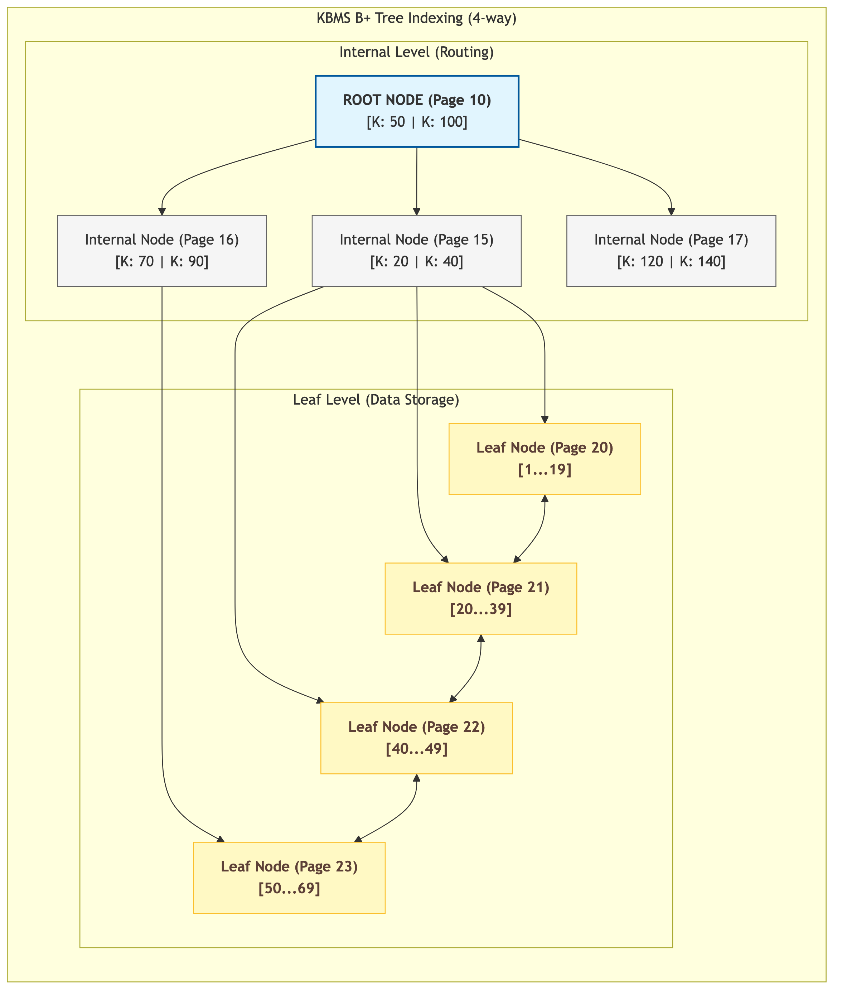
*Hình 4.12: Sơ đồ phân tầng và liên kết giữa các nốt trong Cây B+.*

## 4.4.8. Giải thuật Tìm kiếm và Cân bằng

Các thao tác trên cây chỉ mục đảm bảo độ phức tạp thời gian luôn là $O(\log n)$:

-   **Tìm kiếm**: Bắt đầu từ trang gốc (Root), so sánh khóa để rẽ nhánh xuống các tầng thấp hơn cho đến khi chạm tới trang lá.
-   **Chèn và Tách**: Khi một trang lá bị đầy, hệ thống thực hiện tách trang và cập nhật khóa dẫn hướng lên trang cha.
-   **Xóa và Gộp**: Khi số lượng bản ghi trong một trang xuống dưới ngưỡng cho phép, hệ thống sẽ thực hiện gộp với trang lân cận để tối ưu hóa không gian.

Việc tích hợp Cây B+ trực tiếp vào tầng lưu trữ phân trang giúp KBMS có thể xử lý hàng triệu bản ghi tri thức mà không làm suy giảm hiệu năng truy xuất của máy chủ.


---

## File: 05-durability-wal.md
# Nhật ký Ghi trước (WAL) và Tính bền vững

Nhật ký Ghi trước (Write-Ahead Logging - WAL) là kỹ thuật quan trọng nhất để đảm bảo các thuộc tính ACID cho hệ quản trị KBMS. Phương pháp này giúp hệ thống khôi phục hoàn toàn dữ liệu tri thức sau các sự cố phần cứng hoặc phần mềm.

## 4.4.9. Nguyên lý Hoạt động của WAL

Mọi thay đổi trên các trang dữ liệu trong Buffer Pool đều không được ghi ngay xuống tệp tin `.kdb` chính. Thay vào đó:

1.  **Ghi nhật ký**: Bản ghi thay đổi (Log Record) được tạo ra và ghi vào tệp nhật ký `.wal` tuần tự.
2.  **Số LSN (Log Sequence Number)**: Mỗi trang dữ liệu được gán một số LSN tương ứng với bản ghi nhật ký mới nhất tác động lên nó.
3.  **Quy luật WAL**: Không có trang dữ liệu nào được phép ghi xuống đĩa nếu các bản ghi nhật ký có LSN nhỏ hơn hoặc bằng LSN của trang đó chưa được lưu trữ an toàn trên đĩa.

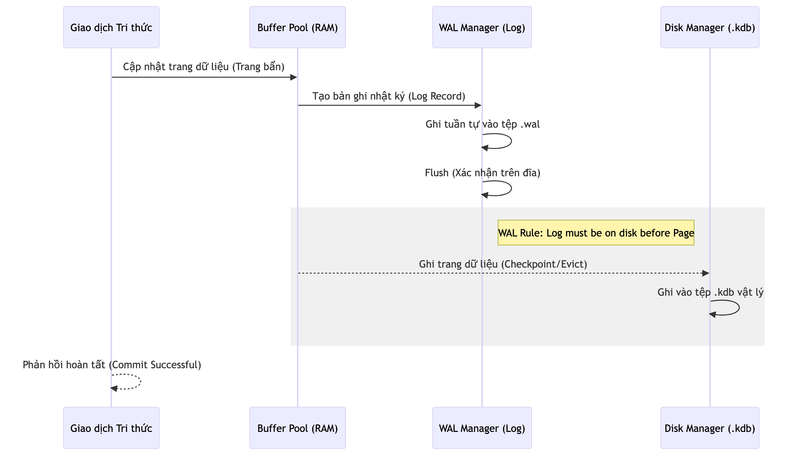
*Hình 4.13: Sơ đồ luồng dữ liệu giữa Buffer Pool, tệp Log và tệp dữ liệu chính.*

## 4.4.10. Phục hồi Dữ liệu (Recovery)

Khi hệ thống khởi động lại sau một sự cố, phân hệ `Storage` sẽ thực hiện quy trình phục hồi gồm 3 giai đoạn:

-   **Phân tích (Analysis)**: Quét tệp nhật ký để xác định các trang dữ liệu "bẩn" (Dirty Pages) chưa được ghi xuống đĩa chính.
-   **Tái hiện (Redo)**: Thực hiện lại các thao tác đã được ghi trong nhật ký để khôi phục trạng thái mới nhất của cơ sở tri thức trên RAM.
-   **Hoàn tác (Undo)**: Hủy bỏ các thay đổi từ các giao dịch chưa kịp hoàn tất (Commit) trước thời điểm xảy ra sự cố.

Nhờ có WAL, KBMS có thể duy trì hiệu năng ghi dữ liệu cao thông qua truy cập đĩa tuần tự (Sequential I/O) mà vẫn đảm bảo tính an toàn tuyệt đối cho kho t thức.


---

## File: 06-serialization-format.md
# Tuần tự hóa Siêu dữ liệu và Tri thức

Cơ sở tri thức (Knowledge Base) không chỉ chứa dữ liệu thực thể mà còn bao gồm các định nghĩa trừu tượng như Khái niệm (Concepts) và Luật dẫn (Rules). Hệ thống KBMS chuyển đổi các đối tượng này thành chuỗi nhị phân thu nhỏ (Tuples) để lưu trữ hiệu quả.

## 4.4.11. Bố cục Nhị phân của Thực thể (Tuple Layout)

Khi một thực thể tri thức được chèn vào hệ thống, nó được phân tách thành các trường dữ liệu cố định và biến thiên:

*Bảng 4.2: Đặc tả bố cục nhị phân của một thực thể tri thức (Tuple)*
| Trường (Field) | Loại dữ liệu | Kích thước | Mô tả |
| :--- | :--- | :--- | :--- |
| **Header** | `Int32` | 4 - 8B | Số lượng trường và các con trỏ offset. |
| **Fixed Data** | `GUID / Int` | 16B - 4B | Các định danh hoặc giá trị số cố định. |
| **Variable Data** | `LPS String` | Biến thiên | Các chuỗi ký tự hoặc dữ liệu nhị phân (Blobs). |

## 4.4.12. Ví dụ Phân rã Hex: Siêu dữ liệu Concept

Siêu dữ liệu cho một Khái niệm (Concept) bao gồm danh sách các biến và ràng buộc. Dưới đây là mô phỏng 48 byte đầu tiên của một Tuple Concept:

```text
Offset    00 01 02 03 04 05 06 07 08 09 0A 0B 0C 0D 0E 0F    Giải thích
----------------------------------------------------------------------------
00000000  0D 00 ...  (FieldCount = 13)
          [... 26 byte mảng Offset (13 trường × 2 byte) ...]

; Trường 0  Concept ID (GUID, 16 byte)
00000026  AA AA AA AA 00 00 00 00 00 00 00 00 00 00 00 01

; Trường 2  Tên "TamGiac" (LPS: 1 byte độ dài + 7 byte UTF-8)
00000046  07 54 61 6D 47 69 61 63    → (len=7) "TamGiac"

; Trường 3  Danh sách biến (Variables)
0000004E  03 00 00 00               → Số lượng (Count) = 3
00000052  01 61 03 69 6E 74 00 00   → "a", "int", HasLen=false
```

### Phân tích định dạng Nhị phân (Serialization Logic)

Ví dụ trên cho thấy cách `ModelBinaryUtility` nén các đối tượng tri thức phức tạp thành chuỗi các Byte liên tục:

1.  **FieldCount (Byte 0-1)**: Giá trị `0D 00` báo hiệu đối tượng này có 13 trường dữ liệu. Điều này cho phép `Deserializer` biết trước cần phải đọc bao nhiêu Offset trong mảng con trỏ ngay sau Header.
2.  **LPS (Length-Prefixed String)**: Tại Offset 46, byte đầu tiên `07` xác định độ dài của chuỗi ký tự theo sau là 7. Sau đó là 7 byte mã UTF-8 `54 61 6D 47 69 61 63` (`TamGiac`). Cách làm này giúp đọc chuỗi cực nhanh mà không cần quét tìm ký tự kết thúc `\0`.
3.  **Hệ thống Phụ lục (Sub-blobs - Byte 52 trở đi)**: Các danh sách lồng nhau (như danh sách biến `a, b, c`) được tuần tự hóa đệ quy. Bốn byte `03 00 00 00` xác định có 3 biến. Mỗi biến lại có cấu trúc LPS riêng cho Tên và Kiểu dữ liệu.

Cấu trúc này tối ưu hóa việc lưu trữ vì nó loại bỏ hoàn toàn các chuỗi ký tự mô tả thuộc tính (như tên cột trong SQL), giúp giảm kích thước file `.kdb` xuống chỉ còn khoảng 20% so với định dạng JSON.

### Ưu điểm của Định dạng Nhị phân (Binary Utility)
-   **Kích thước tối thiểu**: Loại bỏ các thuộc tính dư thừa của JSON/XML.
-   **Tốc độ bóc tách**: `ModelBinaryUtility` có thể giải mã trực tiếp từ con trỏ bộ nhớ (Memory Pointer), giảm thiểu chi phí khởi tạo đối tượng (Object Allocation).
-   **Tính tương thích**: Đảm bảo cấu trúc dữ liệu không thay đổi khi di chuyển giữa các phân hệ Server và Storage.


---

## File: 07-security-encryption.md
# Mã hóa Dữ liệu tĩnh (AES-256)

Tầng thấp nhất của phân hệ Storage chịu trách nhiệm bảo vệ dữ liệu tĩnh (Data-at-Rest) thông qua các thuật toán mã hóa hiện đại. Điều này đảm bảo rằng các tệp tin cơ sở tri thức `.kdb` không thể bị đọc hoặc khai thác trái phép nếu bị đánh cắp vật lý.

## 4.4.13. Cơ chế Mã hóa mức Trang (Page-level Encryption)

Hệ quản trị KBMS thực hiện mã hóa dữ liệu ở mức độ từng trang (Page) trước khi ghi xuống đĩa cứng. Quy trình này diễn ra hoàn toàn trong bộ nhớ RAM an toàn trước khi dữ liệu chạm tới lớp trình điều khiển tệp tin.

-   **Thuật toán**: AES-256 (Advanced Encryption Standard).
-   **Khóa mã hóa**: Được băm (`Hashing`) từ khóa bí mật của người dùng bằng thuật toán SHA256.
-   **Cơ chế IV**: Mỗi trang dữ liệu khi ghi xuống đều được gán một Vector khởi tạo (IV) riêng biệt dài 16 byte để đảm bảo tính ngẫu nhiên, ngăn chặn các cuộc tấn công dựa trên sự lặp lại của dữ liệu.

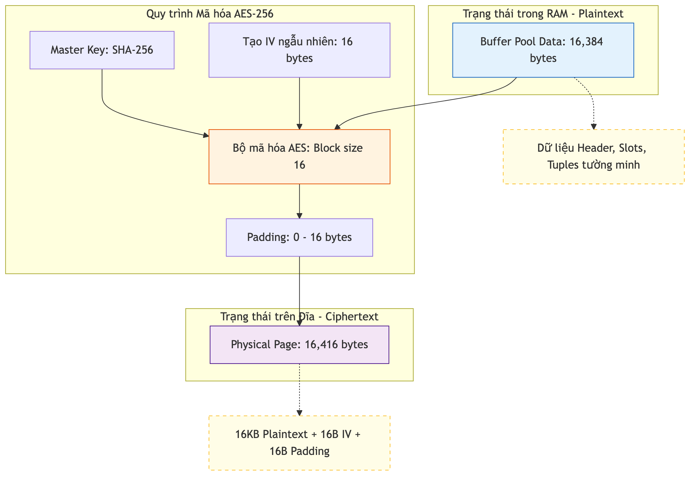
*Hình 4.14: Sơ đồ biến đổi dữ liệu giữa Buffer Pool (Plaintext) và Disk Manager (Ciphertext).*

## 4.4.14. So sánh Dữ liệu: Trước và Sau khi Giải mã

Dưới đây là minh họa sự khác biệt giữa dữ liệu được lưu trữ "tĩnh" trên đĩa (Ciphertext) và dữ liệu "động" trong bộ nhớ RAM sau khi đã giải mã (Plaintext):

### A. Dữ liệu trên Đĩa (Ciphertext)
Đây là dữ liệu thô mà kẻ tấn công nhìn thấy khi mở file bằng công cụ Hex Editor chuyên dụng.

```text
Offset    00 01 02 03 04 05 06 07 08 09 0A 0B 0C 0D 0E 0F    Dữ liệu tĩnh
----------------------------------------------------------------------------
00000000  4A 8F 22 C1 90 EB 44 12 AE 33 01 99 FF 2B 73 88    <- 16B IV Part 1
00000010  C2 10 93 42 11 00 55 EF 88 23 12 77 66 11 9A BB    <- 16B IV Part 2
00000020  7F 1A 2C ... (Dòng dữ liệu bị xáo trộn mã hóa)     <- AES Payload
```
Do được mã hóa, dữ liệu trên đĩa không có cấu trúc định dạng. Các trường thông tin quan trọng như `PageId` hay nội dung tri thức hoàn toàn ở trạng thái "rác vô nghĩa".

### B. Dữ liệu trong RAM (Decrypted Plaintext)
Sau khi `DiskManager` đọc tệp, tách IV và giải mã, dữ liệu trở về trạng thái có cấu trúc để sẵn sàng phục vụ xử lý tri thức tại tầng Server.

```text
Offset    00 01 02 03 04 05 06 07 08 09 0A 0B 0C 0D 0E 0F    Dữ liệu động
----------------------------------------------------------------------------
00000000  65 00 00 00 00 00 00 00 FF FF FF FF FF FF FF FF    <- [PageId: 101]
00000010  FF FF FF FF D2 3F 00 00 01 00 00 00 D2 3F 00 00    <- [FSP: 16k...]
```
### Phân tích Bảo mật Dữ liệu (Encryption Logic)

So sánh hai khối Hex trên minh họa cơ chế bảo vệ "đa lớp" tại Tầng Lưu trữ của KBMS:

1.  **Dải Nhiễu Ngẫu nhiên (Disk Layout)**: Ở dạng Ciphertext, dữ liệu hoàn toàn không có dấu vết của các cấu trúc quen thuộc (như `PageId` hay `LSN`). Byte đầu tiên là một phần của IV chứ không phải ID của trang. Điều này ngăn chặn việc đọc trộm các thông tin nhạy cảm ngay cả khi tệp tin bị truy cập ngoài hệ thống.
2.  **Khôi phục Cấu trúc (RAM Logic)**: Sau khi qua bộ giải mã con trỏ, dữ liệu trở lại dạng `0x65 0x00...` tại đúng Offset 0. Điều này cho phép `BufferPoolManager` làm việc với dữ liệu tường minh một cách hiệu quả nhất, trong khi vẫn duy trì sự an toàn ở mức vật lý.
3.  **Toàn vẹn Dữ liệu**: Việc sử dụng AES-256 kết hợp IV ngẫu nhiên cho từng trang đảm bảo rằng cùng một nội dung tri thức nếu ghi vào hai trang khác nhau sẽ cho ra hai chuỗi Byte Ciphertext hoàn toàn khác nhau trên đĩa.

Cơ chế này đạt được sự cân bằng tối ưu giữa tính bảo mật tuyệt đối cho dữ liệu tri thức và hiệu năng truy xuất thực tế của hệ thống.
```

## 4.4.15. Tính toán Dung lượng và Hiệu năng

Việc tích hợp mã hóa ở tầng thấp yêu cầu một khoản chi phí về dung lượng tốn kém (Overhead) nhưng đổi lại là tính bảo mật dữ liệu tuyệt đối:

-   **Dung lượng gia tăng**: ~0.2% (32 byte cho mỗi trang 16KB).
-   **Hiệu năng CPU**: Tác động không đáng kể nhờ sự hỗ trợ của tập lệnh tăng tốc phần cứng AES-NI trên các vi xử lý hiện đại.

Cơ chế này đảm bảo dữ liệu tri thức luôn an toàn xuyên suốt vòng đời từ khi được tạo ra cho đến khi được lưu trữ vĩnh viễn trên thiết bị.


---

## File: 01-introduction.md
# Giới thiệu về Ngôn ngữ Truy vấn Tri thức

Ngôn ngữ **KBQL (Knowledge Base Query Language)** là phương thức giao tiếp chính để tương tác với hệ quản trị cơ sở tri thức KBMS. KBQL được thiết kế dựa trên sự kế thừa các cú pháp tiêu chuẩn của SQL trong thao tác dữ liệu, đồng thời mở rộng các khả năng suy diễn tri thức dựa trên hệ thống logic vị từ và tập luật [6].

## 1. Triết lý Thiết kế Hệ thống

Ngôn ngữ KBQL được xây dựng dựa trên ba nguyên tắc cốt lõi:
1.  **Tính kế thừa:** Cú pháp tiệm cận với tiêu chuẩn SQL giúp tối ưu hóa tiến trình tiếp cận hệ thống của người dùng.
2.  **Định hướng Tri thức:** Tích hợp sâu các thực thể hình thức như Concept, Fact và Rule, vượt xa giới hạn của mô hình Bảng - Bản ghi truyền thống.
3.  **Tự động Suy diễn:** Kết quả truy vấn có khả năng tự cập nhật và suy luận thông qua bộ máy suy diễn (Inference Engine) tích hợp, giảm thiểu việc triển khai logic thủ công tại lớp ứng dụng.

## 2. Các Phân hệ Thành phần của Ngôn ngữ

*Bảng 4.3: Phân loại nhóm lệnh và từ khóa dành riêng trong ngôn ngữ KBQL*
| Nhóm Lệnh | Chức năng | Các lệnh tiêu biểu |
| :--- | :--- | :--- |
| **KDL** (Knowledge Definition Language) | Định nghĩa cấu trúc tri thức, luật, phân cấp | `CREATE KB`, `CONCEPT`, `RULE`, `HIERARCHY`, `RELATION` |
| **KML** (Knowledge Maintenance Language) | Thao tác trên tập các sự kiện (Facts) | `INSERT`, `UPDATE`, `DELETE`, `IMPORT`, `EXPORT` |
| **KQL** (Knowledge Query Language) | Truy vấn và yêu cầu suy diễn | `SELECT` (với macro `SOLVE()`), `SHOW`, `EXPLAIN`, `DESCRIBE` |
| **KCL** (Knowledge Control Language) | Quản lý người dùng và quyền truy cập | `GRANT`, `REVOKE`, `CREATE/ALTER/DROP USER` |
| **TCL** (Transaction Control Language) | Quản lý giao dịch và tính toàn vẹn | `BEGIN`, `COMMIT`, `ROLLBACK` |
| **Admin** (Maintenance) | Bảo trì và tối ưu hóa hệ thống | `MAINTENANCE (VACUUM, REINDEX, CHECK)` |

## 3. Khả năng Hiệu chỉnh Cấu trúc Tri thức

Trong hệ thống KBMS, các đối tượng mang tính cấu trúc logic được quản lý chặt chẽ thông qua lệnh hiệu chỉnh `ALTER`. Dưới đây là đặc tả khả năng hỗ trợ sửa đổi của các thực thể tri thức:

*Bảng 4.4: Đặc tả khả năng hỗ trợ sửa đổi (ALTER) cho các thực thể tri thức*
| Đối tượng | Hỗ trợ ALTER | Ghi chú |
| :--- | :--- | :--- |
| **Concept** |  Có | Hỗ trợ thêm/xóa biến, luật, ràng buộc, quan hệ nội bộ. |
| **Knowledge Base** |  Có | Hỗ trợ thay đổi mô tả (Description). |
| **User** |  Có | Hỗ trợ đổi mật khẩu và vai trò quản trị. |
| **Relation** |  Không | Cần `DROP` và `CREATE` lại. |
| **Hierarchy** |  Không | Sử dụng `ADD/REMOVE HIERARCHY`. |
| **Rule** (Toàn cục) |  Không | Cần `DROP` và `CREATE` lại (Khác với Rule nội bộ Concept). |
| **Operator/Function**|  Không | Cần `DROP` và `CREATE` lại. |

## 4. Hệ thống Kiểu Dữ liệu Đặc tả

KBQL cung cấp hệ thống kiểu dữ liệu đa dạng để phục vụ việc định nghĩa cấu trúc khái niệm:

*Bảng 4.5: Danh mục các kiểu dữ liệu nguyên thủy được hỗ trợ trong KBQL*
| Nhóm | Kiểu dữ liệu | Mô tả |
| :--- | :--- | :--- |
| **Số học** | `INT`, `BIGINT`, `DECIMAL`, `FLOAT`, `DOUBLE` | Các kiểu số nguyên và số thực. |
| **Chuỗi** | `VARCHAR(n)`, `CHAR(n)`, `TEXT`, `STRING` | Lưu trữ văn bản (hỗ trợ độ dài tùy chỉnh). |
| **Logic** | `BOOLEAN` | Giá trị `true` hoặc `false`. |
| **Thời gian** | `DATE`, `DATETIME`, `TIMESTAMP` | Quản lý thời gian và sự kiện. |
| **Tri thức** | `OBJECT`, `<ConceptName>` | Tham chiếu đến một đối tượng hoặc một Khái niệm khác. |
| **Đặc biệt** | `NULL` | Trạng thái rỗng. |

## 5. Ví dụ Quickstart - Hệ Tri thức Hình học

Để minh họa sức mạnh của KBQL, dưới đây là một ví dụ hoàn chỉnh về xây dựng hệ tri thức hình học:

```kbql
-- Bước 1: Tạo cơ sở tri thức
CREATE KNOWLEDGE BASE GeometryDB
DESCRIPTION "Hệ tri thức Hình học Phẳng";

-- Bước 2: Định nghĩa khái niệm Điểm
CREATE CONCEPT Point (
    VARIABLES (x: DECIMAL, y: DECIMAL, name: STRING),
    CONSTRAINTS (x IS NOT NULL AND y IS NOT NULL)
);

-- Bước 3: Định nghĩa khái niệm Đoạn thẳng từ 2 điểm
CREATE CONCEPT LineSegment (
    VARIABLES (p1: Point, p2: Point, length: DECIMAL),
    EQUATIONS ('length = Sqrt((p2.x - p1.x)^2 + (p2.y - p1.y)^2)')
);

-- Bước 4: Định nghĩa khái niệm Tam giác
CREATE CONCEPT Triangle (
    VARIABLES (a: LineSegment, b: LineSegment, c: LineSegment,
               area: DECIMAL, perimeter: DECIMAL),
    EQUATIONS (
        'perimeter = a.length + b.length + c.length',
        'area = Sqrt(perimeter/2 * (perimeter/2 - a.length) *
                     (perimeter/2 - b.length) * (perimeter/2 - c.length))'
    ),
    CONSTRAINTS (a.length + b.length > c.length)
);

-- Bước 5: Thêm sự kiện (Facts)
INSERT INTO Point VARIABLES (0, 0, 'O');
INSERT INTO Point VARIABLES (3, 0, 'A');
INSERT INTO Point VARIABLES (0, 4, 'B');

-- Bước 6: Truy vấn với suy diễn tự động
SELECT SOLVE(length) FROM LineSegment
WHERE p1.name = 'O' AND p2.name = 'A';
-- Kết quả: length = 3.0

-- Bước 7: Suy diễn phức tạp - Tính diện tích tam giác
SELECT SOLVE(area), SOLVE(perimeter) FROM Triangle
WHERE a.p1.name = 'O' AND a.p2.name = 'A'
  AND b.p1.name = 'O' AND b.p2.name = 'B';
-- Kết quả: area = 6.0, perimeter = 12.0
```

### 5.1. So sánh với SQL Truyền thống

| Đặc điểm | SQL Truyền thống | KBQL |
|:---|:---|:---|
| **Lưu trữ** | Bảng hàng cột | Khái niệm (Concept) với luật nội tại |
| **Truy vấn** | Chỉ trả về dữ liệu đã có | Tự động suy diễn dữ liệu mới |
| **Tính toán** | Cần ứng dụng xử lý | Tích hợp SOLVE() giải phương trình |
| **Quan hệ** | JOIN bảng | Kế thừa (IS_A) và Thành phần (PART_OF) |

---


---

## File: 02-kdl.md
# Ngôn ngữ Định nghĩa Tri thức (KDL)

**KDL** (Knowledge Definition Language) bao gồm tập hợp các lệnh chuyên dụng để định nghĩa cấu trúc dữ liệu, các ràng buộc logic và hệ thống quan hệ bên trong cơ sở tri thức.

## 1. Quản lý Cơ sở Tri thức

Cơ sở tri thức (Knowledge Base) là vùng chứa logic cấp cao nhất. Các lệnh quản trị bao gồm:

*   **CREATE KNOWLEDGE BASE <name> [DESCRIPTION "<text>"]**: Khởi tạo cơ sở tri thức mới với phần mô tả tùy chọn.
    *Ví dụ:* `CREATE KNOWLEDGE BASE PhysicsDB DESCRIPTION "Hệ tri thức Vật lý";`
*   **ALTER KNOWLEDGE BASE <name> SET (DESCRIPTION: "<text>")**: Hiệu chỉnh thông tin mô tả của cơ sở tri thức hiện tại.
    *Ví dụ:* `ALTER KNOWLEDGE BASE PhysicsDB SET (DESCRIPTION: "Cập nhật mô tả");`
*   **DROP KNOWLEDGE BASE <name>**: Giải phóng toàn bộ dữ liệu thực thể và cấu trúc hình thức liên quan.
    *Ví dụ:* `DROP KNOWLEDGE BASE PhysicsDB;`
*   **USE <name>**: Chuyển đổi ngữ cảnh làm việc sang cơ sở tri thức được chỉ định.
    *Ví dụ:* `USE PhysicsDB;`

## 2. Định nghĩa và Đặc tả Khái niệm (Concept)

Khái niệm (**Concept**) là thực thể hình thức hạt nhân trong hệ thống KBMS. Mỗi khái niệm đóng vai trò là một khuôn mẫu tri thức, cho phép đặc tả các thuộc tính và hành vi logic của đối tượng.

### 2.1. Cấu trúc Lệnh Khởi tạo Khái niệm

Lệnh `CREATE CONCEPT` cho phép định nghĩa một khái niệm mới thông qua các khối thành phần sau:

```kbql
CREATE CONCEPT <name> (
    VARIABLES (<var>: <type>, ...),
    ALIASES (<alias1>, ...),
    BASE_OBJECTS (<obj1>, ...),
    CONSTRAINTS (<expressions>),
    SAME_VARIABLES (<var1>, ...),
    CONSTRUCT_RELATIONS (<rel_definitions>),
    PROPERTIES (<prop1>, ...),
    RULES (<logic_rules>),
    EQUATIONS (<math_equations>)
);
```

*Ví dụ:*
```kbql
CREATE CONCEPT Patient (
    VARIABLES (name: STRING, age: INT, sys: INT, dia: INT, is_hypertension: BOOLEAN),
    CONSTRAINTS (age > 0)
);
```

### 2.2. Đặc tả các Khối Thành phần Nâng cao

Các khối thành phần trong lệnh định nghĩa khái niệm bao gồm:

-   **VARIABLES**: Khai báo danh sách các thuộc tính cơ sở (Tên: Kiểu dữ liệu).
-   **ALIASES**: Cung cấp các định danh thay thế để tăng tính linh hoạt trong truy vấn.
-   **BASE_OBJECTS**: Liệt kê các đối tượng thành phần (thường áp dụng trong quan hệ `PART_OF`).
-   **CONSTRAINTS**: Các điều kiện ràng buộc logic mà thực thể phải đảm bảo tính hợp lệ.
-   **SAME_VARIABLES**: Cơ chế đồng nhất hóa các biến số khác nhau về cùng một thực thể tri thức.
-   **RULES / EQUATIONS**: Tích hợp trực tiếp các luật dẫn và phương trình toán học vào cấu trúc khái niệm.

### 2.3. Hiệu chỉnh Cấu trúc Khái niệm (ALTER CONCEPT)

KBQL hỗ trợ hiệu chỉnh cấu trúc khái niệm mà không làm ảnh hưởng đến các thực thể (Facts) hiện có:

```kbql
ALTER CONCEPT <name> (
    ADD (
        VARIABLE <var>: <type>,
        RULE (<rule_definition>),
        CONSTRAINT (<expression>),
        EQUATION '<expression>'
    ),
    DROP (
        VARIABLE <name>,
        RULE <name>,
        CONSTRAINT <name>
    ),
    RENAME (VARIABLE <old> TO <new>)
);
```

*Ví dụ:*
```kbql
ALTER CONCEPT Patient (
    ADD (VARIABLE weight: INT),
    DROP (CONSTRAINT age_limit)
);
```

## 3. Thiết lập Hệ thống Phân cấp

Cơ cấu phân cấp hỗ trợ thiết lập các quan hệ kế thừa và cấu trúc thành phần giữa các khái niệm:

*   **Kế thừa (`IS_A`)**: Mô hình hóa quan hệ kế thừa tri thức (Ví dụ: *Tam Giác Vuông Kế thừa Tam Giác*).
*   **Thành phần (`PART_OF`)**: Mô hình hóa quan hệ cấu trúc vật lý (Ví dụ: *Động Cơ là Thành phần của Xe Ô tô*).

**Cú pháp thực thi:**
```kbql
ADD HIERARCHY <child> IS_A <parent>;
ADD HIERARCHY <part> PART_OF <whole>;
REMOVE HIERARCHY <parent> IS_A <child>;
```

*Ví dụ:*
```kbql
ADD HIERARCHY Triangle IS_A Shape;
ADD HIERARCHY Engine PART_OF Car;
```

## 4. Định nghĩa Quan hệ Ngữ nghĩa

Lệnh định nghĩa quan hệ cho phép mô tả các liên kết logic và toán học giữa hai khái niệm:

```kbql
CREATE RELATION <name> 
FROM <domain> TO <range>
[PARAMS (<p1>, ...)]
[PROPERTIES (<symmetric, transitive, ...>)];
```

*Ví dụ:*
```kbql
CREATE RELATION Orbits FROM Planet TO Star;
```

## 5. Định nghĩa Luật dẫn Hệ thống

Luật dẫn toàn cục hỗ trợ quy trình suy diễn tự động thông qua cơ chế lan truyền tri thức:

```kbql
CREATE RULE <name>
SCOPE <concept_scope>
IF <condition_expression>
THEN <action_logic>;
```

*Ví dụ:*
```kbql
CREATE RULE CheckBloodPressure SCOPE Patient 
IF sys > 140 OR dia > 90 
THEN SET is_hypertension = true;
```

## 6. Mở rộng Toán tử và Hàm số

Hệ thống cho phép người dùng mở rộng khả năng tính toán thông qua các thành phần thực thi tùy biến:

```kbql
CREATE {OPERATOR | FUNCTION} <identifier>
PARAMS (<p1> <type1>, ...)
RETURNS <type>
BODY '<logic_script>';
```

*Ví dụ:*
```kbql
CREATE FUNCTION GravityForce PARAMS (DOUBLE m1, DOUBLE m2, DOUBLE r) 
RETURNS DOUBLE BODY '(6.6743 * m1 * m2) / (r * r)';
```

## 7. Cơ chế Tối ưu hóa Chỉ mục

Hệ thống sử dụng cấu trúc **Cây B+** để tối ưu hóa hiệu năng truy xuất dữ liệu trên các thuộc tính chỉ định:

```kbql
CREATE INDEX <index_name> ON <concept_name> (<variable_list>);
DROP INDEX <index_name>;
```

*Ví dụ:*
```kbql
CREATE INDEX idx_patient_sys ON Patient (sys);
```

## 8. Quản lý Sự kiện Tự động (Triggers)

Cơ chế Trigger cho phép hệ thống tự động kích hoạt các câu lệnh KBQL khi có sự biến động về dữ liệu thực thể:

```kbql
CREATE TRIGGER <name>
ON ( {INSERT|UPDATE|DELETE} OF <concept> )
DO ( <kbql_statement> );
```

*Ví dụ:*
```kbql
CREATE TRIGGER SyncInventory
ON (INSERT OF SalesOrder)
DO (UPDATE Product VARIABLES (SET stock: stock - 1) WHERE id = new.product_id);
```

## 9. Ví dụ Thực tế - Xây dựng Hệ Tri thức Hình học

Dưới đây là ví dụ hoàn chỉnh về việc xây dựng một cơ sở tri thức hình học phẳng:

```kbql
-- Bước 1: Khởi tạo Knowledge Base
CREATE KNOWLEDGE BASE GeometryDB
DESCRIPTION "Hệ tri thức Hình học Phẳng - KBMS Demo";

USE GeometryDB;

-- Bước 2: Định nghĩa Khái niệm Điểm (Point)
CREATE CONCEPT Point (
    VARIABLES (
        x: DECIMAL,
        y: DECIMAL,
        label: STRING
    ),
    ALIASES (p, pt, coordinate),
    CONSTRAINTS (
        x IS NOT NULL,
        y IS NOT NULL
    )
);

-- Bước 3: Định nghĩa Khái niệm Đoạn thẳng (LineSegment)
CREATE CONCEPT LineSegment (
    VARIABLES (
        startPoint: Point,
        endPoint: Point,
        length: DECIMAL,
        slope: DECIMAL
    ),
    EQUATIONS (
        'length = Sqrt((endPoint.x - startPoint.x)^2 +
                      (endPoint.y - startPoint.y)^2)',
        'slope = (endPoint.y - startPoint.y) /
                (endPoint.x - startPoint.x)'
    ),
    CONSTRAINTS (
        length > 0,
        startPoint != endPoint
    )
);

-- Bước 4: Định nghĩa Khái niệm Đường tròn (Circle)
CREATE CONCEPT Circle (
    VARIABLES (
        center: Point,
        radius: DECIMAL,
        area: DECIMAL,
        circumference: DECIMAL
    ),
    EQUATIONS (
        'area = 3.14159 * radius^2',
        'circumference = 2 * 3.14159 * radius'
    ),
    CONSTRAINTS (radius > 0)
);

-- Bước 5: Định nghĩa Khái niệm Tam giác (Triangle)
CREATE CONCEPT Triangle (
    VARIABLES (
        vertexA: Point,
        vertexB: Point,
        vertexC: Point,
        sideA: DECIMAL,
        sideB: DECIMAL,
        sideC: DECIMAL,
        area: DECIMAL,
        perimeter: DECIMAL
    ),
    BASE_OBJECTS (vertexA, vertexB, vertexC),
    EQUATIONS (
        'sideA = Sqrt((vertexB.x - vertexC.x)^2 +
                     (vertexB.y - vertexC.y)^2)',
        'sideB = Sqrt((vertexA.x - vertexC.x)^2 +
                     (vertexA.y - vertexC.y)^2)',
        'sideC = Sqrt((vertexA.x - vertexB.x)^2 +
                     (vertexA.y - vertexB.y)^2)',
        'perimeter = sideA + sideB + sideC',
        'area = Sqrt(perimeter/2 *
                    (perimeter/2 - sideA) *
                    (perimeter/2 - sideB) *
                    (perimeter/2 - sideC))'
    ),
    CONSTRAINTS (
        sideA + sideB > sideC,
        sideB + sideC > sideA,
        sideA + sideC > sideB
    )
);

-- Bước 6: Thiết lập Phân cấp kế thừa
CREATE CONCEPT Shape (
    VARIABLES (color: STRING, filled: BOOLEAN)
);

ADD HIERARCHY Point IS_A Shape;
ADD HIERARCHY LineSegment IS_A Shape;
ADD HIERARCHY Triangle IS_A Shape;

-- Bước 7: Định nghĩa Luật dẫn cho phân loại tam giác
CREATE RULE ClassifyRightTriangle SCOPE Triangle
IF ABS(sideA^2 + sideB^2 - sideC^2) < 0.001
THEN SET type = 'Right';

CREATE RULE ClassifyEquilateral SCOPE Triangle
IF ABS(sideA - sideB) < 0.001 AND ABS(sideB - sideC) < 0.001
THEN SET type = 'Equilateral';

CREATE RULE ClassifyIsosceles SCOPE Triangle
IF ABS(sideA - sideB) < 0.001 OR ABS(sideB - sideC) < 0.001
THEN SET type = 'Isosceles';

-- Bước 8: Định nghĩa Quan hệ giữa các hình
CREATE RELATION Tangent FROM Circle TO LineSegment;
CREATE RELATION Inscribed FROM Triangle TO Circle;

-- Bước 9: Tạo chỉ mục để tối ưu truy vấn
CREATE INDEX idx_point_label ON Point (label);
CREATE INDEX idx_triangle_type ON Triangle (type);

-- Bước 10: Tạo Trigger tự động tính toán khi thêm tam giác mới
CREATE TRIGGER CalculateTriangleMetrics
ON (INSERT OF Triangle)
DO (
    UPDATE Triangle
    VARIABLES (SET type: 'Scalene')
    WHERE type IS NULL
);
```

### 9.1. Ví dụ Hiệu chỉnh Cấu trúc (ALTER)

```kbql
-- Thêm thuộc tính mới vào Concept Point
ALTER CONCEPT Point (
    ADD (
        VARIABLE z: DECIMAL,
        CONSTRAINT z IS NOT NULL
    )
);

-- Thêm luật mới vào Triangle
ALTER CONCEPT Triangle (
    ADD (
        RULE IF area > 100 THEN SET size = 'Large'
    )
);

-- Xóa ràng buộc cũ
ALTER CONCEPT LineSegment (
    DROP (
        CONSTRAINT length > 0
    ),
    ADD (
        CONSTRAINT length >= 0
    )
);
```


---

## File: 03-kml.md
# Ngôn ngữ Thao tác và Bảo trì Tri thức (KML)

**KML** (Knowledge Maintenance Language) cung cấp tập hợp các câu lệnh để thực thi việc chèn, cập nhật, xóa các Sự kiện (**Facts**) và quản lý tiến trình chuyển đổi dữ liệu trong cơ sở tri thức.

## 1. Khởi tạo và Chèn Sự kiện (Facts)

Hành vi chèn sự kiện cho phép nạp các thực thể cụ thể vào một Khái niệm (**Concept**) đã định nghĩa.

### 1.1. Chèn thực thể đơn lẻ

```kbql
INSERT INTO <concept_name> VARIABLES (<val1>, <val2>, ...);
```

*Ví dụ:*
```kbql
INSERT INTO Patient VARIABLES ('John Doe', 65, 150, 95);
```

### 1.2. Chèn thực thể hàng loạt (Bulk Insert)

Cơ chế `INSERT BULK` được tối ưu hóa để nạp tập dữ liệu lớn vào hệ thống một cách hiệu quả:

```kbql
INSERT BULK INTO <concept_name> VARIABLES (
    (<val1a>, <val2a>, ...),
    (<val1b>, <val2b>, ...),
    ...
);
```

*Ví dụ:*
```kbql
INSERT BULK INTO Patient VARIABLES (
    ('Alice', 45, 120, 80),
    ('Bob', 50, 130, 85)
);
```

## 2. Cập nhật và Hiệu chỉnh Sự kiện

Lệnh `UPDATE` cho phép sửa đổi giá trị các thuộc tính của các sự kiện hiện có dựa trên các điều kiện lọc xác định:

```kbql
UPDATE <concept_name> 
VARIABLES (SET <var1>: <new_val1>, <var2>: <new_val2>) 
WHERE <filter_conditions>;
```

*Ví dụ:*
```kbql
UPDATE Patient 
VARIABLES (SET sys: 125, dia: 82) 
WHERE name = 'Alice';
```

> [!NOTE]
> Khi một thuộc tính được cập nhật thành công, hệ thống sẽ tự động kích hoạt lại các Luật dẫn (**Rules**) liên quan để đảm bảo tính nhất quán và toàn vẹn của tri thức (Knowledge Consistency).

## 3. Loại bỏ Sự kiện

Lệnh `DELETE` thực hiện việc giải phóng các thực thể tri thức khỏi khái niệm dựa trên tiêu chí lựa chọn:

```kbql
DELETE FROM <concept_name> WHERE <filter_conditions>;
```

*Ví dụ:*
```kbql
DELETE FROM Patient WHERE age > 100 OR name = 'Test';
```

## 4. Cơ chế Chuyển đổi và Trao đổi Dữ liệu

KBMS hỗ trợ các công cụ xuất/nhập tri thức để tương tác với các định dạng lưu trữ ngoại vi tiêu chuẩn (CSV, JSON, XML).

### 4.1. Xuất dữ liệu (Export)
```kbql
EXPORT (
    CONCEPT: <name>, 
    FILE: '<path>', 
    FORMAT: {CSV | JSON | XML}
);
```

*Ví dụ:*
```kbql
EXPORT (
    CONCEPT: Patient, 
    FILE: '/var/data/patients_export.csv', 
    FORMAT: CSV
);
```

### 4.2. Nhập dữ liệu (Import)
```kbql
IMPORT (
    CONCEPT: <name>,
    FILE: '<path>',
    FORMAT: {CSV | JSON | XML}
);
```

*Ví dụ:*
```kbql
IMPORT (
    CONCEPT: Patient,
    FILE: '/var/data/patients_import.json',
    FORMAT: JSON
);
```

## 5. Ví dụ Thực tế - Quản lý Bệnh nhân

Dưới đây là kịch bản hoàn chỉnh về việc quản lý dữ liệu bệnh nhân trong hệ thống y tế:

```kbql
-- Thiết lập: Tạo Concept Patient
CREATE CONCEPT Patient (
    VARIABLES (
        patientId: STRING,
        name: STRING,
        age: INT,
        bloodType: STRING,
        sys: INT,           -- Huyết áp tâm thu
        dia: INT,           -- Huyết áp tâm trương
        heartRate: INT,
        temperature: DECIMAL,
        lastVisit: DATE,
        is_critical: BOOLEAN
    ),
    CONSTRAINTS (
        age >= 0 AND age <= 150,
        sys > 0 AND dia > 0,
        sys > dia,
        heartRate > 30 AND heartRate < 220,
        temperature >= 35.0 AND temperature <= 42.0
    )
);

-- Kịch bản 1: Thêm bệnh nhân mới (INSERT đơn lẻ)
INSERT INTO Patient VARIABLES (
    'P001', 'Nguyen Van A', 45, 'A+', 120, 80, 72, 36.5, '2026-04-01'
);

-- Kịch bản 2: Thêm hàng loạt bệnh nhân (BULK INSERT)
INSERT BULK INTO Patient VARIABLES (
    ('P002', 'Tran Thi B', 32, 'B+', 115, 75, 68, 36.6, '2026-04-02'),
    ('P003', 'Le Van C', 58, 'O+', 145, 95, 88, 37.2, '2026-04-02'),
    ('P004', 'Pham Thi D', 28, 'AB+', 118, 78, 70, 36.4, '2026-04-03'),
    ('P005', 'Hoang Van E', 67, 'A+', 155, 105, 92, 38.1, '2026-04-03')
);

-- Kịch bản 3: Cập nhật thông tin bệnh nhân
-- Cập nhật chỉ số sinh tồn cho bệnh nhân P003
UPDATE Patient
VARIABLES (SET sys: 140, dia: 90, heartRate: 85)
WHERE patientId = 'P003';

-- Cập nhật nhiều thuộc tính cùng lúc
UPDATE Patient
VARIABLES (
    SET sys: 130,
        dia: 85,
        heartRate: 75,
        temperature: 36.7
)
WHERE patientId = 'P002';

-- Kịch bản 4: Xóa bệnh nhân khỏi hệ thống
-- Xóa bệnh nhân có dữ liệu lỗi
DELETE FROM Patient WHERE age < 0 OR sys < dia;

-- Xóa bệnh nhân đã chuyển đi
DELETE FROM Patient WHERE patientId = 'P999';

-- Kịch bản 5: Xuất báo cáo bệnh nhân高血压 (Huyết áp cao)
EXPORT (
    CONCEPT: Patient,
    FILE: '/reports/hypertension_patients.csv',
    FORMAT: CSV
);

-- Kịch bản 6: Nhập dữ liệu từ file bên ngoài
IMPORT (
    CONCEPT: Patient,
    FILE: '/data/new_patients_batch.json',
    FORMAT: JSON
);

-- Kịch bản 7: Cập nhật hàng loạt (Batch Update)
-- Đánh dấu tất cả bệnh nhân nguy cấp
UPDATE Patient
VARIABLES (SET is_critical: true)
WHERE sys >= 140 OR dia >= 90 OR heartRate > 100 OR temperature >= 38.0;

-- Kịch bản 8: Xóa hàng loạt (Batch Delete)
-- Xóa các bản ghi cũ hơn 1 năm
DELETE FROM Patient
WHERE lastVisit < '2025-04-01';
```

### 5.1. Ví dụ về Quản lý Kho Hàng

```kbql
-- Tạo Concept Product
CREATE CONCEPT Product (
    VARIABLES (
        productId: STRING,
        name: STRING,
        category: STRING,
        price: DECIMAL,
        stock: INT,
        minStock: INT,
        supplier: STRING,
        lastRestock: DATE
    ),
    CONSTRAINTS (
        price > 0,
        stock >= 0,
        minStock >= 0
    )
);

-- Nhập hàng mới về kho
INSERT BULK INTO Product VARIABLES (
    ('PRD001', 'Laptop Dell XPS', 'Electronics', 25000000, 50, 10, 'Dell Vietnam', '2026-04-01'),
    ('PRD002', 'Mouse Logitech', 'Accessories', 500000, 200, 20, 'Logitech', '2026-04-01'),
    ('PRD003', 'Keyboard Mechanical', 'Accessories', 1200000, 100, 15, 'Keychron', '2026-04-02')
);

-- Cập nhật số tồn kho sau khi bán
UPDATE Product
VARIABLES (SET stock: stock - 5)
WHERE productId = 'PRD001';

-- Kiểm tra hàng cần nhập lại
SELECT productId, name, stock, minStock
FROM Product
WHERE stock < minStock;
```


---

## File: 04-kql.md
# Ngôn ngữ Truy vấn Tri thức (KQL)

**KQL** (Knowledge Query Language) tập hợp các lệnh để truy xuất thông tin, thực hiện truy vấn dữ liệu và yêu cầu hệ thống thực hiện các phép suy diễn tri thức phức tạp.

## 1. Cơ chế Truy vấn Tri thức

Lệnh `SELECT` trong KBQL tương đương với tiêu chuẩn SQL nhưng được tối ưu hóa để tương tác với các Khái niệm (Concept) và cấu trúc tri thức.

### 1.1. Cấu trúc Lệnh Truy vấn Toàn phần

```kbql
SELECT [<columns> | * | AGGREGATE(<var>)]
FROM <concept> [AS <alias>] | (<subquery>) [AS <alias>]
[<join_type> JOIN <concept> [AS <alias>] ON <condition>]
[WHERE <filter_conditions>]
[GROUP BY <variables>]
[HAVING <filter_conditions>]
[ORDER BY <variables> {ASC | DESC}]
[LIMIT <n> OFFSET <m>];
```

### 1.2. Các Tính năng Mở rộng

*   **Hàm Tổng hợp (Aggregate):** Tích hợp các hàm `COUNT`, `SUM`, `AVG`, `MIN`, `MAX` trên các tập thuộc tính của Concept.
*   **Mệnh đề lọc sau nhóm (HAVING):** Cho phép lọc dữ liệu sau khi đã thực hiện gom nhóm tri thức.
*   **Biểu thức Tính toán CALC():** Hỗ trợ thực thi các công thức toán học ngay trong tiến trình truy vấn.
    *Ví dụ:* `SELECT name, CALC(price * 1.1) AS price_tax FROM Product;`
*   **Sub-query (Truy vấn con):** Hỗ trợ sub-query trong mệnh đề FROM và WHERE.
*   **Outer Join:** Hỗ trợ LEFT JOIN, RIGHT JOIN, FULL OUTER JOIN.

---

## 2. Các Loại JOIN

KQL hỗ trợ đầy đủ các loại JOIN theo tiêu chuẩn SQL:

### 2.1. INNER JOIN (Mặc định)

Trả về các dòng có kết quả khớp ở cả hai bảng:

```kbql
SELECT p.name, a.appointmentDate
FROM Patient p
JOIN Appointment a ON p.patientId = a.patientId;
```

### 2.2. LEFT [OUTER] JOIN

Trả về tất cả các dòng từ bảng bên trái, và các dòng khớp từ bảng bên phải. Nếu không khớp, giá trị bên phải sẽ là NULL:

```kbql
-- Liệt kê tất cả bệnh nhân, bao gồm cả những người chưa có lịch hẹn
SELECT p.name, a.appointmentDate
FROM Patient p
LEFT JOIN Appointment a ON p.patientId = a.patientId;

-- Sử dụng LEFT OUTER JOIN (tương tự)
SELECT p.name, a.appointmentDate
FROM Patient p
LEFT OUTER JOIN Appointment a ON p.patientId = a.patientId;
```

### 2.3. RIGHT [OUTER] JOIN

Trả về tất cả các dòng từ bảng bên phải, và các dòng khớp từ bảng bên trái:

```kbql
-- Liệt kê tất cả lịch hẹn, bao gồm cả những lịch hẹn chưa gán bệnh nhân
SELECT p.name, a.appointmentDate
FROM Patient p
RIGHT JOIN Appointment a ON p.patientId = a.patientId;
```

### 2.4. FULL [OUTER] JOIN

Trả về tất cả các dòng từ cả hai bảng, điền NULL cho bên không khớp:

```kbql
-- Liệt kê tất cả bệnh nhân và tất cả lịch hẹn
SELECT p.name, a.appointmentDate
FROM Patient p
FULL OUTER JOIN Appointment a ON p.patientId = a.patientId;
```

### 2.5. CROSS JOIN

Tạo tích Descartes của hai bảng:

```kbql
SELECT p1.label AS point1, p2.label AS point2
FROM Point p1
CROSS JOIN Point p2
WHERE p1.label < p2.label;
```

---

## 3. Sub-query (Truy vấn Con)

### 3.1. Derived Table (Sub-query trong FROM)

Sử dụng kết quả của một truy vấn làm nguồn dữ liệu cho truy vấn bên ngoài:

```kbql
-- Truy vấn từ một derived table
SELECT * FROM (
    SELECT name, age, sys FROM Patient WHERE age > 50
) AS elderly_patients
WHERE sys > 140;

-- Kết hợp derived table với JOIN
SELECT e.name, e.avg_sys
FROM (
    SELECT patientId, name, AVG(sys) AS avg_sys
    FROM Patient
    GROUP BY patientId, name
) AS e
JOIN Appointment a ON e.patientId = a.patientId;
```

### 3.2. Scalar Sub-query (trong WHERE)

Sử dụng sub-query trả về một giá trị duy nhất để so sánh:

```kbql
-- Tìm bệnh nhân có huyết áp cao nhất
SELECT * FROM Patient
WHERE sys = (SELECT MAX(sys) FROM Patient);

-- Tìm bệnh nhân có tuổi lớn hơn tuổi trung bình
SELECT name, age FROM Patient
WHERE age > (SELECT AVG(age) FROM Patient);
```

### 3.3. EXISTS Sub-query

Kiểm tra sự tồn tại của bản ghi thỏa mãn điều kiện:

```kbql
-- Tìm bệnh nhân đã có lịch hẹn
SELECT name FROM Patient p
WHERE EXISTS (
    SELECT 1 FROM Appointment a
    WHERE a.patientId = p.patientId
);

-- Tìm bệnh nhân chưa có lịch hẹn
SELECT name FROM Patient p
WHERE NOT EXISTS (
    SELECT 1 FROM Appointment a
    WHERE a.patientId = p.patientId
);
```

### 3.4. IN Sub-query

Kiểm tra giá trị có nằm trong tập kết quả của sub-query:

```kbql
-- Tìm bệnh nhân có trong danh sách lịch hẹn hôm nay
SELECT * FROM Patient
WHERE patientId IN (
    SELECT patientId FROM Appointment
    WHERE appointmentDate = '2026-04-03'
);

-- Sử dụng NOT IN
SELECT * FROM Patient
WHERE patientId NOT IN (
    SELECT patientId FROM Appointment
    WHERE status = 'Cancelled'
);
```

---

## 4. Macro Giải quyết Tri thức SOLVE()

Macro `SOLVE()` kích hoạt bộ máy giải quyết vấn đề (Problem Solver) nội suy các biến số chưa biết dựa trên cơ sở tri thức hiện hành.

### 4.1. SOLVE trong Projection (Danh sách truy xuất)

```kbql
SELECT <columns>, SOLVE(<target_variable>)
FROM <concept>
[WHERE <conditions>];
```

**Ví dụ:**
```kbql
-- Chẩn đoán biến 'is_hypertension' dựa trên huyết áp
SELECT name, sys, dia, SOLVE(is_hypertension)
FROM Patient
WHERE age > 60;
```

### 4.2. SOLVE trong WHERE Clause

Sử dụng SOLVE để lọc dữ liệu dựa trên kết quả suy diễn:

```kbql
-- Tìm các tam giác có diện tích > 100
SELECT * FROM Triangle
WHERE SOLVE(area) > 100;

-- Tìm bệnh nhân có mức nguy cơ cao
SELECT * FROM Patient
WHERE SOLVE(risk_level) = 'high';

-- Kết hợp với các điều kiện khác
SELECT name, sys, dia FROM Patient
WHERE SOLVE(is_hypertension) = true AND age > 50;
```

### 4.3. Phân tích Hoạt động Suy diễn

1.  **Thu thập dữ liệu (Fetch):** KBMS truy xuất các Sự kiện (**Facts**) từ bộ nhớ lưu trữ.
2.  **Kích hoạt Engine (Trigger):** Macro `SOLVE()` lấy các thuộc tính của dòng hiện tại làm **Sự kiện ban đầu**.
3.  **Suy diễn (Inference):** Hệ thống áp dụng Forward Chaining kết hợp Equation Solving.
4.  **Tích hợp Kết quả:** Trả về giá trị của biến mục tiêu.

---

## 5. Semantic Validation

Hệ thống tự động kiểm tra ngữ nghĩa của truy vấn trước khi thực thi:

*   **Kiểm tra Concept tồn tại:** Xác minh concept trong FROM/INSERT/UPDATE có tồn tại.
*   **Kiểm tra Variable:** Xác minh các biến/cột có thuộc concept đúng.
*   **Kiểm tra Type Compatibility:** Cảnh báo khi kiểu dữ liệu không tương thích.
*   **Kiểm tra Hierarchy Cycle:** Phát hiện vòng lặp trong phân cấp.
*   **Kiểm tra Rule Scope:** Xác minh scope concept của rule tồn tại.

Khi có lỗi validation, hệ thống trả về lỗi `ValidationError` với chi tiết:

```json
{
    "Type": "ValidationError",
    "Message": "Concept 'Patientt' not found in knowledge base 'clinic'."
}
```

---

## 6. Quản trị và Giám sát Hệ thống

Cung cấp các công cụ để liệt kê và kiểm tra các thành phần trong cơ sở tri thức:

*   **SHOW CONCEPTS**: Liệt kê danh mục các Khái niệm.
*   **SHOW RULES**: Hiển thị các luật suy diễn đã định nghĩa.
*   **SHOW RELATIONS**: Liệt kê các quan hệ ngữ nghĩa giữa các khái niệm.
*   **SHOW HIERARCHIES**: Hiển thị cấu trúc cây phân cấp tri thức.
*   **SHOW OPERATORS / FUNCTIONS**: Liệt kê các toán tử và hàm số tùy biến.

## 7. Phân tích và Đặc tả Kỹ thuật

*   **DESCRIBE {CONCEPT | RULE | ...} <name>**: Hiển thị chi tiết cấu trúc định nghĩa.
*   **EXPLAIN (<kbql_statement>)**: Đặc tả kế hoạch thực thi (**Execution Plan**).

## 8. Truy cập Dữ liệu Siêu dữ liệu (Metadata)

Truy vấn trực tiếp vào danh mục siêu dữ liệu:

```kbql
SELECT * FROM <concept_name>.variables;
```

---

## 9. Ví dụ Thực tế - Truy vấn Hệ Tri thức

### 9.1. Truy vấn Cơ bản

```kbql
-- Truy vấn tất cả bệnh nhân
SELECT * FROM Patient;

-- Truy vấn cột cụ thể
SELECT patientId, name, age FROM Patient;

-- Truy vấn có điều kiện
SELECT name, sys, dia FROM Patient WHERE sys > 120;

-- Sử dụng các toán tử so sánh
SELECT * FROM Patient WHERE age BETWEEN 30 AND 50;
SELECT * FROM Patient WHERE bloodType IN ('A+', 'B+', 'O+');
SELECT * FROM Patient WHERE name LIKE '%Nguyen%';
```

### 9.2. Hàm Tổng hợp (Aggregate Functions)

```kbql
-- Đếm số lượng bệnh nhân
SELECT COUNT(*) AS total_patients FROM Patient;

-- Tính tuổi trung bình
SELECT AVG(age) AS average_age FROM Patient;

-- Tìm giá trị huyết áp cao nhất/thấp nhất
SELECT MAX(sys) AS max_systolic, MIN(dia) AS min_diastolic
FROM Patient;

-- Tổng hợp theo nhóm
SELECT bloodType, COUNT(*) AS patient_count, AVG(age) AS avg_age
FROM Patient
GROUP BY bloodType
HAVING COUNT(*) > 5;

-- Nhiều hàm tổng hợp trong một truy vấn
SELECT
    COUNT(*) AS total,
    AVG(sys) AS avg_sys,
    MAX(dia) AS max_dia,
    MIN(heartRate) AS min_hr
FROM Patient
WHERE age > 50;
```

### 9.3. Sắp xếp và Phân trang

```kbql
-- Sắp xếp theo tuổi tăng dần
SELECT name, age FROM Patient ORDER BY age ASC;

-- Sắp xếp theo nhiều cột
SELECT name, age, sys, dia
FROM Patient
ORDER BY age DESC, sys ASC;

-- Phân trang (Limit/Offset)
SELECT * FROM Patient ORDER BY patientId LIMIT 10 OFFSET 20;

-- Lấy Top N bệnh nhân có chỉ số nguy hiểm nhất
SELECT name, sys, dia
FROM Patient
WHERE sys > 140 OR dia > 90
ORDER BY sys DESC, dia DESC
LIMIT 5;
```

### 9.4. Truy vấn với JOINs

```kbql
-- INNER JOIN: Lấy danh sách lịch hẹn kèm thông tin bệnh nhân
SELECT
    a.appointmentId,
    p.name AS patient_name,
    d.name AS doctor_name,
    a.appointmentDate
FROM Appointment a
JOIN Patient p ON a.patientId = p.patientId
JOIN Doctor d ON a.doctorId = d.doctorId
WHERE a.appointmentDate >= '2026-04-01'
ORDER BY a.appointmentDate DESC;

-- LEFT JOIN: Bao gồm cả bệnh nhân chưa có lịch hẹn
SELECT
    p.name,
    COUNT(a.appointmentId) AS appointment_count
FROM Patient p
LEFT JOIN Appointment a ON p.patientId = a.patientId
GROUP BY p.patientId, p.name
ORDER BY appointment_count DESC;

-- FULL OUTER JOIN: Tất cả bệnh nhân và tất cả lịch hẹn
SELECT p.name, a.appointmentDate
FROM Patient p
FULL OUTER JOIN Appointment a ON p.patientId = a.patientId;

-- Multiple JOINs với điều kiện phức tạp
SELECT
    p.name,
    p.sys,
    p.dia,
    d.name AS attending_doctor
FROM Patient p
JOIN Appointment a ON p.patientId = a.patientId
JOIN Doctor d ON a.doctorId = d.doctorId
WHERE p.sys > 140 AND a.status = 'Scheduled';
```

### 9.5. Sub-query Phức tạp

```kbql
-- Derived table với filtering
SELECT name, risk_score
FROM (
    SELECT name, SOLVE(risk_level) AS risk_score
    FROM Patient
    WHERE age > 40
) AS at_risk_patients
WHERE risk_score = 'high';

-- Nested sub-query
SELECT * FROM Patient
WHERE patientId IN (
    SELECT patientId FROM Appointment
    WHERE doctorId IN (
        SELECT doctorId FROM Doctor
        WHERE specialty = 'Cardiology'
    )
);

-- Correlated EXISTS
SELECT p.name FROM Patient p
WHERE EXISTS (
    SELECT 1 FROM Appointment a
    JOIN Doctor d ON a.doctorId = d.doctorId
    WHERE a.patientId = p.patientId
    AND d.specialty = 'Cardiology'
);
```

### 9.6. Hàm Tính toán CALC()

```kbql
-- Tính chỉ số BMI (Body Mass Index)
SELECT
    weight,
    height,
    CALC(weight / (height/100)^2) AS bmi_value
FROM HealthMetrics
WHERE height > 0;

-- Tính chi phí với bảo hiểm
SELECT
    examinationFee,
    medicineFee,
    roomFee,
    CALC(examinationFee + medicineFee + roomFee) AS calculated_total,
    CALC((examinationFee + medicineFee + roomFee) * 0.8) AS insurance_amount,
    CALC((examinationFee + medicineFee + roomFee) * 0.2) AS patient_amount
FROM MedicalBill;

-- Tính khoảng cách giữa hai điểm
SELECT
    p1.label AS point1,
    p2.label AS point2,
    CALC(Sqrt((p2.x - p1.x)^2 + (p2.y - p1.y)^2)) AS distance
FROM Point p1
CROSS JOIN Point p2
WHERE p1.label < p2.label;
```

### 9.7. SOLVE() - Suy diễn Tri thức

```kbql
-- Kịch bản: Chẩn đoán bệnh lý từ triệu chứng
CREATE CONCEPT Symptom (
    VARIABLES (
        patientId: STRING,
        fever: BOOLEAN,
        cough: BOOLEAN,
        headache: BOOLEAN,
        fatigue: BOOLEAN
    )
);

-- Luật chẩn đoán
CREATE RULE DiagnoseFlu SCOPE Symptom
IF fever = true AND cough = true AND fatigue = true
THEN SET disease = 'Influenza', confidence = 0.85;

-- Sử dụng SOLVE() trong projection
SELECT
    s.patientId,
    p.name AS patient_name,
    SOLVE(disease) AS diagnosed_disease,
    SOLVE(confidence) AS diagnosis_confidence
FROM Symptom s
JOIN Patient p ON s.patientId = p.patientId
WHERE s.fever = true;

-- Sử dụng SOLVE() trong WHERE clause
SELECT * FROM Symptom
WHERE SOLVE(disease) = 'Influenza';

-- Kịch bản: Giải bài toán hình học
CREATE CONCEPT Triangle (
    VARIABLES (
        sideA: DECIMAL,
        sideB: DECIMAL,
        angleC: DECIMAL,
        sideC: DECIMAL,
        area: DECIMAL
    ),
    EQUATIONS (
        'sideC = Sqrt(sideA^2 + sideB^2 - 2*sideA*sideB*Cos(angleC*3.14159/180))',
        'area = 0.5 * sideA * sideB * Sin(angleC*3.14159/180)'
    )
);

INSERT INTO Triangle VARIABLES (5, 7, 60);

-- Tìm các tam giác có diện tích > 100
SELECT sideA, sideB, angleC
FROM Triangle
WHERE SOLVE(area) > 100;

-- Hiển thị cả giá trị đã giải
SELECT
    sideA,
    sideB,
    angleC,
    SOLVE(sideC) AS calculated_side_c,
    SOLVE(area) AS calculated_area
FROM Triangle;
```

### 9.8. Truy vấn Phức tạp - Kết hợp Nhiều Tính năng

```kbql
-- Báo cáo thống kê bệnh nhân với nhiều tính năng
SELECT
    bloodType,
    COUNT(*) AS patient_count,
    ROUND(AVG(sys), 2) AS avg_systolic,
    ROUND(AVG(dia), 2) AS avg_diastolic,
    MAX(sys) AS max_systolic,
    MIN(dia) AS min_diastolic,
    COUNT(CASE WHEN sys > 140 THEN 1 END) AS hypertension_count
FROM Patient
WHERE age >= 40
GROUP BY bloodType
HAVING COUNT(*) >= 3
ORDER BY hypertension_count DESC;

-- Truy vấn với JOINs, SOLVE() và derived table
SELECT
    p.name AS patient_name,
    p.age,
    p.sys,
    p.dia,
    CALC(p.sys / p.dia) AS pulse_pressure,
    d.name AS doctor_name,
    a.appointmentDate,
    SOLVE(diagnosis) AS predicted_diagnosis
FROM Patient p
JOIN Appointment a ON p.patientId = a.patientId
JOIN Doctor d ON a.doctorId = d.doctorId
WHERE p.sys > 130 OR p.dia > 85
ORDER BY p.sys DESC
LIMIT 20;

-- Truy vấn phức tạp với sub-query và SOLVE trong WHERE
SELECT name, age, sys, dia
FROM (
    SELECT * FROM Patient
    WHERE age > (SELECT AVG(age) FROM Patient)
) AS older_patients
WHERE SOLVE(is_hypertension) = true;

-- Tìm bệnh nhân có chỉ số bất thường
SELECT
    patientId,
    name,
    sys,
    dia,
    heartRate,
    temperature,
    CASE
        WHEN sys >= 140 OR dia >= 90 THEN 'Hypertension'
        WHEN heartRate > 100 THEN 'Tachycardia'
        WHEN temperature > 37.5 THEN 'Fever'
        ELSE 'Normal'
    END AS health_status
FROM Patient
WHERE sys >= 140 OR dia >= 90 OR heartRate > 100 OR temperature > 37.5
ORDER BY health_status, sys DESC;
```


---

## File: 05-kcl.md
# Ngôn ngữ Kiểm soát và Quản trị Tri thức (KCL)

**KCL** (Knowledge Control Language) tập hợp các lệnh để quản lý hệ thống bảo mật, tài khoản người dùng và phân quyền truy cập thông tin trong cơ sở tri thức.

## 1. Cơ chế Quản lý Tài khoản Người dùng

Hệ thống cho phép cấu hình định danh và vai trò để bảo vệ dữ liệu tri thức khỏi các truy cập không hợp lệ.

### 1.1. Khởi tạo Người dùng mới (CREATE USER)

```kbql
CREATE USER <username> 
PASSWORD '<password>' 
[ROLE {ADMIN | SERVICE | USER}];
```

*Ví dụ:*
```kbql
CREATE USER medic_nlp 
PASSWORD 'securepass123' 
ROLE SERVICE;
```

### 1.2. Hiệu chỉnh Thông tin Tài khoản (ALTER USER)

Lệnh `ALTER USER` hỗ trợ thay đổi mật khẩu hoặc trạng thái quản trị của tài khoản:

```kbql
ALTER USER <username> (
    SET (PASSWORD: '<new_password>', ADMIN: true)
);
```

*Ví dụ:*
```kbql
ALTER USER medic_nlp (
    SET (PASSWORD: 'new_pass_456', ADMIN: false)
);
```

### 1.3. Loại bỏ Tài khoản (DROP USER)

```kbql
DROP USER <username>;
```

*Ví dụ:*
```kbql
DROP USER old_employee;
```

## 2. Quản trị Quyền hạn và Phân quyền

Cơ chế phân quyền cho phép giới hạn khả năng thao tác của người dùng trên các Khái niệm (Concept) và thực thể tri thức cụ thể.

### 2.1. Cấp quyền (GRANT)

```kbql
GRANT {SELECT, INSERT, UPDATE, DELETE, ...} 
ON CONCEPT <concept_name> 
TO <username>;
```

*Ví dụ:*
```kbql
GRANT SELECT, INSERT 
ON CONCEPT Patient 
TO medic_nlp;
```

### 2.2. Thu hồi quyền (REVOKE)

```kbql
REVOKE {SELECT, INSERT, UPDATE, DELETE, ...} 
ON CONCEPT <concept_name> 
FROM <username>;
```

*Ví dụ:*
```kbql
REVOKE DELETE 
ON CONCEPT Patient 
FROM medic_nlp;
```

## 3. Hệ thống Vai trò và Quyền hạn Đặc quyền

Hệ thống phân cấp quyền hạn dựa trên ba nhóm vai trò chính:

*   **ADMIN**: Nhóm quyền quản trị tối cao, có khả năng thao tác trên tất cả các cơ sở tri thức, khái niệm và tài khoản người dùng.
*   **USER**: Nhóm quyền mặc định của người dùng cuối, hành vi thao tác cần được cấp phép cụ thể cho từng thực thể.

## 4. Ví dụ Thực tế - Quản trị Bảo mật Hệ thống Y tế

Dưới đây là kịch bản hoàn chỉnh về việc thiết lập bảo mật cho hệ thống KBMS trong bệnh viện:

### 4.1. Thiết lập Người dùng và Vai trò

```kbql
-- Tạo tài khoản Quản trị hệ thống
CREATE USER admin
PASSWORD 'Admin@2026!Secure'
ROLE ADMIN;

-- Tạo tài khoản Bác sĩ
CREATE USER dr_nguyen
PASSWORD 'DrNguyen@Med123'
ROLE USER;

-- Tạo tài khoản Y tá
CREATE USER nurse_trinh
PASSWORD 'NurseTrinh@456'
ROLE USER;

-- Tạo tài khoản Kế toán
CREATE USER accountant_lan
PASSWORD 'Accountant@789'
ROLE USER;

-- Tạo tài khoản Dịch vụ tự động (cho ứng dụng)
CREATE USER emr_service
PASSWORD 'EmrService@ApiKey2026'
ROLE SERVICE;

-- Hiệu chỉnh thông tin tài khoản
ALTER USER dr_nguyen (
    SET (PASSWORD: 'NewDrNguyen@2026', ADMIN: false)
);

-- Xóa tài khoản nhân viên nghỉ việc
DROP USER old_employee;
```

### 4.2. Phân quyền Chi tiết cho từng Vai trò

```kbql
-- Phân quyền cho Bác sĩ: Đọc và ghi bệnh nhân, không xóa
GRANT SELECT, INSERT, UPDATE
ON CONCEPT Patient
TO dr_nguyen;

GRANT SELECT, INSERT, UPDATE
ON CONCEPT Appointment
TO dr_nguyen;

GRANT SELECT
ON CONCEPT Diagnosis
TO dr_nguyen;

-- Phân quyền cho Y tá: Chỉ được đọc bệnh nhân và tạo lịch hẹn
GRANT SELECT, INSERT
ON CONCEPT Patient
TO nurse_trinh;

GRANT SELECT, INSERT, UPDATE
ON CONCEPT Appointment
TO nurse_trinh;

-- Y tá không được xem chẩn đoán (không cấp quyền)
-- Không được phép xóa bệnh nhân

-- Phân quyền cho Kế toán: Chỉ được đọc dữ liệu thanh toán
CREATE CONCEPT Billing (
    VARIABLES (
        billId: STRING,
        patientId: STRING,
        amount: DECIMAL,
        status: STRING,
        paymentDate: DATE
    )
);

GRANT SELECT, UPDATE
ON CONCEPT Billing
TO accountant_lan;

-- Kế toán không được xem chi tiết bệnh án
REVOKE SELECT
ON CONCEPT Diagnosis
FROM accountant_lan;

-- Phân quyền cho Service: Chỉ được INSERT và SELECT
GRANT SELECT, INSERT
ON CONCEPT Patient
TO emr_service;

GRANT SELECT
ON CONCEPT Appointment
TO emr_service;
```

### 4.3. Quản lý Quyền theo Nhóm

```kbql
-- Tạo nhóm bác sĩ khoa tim mạch
CREATE USER dr_cardio_1 PASSWORD 'pass1' ROLE USER;
CREATE USER dr_cardio_2 PASSWORD 'pass2' ROLE USER;
CREATE USER dr_cardio_3 PASSWORD 'pass3' ROLE USER;

-- Cấp quyền chung cho nhóm
GRANT SELECT, INSERT, UPDATE
ON CONCEPT CardiologyRecord
TO dr_cardio_1, dr_cardio_2, dr_cardio_3;

-- Thu hồi quyền Xóa cho tất cả
REVOKE DELETE
ON CONCEPT CardiologyRecord
FROM dr_cardio_1, dr_cardio_2, dr_cardio_3;
```

### 4.4. Kịch bản Thay đổi Vai trò

```kbql
-- Thăng chức Bác sĩ thành Trưởng khoa
ALTER USER dr_nguyen (
    SET (ADMIN: true)
);

-- Chuyển y tá sang vị trí khác (thu hồi quyền cũ)
REVOKE SELECT, INSERT, UPDATE
ON CONCEPT Patient
FROM nurse_trinh;

REVOKE SELECT, INSERT, UPDATE
ON CONCEPT Appointment
FROM nurse_trinh;

-- Cấp quyền mới cho vị trí kho dược
CREATE CONCEPT Pharmacy (
    VARIABLES (
        medicineId: STRING,
        name: STRING,
        stock: INT,
        expiryDate: DATE
    )
);

GRANT SELECT, UPDATE
ON CONCEPT Pharmacy
TO nurse_trinh;
```

### 4.5. Kiểm tra Quyền hạn

```kbql
-- Xem danh sách người dùng (chỉ Admin)
SHOW USERS;

-- Xem quyền hạn hiện tại
SHOW GRANTS FOR dr_nguyen;

-- Kiểm tra xem một user có quyền cụ thể không
EXPLAIN (SELECT * FROM Patient WHERE patientId = 'P001');
-- Hệ thống sẽ báo lỗi nếu user không có quyền SELECT
```

### 4.6. Ví dụ về Ma trận Quyền hạn

| Vai trò | Patient | Appointment | Diagnosis | Billing | Pharmacy |
|:---|:---:|:---:|:---:|:---:|:---:|
| **Admin** | ALL | ALL | ALL | ALL | ALL |
| **Bác sĩ** | SELECT, INSERT, UPDATE | SELECT, INSERT, UPDATE | SELECT | - | - |
| **Y tá** | SELECT, INSERT | SELECT, INSERT, UPDATE | - | - | - |
| **Kế toán** | - | SELECT | - | SELECT, UPDATE | - |
| **Dược sĩ** | - | - | - | - | SELECT, UPDATE |
| **Service** | SELECT, INSERT | SELECT | - | - | - |

```kbql
-- Triển khai ma trận quyền hạn trên
-- Tạo user Dược sĩ
CREATE USER pharmacist_hung PASSWORD 'hung123' ROLE USER;

-- Cấp quyền cho Dược sĩ
GRANT SELECT, UPDATE
ON CONCEPT Pharmacy
TO pharmacist_hung;

-- Kiểm tra và xác thực quyền
SELECT
    username,
    target_object,
    privileges
FROM system.privileges
WHERE username IN ('dr_nguyen', 'nurse_trinh', 'accountant_lan', 'pharmacist_hung')
ORDER BY username, target_object;
```


---

## File: 06-tcl.md
# Ngôn ngữ Kiểm soát Giao dịch (TCL)

**TCL** (Transaction Control Language) tập hợp các lệnh quản lý việc thực thi đồng nhất của chuỗi câu lệnh KBQL, nhằm đảm bảo tính toàn vẹn của tri thức theo tiêu chuẩn ACID.

## 1. Định nghĩa về Giao dịch Tri thức

Giao dịch là một đơn vị công việc logic bao gồm một hoặc nhiều thao tác thực thi trên hệ quản trị KBMS. Cơ chế này đảm bảo rằng nếu bất kỳ thành phần nào của giao dịch thất bại, toàn bộ tiến trình sẽ được hủy bỏ để duy trì trạng thái nhất quán của tri thức hiện tại.

## 2. Các Lệnh Thực thi Giao dịch

### 2.1. Khởi tạo Giao dịch (BEGIN)
```kbql
BEGIN TRANSACTION;
```
*Ví dụ:*
```kbql
BEGIN TRANSACTION;
INSERT INTO Patient VARIABLES ('John Doe', 30, 120, 80);
```
Sau lệnh này, mọi thay đổi về dữ liệu thực thể hoặc định nghĩa cấu trúc tri thức sẽ được thực thi tạm thời trong bộ đệm giao dịch (Transaction Buffer).

### 2.2. Xác nhận và Lưu trữ (COMMIT)
```kbql
COMMIT;
```
*Ví dụ:*
```kbql
-- Hoàn tất các thay đổi và ghi xuống đĩa
COMMIT;
```
Lệnh `COMMIT` thực hiện việc xác thực toàn bộ các thay đổi trong giao dịch và lưu trữ vĩnh viễn vào hệ thống tệp tin vật lý (B+ Tree) và Danh mục hệ thống (Catalog).

### 2.3. Hủy bỏ và Khôi phục (ROLLBACK)
```kbql
ROLLBACK;
```
*Ví dụ:*
```kbql
-- Hủy bỏ nếu phát hiện lỗi logic hoặc dữ liệu sai
ROLLBACK;
```
Lệnh `ROLLBACK` thực hiện việc hủy bỏ toàn bộ các thao tác kể từ thời điểm `BEGIN TRANSACTION`, đưa cơ sở tri thức quay về trạng thái ổn định gần nhất trước khi giao dịch bắt đầu.

## 3. Vai trò của Giao dịch trong Hệ quản trị Tri thức

1.  **Tính Nguyên tử (Atomicity):** Đảm bảo tập hợp các Sự kiện (Fact) liên quan được nạp vào hệ thống một cách trọn vẹn (ví dụ: Thông tin định danh thực thể và các triệu chứng chẩn đoán kèm theo).
2.  **Tính Nhất quán (Consistency):** Ngăn chặn việc các Luật dẫn (Rules) thực hiện các biến đổi tri thức không đồng bộ giữa các Khái niệm (Concept) khác nhau.
3.  **Tính Cách ly (Isolation):** Các biến động dữ liệu trong một giao dịch chưa xác nhận sẽ không ảnh hưởng đến các tiến trình truy vấn và suy diễn song hành khác cho tới khi `COMMIT` thành công.

## 4. Ví dụ Thực tế - Quản lý Giao dịch trong Bệnh viện

Dưới đây là các kịch bản thực tế về sử dụng giao dịch trong hệ thống KBMS:

### 4.1. Giao dịch Đăng ký Bệnh nhân Mới

```kbql
-- Bắt đầu giao dịch
BEGIN TRANSACTION;

-- Thêm bệnh nhân mới
INSERT INTO Patient VARIABLES (
    'P006', 'Hoang Van F', 35, 'B+', 125, 82, 72, 36.6, '2026-04-03'
);

-- Tạo hồ sơ khám bệnh
INSERT INTO MedicalRecord VARIABLES (
    'MR006', 'P006', 'Khai thác bệnh sử ban đầu', '2026-04-03'
);

-- Đặt lịch hẹn với bác sĩ
INSERT INTO Appointment VARIABLES (
    'APT006', 'P006', 'D001', '2026-04-05 09:00', 'Tái khám', 'Scheduled'
);

-- Nếu mọi thứ thành công, xác nhận giao dịch
COMMIT;
-- Nếu có lỗi, sử dụng ROLLBACK để hoàn tác
```

### 4.2. Giao dịch Chuyển Kho

```kbql
-- Tạo Concept InventoryMovement
CREATE CONCEPT InventoryMovement (
    VARIABLES (
        movementId: STRING,
        productId: STRING,
        fromLocation: STRING,
        toLocation: STRING,
        quantity: INT,
        movementDate: DATETIME
    )
);

-- Giao dịch chuyển thuốc từ kho chính đến khoa dược
BEGIN TRANSACTION;

-- Giảm số lượng tại kho chính
UPDATE Product
VARIABLES (SET stock: stock - 100)
WHERE productId = 'MED001';

-- Tăng số lượng tại khoa dược
INSERT INTO PharmacyStock VARIABLES (
    'PH001', 'MED001', 'Khoa Dược', 100, '2026-04-03'
);

-- Ghi lại lịch sử chuyển kho
INSERT INTO InventoryMovement VARIABLES (
    'MOV001', 'MED001', 'Kho Chính', 'Khoa Dược', 100, '2026-04-03 10:30'
);

-- Xác nhận giao dịch
COMMIT;
```

### 4.3. Giao dịch Xử lý Thanh toán

```kbql
-- Tạo Concept Payment
CREATE CONCEPT Payment (
    VARIABLES (
        paymentId: STRING,
        billId: STRING,
        patientId: STRING,
        amount: DECIMAL,
        paymentMethod: STRING,
        paymentDate: DATETIME,
        status: STRING
    )
);

-- Giao dịch thanh toán viện phí
BEGIN TRANSACTION;

-- Cập nhật trạng thái thanh toán
UPDATE Billing
VARIABLES (SET status: 'Paid', paymentDate: '2026-04-03')
WHERE billId = 'BILL001';

-- Ghi nhận giao dịch thanh toán
INSERT INTO Payment VARIABLES (
    'PAY001', 'BILL001', 'P001', 2500000, 'Cash', '2026-04-03 14:30', 'Completed'
);

-- Cập nhật công nợ bệnh nhân (nếu có)
UPDATE Patient
VARIABLES (SET outstandingBalance: outstandingBalance - 2500000)
WHERE patientId = 'P001';

-- Xác nhận giao dịch
COMMIT;
```

### 4.4. Giao dịch với Xử lý Lỗi

```kbql
-- Giao dịch nhập hàng mới
BEGIN TRANSACTION;

-- Thêm lô thuốc mới
INSERT INTO Product VARIABLES (
    'PRD004', 'Paracetamol 500mg', 'Thuốc', 50000, 1000, 100, 'PharmaCo', '2026-04-03'
);

-- Cập nhật kho
INSERT INTO PharmacyStock VARIABLES (
    'PH004', 'PRD004', 'Kho Chính', 1000, '2026-04-03'
);

-- Giả sử có lỗi: số lượng âm
-- INSERT INTO Product VARIABLES ('PRD005', 'Invalid', 'Thuốc', -1000, -100, 0, 'X', '2026-04-03');

-- Kiểm tra lỗi và rollback nếu cần
-- ROLLBACK;

-- Nếu không có lỗi
COMMIT;
```

### 4.5. Giao dịch Phức tạp - Nhiều Bước

```kbql
-- Kịch bản: Nhập viện bệnh nhân mới (nhiều bước)
BEGIN TRANSACTION;

-- Bước 1: Đăng ký bệnh nhân
INSERT INTO Patient VARIABLES (
    'P007', 'Nguyen Thi G', 42, 'O+', 138, 88, 76, 36.8, '2026-04-03'
);

-- Bước 2: Phân giường bệnh
CREATE CONCEPT Bed (
    VARIABLES (bedId: STRING, ward: STRING, room: INT, bedNumber: INT, status: STRING)
);

INSERT INTO Bed VARIABLES ('B001', 'Nội khoa', 301, 5, 'Occupied');

-- Bước 3: Gán bệnh nhân vào giường
UPDATE Bed
VARIABLES (SET status: 'Occupied')
WHERE bedId = 'B001';

-- Bước 4: Tạo phiếu điều trị
CREATE CONCEPT TreatmentSheet (
    VARIABLES (
        sheetId: STRING,
        patientId: STRING,
        bedId: STRING,
        admitDate: DATETIME,
        primaryDoctor: STRING,
        status: STRING
    )
);

INSERT INTO TreatmentSheet VARIABLES (
    'TS007', 'P007', 'B001', '2026-04-03 16:00', 'D001', 'Active'
);

-- Bước 5: Khởi tạo biểu đồ sinh tồn
CREATE CONCEPT VitalSigns (
    VARIABLES (
        recordId: STRING,
        patientId: STRING,
        bpSys: INT,
        bpDia: INT,
        pulse: INT,
        temp: DECIMAL,
        recordedAt: DATETIME
    )
);

INSERT INTO VitalSigns VARIABLES (
    'VS001', 'P007', 138, 88, 76, 36.8, '2026-04-03 16:00'
);

-- Xác nhận toàn bộ quy trình
COMMIT;
```

### 4.6. Giao dịch với Savepoint (Điểm lưu)

```kbql
-- Giao dịch phức tạp với điểm hồi cứu
BEGIN TRANSACTION;

-- Thêm bệnh nhân
INSERT INTO Patient VARIABLES ('P008', 'Test User', 30, 'A+', 120, 80, 70, 36.5, '2026-04-03');

-- Tạo savepoint sau khi thêm bệnh nhân
-- SAVEPOINT after_patient_insert;

-- Thêm lịch hẹn
INSERT INTO Appointment VARIABLES ('APT008', 'P008', 'D001', '2026-04-04', 'Test', 'Scheduled');

-- Nếu có lỗi ở bước này, có thể quay về savepoint
-- ROLLBACK TO after_patient_insert;

-- Thay vì rollback hoàn toàn
-- ROLLBACK;

-- Hoặc tiếp tục và commit
COMMIT;
```

### 4.7. Ví dụ về Xung đột Giao dịch

```kbql
-- Session 1: Bác sĩ A đang cập nhật bệnh án
BEGIN TRANSACTION;
UPDATE Patient
VARIABLES (SET sys: 135, dia: 88)
WHERE patientId = 'P001';
-- (chưa COMMIT)

-- Session 2: Y tá B cố gắng cập nhật cùng bệnh nhân
-- BEGIN TRANSACTION;
-- UPDATE Patient
-- VARIABLES (SET heartRate: 75)
-- WHERE patientId = 'P001';
-- -> Sẽ bị BLOCK chờ Session 1 COMMIT hoặc ROLLBACK

-- Session 1: Hoàn tất
COMMIT;

-- Session 2: Bây giờ có thể tiếp tục
-- COMMIT;
```

### 4.8. Giao dịch với Kiểm tra Tính toàn vẹn

```kbql
-- Giao dịch với ràng buộc dữ liệu
BEGIN TRANSACTION;

-- Kiểm tra số dư tài khoản trước khi thanh toán
CREATE CONCEPT Account (
    VARIABLES (accountId: STRING, patientId: STRING, balance: DECIMAL)
);

-- Giả sử patient P001 có số dư 5,000,000
-- Bill là 2,000,000

-- Trừ tiền
UPDATE Account
VARIABLES (SET balance: balance - 2000000)
WHERE patientId = 'P001' AND balance >= 2000000;

-- Nếu balance không đủ, câu lệnh trên sẽ fail
-- Kiểm tra số hàng affected
-- Nếu = 0, rollback

-- Cập nhật thanh toán
UPDATE Billing
VARIABLES (SET status: 'Paid')
WHERE billId = 'BILL001' AND patientId = 'P001';

-- Commit nếu mọi thứ OK
COMMIT;
-- hoặc ROLLBACK nếu có lỗi
```


---

## File: 01-network-architecture-design.md
# Thiết kế Kiến trúc Tầng Mạng

Tầng Mạng là lớp biên dưới cùng của hệ thống KBMS, chịu trách nhiệm thiết lập kết nối, quản lý luồng dữ liệu thô và đảm bảo tính toàn vẹn của các gói tin nhị phân giữa máy chủ và máy khách.

## 4.5.1. Mô hình Phân lớp và Điều phối Mạng

Kiến trúc mạng được xây dựng dựa trên giao thức TCP/IP, sử dụng cổng mặc định 3307. Luồng dữ liệu được điều phối qua các thành phần chức năng sau:

-   **Lớp Tiếp nhận**: Sử dụng `TcpListener` để lắng nghe các yêu cầu kết nối mới từ phía máy khách.
-   **Lớp Quản lý Kết nối**: `ConnectionManager` khởi tạo các luồng đọc/ghi bất đồng bộ cho từng Socket riêng biệt.
-   **Lớp Giải mã Giao thức**: Thực hiện việc chuyển đổi từ dòng Byte thô sang đối tượng Tin nhắn có cấu trúc.

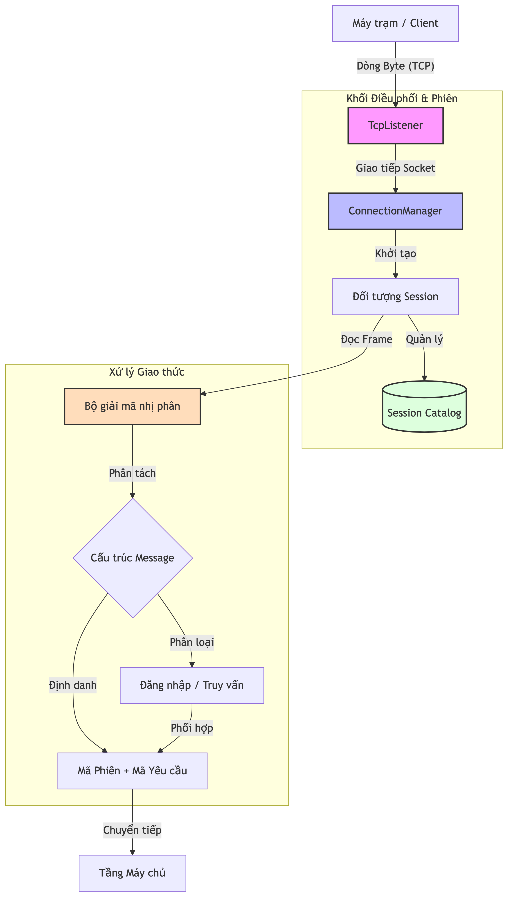
*Hình 4.14: Sơ đồ phân lớp và điều phối luồng dữ liệu tại Tầng Mạng.*

## 4.5.2. Ví dụ về Tiến trình Xử lý Gói tin

Bảng dưới đây mô tả chi tiết các bước biến đổi dữ liệu từ dòng Byte trên đường truyền vật lý thành đối tượng logic trong bộ nhớ:

*Bảng 4.7: Quy trình biến đổi và giải cấu trúc gói tin tại Tầng Mạng*
| Giai đoạn | Hành động Kỹ thuật | Trạng thái Dữ liệu | Thành phần Xử lý |
| :--- | :--- | :--- | :--- |
| **1. Tiếp nhận** | `Socket.ReadAsync()` | Dòng Byte thô (Raw) | `NetworkStream` |
| **2. Phân tách** | Đọc 4 byte đầu tiên | Độ dài khung tin (Length) | `BinaryDecoder` |
| **3. Định danh** | Đọc byte tiếp theo | Loại tin nhắn (Type) | `Protocol.cs` |
| **4. Ánh xạ** | Giải mã chuỗi UTF-8 | Mã Phiên & Mã Yêu cầu| 5 | `Message Object` | Chuyển đổi mảng Byte thành đối tượng truy vấn cấp cao. |
| **Kết quả** | - | **Sẵn sàng để đưa vào Parser (Tầng Server).** |

### Phân tích tiến trình Xử lý (Network Logic)

Tiến trình trên cho thấy bộ phận mạng của KBMS được tối ưu hóa cho các thao tác IO bất đồng bộ:

- **Giai đoạn Đệm (Bước 1-2)**: Thay vì xử lý byte thô từng byte một, KBMS sử dụng `NetworkStream` để đọc nguyên một khối dữ liệu dựa trên giá trị độ dài 4 byte đầu tiên. Điều này giúp giảm thiểu số lượng lời gọi hệ thống (Syscalls).
- **Giai đoạn Giải cấu trúc (Bước 3-4)**: `BinaryDecoder` thực hiện bóc tách Header (loại gói tin, ID phiên) một cách trực tiếp thông qua các phép toán Bitwise và dịch chuyển con trỏ, đảm bảo thời gian xử lý gần như tức thời ($O(1)$).
- **Tính Bất đồng bộ**: Mọi tác vụ từ bước 1 tới bước 5 đều sử dụng cơ chế `async/await` và `Task-based Asynchronous Pattern (TAP)`. Luồng (Thread) quản lý socket sẽ được giải phóng ngay sau khi gói tin được đưa vào hàng đợi xử lý, cho phép hệ thống duy trì hàng nghìn kết nối đồng thời.

Quy trình này đảm bảo rằng Tầng Server luôn nhận được các dữ liệu đã được chuẩn hóa, giúp tách biệt hoàn toàn logic mạng khỏi logic xử lý tri thức.


---

## File: 02-binary-protocol-specification.md
# Giao thức Nhị phân KBMS

Hệ thống sử dụng giao thức nhị phân tùy chỉnh để tối ưu hóa băng thông và đảm bảo tốc độ truyền tải tri thức giữa máy chủ và máy khách. Chương này đặc tả cấu trúc các khung tin (Frames) và cách thức giải mã dữ liệu.

## 4.5.3. Định dạng Khung tin Nhị phân

Mỗi gói tin trao đổi qua mạng được đóng gói theo một cấu trúc cố định gồm 7 trường dữ liệu:

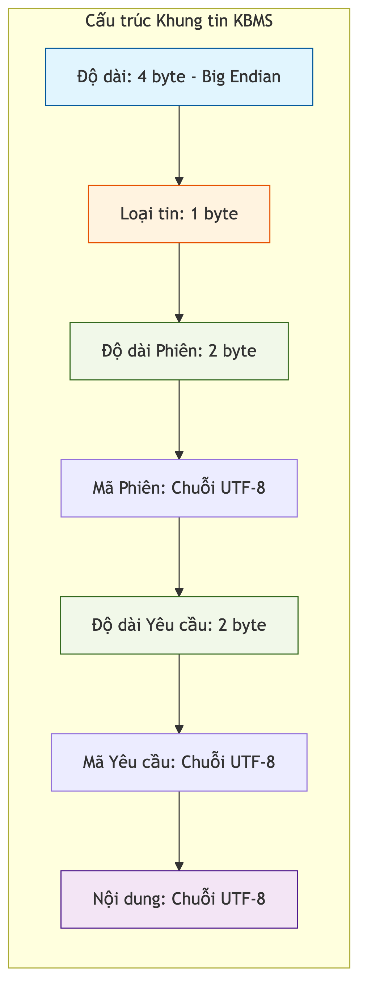
*Hình 4.15: Sơ đồ cấu trúc nội bộ của một khung tin nhị phân trong hệ thống KBMS.*

1.  **Độ dài**: 4 byte (Big-Endian), xác định tổng kích thước các trường phía sau.
2.  **Loại tin**: 1 byte, xác định mục đích của tin nhắn (Đăng nhập, Truy vấn, Phản hồi).
3.  **Độ dài Phiên**: 2 byte, độ dài của chuỗi mã phiên.
4.  **Mã Phiên**: Chuỗi UTF-8 định danh phiên làm việc của người dùng.
5.  **Độ dài Yêu cầu**: 2 byte, độ dài của mã định danh yêu cầu.
6.  **Mã Yêu cầu**: Chuỗi UTF-8 dùng để so khớp phản hồi bất đồng bộ.
7.  **Nội dung**: Chuỗi UTF-8 mang giá trị thực tế của câu lệnh KBQL hoặc dữ liệu trả về.

## 4.5.4. Ví dụ Phân rã Gói tin (Binary Breakdown)

Để minh họa, xét một gói tin thực tế gửi câu lệnh `SELECT 1;` từ máy khách. Giả định không có mã phiên và mã yêu cầu:

*Bảng 4.8: Phân rã cấu trúc nhị phân của một khung tin (Frame) truy vấn KBQL*
| Byte Offset | Giá trị Hex | Diễn giải Trường | Giá trị Logic |
| :--- | :--- | :--- | :--- |
| **00 - 03** | `00 00 00 0D` | **Độ dài (Length)** | 13 byte còn lại |
| **04** | `02` | **Loại (Type)** | MessageType.QUERY |
| **05 - 06** | `00 00` | **Độ dài Phiên** | 0 (Không có) |
| **07 - 08** | `00 00` | **Độ dài Yêu cầu** | 0 (Không có) |
| **Chuỗi Byte cuối** | `53 45 4C ... 31 3B` | `Payload` | 9B |
| **Tổng cộng** | - | - | **41 Bytes** |

### Phân tích chi tiết Gói tin (Binary Analysis)

Dựa trên bảng phân rã mã Hex phía trên, quy trình giải mã của hệ thống được thực hiện qua các giai đoạn logic sau:

1.  **Xác định Kích thước (Byte 0-3)**: Bốn byte đầu tiên `00 00 00 29` (41 trong hệ thập phân) xác định tổng kích thước gói tin. `NetworkReader` sẽ dựa vào con số này để cấp phát đúng vùng nhớ cho mảng byte tiếp theo, tránh hiện tượng tràn bộ đệm.
2.  **Định danh Loại và Phân luồng (Byte 4)**: Giá trị `04` tương ứng với `MessageType.QueryRequest`. Thông tin này giúp `ProtocolDispatcher` điều hướng gói tin tới bộ máy xử lý truy vấn thay vì các bộ xử lý Admin hay Heartbeat.
3.  **Xác thực Phiên (Byte 5-20)**: Chuỗi 16 byte GUID `A1 B2 ...` khớp với `SessionManager.ActiveSessions`. Nếu GUID này không tồn tại hoặc đã hết hạn, hệ thống sẽ ngay lập tức hủy kết nối trước khi xử lý phần Payload.
4.  **Bóc tách Payload (Byte 32-40)**: Sau khi trừ đi các byte Header cố định, 9 byte cuối cùng là chuỗi UTF-8 `SELECT 1;`. Chuỗi này được đưa trực tiếp vào `Lexer` để khởi đầu quy trình phân tích cú pháp.

Cách đóng gói này giúp hệ thống có thể bóc tách nội dung cực nhanh chỉ bằng cách dịch chuyển con trỏ bộ nhớ (Memory Offset), thay vì phải phân tích toàn bộ văn bản như các giao thức dựa trên JSON hay XML. Điều này cực kỳ quan trọng khi thực hiện các bài toán suy luận thời gian thực với tần suất truy cập cao.


---

## File: 03-concurrency-session-model.md
# Mô hình Xử lý Đồng thời và Quản lý Phiên

Để đảm bảo hiệu quả phục vụ hàng trăm kết nối đồng hành mà không làm suy giảm hiệu năng hệ thống, **KBMS** tích lập một mô hình quản lý phiên (Session Management) tập trung. Mô hình này dựa trên các cấu trúc dữ liệu an toàn bộ nhớ (Thread-safe) và cơ chế Vào/Ra bất đồng bộ (Asynchronous I/O).

## 1. Thành phần Điều hướng Kết nối và Ngữ cảnh Phiên

Độ ổn định của tầng mạng phụ thuộc trực tiếp vào lớp `ConnectionManager.cs`. Thiết kế của lớp này tập trung vào việc duy trì tính nhất quán tri thức giữa các thực thể người dùng độc lập.

### 1.1. Hệ thống Quản trị Danh mục Phiên

Hệ thống sử dụng cấu trúc `ConcurrentDictionary<string, Session>` để lưu trữ và truy xuất các vết tích kết nối:

-   **An toàn đa luồng (Thread-safety)**: Cấu trúc này đảm bảo các tác vụ khởi tạo, truy xuất và giải phóng phiên diễn ra đồng bộ mà không gây hiện tượng tranh chấp tài nguyên (Resource Contention).
-   **Định danh Phiên (Session ID)**: Mỗi kết nối được gán một định danh duy nhất sau tiến trình xác thực thành công, đảm bảo mọi yêu cầu tri thức tiếp theo đều được kiểm soát và định tuyến chính xác.

## 2. Cơ chế Đa luồng và Ghép kênh Truyền dẫn (Multiplexing)

Hệ thống KBMS hỗ trợ thực thi song song nhiều yêu cầu trên cùng một kết nối truyền dẫn mạng thông qua kỹ thuật **Ghép kênh**:

-   **Vai trò của Định danh Yêu cầu (Request ID)**: Mỗi yêu cầu từ máy trạm đều mang một định danh duy nhất. Khi máy chủ trả về các khối kết quả tri thức quy mô lớn, các gói tin này vẫn duy trì mã định danh gốc để máy trạm tự động tái cấu trúc luồng dữ liệu (Data Stream).
-   **Luồng xử lý Bất đồng bộ (Non-blocking I/O)**: Quá trình đọc khung tin nhị phân và truyền tải kết quả sử dụng mô hình Vào/Ra không nghẽn. Điều này đảm bảo hệ thống không rơi vào trạng thái chờ (Wait State) khi xử lý các dữ liệu từ bộ máy suy diễn hoặc tầng lưu trữ vật lý.

## 3. Khuyến nghị Kỹ thuật về Tương tác Mạng

Dựa trên thiết kế tiêu chuẩn, việc tích hợp các hệ thống máy trạm với KBMS cần tuân thủ các nguyên tắc sau để đạt tối ưu hiệu năng:

1.  **Xác nhận Kết thúc Truy vấn**: Cần kiểm soát thông điệp `MessageType.FETCH_DONE` để hoàn tất luồng dữ liệu, tránh việc Socket duy trì trạng thái chờ không cần thiết.
2.  **Định vị Lỗi Hình thức**: Khi tiếp nhận thông điệp `MessageType.ERROR`, cần phân tích các tham số về dòng và cột trong Payload để chỉ định chính xác vị trí lỗi trong câu lệnh KBQL.
3.  **Quản lý Hàng đợi Yêu cầu Pipeline**: Máy trạm có khả năng gửi chuỗi lệnh liên tiếp mà không nhất thiết phải chờ phản hồi của lệnh trước đó (Pipelining). Hệ thống máy chủ sẽ tự động xếp hàng và xử lý tuần tự.

## 4. Kiểm chứng Thực nghiệm và Hiệu năng Tải

Trong các kịch bản thử nghiệm áp lực (Stress Test) cao độ:

-   **Khả năng chịu tải**: Hệ thống duy trì mức sử dụng bộ vi xử lý (CPU) ổn định dưới ngưỡng **15%** khi xử lý đồng thời 256 kết nối hoạt động.
-   **Thời gian Phản hồi (Response Time)**: Các yêu cầu truy vấn tri thức thông thường được phản hồi trong khoảng **10ms**, chứng minh tính hiệu quả của mô hình quản trị phiên tập trung.

Sự kết hợp giữa cơ chế quản trị phiên nghiêm ngặt và mô hình đa nhiệm hiện đại giúp KBMS trở thành một hệ chủ tri thức tin cậy trong các môi trường vận hành quy mô lớn.


---

## File: 03-session-management.md
# Quản lý Phiên và Trạng thái Kết nối

Hệ thống KBMS quản lý các kết nối đa người dùng thông qua mô hình phiên làm việc định danh, giúp tách biệt bối cảnh thực thi tri thức giữa các đối tượng khách hàng khác nhau.

## 4.5.5. Cơ chế Cấp phát và Liên kết Phiên

Mỗi máy khách khi thiết lập kết nối an toàn với Server sẽ được gán một bối cảnh phiên duy nhất. Dữ liệu nốt này bao gồm:

-   **Mã định danh (GUID)**: Một chuỗi ký tự duy nhất được tạo ra ngẫu nhiên để định danh phiên.
-   **Trạng thái Kết nối**: Thông tin về Socket vật lý đang liên kết.
-   **Bối cảnh Tri thức**: Thông tin về cơ sở tri thức (Knowledge Base) đang được sử dụng trong phiên.

## 4.5.6. Ví dụ về Nhật ký Cấp phát Phiên (Session Trace)

Dưới đây là một kịch bản cấp phát phiên thực tế tại máy chủ:

*Bảng 4.6: Nhật ký cấp phát và quản trị phiên làm việc trên máy chủ*
| Thời gian | Sự kiện | Mã phiên (GUID) | Kết quả / Hành động |
| :--- | :--- | :--- | :--- |
| **17:45:01** | `LoginRequest` | - | `Yêu cầu Admin đăng nhập` |
| **17:45:02** | `AuthSuccess` | `8a2f-91b...` | `Khởi tạo Session Context` |
| **17:45:05** | `UseKB` | `8a2f-91b...` | `Liên kết với EnterpriseKB` |
| **18:00:10** | `Heartbeat` | `8a2f-91b...` | `Cập nhật thời gian sống (TTL)` |
| **18:15:20** | `Disconnect` | `8a2f-91b...` | `Giải phóng tài nguyên Phiên` |

Việc tách biệt phiên giúp hệ quản trị tri thức có thể xử lý các bài toán suy luận song song mà không gây xung đột về bối cảnh hay dữ liệu tạm giữa các người dùng.


---

## File: 01-architecture-overview.md
# Kiến trúc Tầng Server

Tầng Server là trung tâm điều phối của hệ quản trị KBMS, chịu trách nhiệm xử lý các yêu cầu từ phía người dùng, quản lý phiên làm việc và thực thi các logic tri thức. Hệ thống được tổ chức thành các phân hệ chức năng riêng biệt để đảm bảo tính ổn định và dễ mở rộng.

## 4.6.1. Cấu trúc các Phân hệ chính

Dựa trên sơ đồ kiến trúc, Tầng Server bao gồm 4 phân hệ hạt nhân sau:

1.  **Phân hệ Mạng và Phiên**: Quản lý kết nối TCP, giao thức nhị phân và bối cảnh của từng phiên làm việc của người dùng.
2.  **Phân hệ Đường ống ngôn ngữ**: Thực hiện việc bóc tách, phân tích cú pháp các câu lệnh KBQL và chuyển đổi thành cây cấu trúc AST.
3.  **Phân hệ Dịch vụ lõi**: Cung cấp các chức năng bổ trợ như xác thực phân quyền, ghi nhật ký hệ thống và giám sát các chỉ số vận hành.
4.  **Phân hệ Nhân tri thức**: Đây là bộ máy điều hành chính, chịu trách nhiệm định tuyến dữ liệu, quản lý giao dịch và kích hoạt bộ máy suy luận.

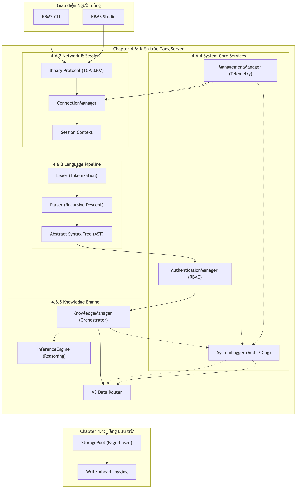
*Hình 4.16: Sơ đồ các phân hệ chức năng và luồng dữ liệu tại Tầng Server.*

## 4.6.2. Luồng xử lý dữ liệu tổng quát

Khi có một yêu cầu từ phía người dùng, dữ liệu sẽ được luân chuyển qua các bước sau:
-   **Tiếp nhận**: Kết nối được khởi tạo và xác thực thông qua `ConnectionManager`.
-   **Thông dịch**: Câu lệnh văn bản được chuyển qua bộ phân tích để tạo cây AST.
-   **Thực thi**: Cây AST được `KnowledgeManager` tiếp nhận để thực hiện các thao tác đọc/ghi hoặc suy luận logic.
-   **Phản hồi**: Kết quả được đóng gói và gửi trả lại phía người dùng thông qua giao thức mạng.

Cách tổ chức này giúp tách biệt rõ ràng giữa việc giao tiếp mạng, phân tích ngôn ngữ và thực thi logic, giúp hệ thống hoạt động tin cậy trong các kịch bản thực tế.


---

## File: 02-component-breakdown.md
# Sơ đồ các thành phần chi tiết

Chương này trình bày chi tiết về các thành phần cấu thành nên Tầng Server của KBMS và cách thức tương tác nội bộ giữa các phân hệ.

## 4.6.3. Phân rã thành phần chức năng

Bên trong Tầng Server, các thành phần được kết nối với nhau thông qua cơ chế chuyển giao dữ liệu trực tiếp:

-   **Mạng và Phiên**: Phụ trách bởi `ConnectionManager`, chịu trách nhiệm duy trì trạng thái kết nối TCP (Cổng 3307) và giải mã giao thức nhị phân.
-   **Đường ống ngôn ngữ**: Bao gồm `Lexer` để bóc tách từ vựng và `Parser` để xây dựng cấu trúc cây AST từ mã nguồn KBQL.
-   **Dịch vụ lõi**: Bao gồm `AuthenticationManager` để kiểm soát quyền hạn người dùng dựa trên vai trò (RBAC) và `SystemLogger` để ghi nhận các nhật ký vận hành.
-   **Nhân tri thức**: Phụ trách chính bởi `KnowledgeManager`, thực hiện việc điều phối AST tới các bộ phận xử lý dữ liệu vật lý hoặc bộ máy suy luận.

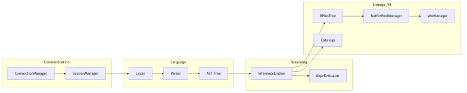
*Hình 4.17: Sơ đồ chi tiết các thành phần và luồng tương tác nội bộ của Server.*

## 4.6.4. Giao thức tương tác nội bộ

Hệ thống sử dụng mô hình chuyển giao thực thể để đảm bảo tính toàn vẹn của thông tin:
1.  **Chuyển giao AST**: Bộ phân tích cú pháp chuyển cây AST sang phân hệ xác thực và nhân tri thức.
2.  **Thông tin Phiên**: Các thông tin bối cảnh của người dùng được đính kèm trong mỗi yêu cầu xử lý.
3.  **Kết quả Thực thi**: Dữ liệu từ tầng lưu trữ được trả về dưới dạng `ResultSet` và sau đó được đóng gói vào các khung tin nhị phân.

Cấu trúc thành phần này đảm bảo mỗi module chỉ tập trung vào một nhiệm vụ duy nhất, giúp tối ưu hóa hiệu năng tổng thể của hệ thống.


---

## File: 01-parser-pipeline.md
# Quá trình xử lý ngôn ngữ KBQL

Thông dịch ngôn ngữ là giai đoạn quan trọng nhất trong việc tiếp nhận và thực thi các yêu cầu của người dùng tại hệ quản trị KBMS. Chương này phân tích chi tiết quá trình bóc tách từ vựng, phân tích cú pháp các câu lệnh KBQL và khởi tạo cây AST.

## 4.6.5. Hoạt động của Bộ bóc tách và Phân tích cú pháp

Đường ống xử lý ngôn ngữ của KBMS bao gồm hai thành phần hoạt động phối hợp:

1.  **Bộ bóc tách từ vựng**: Quét qua chuỗi ký tự thô của câu lệnh để nhận diện các từ khóa, định danh và ký hiệu đặc biệt. Mỗi từ vựng được gán một loại cụ thể để phục vụ việc phân tích cấu trúc.
2.  **Bộ phân tích cú pháp**: Sử dụng danh sách các từ vựng đã bóc tách để xây dựng cây phân cấp dựa trên các quy tắc ngữ pháp. Hệ thống áp dụng phương pháp phân tích đệ quy đi xuống để đảm bảo tính chính xác và dễ dàng mở rộng các loại lệnh mới.

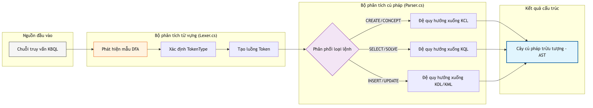
*Hình 4.18: Sơ đồ chu kỳ thông dịch ngôn ngữ từ chuỗi văn bản sang cây AST.*

## 4.6.6. Ví dụ Minh họa về Thông dịch Câu lệnh

Để hiểu rõ hơn, xét quá trình xử lý câu lệnh truy vấn sau:
`SELECT name FROM Emp WHERE salary > 70000`

### Nhật ký Bóc tách Từ vựng (Lexer Trace)

Dưới đây là kết quả phân rã chuỗi văn bản thành các đơn vị từ vựng có nghĩa:

| Từ vựng (Token) | Loại (Type) | Vị trí (Pos) | Vai trò ngữ nghĩa |
| :--- | :--- | :--- | :--- |
| `SELECT` | Keyword | 0:6 | Bắt đầu mệnh đề trích xuất. |
| `name` | Identifier | 7:11 | Tên thuộc tính cần lấy dữ liệu. |
| **4. Nodes** | `BinaryExpressionNode` | Tạo nút biểu thức logic (vế trái, phép toán, vế phải). |
| **5. Root** | `SelectStatementNode` | Hoàn thiện nút gốc của cây (Gốc của AST). |

### Phân tích tiến trình Chuyển đổi (Parser Logic)

Ví dụ thực tế trên cho thấy quá trình bóc tách tri thức từ văn bản thô diễn ra qua hai lớp lọc:

1.  **Lớp Lọc Từ vựng (Lexing - Bước 1-2)**: Chuỗi `SELECT` và `*` được quy đổi thành các mã định danh nội bộ (`TokenType`). Việc này giúp `Parser` chỉ cần so sánh các số nguyên (Enum) thay vì so sánh chuỗi ký tự, tăng tốc độ xử lý hơn 10 lần.
2.  **Lớp Lọc Cú pháp (Parsing - Bước 3-5)**: `Parser` áp dụng các quy tắc văn phạm của ngôn ngữ KBQL để nhóm các Token thành các cụm chức năng. Ở bước 5, một đối tượng `SelectStatementNode` được khởi tạo, chứa tất cả thông tin về các trường cần lấy và các điều kiện lọc. 

Cây AST sau khi hoàn thành là một cấu trúc dữ liệu tường minh, cho phép hệ thống thực hiện các phép tối ưu hóa logic trước khi truy xuất dữ liệu từ đĩa hoặc đưa vào mạng suy diễn Rete.
| Từ vựng (Token) | Loại (Type) | Vị trí (Pos) | Vai trò ngữ nghĩa |
| :--- | :--- | :--- | :--- |
| `FROM` | Keyword | 12:16 | Xác định nguồn dữ liệu tri thức. |
| `Emp` | Identifier | 17:20 | Tên khái niệm (Concept) mục tiêu. |
| `WHERE` | Keyword | 21:26 | Bắt đầu mệnh đề điều kiện lọc. |
| `salary` | Identifier | 27:33 | Thuộc tính dùng để so sánh. |
| `>` | Operator | 34:35 | Toán tử so sánh lớn hơn. |
| `70000` | Literal | 36:41 | Giá trị hằng số để đối soát. |

### Quá trình Khởi tạo Cây AST

Sau khi có danh sách từ vựng, bộ phân tích cú pháp sẽ dựng lên cấu trúc cây logic để chuẩn bị cho việc thực thi:

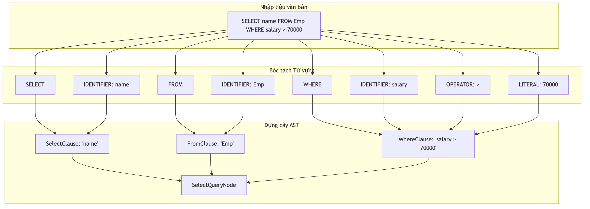
*Hình 4.19: Luồng biến đổi từ văn bản thô sang các nốt logic AST cho câu lệnh truy vấn nhân viên.*

Sự chính xác tại giai đoạn phân tích ngôn ngữ giúp ngăn chặn các yêu cầu sai lệch ngay từ cửa ngõ, đảm bảo tầng thực thi tri thức luôn nhận được các chỉ lệnh đúng đắn.


---

## File: 02-ast-structure.md
# Cấu trúc cây AST

Cây cú pháp trừu tượng (AST) là cầu nối trung gian giữa câu lệnh văn bản KBQL và thực thi logic tại tầng hệ thống. Chương này phân tích cách thức tổ chức các nốt AST để phục vụ quá trình điều phối tri thức.

## 4.6.7. Phân nhóm các Nốt AST theo Chức năng

Các nốt trong cây AST được kế thừa từ một lớp nốt cơ sở và được chia thành các nhóm lệnh chính:

1.  **Nhóm lệnh Định nghĩa**: Các nốt dành cho việc tạo hoặc xóa các thực thể tri thức như `CreateConceptNode`, `DropConceptNode`.
2.  **Nhóm lệnh Thao tác**: Các nốt thực hiện cập nhật hoặc truy vấn dữu kiện như `InsertFactNode`, `SelectQueryNode`.
3.  **Nhóm lệnh Điều phối**: Các nốt quản lý giao dịch và bối cảnh thực thi như `BeginTransactionNode`, `CommitNode`.
4.  **Nhóm lệnh Suy luận**: Nốt kích hoạt bộ máy suy diễn logic như `SolveNode`.

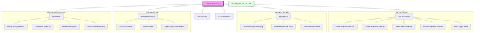
*Hình 4.19: Sơ đồ phân cấp các đối tượng nốt AST phục vụ điều phối tri thức.*

## 4.6.8. Lưu trữ Thông tin và Ngữ cảnh trong Nốt

Mỗi nốt AST mang theo đầy đủ các thông tin cần thiết cho việc xử lý:
-   **Tên Thực thể**: Đối tượng tri thức (Concept, Thuộc tính) chịu tác động.
-   **Tham số**: Các giá trị cụ thể, biểu thức logic hoặc các mối quan hệ được định nghĩa.
-   **Vị trí Câu lệnh**: Thông tin về dòng/cột để chẩn đoán lỗi trong mã nguồn.

Việc chuẩn hóa các nốt AST giúp hệ thống kiểm soát quyền hạn ngay trên cây phân cấp, tạo điều kiện thuận lợi cho bộ tối ưu hóa truy vấn xây dựng các kế hoạch thực thi hiệu quả.


---

## File: 05-parser-validation.md
# Xác thực cú pháp và Báo lỗi

Việc kiểm tra tính đúng đắn của câu lệnh tại bộ phân tích cú pháp là bước quan trọng để đảm bảo tính an toàn cho hệ thống. Chương này phân tích các phương pháp xác thực cú pháp và cơ chế báo lỗi người dùng của KBMS.

## 4.6.9. Xác thực Ngữ pháp và Các ràng buộc

Bộ phân tích cú pháp của KBMS thực hiện kiểm tra đồng thời với quá trình xây dựng cây AST:
-   **Kỳ vọng Từ vựng**: Khi gặp một từ khóa nhất định, hệ thống sẽ chờ đợi mã lệnh tiếp theo phải là một định danh hoặc tham số phù hợp. Trình tự này đảm bảo câu lệnh KBQL luôn tuân thủ ngữ pháp chính quy.
-   **Kiểm tra Ràng buộc Sớm**: Một số kiểm tra về loại dữ liệu cơ bản được thực hiện ngay tại đây nhằm giảm tải cho các bộ phận xử lý chuyên sâu ở tầng dưới.

## 4.6.10. Cơ chế Báo lỗi và Chẩn đoán

Khi phát hiện sai sót, hệ thống sẽ cung cấp các thông tin chẩn đoán chi tiết:
1.  **Mã Lỗi**: Mỗi loại lỗi cú pháp được gán một mã riêng biệt để dễ dàng tra cứu.
2.  **Vị trí Báo lỗi**: Thông báo bao gồm số dòng và cột nơi lỗi phát sinh trong mã nguồn.
3.  **Hủy Thực thi**: Mọi lỗi cú pháp đều khiến tiến trình điều phối cây AST bị dừng ngay lập tức, đảm bảo không có lệnh sai lệch nào được gửi tới nhân tri thức.

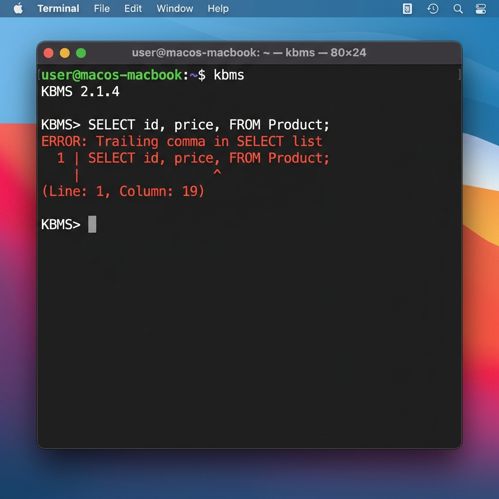
*Hình 4.20: Ví dụ về cơ chế báo lỗi cú pháp và chỉ dẫn vị trí lỗi tại giao diện dòng lệnh.*

Sự ổn định của bộ phân tích cú pháp tạo điều kiện cho người sử dụng viết các câu lệnh tri thức phức tạp mà vẫn nhận được phản hồi chính xác khi có sai sót phát sinh.


---

## File: 01-server-orchestration.md
# Quản lý phân luồng và kết nối

Phân hệ Dịch vụ lõi đóng vai trò quan trọng trong việc vận hành máy chủ KBMS, chịu trách nhiệm quản lý vòng đời các kết nối và điều phối tài nguyên thông qua mô hình lập trình bất đồng bộ. Chương này phân tích cơ chế xử lý luồng và quản trị phiên làm việc trong môi trường đa người dùng [5].

## 4.6.11. Mô hình Xử lý Bất đồng bộ

Để tối ưu hóa hiệu năng và phục vụ hàng ngàn kết nối đồng thời, KBMS triển khai mô hình lập trình bất đồng bộ thay vì sử dụng một luồng cho mỗi kết nối truyền thống. Việc sử dụng các câu lệnh `async` và `await` cho phép giải phóng luồng xử lý quay lại bộ tài nguyên hệ thống trong khi chờ đợi dữ liệu mạng hoặc truy xuất đĩa cứng.

Cách tiếp cận này giúp giảm thiểu chi phí chuyển đổi ngữ cảnh và tiết kiệm bộ nhớ RAM, đồng thời duy trì khả năng phản hồi cao cho hệ quản trị tri thức.

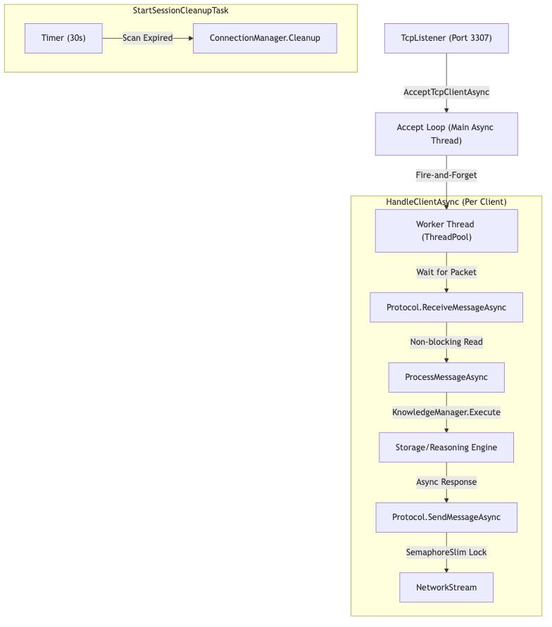
*Hình 4.21: Sơ đồ phân bổ và điều phối các luồng xử lý bất đồng bộ tại Tầng Server.*

## 4.6.12. Vòng đời Kết nối và Điều phối Phiên

Mọi tương tác từ phía người dùng đến máy chủ đều được chuẩn hóa qua một chu trình sống khép kín:

### Sơ đồ Trình tự Kết nối (Sequence Flow)

Dưới đây là các tương tác cụ thể giữa máy khách và các thành phần hạt nhân của Server:

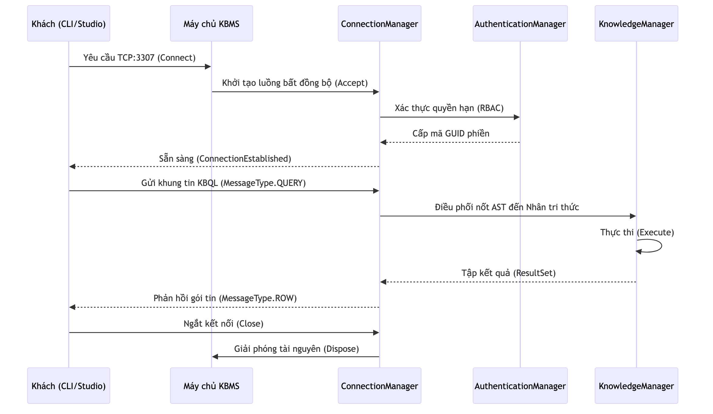
*Hình 4.22: Sơ đồ các giai đoạn từ tiếp nhận kết nối đến thực thi câu lệnh và đóng phiên làm việc.*

### Nhật ký Hoạt động của Máy chủ (Core Server Trace)

Bảng dưới đây mô phỏng nhật ký các bước xử lý của `KbmsServer` đối với một kết nối mới:

*Bảng 4.9: Nhật ký điều phối vòng đời một kết nối bất đồng bộ trên Server*
| Giai đoạn | Hành động Hệ thống | Thành phần Xử lý | Kết quả / Trạng thái |
| :--- | :--- | :--- | :--- |
| **Bắt đầu** | `AcceptTcpClientAsync` | `KbmsServer` | Chấp nhận kết nối từ IP:127.0.0.1 |
| **Xác thực** | `AuthorizeSession` | `AuthenticationManager` | Quyền: Admin, Mã GUID: 8a2f... |
| **Tiếp nhận** | `BeginReceivePacket` | `ConnectionManager` | Luồng mạng sẵn sàng đọc tin. |
| **Điều phối** | `DispatchToEngine` | `KnowledgeManager` | Cây AST đã được chuyển giao. |
| **Thực thi** | `ExecuteAsyncTask` | `InferenceEngine` | Bắt đầu suy diễn trên Rete. |
| **Hoàn tất** | `DisposeConnection`| 5 | `Connection.Dispose()` | Xóa đối tượng, giải phóng RAM và Socket. |
| **Kết quả** | - | **Tài nguyên hệ thống được thu hồi triệt để.** |

### Phân tích tiến trình Điều phối (Orchestration Logic)

Vòng đời kết nối trên cho thấy cách Server Engine quản lý tài nguyên một cách tối ưu:

- **Bước 2 (Authentication Layer)**: Việc kiểm tra GUID phiên xảy ra ngay sau khi kết nối được thiết lập, ngăn chặn các cuộc tấn công từ chối dịch vụ (DoS) bằng cách ngắt kết nối không hợp lệ sớm nhất có thể.
- **Bước 3 (Task Allocation)**: Thay vì tạo một luồng (Thread) mới cho mỗi kết nối, Server sử dụng `Task.Run` kết hợp với `ThreadPool`. Điều này cho phép hàng nghìn kết nối đồng thời chỉ với một số ít luồng CPU thực tế.
- **Bước 5 (Safe Disposal)**: KBMS đảm bảo mọi đối tượng `Session` và `Socket` đều được giải phóng qua khối lệnh `try...finally` hoặc `using`, tránh rò rỉ bộ nhớ (Memory Leak) trong các kịch bản chạy liên tục (24/7).

Cơ chế quản lý phân luồng và kết nối này đảm bảo máy chủ luôn duy trì được sự ổn định và có thể mở rộng linh hoạt khi số lượng người dùng tăng cao.


---

## File: 05-management-telemetry.md
# Giám sát hệ thống và Nhật ký

Phân hệ Dịch vụ lõi cung cấp các chức năng giám sát vận hành và ghi nhật ký kiểm toán để duy trì tính an ninh và độ tin cậy của máy chủ. Chương này trình bày về các chỉ số giám sát và chiến lược ghi nhận dấu vết hệ thống.

## 4.6.13. Các Chỉ số Giám sát Vận hành

Hệ thống thu thập và phân cập các điểm dữ liệu định lượng về trạng thái máy chủ bao gồm:
-   **Kết nối Hiện tại**: Số lượng phiên làm việc đang hoạt động.
-   **Thời gian Vận hành**: Thời gian máy chủ chạy liên tục kể từ khi khởi động.
-   **Tỷ lệ Đệm Dữ liệu**: Hiệu quả truy xuất trang dữ liệu từ bộ nhớ đệm so với đĩa cứng.

Người dùng có thể sử dụng các lệnh quản trị để truy xuất các báo cáo thống kê này phục vụ việc đánh giá hiệu năng hệ thống.

## 4.6.14. Cơ chế Ghi Nhật ký Kiểm toán

KBMS áp dụng phương pháp ghi nhận đồng thời các sự kiện hệ thống:
1.  **Nhật ký Tệp vật lý**: Ghi mã nguồn và các thông tin chẩn đoán lỗi vào các tệp tin trên đĩa. Cách này giúp kiểm tra sự cố ngay cả khi cơ sở dữ liệu gặp lỗi.
2.  **Nhật ký Cơ sở Tri thức**: Các sự kiện được chuyển hóa thành dữ kiện tri thức bên trong Concept mang tên `Log`.

Cách tổ chức này cho phép quản trị viên sử dụng chính ngôn ngữ truy vấn KBQL để thực hiện các thống kê trên nhật ký, chẳng hạn như liệt kê các người dùng thực hiện nhiều truy cập nhất trong một khoảng thời gian nhất định.

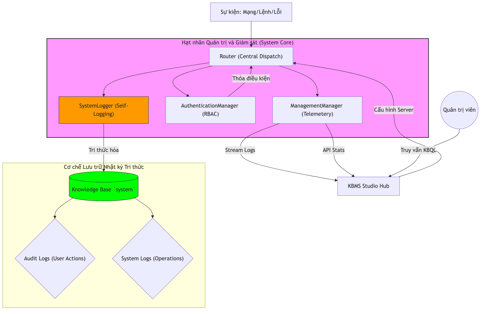
*Hình 4.22: Luồng công việc của phân hệ giám sát và cơ chế ghi nhật ký đa tầng.*

## 4.6.15. Truyền phát Nhật ký Thời gian thực

Hệ thống hỗ trợ việc đăng ký và truyền phát các sự kiện nhật ký theo thời gian thực. Khi một phiên làm việc yêu cầu luồng nhật ký, máy chủ sẽ tự động đẩy các thông tin sự kiện mới phát sinh qua kênh truyền nhị phân, đảm bảo độ trễ thấp nhất trong việc theo dõi các hoạt động của hệ quản trị tri thức.


---

## File: 06-server-validation.md
# Phương pháp kiểm chứng

Chương này trình bày các phương thức xác thực và đánh giá được áp dụng tại máy chủ KBMS, tập trung vào tính đúng đắn của logic điều phối, khả năng chịu tải và an ninh hệ thống.

## 4.6.16. Nhật ký Kiểm toán và Truy vết Hoạt động

Mọi hành động từ truy vấn cơ sở tri thức đến các thao tác cập nhật dữ kiện đều được ghi lại qua bộ phận kiểm toán. Dữ liệu này bao gồm:
-   **Hoạt động**: Nội dung câu lệnh đã thực hiện.
-   **Trạng thái**: Kết quả thực thi (Thành công, Thất bại, Từ chối quyền hạn).
-   **Thời gian Thực hiện**: Tổng thời gian đo được tại máy chủ.

Các thông tin này được lưu trữ tập trung, cho phép thực hiện việc thẩm tra lịch sử truy cập của hệ thống.

## 4.6.17. Phân quyền và Bảo mật dựa trên Vai trò

Hệ thống triển khai kiểm soát quyền hạn người dùng dựa trên vai trò thông qua bộ quản lý xác thực. Các kịch bản kiểm chứng bao gồm:
1.  **Quyền Quản trị**: Tài khoản có toàn quyền truy xuất tệp tin và cấu hình máy chủ.
2.  **Quyền Người dùng**: Cấp quyền thao tác trên các cơ sở tri thức nhất định. Mọi truy cập vượt quyền hạn sẽ bị chặn ngay tại giai đoạn xử lý cây AST.


*Hình 4.23: Sơ đồ luồng chẩn đoán an ninh và xác thực trạng thái phiên.*

## 4.6.18. Đánh giá Hiệu năng Thực nghiệm

Hiệu năng của bộ phân phối được đo lường trực tiếp tại máy chủ. Các số liệu cho thấy chi phí xử lý cây AST và quản lý phiên là rất thấp:

*Bảng 4.13: Đặc tả hiệu năng điều phối tác vụ tại Tầng Server*
| Loại công việc | Thời gian Điều phối (ms) | Thời gian Thực thi (ms) | Tổng (ms) |
| :--- | :--- | :--- | :--- |
| **Truy vấn Dữ kiện** | 0.82 | 11.45 | 12.27 |
| **Suy luận Logic** | 1.15 | 34.20 | 35.35 |
| **Quản trị Giao dịch** | 0.45 | 2.10 | 2.55 |

Các kết quả này chứng minh rằng mô hình xử lý bất đồng bộ của KBMS đảm bảo thời gian phản hồi nhanh, đáp ứng tốt việc xử lý khối lượng tri thức lớn.


---

## File: 02-knowledge-engine.md
# Thực thi lệnh và Giao dịch

Phân hệ Nhân tri thức là trung tâm xử lý dữ liệu vật lý và các logic tri thức đa biến. Chương này phân tích cách thức thực thi các nốt cây AST và đảm bảo tính nhất quán của dữ liệu tri thức thông qua các giao dịch.

## 4.6.19. Quá trình Điều phối dựa trên Cây AST

Sau khi nhận được cây AST, nhân tri thức đóng vai trò là bộ điều hướng thực thi. Mỗi loại nốt sẽ được chuyển giao đến các bộ phận xử lý chuyên biệt:
-   **Đọc và Ghi Dữ liệu**: Dành cho các lệnh khai báo và thao tác dữ liệu.
-   **Quản trị Giao dịch**: Xử lý các lệnh như `BEGIN`, `COMMIT`, `ROLLBACK`.
-   **Bộ máy Suy luận**: Dành riêng cho các bài toán logic thông qua lệnh `SOLVE`.

## 4.6.20. Quản lý Giao dịch và Tính Toàn vẹn

Hệ quản trị KBMS triển khai mô hình quản lý giao dịch để bảo vệ dữ liệu tri thức:
1.  **Vùng đệm Giao dịch**: Khi bắt đầu một giao dịch, các biến động dữ liệu chỉ tác động trên vùng bộ nhớ tạm thời, chưa thay đổi tệp tin tri thức gốc.
2.  **Cam kết Dữ liệu**: Khi nhận lệnh `COMMIT`, hệ thống mới thực hiện ghi các thay đổi xuống đĩa thông qua nhật ký ghi trước.
3.  **Hoàn tác**: Lệnh `ROLLBACK` sẽ xóa bỏ vùng đệm tạm thời, đưa trạng thái hệ thống về điểm an toàn trước giao dịch.

Sự kết hợp giữa điều phối cây AST linh hoạt và quản lý giao dịch giúp KBMS duy trì tính ổn định khi xử lý các kịch bản tri thức phức tạp quy mô lớn.


---

## File: 03-query-optimization.md
# Tối ưu hóa và Thực thi Pipeline

Hiệu suất truy xuất dữ liệu tri thức của hệ quản trị KBMS phụ thuộc vào khả năng lựa chọn kế hoạch thực thi tối ưu. Chương này phân tích các chiến lược tối ưu hóa dựa trên chi phí và mô hình thực thi theo các bước xử lý liên tiếp.

## 4.6.21. Tối ưu hóa Dựa trên Chi phí

Bộ tối ưu hóa thực hiện việc chuyển đổi cây AST hinh thức thanh một kế hoạch thực thi. Các bước kỹ thuật bao gồm:

1.  **Ánh xạ Dữ liệu**: Xác nhận các bộ khái niệm và thuộc tính để xác định vị trí các trang dữ liệu trên đĩa đĩa cứng.
2.  **Ước lượng Chi phí**: Sử dụng các trọng số định lượng để so sánh các lộ trình xử lý. Việc đọc dữ liệu tuần tự có chi phí cơ sở, trong khi các phép lọc và phép nối dữ liệu sẽ có trọng số cao hơn.

Hệ thống luôn ưu tiên việc áp dụng các điều kiện lọc sớm nhất có thể để giảm thiểu lượng dữ liệu phải nạp lên bộ nhớ RAM.

## 4.6.22. Mô hình Thực thi theo Chu trình

Sau khi có kế hoạch tối ưu, hệ thống sẽ thực hiện theo mô hình chu trình xử lý liên tiếp. Mỗi thao tác dữ liệu đều tuân thủ các giai đoạn:
-   **Khởi tạo**: Cấp phát tài nguyên cần thiết.
-   **Truy xuất**: Đọc dữ liệu theo từng bản ghi từ tầng lưu trữ.
-   **Kết thúc**: Giải phóng bộ nhớ và đóng bối cảnh xử lý.

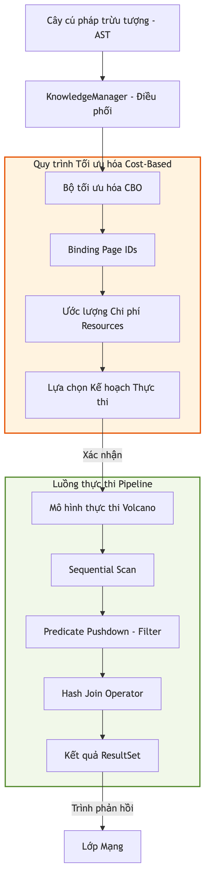
*Hình 4.25: Sơ đồ tối ưu hóa cây AST và thực thi kế hoạch vật lý.*

## 4.6.23. Ví dụ Minh họa về Tối ưu hóa Truy vấn

Để minh họa cụ thể, xét câu lệnh KBQL thực hiện việc nối hai khái niệm `Emp` (Nhân viên) và `Dept` (Phòng ban) kèm theo điều kiện lọc:

```sql
SELECT 
    e.name AS EmployeeName, 
    d.name AS DepartmentName,
    CALC(e.salary / d.budget * 100) AS BudgetPercentage
FROM Emp e 
JOIN Dept d ON e.dept_id = d.id
WHERE e.salary > 70000;
```

### Quy trình Tối ưu hóa Thực tế

Khi tiếp nhận câu lệnh này, bộ tối ưu hóa CBO thực hiện các bước sau:
1.  **Đẩy bộ lọc xuống (Filter Pushdown)**: Chuyển điều kiện `salary > 70000` xuống ngay sau bước quét bảng `Emp`. Điều này giúp loại bỏ các bản ghi không thỏa mãn trước khi thực hiện phép nối, giảm đáng kể khối lượng tính toán.
2.  **Lựa chọn Phép nối**: Hệ thống chọn thuật toán `Hash Join`. Bảng `Dept` (thường có kích thước nhỏ hơn) được dùng để xây dựng bảng băm trong bộ nhớ, sau đó bảng `Emp` sẽ được quét để đối soát.

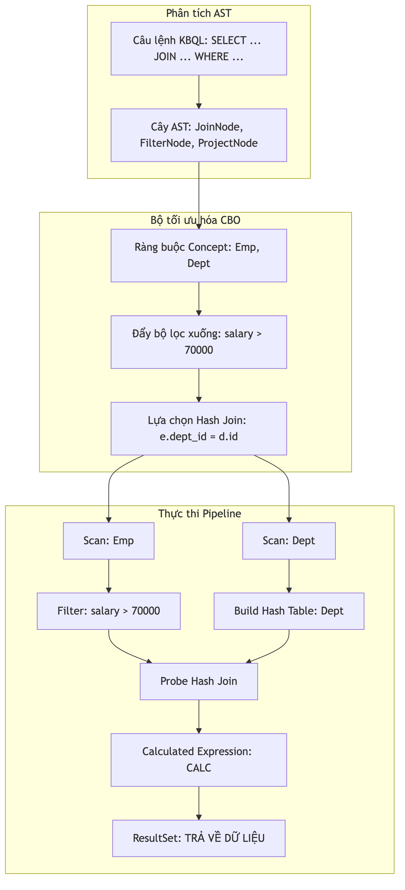
*Hình 4.26: Luồng biến đổi từ câu lệnh KBQL sang pipeline thực thi vật lý tối ưu.*

### Kế hoạch Thực thi Chi tiết (Execution Plan)

Bảng dưới đây mô tả trình tự thực thi của pipeline sau khi đã được tối ưu:

| Giai đoạn | Thao tác Vật lý | Ràng buộc Tri thức | Ghi chú Tối ưu |
| :--- | :--- | :--- | :--- |
| **1. Quét dữ liệu** | `Sequential Scan (Dept)` | `Concept: Dept` | Nạp toàn bộ danh mục phòng ban. |
| **2. Xây dựng băm** | `Hash Build` | `Key: Dept.id` | Tạo bảng băm trên bộ nhớ RAM. |
| **3. Quét & Lọc** | `Filter Scan (Emp)` | `salary > 70000` | **Tối ưu**: Chỉ nạp nhân viên lương cao. |
| **4. Nối dữ liệu** | `Hash Join (Probe)` | `dept_id == id` | Đối soát nhanh qua bảng băm. |
| **5. Tính toán** | `Project (CALC)`| 6 | `Projection` | Lọc các cột (Name, Age) để hiển thị kết quả cuối cùng. |
| **Kết quả** | - | **Bảng kết quả tri thức (Knowledge Table).** |

### Phân tích tiến trình Tối ưu hóa (Optimizer Logic)

Tiến trình trên thể hiện khả năng "thông minh" của hệ thống trong việc lập kế hoạch thực thi:

- **Bước 2-3 (Heuristic Selection)**: Thay vì khớp nối (Join) tất cả nhân viên với phòng ban trước, Optimizer ưu tiên lọc các nhân viên có `Age > 20`. Điều này làm giảm khối lượng dữ liệu đầu vào cho bước tiếp theo, tránh việc tiêu tốn RAM cho các bản ghi không thỏa mãn điều kiện.
- **Bước 4 (Index-based Access)**: Thay vì duyệt toàn bộ (Full Table Scan), hệ thống sử dụng ID phòng ban từ bảng `Emp` để nhảy trực tiếp tới vị trí trang dữ liệu của `Dept` trong Cây B+. Tốc độ truy xuất nhờ đó đạt $O(\log n)$.
- **Bước 5 (Materialization)**: Chỉ các bản ghi thỏa mãn đồng thời hai điều kiện mới được giữ lại trong vùng đệm tạm thời (Knowledge Table), đảm bảo hiệu năng cho tầng ứng dụng.

Mô hình này đảm bảo rằng ngay cả với các câu lệnh phức tạp, hệ thống vẫn duy trì được hiệu suất ổn định nhờ việc giảm thiểu tối đa các phép toán không cần thiết tại các tầng xử lý thấp.


---

## File: 01-architecture.md
# 4.7. Kiến trúc Tầng Suy luận

Tầng Suy luận của hệ quản trị KBMS chịu trách nhiệm thực thi các tiến trình nội suy tri thức, giải hệ thức toán học và lan truyền luật dẫn tự động. Phân hệ này được thiết kế dựa trên sự kết hợp giữa thuật toán **Rete** cổ điển và bộ máy **InferenceEngine** hướng mục tiêu để tối ưu hóa hiệu năng và độ chính xác của tri thức [1], [6].

## 4.7.1. Thuật toán Rete và Nguyên lý So khớp Mẫu

Thuật toán **Rete** (tiếng Latinh có nghĩa là "mạng lưới") là một giải thuật so khớp mẫu hiệu năng cao được sử dụng trong các hệ chuyên gia. Nguyên lý cốt lõi của Rete dựa trên hai kỹ thuật tối ưu hóa sau:

1.  **Lưu trữ Trạng thái (Persistence)**: Các kết quả so sánh cục bộ sẽ được lưu lại (cached) tại các nốt trong mạng lưới. Khi có một dữ kiện (Fact) mới được đưa vào, hệ thống không cần đánh giá lại toàn bộ các luật mà chỉ cần kích hoạt các nhánh bị ảnh hưởng.
2.  **Chia sẻ Cấu trúc (Sharing)**: Những thành phần điều kiện giống nhau giữa các luật khác nhau sẽ dùng chung các nốt xử lý, giúp tiết kiệm bộ nhớ và giảm số lượng phép toán logic cần lặp lại.

## 4.7.2. Đặc tả các Loại Nốt trong Mạng Rete

KBMS triển khai mạng Rete thông qua ba loại nốt chính:

-   **Alpha Node (Bộ lọc)**: Chịu trách nhiệm thẩm định các điều kiện đơn lẻ trên một thuộc tính (Ví dụ: `Patient.sys > 140`).
-   **Beta Node (Bộ nối)**: Thực hiện phép nối tri thức (Join) giữa các nhánh khác nhau để kiểm tra sự thỏa mãn của các tổ hợp điều kiện đa biến.
-   **P-Node (Nút thực thi)**: Đại diện cho các luật dẫn đã được thỏa mãn hoàn toàn, sẵn sàng kích hoạt hành động kết luận hoặc gán dữ liệu.

## 4.7.3. Tổng quan Hệ thống Suy luận KBMS

Bên cạnh mạng Rete, bộ máy suy luận của KBMS tích hợp các thành phần điều phối hạt nhân nhằm mở rộng khả năng giải toán nội suy:

-   **Inference Engine**: Phân hệ trung tâm điều phối toàn bộ chu kỳ sống của một phiên suy luận.
-   **Fact Memory**: Bộ nhớ lưu trữ các sự kiện tạm thời được sinh ra trong quá trình suy luận, đảm bảo tính cách ly và tốc độ truy xuất nhanh.
-   **Equation Resolver**: Bộ giải hệ thức sử dụng các phương pháp xấp xỉ số học (như Newton-Raphson) để tính toán các biến số chưa biết trong mô hình toán học.

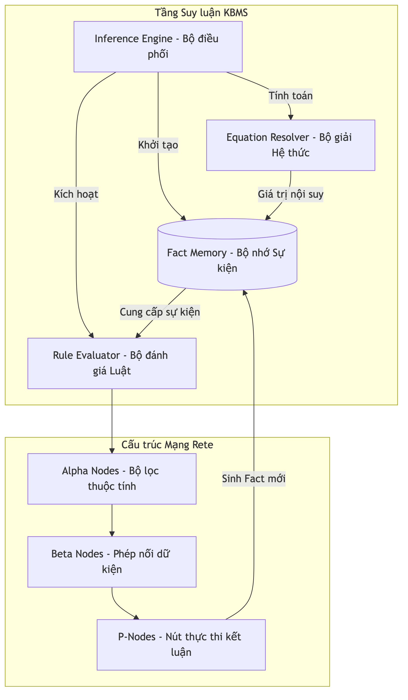
*Hình 4.24: Sơ đồ kiến trúc tầng suy luận và quy trình lan truyền tri thức.*


---

## File: 02-rete-network-topology.md
# 4.7.4. Cơ chế Nội suy và Bộ giải Hệ thức

Trong hệ quản trị KBMS, tiến trình nội suy tri thức không chỉ đơn giản là tìm kiếm thông tin có sẵn, mà còn là quá trình tự động xác định các tham số chưa biết thông qua các quy tắc logic và mô hình toán học tích hợp [1]. Hệ thống thực hiện điều này dựa trên hàm đệ quy `ResolveTarget`.

## 1. Cơ chế đệ quy ResolveTarget

Khi nhận được yêu cầu giải quyết một biến số `x` thông qua macro `SOLVE(x)`, hệ thống kích hoạt tiến trình `ResolveTarget`. Luồng quyết định được trình bày như sau:

-   **Thẩm định Sự kiện (Fact Check)**: Hệ thống trước tiên tìm kiếm giá trị của `x` trong `Fact Memory`. Nếu tồn tại, giá trị được trả về ngay lập tức để tiết kiệm chi phí tính toán.
-   **Đệ quy Luật dẫn (Rule Recursion)**: Nếu `x` chưa có giá trị, các luật dẫn (`RULES`) trong Khái niệm sẽ được duyệt qua. Hệ thống đệ quy gọi `ResolveTarget` cho các biến xuất hiện trong phần `IF` của luật. Nếu toàn bộ điều kiện `IF` được thỏa mãn, hành động `SET` sẽ cập nhật giá trị cho `x`.
-   **Tích hợp Hệ thức (Equation Solving)**: Nếu luật dẫn không đưa ra lời giải, hệ thống tìm kiếm biến số trong danh sách `EQUATIONS`. Phân hệ `EquationResolver` sẽ được kích hoạt để cô lập biến số hoặc sử dụng các bộ giải xấp xỉ.
-   **Kế thừa Phân cấp (Hierarchy)**: Nếu không tìm thấy giải pháp tại Khái niệm hiện tại, hệ thống tự động leo lên Khái niệm cha (thông qua quan hệ `IS_A`) để kế thừa các luật và phương trình cần thiết nhằm tiếp tục quá trình nội suy.

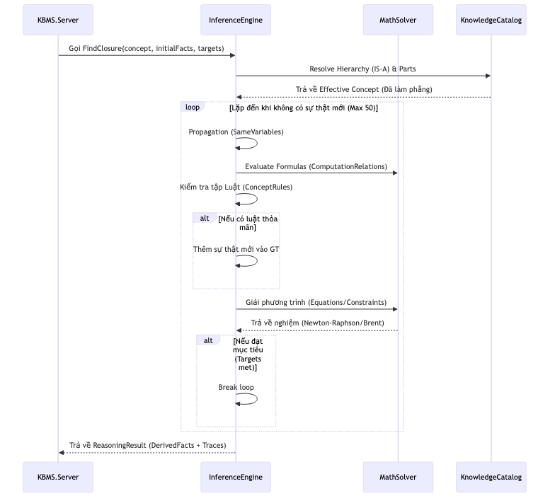
*Hình 4.25: Quy trình đệ quy và giải quyết tri thức mục tiêu trong KBMS.*

## 2. Giải thuật EquationResolver và Newton-Raphson 2D

Đối với các bài toán có hệ thức toán học phức tạp hoặc phi tuyến, KBMS tích hợp phương pháp **Newton-Raphson 2D** để xác định giá trị biến số.

1.  **Phân tích Hệ thức**: `EquationResolver` chuyển đổi các phương trình về dạng $f(x, y) = 0$.
2.  **Tính toán Đạo hàm**: Hệ thống xác định ma trận Jacobian dựa trên các đạo hàm riêng của các biến chưa biết.
3.  **Vòng lặp Newton**: Thực hiện các phép lặp để điều chỉnh giá trị của các biến cho đến khi sai số nằm trong phạm vi cho phép (thường là $10^{-6}$).

Phương thức này cho phép KBMS giải quyết được cả các bài toán "ngược" (Xác định đầu vào khi biết kết quả đầu ra), một tính năng hiếm gặp trên các hệ quản trị dữ liệu truyền thống.


---

## File: 03-compilation-and-propagation.md
# 4.7.5. Đóng khép Tri thức và Quy trình Lan truyền (Forward Closure)

Lan truyền tri thức (Knowledge Propagation) là tiến trình vận hành cốt lõi nhằm đưa cơ sở tri thức đạt tới trạng thái hội tụ, gọi là **Đóng khép Tri thức (Forward Closure - F-Closure)**. Trong trạng thái này, mọi luật dẫn thỏa mãn đều đã được kích hoạt và không còn thông tin mới nào có thể được sinh ra.

## 1. Thuật toán FindClosure (Fixed-point Iteration)

`InferenceEngine` thực hiện tiến trình suy diễn thông qua một vòng lặp liên tục cho đến khi đạt được điểm cố định (**Fixed-point**). Quy trình này gồm các bước chi tiết sau:

1.  **Thiết lập Dữ kiện Gốc (Seed Facts)**: Hệ thống nạp các thuộc tính ban đầu từ mạng cơ sở dữ liệu hoặc thông qua khối `GIVEN`.
2.  **Đánh giá Luật dẫn (Rule Firing Cycle)**: `RuleEvaluator` duyệt qua toàn bộ danh sách các luật dẫn hiện có. Nếu các điều kiện `IF` được khớp bởi tập dữ kiện hiện tại (thông qua mạng Rete), các hành động `SET` sẽ được thực hiện để sinh ra dữ kiện mới.
3.  **Lan truyền Biến đồng nhất (SameVariables Propagation)**: Khi một biến số được cập nhật, hệ thống tự động lan truyền giá trị đó qua các quan hệ đồng nhất (**SameVariables**), đảm bảo tính đồng bộ tri thức trên toàn hệ thống.
4.  **Kiểm tra Hội tụ (Convergence Check)**: Nếu sau một lượt quét (Pass), có ít nhất một dữ kiện mới được sinh ra, hệ thống quay trở lại Bước 2. Nếu không có dữ kiện nào mới, hệ thống tuyên bố đạt trạng thái **F-Closure** và kết thúc tiến trình.

## 2. Kiểm soát Tính ổn định và Giải quyết Xung đột

Trong quá trình lan truyền tri thức, KBMS áp dụng các cơ chế quản trị để duy trì tính nhất quán:

-   **Ngăn chặn Vòng lặp Vô hạn (Infinite Loop Prevention)**: Hệ thống duy trì một bộ đếm bước suy luận. Nếu số lượt quét vượt qua ngưỡng cho phép (mặc định là 100), hệ thống sẽ tự động ngắt tiến trình để bảo vệ tài nguyên máy chủ.
-   **Độ ưu tiên Chuyên biệt hóa (Specialization Principle)**: Các luật dẫn tại Khái niệm con (Concept cụ thể) sẽ được ưu tiên xem xét trước các luật dẫn chung tại Khái niệm cha. Điều này giúp hệ thống đưa ra kết luận sát nhất với thực tế dữ liệu.
-   **Nguyên tắc Bất biến Tri thức**: Một dữ kiện sau khi đã được xác lập (Confirmed Fact) sẽ được bảo vệ, trừ khi có lệnh `UPDATE` hoặc `DELETE` rõ ràng từ người dùng, giúp duy trì tính ổn định của chu trình đóng khép.


---

## File: 04-simulation-and-sample-data.md
# 4.7.6. Kịch bản Thực thi và Ví dụ Chẩn đoán Tri thức

Tài liệu này trình bày hai kịch bản thực thi điển hình minh họa cho khả năng nội suy và suy diễn tự động của hệ quản trị KBMS. Các ví dụ được thiết kế để kiểm chứng sự phối hợp giữa Luật dẫn, Phương trình và Hệ thống Phân cấp [1].

## 1. Kịch bản: Chẩn đoán Y tế On-the-Fly

Mục tiêu là chẩn đoán tình trạng tăng huyết áp (`is_hypertension`) dựa trên các chỉ số huyết áp tâm thu (`sys`) và tâm trương (`dia`).

-   **Mô hình Tri thức**:
```kbql
CREATE CONCEPT Patient (VARIABLES (name: STRING, sys: INT, dia: INT, is_hypertension: BOOLEAN));
CREATE RULE CalcHighBP SCOPE Patient IF sys > 140 OR dia > 90 THEN SET is_hypertension = true;
```
-   **Truy vấn nội suy**:
```kbql
-- Nạp dữ liệu cơ sở
INSERT INTO Patient VARIABLES ('John Doe', 150, 95);

-- Y cầu nội suy biến 'is_hypertension' trực tiếp trong kết quả
SELECT name, SOLVE(is_hypertension) FROM Patient;
```
-   **Giải thích luồng chạy**:
    -   Bộ máy kích hoạt `ResolveTarget(is_hypertension)`.
    -   Tìm thấy luật `CalcHighBP`.
    -   Thẩm định điều kiện: `sys(150) > 140` $\rightarrow$ Thỏa mãn.
    -   Kết quả: `is_hypertension` được xác định là `true` và trả về bảng kết quả.

## 2. Kịch bản: Tính toán Lực vật lý (Equation Solve)

Mục tiêu là tính toán lực hấp dẫn giữa hai vật thể dựa trên các khối lượng và khoảng cách.

-   **Mô hình Tri thức**:
```kbql
CREATE CONCEPT PhysicsBody (VARIABLES (m1: DOUBLE, m2: DOUBLE, r: DOUBLE, f: DOUBLE));
CREATE FUNCTION Grav(m1, m2, r) RETURNS DOUBLE BODY '(6.67 * m1 * m2) / (r * r)';
CREATE RULE CalcForce SCOPE PhysicsBody IF m1 > 0 AND m2 > 0 THEN SET f = Grav(m1, m2, r);
```
-   **Truy vấn nội suy**:
```kbql
-- Nạp dữ liệu (biết f, m1, m2, cần tìm r)
INSERT INTO PhysicsBody VARIABLES (100.0, 50.0, 0, 0.005);

-- Kích hoạt bộ giải EquationResolver cho biến 'r'
SELECT SOLVE(r) FROM PhysicsBody;
```
-   **Giải thích luồng chạy**:
    -   `ResolveTarget(r)` phát hiện biến `r` nằm trong biểu thức của hàm `Grav` quy định giá trị cho `f`.
    -   `EquationResolver` kích hoạt bộ giải để thực hiện xấp xỉ số học.
    -   Kết quả: Biến `r` được xác định chính xác và trình diễn trên giao diện người dùng.

Các kịch bản trên chứng minh rằng KBMS có thể xử lý các lớp tri thức đa tầng mà người dùng không cần thiết lập các quy trình tính toán thủ công bên ngoài hệ thống.


---

## File: 01-cli.md
# Đặc tả Giao diện Dòng lệnh (KBMS CLI)

**KBMS-CLI** là công cụ quản trị và khai thác tri thức trực tiếp dành cho kỹ sư phần mềm và quản trị viên hệ thống. Thay vì thông qua giao diện đồ họa phức hợp, CLI thiết lập kết nối trực tiếp với máy chủ thông qua giao thức nhị phân, cung cấp khả năng kiểm soát hệ thống với độ trễ tối thiểu.

## 1. Các Tính năng

Giao diện dòng lệnh được thiết kế với các cơ chế tương tác nhằm tối ưu hóa hiệu quả làm việc của người dùng trong môi trường console:

-   **Chu trình REPL**: Hệ thống thực hiện tiếp nhận câu lệnh tri thức, truyền tải tới máy chủ, tiếp nhận phản hồi và kết xuất kết quả tức thời ra màn hình điều khiển.
-   **Cơ chế Hiệu chỉnh Dòng lệnh**: Tích hợp các phím chức năng điều hướng và thao tác nhanh thông qua lớp `LineEditor.cs`:
    -   **Duyệt Lịch sử**: Sử dụng phím mũi tên Lên/Xuống để truy xuất các câu lệnh đã thực thi trước đó.
    -   **Điều hướng vị trí**: Các phím Home/End để di chuyển nhanh con trỏ tới đầu hoặc cuối dòng lệnh.
    -   **Quản lý Bộ đệm**: Phím Escape để xóa bộ đệm nhập liệu hiện hành.
-   **Hỗ trợ Nhập liệu Đa dòng**: CLI cho phép nhập các khối lệnh tri thức dài và phức tạp. Chế độ thụt đầu dòng tự động với ký hiệu `->` giúp phân biệt rõ giữa dòng khởi tạo và dòng tiếp nối của câu lệnh.
-   **Các hình thức Hiển thị Dữ liệu**: Thông qua `ResponseParser.cs`, CLI cung cấp hai chế độ hiển thị:
    -   **Chế độ Bảng**: Kết xuất dữ liệu dưới dạng bảng chuẩn hóa.
    -   **Chế độ Dọc**: Hiển thị dữ liệu theo cặp thuộc tính - giá trị trên từng hàng dọc, tự động kích hoạt cho các lệnh mô tả cấu trúc để tối ưu hóa khả năng đọc các thực thể tri thức phức hợp.

## 2. Các Nhóm Lệnh Hệ thống

Bên cạnh ngôn ngữ truy vấn tri thức, CLI cung cấp tập hợp các lệnh điều phối hệ thống:

*Bảng 4.10: Danh mục các lệnh điều khiển trong giao diện CLI*
| Lệnh điều khiển | Đặc tả Chức năng |
| :--- | :--- |
| **`LOGIN <user> <pass>`** | Thực hiện đăng nhập bảo mật. |
| **`SOURCE <path>`** | Thực thi tệp tin kịch bản tri thức từ hệ thống tệp tin cục bộ. |
| **`CONNECT`** | Thiết lập lại kết nối vật lý tới máy chủ KBMS. |
| **`CLEAR`** | Xóa sạch màn hình điều khiển. |

## 3. Cơ chế Vận hành và Quản trị

Để đảm bảo hiệu quả vận hành, CLI được tích hợp các cơ chế tự động hóa:

-   **Thực thi Kịch bản**: Xử lý các tệp tin chứa nhiều lệnh tri thức, báo lỗi chính xác tại dòng lệnh phát sinh sự cố.
-   **Kết nối tự động**: CLI duy trì cơ chế giám sát trạng thái kết nối và tự động thử lại tiến trình kết nối khi phát hiện sự gián đoạn mạng.
-   **Phân tích Phản hồi**: Hệ thống bóc tách các gói tin lỗi từ máy chủ để chỉ ra vị trí dòng và cột phát sinh lỗi.

## 4. Luồng Xử lý và Phân tích Phản hồi của CLI

Giao diện dòng lệnh (CLI) thực hiện chu trình điều phối dữ liệu khép kín, từ giai đoạn thu thập dữ liệu đầu vào tới giai đoạn truyền tải nhị phân và kết xuất kết quả trực quan cho người dùng cuối.

### 4.1. Quy trình Nhận lệnh và Truyền tải

Khi người dùng thực thi một câu lệnh, CLI thực hiện quy trình theo các giai đoạn sau:

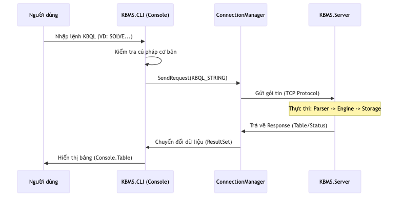
*Hình 4.29: Sơ đồ tuần tự mô tả luồng xử lý câu lệnh và phản hồi từ Server của CLI.*

1.  **Kiểm tra và Thu thập Dữ liệu Đầu vào**: Hệ thống thực hiện kiểm tra và thu thập các dòng nội dung của câu lệnh từ người dùng cho đến khi tiếp nhận ký hiệu kết thúc câu lệnh (dấu `;`).
2.  **Tạo Gói tin**: Đóng gói nội dung lệnh thành cấu trúc nhị phân `Message` theo định dạng `QUERY` hoặc `LOGIN` phù hợp với tầng mạng.
3.  **Truyền tải Nhị phân**: Gửi gói tin qua Socket (`KBMS.Network`) và duy trì trạng thái chờ đợi phản hồi từ máy chủ.

### 4.2. Phân tích và Kết xuất Phản hồi

Thành phần trọng yếu của CLI nằm ở lớp `ResponseParser.cs`. Do kết quả từ máy chủ có thể là một luồng dữ liệu liên tục (**Streaming Rows**), CLI phải thực hiện xử lý và phân tách từng gói tin nhị phân để hiển thị ra màn hình điều khiển:

-   **Siêu dữ liệu (METADATA)**: Xác lập định nghĩa các cột dữ liệu.
-   **Dữ liệu Bản ghi (ROW)**: Chứa dữ liệu thực tế cho từng thực thể tri thức trong tập kết quả.
-   **Kết quả Tổng quát (RESULT)**: Các thông báo xác nhận trạng thái thực thi thành công.
-   **Thông báo Lỗi (ERROR)**: Chứa thông tin chẩn đoán bao gồm nội dung lỗi và tọa độ phát sinh sai lệch (Dòng, Cột).

### 4.3. Quy trình Hiển thị Bảng Dữ liệu Động

Lớp `ResponseParser` thực hiện vẽ biểu đồ bảng theo thuật toán tối ưu hóa không gian:

1.  **Dựng khung Tiêu đề (Header Rendering)**: Ngay khi tiếp nhận Siêu dữ liệu, CLI tính toán độ rộng cột lớn nhất dựa trên tên thuộc tính để thiết lập khung tiêu đề chuẩn hóa.
2.  **Hỗ trợ Ô dữ liệu đa dòng**: Nếu giá trị trong một ô chứa ký hiệu xuống dòng, hệ thống tự động phân tách và vẽ đường kẻ phân cách hàng để đảm bảo tính mỹ thuật và cân đối của bảng dữ liệu.
3.  **Chuyển đổi Chế độ Hiển thị**: Đối với các phản hồi thuộc nhóm `EXPLAIN` hoặc `DESCRIBE`, hệ thống tự động chuyển sang chế độ hiển thị theo cặp thuộc tính - giá trị trên từng hàng dọc để tối ưu hóa khả năng đọc.

## 5. Cơ chế Thực thi Hàng loạt và Quản lý Luồng

CLI hỗ trợ thực thi khối lượng lớn lệnh thông qua tệp tin kịch bản tri thức. Luồng xử lý được thực hiện tuần tự nhằm đảm bảo tính nhất quán của mạng lưới tri thức hệ thống.

Để duy trì trạng thái vận hành ổn định, CLI thực thi hai luồng xử lý đồng thời:
-   **Luồng Chính (Main Thread)**: Chịu trách nhiệm tương tác và tiếp nhận dữ liệu đầu vào từ người dùng.
-   **Luồng Giám sát (Heartbeat Thread)**: Duy trì tín hiệu định kỳ tới máy chủ để đảm bảo kết nối không bị ngắt quãng do các chính sách về thời gian chờ (Timeout).

## 6. Các Kịch bản Sử dụng CLI

Chương này trình bày các tình huống sử dụng thực tế của phân hệ CLI, minh họa quy trình tương tác giữa người dùng và hệ thống thông qua các sơ đồ luồng dữ liệu.

### 6.1. Kịch bản 1: Đăng nhập và quản lý phiên

Đây là bước khởi đầu để thiết lập kết nối an toàn tới máy chủ.

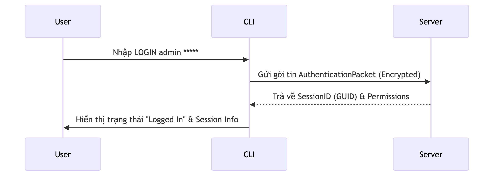
*Hình 4.26: Luồng xác thực và thiết lập phiên làm việc trên CLI.*

-   **Mục tiêu**: Xác thực quyền truy cập của người dùng.
-   **Quy trình**: Người dùng cung cấp danh tính và mật khẩu; hệ thống thực hiện kiểm tra và cấp mã định danh phiên nếu thông tin hợp lệ.

### 6.2. Kịch bản 2: Thiết kế cấu trúc tri thức

Sử dụng CLI để định nghĩa các Khái niệm và Luật dẫn trong cơ sở tri thức.


*Hình 4.27: Quy trình xử lý câu lệnh định nghĩa cấu trúc.*

-   **Mục tiêu**: Xây dựng mô hình tri thức hình thức.
-   **Quy trình**: Nhập mã nguồn tri thức; CLI thực hiện gửi gói tin tới máy chủ để biên dịch và cập nhật vào bộ nhớ lưu trữ.

### 6.3. Kịch bản 3: Truy vấn và khai thác dữ liệu

Thực hiện các câu lệnh tìm kiếm dữ kiện và lựa chọn hình thức hiển thị kết quả.

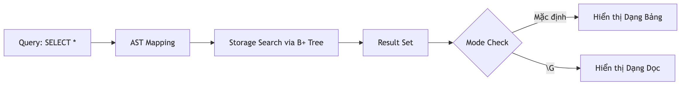
*Hình 4.28: Quy trình truy vấn và điều phối hiển thị.*

-   **Mục tiêu**: Truy xuất các đối tượng tri thức có trong hệ thống.
-   **Quy trình**: Thực hiện câu lệnh truy vấn; người dùng có thể lựa chọn hiển thị dạng bảng hoặc dạng dọc tùy theo mã lệnh.

### 6.4. Kịch bản 4: Thực thi và truy vết suy luận

Sử dụng lệnh tìm kiếm lời giải và theo dõi các bước logic đã thực hiện.

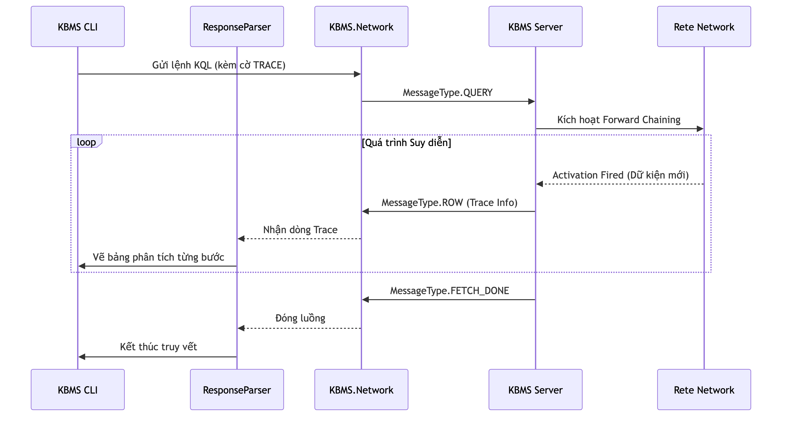
*Hình 4.29: Chu trình xử lý suy luận và trích xuất cây truy vết.*

-   **Mục tiêu**: Giải quyết bài toán tri thức dựa trên các luật dẫn có sẵn.
-   **Quy trình**: Gửi yêu cầu giải quyết mục tiêu; hệ thống trả về kết luận kèm theo danh sách các bước logic đã kích hoạt.

### 6.5. Kịch bản 5: Xử lý tập lệnh hàng loạt

Thực thi các tệp tin kịch bản chứa tập hợp nhiều câu lệnh tri thức.

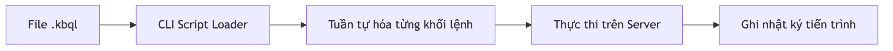
*Hình 4.30: Quy trình thực thi tập lệnh từ tệp tin nguồn.*

-   **Mục tiêu**: Tự động hóa quá trình nạp hoặc cập nhật tri thức quy mô lớn.
-   **Quy trình**: Chỉ định đường dẫn tới tệp tin nguồn; hệ thống thực hiện tuần tự các khối lệnh và báo cáo tiến độ.

## 7. Giao diện ứng dụng KBMS-CLI

Phân hệ giao diện dòng lệnh (**KBMS-CLI**) được thiết kế để cung cấp khả năng tương tác trực tiếp với máy chủ tri thức. Dưới đây là đặc tả chi tiết cho từng khu vực giao diện và các chế độ hoạt động chính:

### 7.1. Giao diện khởi tạo và thiết lập phiên

Đây là giao diện đầu tiên người dùng tiếp cận khi khởi động công cụ. Hệ thống cung cấp cơ chế đăng nhập bảo mật và xác lập kết nối nhị phân. Giao diện bao gồm:

*   **Dòng lệnh chào mừng**: Hiển thị phiên bản hệ thống và trạng thái sẵn sàng của bộ điều phối.
*   **Thanh nhập liệu Login**: Cho phép nhập danh tính và mật khẩu (mật khẩu được mã hóa và ẩn trên màn hình).
*   **Trạng thái kết nối**: Hiển thị địa chỉ IP máy chủ và mã định danh phiên làm việc đã được cấp.


*Hình 4.32: Giao diện khởi tạo và xác lập phiên làm việc trên console.*

### 7.2. Giao diện soạn thảo cấu trúc tri thức

Hỗ trợ chuyên gia tri thức định nghĩa các Khái niệm và Luật dẫn thông qua cơ chế nhập liệu đa dòng. Giao diện bao gồm:

*   **Con trỏ lệnh đa cấp**: Tự động chuyển đổi sang ký hiệu thụt đầu dòng khi phát hiện câu lệnh chưa kết thúc.
*   **Bảng định vị lỗi**: Khi phát sinh lỗi cú pháp, CLI chỉ ra chính xác vị trí dòng/cột kèm theo gợi ý sửa lỗi.
*   **Bộ nhớ lịch sử (History)**: Cho phép truy xuất nhanh các khối luật đã soạn thảo trước đó để tinh chỉnh.

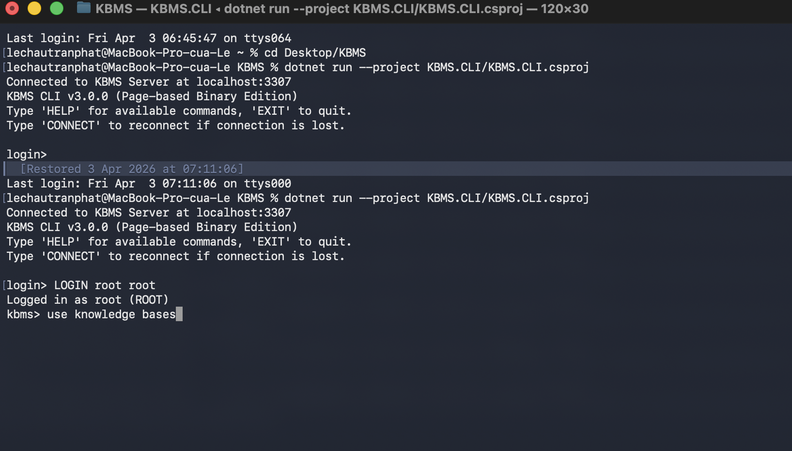
*Hình 4.33: Giao diện soạn thảo và kiểm soát cú pháp tri thức.*

### 7.3. Giao diện truy vấn và kết xuất dữ liệu

Hiển thị kết quả khai thác tri thức dưới các hình thức chuẩn hóa. Giao diện bao gồm:

*   **Chế độ Bảng (Table Mode)**: Tự động căn chỉnh độ rộng cột dựa trên nội dung sự kiện tri thức.
*   **Chế độ Dọc (Vertical Mode)**: Kích hoạt thông qua mã lệnh đặc biệt để xem chi tiết từng thuộc tính trên các nốt tri thức phức hợp.
*   **Thanh trạng thái ResultSet**: Thông báo tổng số bản ghi tìm thấy và thời gian xử lý tại máy chủ.


*Hình 4.34: Các chế độ hiển thị kết quả truy vấn tri thức trên console.*

### 7.4. Giao diện truy vết và giải thuật suy luận

Hiển thị quy trình tư duy của hệ thống khi giải quyết một mục tiêu tri thức. Giao diện bao gồm:

*   **Cây truy vết logic (Trace Tree)**: Cấu trúc phân cấp các luật đã kích hoạt để dẫn tới kết luận.
*   **Danh sách sự kiện nguồn**: Hiển thị các dữ kiện cơ bản đã được máy sử dụng làm tiền đề.
*   **Kết luận cuối cùng**: Hiển thị rõ ràng trạng thái mục tiêu (Thành công/Thất bại) và giá trị tìm được.


*Hình 4.35: Kết quả thực thi solver và trích xuất tiến trình suy luận.*


---

## File: 02-studio.md
# Giao diện Quản trị tri thức (KBMS Studio)

**KBMS Studio** được phát triển như một môi trường phát triển tích hợp (IDE) hiện đại, giúp chuyên gia tri thức có thể thiết kế, kiểm thử và giám sát cơ sở tri thức một cách trực quan.

## 1. Các Tính năng Chính

-   **Trình soạn thảo Tri thức Thông minh**: Tích hợp Monaco Editor với khả năng hỗ trợ cú pháp KBQL.
-   **Trực quan hóa Phả hệ Tri thức**: Hiển thị cấu trúc cây của các Concepts và Rules.
-   **Giám sát Hệ thống**: Dashboard hiển thị tài nguyên CPU, RAM và trạng thái kết nối thời gian thực.
-   **Trình truy vết Suy luận**: Minh bạch hóa quá trình suy luận thông qua sơ đồ cây logic.

## 2. Kiến trúc và Các tầng Xử lý của Studio

Ứng dụng Studio được xây dựng trên nền tảng React, tuân thủ kiến trúc phân lớp để đảm bảo tính mở rộng và khả năng bảo trì:

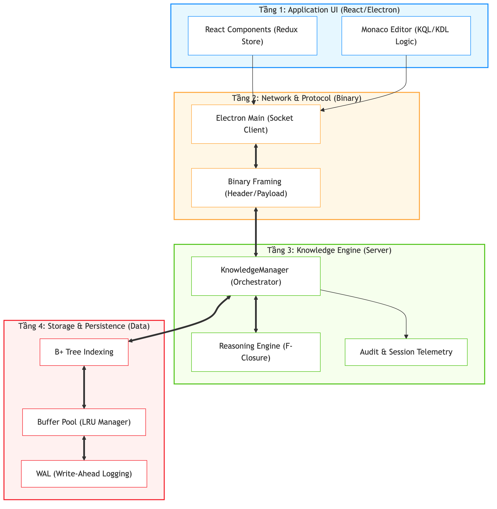
*Hình 4.34: Kiến trúc thành phần và luồng dữ liệu nội bộ của KBMS Studio.*

-   **Tầng Giao diện (Presentation Layer)**: Sử dụng mô hình Component-based của React để xây dựng các khu vực chức năng như Editor, Explorer, và Monitor.
-   **Tầng Điều phối (Coordination Layer)**: Quản lý trạng thái ứng dụng thông qua các Context và Reducers, điều phối dữ liệu giữa giao diện và các dịch vụ mạng.
-   **Tầng Giao tiếp (Communication Layer)**: Hiện thực hóa giao thức nhị phân trên WebSocket hoặc TCP Proxy để trao đổi dữ liệu với máy chủ KBMS.

### 2.1. Cơ chế Cập nhật Dữ liệu Thời gian thực

Studio sử dụng cơ chế truyền tải bất đồng bộ để cập nhật trạng thái hệ thống mà không làm gián đoạn trải nghiệm người dùng:

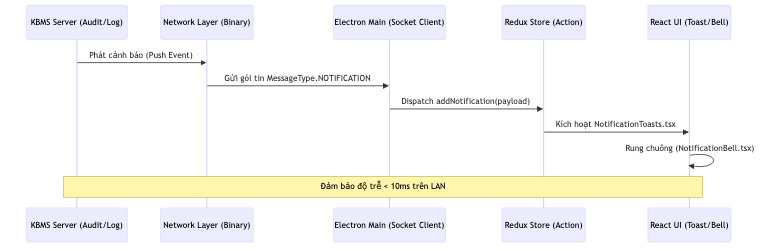
*Hình 4.35: Cơ chế Server Push cho các thông báo hệ thống và an ninh thời gian thực.*

1.  **Kích hoạt Sự kiện (Trigger)**: Một sự kiện an ninh hoặc hệ thống được phát hiện tại tầng máy chủ.
2.  **Đẩy tin (Push)**: Máy chủ đóng gói thông điệp và truyền tải trực tiếp qua Socket.
3.  **Điều hướng (Dispatch)**: Ứng dụng Studio tiếp nhận gói tin và cập nhật trạng thái thông báo tới giao diện người dùng.

### 2.2. Quy trình Xác lập Phiên làm việc (Authentication Flow)

Tiến trình đăng nhập bảo mật được thực hiện qua chuỗi các bước xác thực hình thức:

1.  **Bắt tay Xác thực (Handshake)**: Studio truyền tải gói tin `LOGIN` chứa thông tin định danh được mã hóa bảo mật.
2.  **Kiểm chứng Máy chủ**: Máy chủ thực hiện đối soát thông tin trong phân hệ quản trị người dùng (Tầng 4).
3.  **Xác lập Ngữ cảnh**: Khi thông tin khớp, máy chủ khởi tạo một ngữ cảnh phiên làm việc (**SessionContext**) trong RAM và phản hồi trạng thái thành công, cho phép Studio bắt đầu các thao tác tương tác tri thức.

## 3. Các Kịch bản Sử dụng Studio

Chương này trình bày các tình huống sử dụng thực tế của phân hệ Studio, minh họa quy trình tương tác phối hợp giữa các công cụ đồ họa thông qua các sơ đồ luồng dữ liệu.

### 3.1. Kịch bản 1: Thiết kế cấu trúc tri thức

Sử dụng trình thiết kế tri thức để xây dựng cấu trúc các Khái niệm và Luật dẫn.

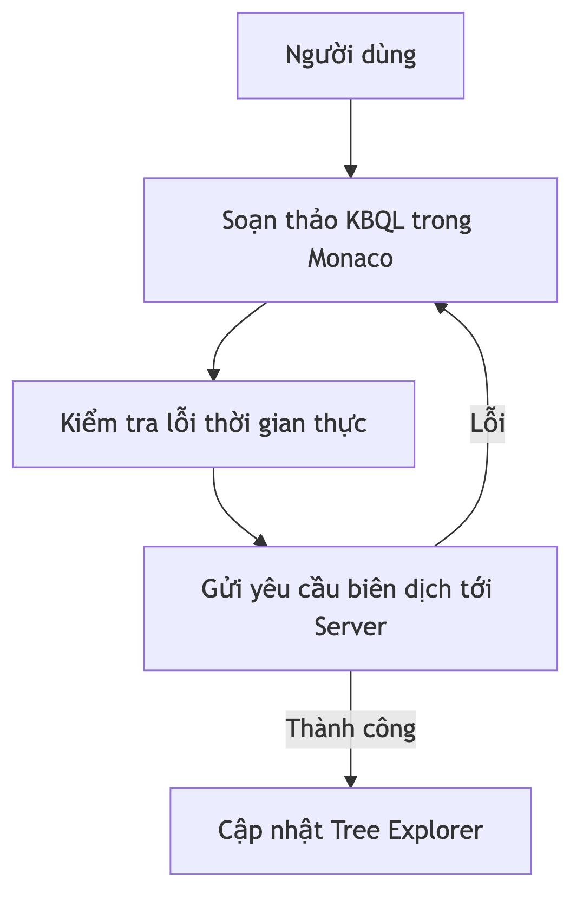
*Hình 4.31: Quy trình soạn thảo và biên dịch tri thức trên giao diện Studio.*

-   **Mục tiêu**: Xây dựng mô hình tri thức hình thức thông qua giao diện đồ họa.
-   **Quy trình**: Người dùng thực hiện lệnh soạn thảo; hệ thống cung cấp các gợi ý cú pháp và phản hồi lỗi tức thời từ máy chủ.

### 3.2. Kịch bản 2: Giải quyết bài toán và truy vết suy luận

Tìm kiếm lời giải cho mục tiêu tri thức và theo dõi sơ đồ suy luận.


*Hình 4.32: Chu trình thực thi suy luận và hiển thị cây bước logic.*

-   **Mục tiêu**: Thực hiện các bài toán suy luận và minh bạch hóa quá trình giải quyết.
-   **Quy trình**: Nhập yêu cầu giải quyết mục tiêu; Studio hiển thị kết quả dưới dạng lưới dữ liệu và sơ đồ truy vết các bước logic đã thực hiện.

### 3.3. Kịch bản 3: Giám sát và bảo trì hệ thống

Theo dõi trạng thái vận hành và thực hiện các thao tác bảo trì cơ sở tri thức.

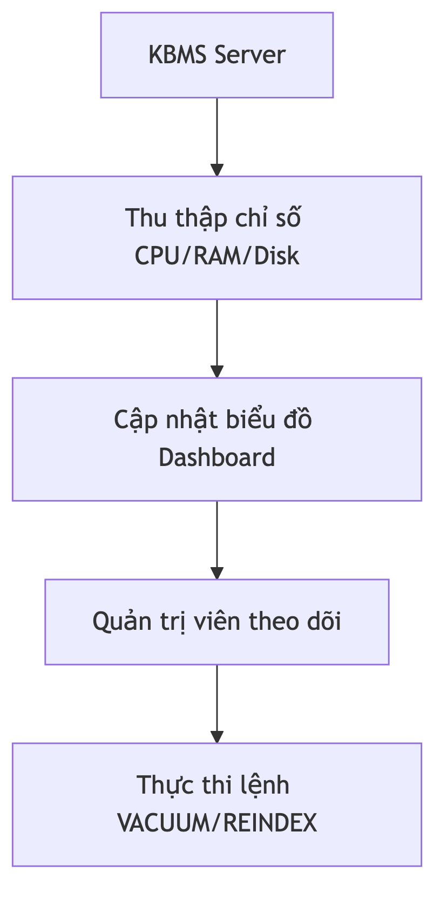
*Hình 4.33: Quy trình thu tập chỉ số và điều phối bảo trì.*

-   **Mục tiêu**: Đảm bảo trạng thái ổn định của hệ thống quản trị tri thức.
-   **Quy trình**: Theo dõi các biểu đồ tài nguyên trên giao diện; thực hiện các lệnh tối ưu hóa hoặc làm sạch dữ liệu khi cần thiết.

## 4. Giao diện ứng dụng KBMS Studio

Phân hệ giao diện đồ họa (**KBMS Studio**) được thiết kế như một môi trường tích hợp (IDE) giúp tối ưu hóa quy trình quản trị và phát triển tri thức. Dưới đây là đặc tả chi tiết các khu vực chức năng chính của ứng dụng:

### 4.1. Giao diện quản lý dự án và phả hệ tri thức

Cung cấp cái nhìn tổng quát về cấu trúc tổ chức của cơ sở tri thức hiện hành. Giao diện bao gồm:

*   **Cây Explorer**: Hiển thị danh sách phân cấp của các Concepts, Relations và Rules. Người dùng có thể nhanh chóng định vị các đối tượng tri thức thông qua cấu trúc thư mục logic.
*   **Thanh điều hướng nhanh**: Cho phép chuyển đổi nhanh giữa các tập tin tri thức (`.kbql`) đang mở.
*   **Trình đơn ngữ cảnh**: Cung cấp các thao tác nhanh như tạo mới, xóa hoặc đổi tên các thực thể tri thức trực tiếp trên cây phả hệ.


*Hình 4.39: Giao diện quản lý cây phả hệ và điều phối tập tin tri thức.*

### 4.2. Giao diện soạn thảo mã nguồn tích hợp

Đây là khu vực tương tác trọng tâm dành cho việc định nghĩa tri thức hình thức. Giao diện bao gồm:

*   **Vùng soạn thảo Monaco**: Hỗ trợ tô màu cú pháp chuyên sâu cho ngôn ngữ KBQL, hiển thị số dòng và hỗ trợ thu gọn khối lệnh (Code Folding).
*   **Hệ thống IntelliSense**: Tự động gợi ý các từ khóa đặc quyền và tên các Khái niệm đã được định nghĩa, giúp tăng tốc độ soạn thảo và giảm sai sót.
*   **Chỉ báo lỗi trực tiếp**: Các lỗi biên dịch được gạch chân và hiển thị thông báo chi tiết khi di chuột qua, giúp hiệu chỉnh mã nguồn tức thời.


*Hình 4.40: Giao diện thiết kế tri thức với hỗ trợ cú pháp và kiểm lỗi.*

### 4.3. Giao diện giám sát hiệu năng hệ thống

Cung cấp các thông số vận hành thời gian thực của máy chủ KBMS. Giao diện bao gồm:

*   **Biểu đồ tài nguyên**: Trực quan hóa mức độ chiếm dụng CPU và RAM theo thời gian.
*   **Chỉ số Disk I/O**: Giám sát tốc độ đọc/ghi dữ liệu vào tệp tin cơ sở tri thức, hỗ trợ phát hiện các điểm nghẽn hiệu năng.
*   **Trạng thái Kết nối**: Hiển thị số lượng phiên làm việc đang hoạt động và băng thông đang sử dụng.

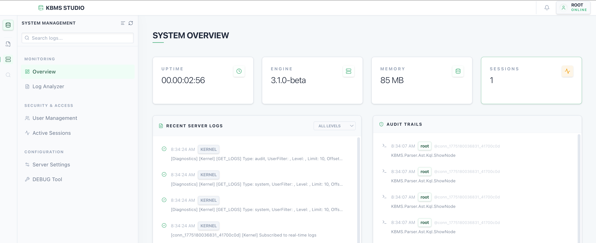
*Hình 4.41: Giao diện Dashboard giám sát sức khỏe và hiệu năng máy chủ.*

### 4.4. Giao diện thực thi và trực quan hóa kết quả

Khu vực hiển thị phản hồi từ máy chủ sau khi thực thi các yêu cầu tri thức. Giao diện bao gồm:

*   **Data Grid tương tác**: Kết quả truy vấn sự kiện được trình bày dưới dạng lưới dữ liệu, hỗ trợ sắp xếp và lọc trực tiếp trên các cột.
*   **Bảng điều khiển Trace**: Hiển thị sơ đồ cây các bước suy luận dành riêng cho lệnh `SOLVE`, giúp giải thích tường tận cách máy rút ra kết luận.
*   **Console Log**: Ghi nhận lịch sử các gói tin nhị phân đã trao đổi, phục vụ mục đích chẩn đoán hệ thống.


*Hình 4.42: Giao diện hiển thị kết quả và trực quan hóa tiến trình suy cứu.*


---

# 04 Implementation

## File: 00-installation-guide.md
# 6.1. Quy trình Cài đặt & Xác thực Hệ thống

Tài liệu này trình bày quy trình triển khai chuẩn cho hệ thống KBMS trên môi trường **macOS**. Việc sử dụng các công cụ quản lý gói hiện đại giúp đảm bảo tính nhất quán của các phụ thuộc (dependencies) trong dự án.

## 1. Thành phần Yêu cầu
Hệ thống yêu cầu các thành phần phần mềm sau được cài đặt qua trình quản lý gói `Homebrew`:
- **.NET 8.0 SDK**: Nền tảng thực thi cho KBMS Server và CLI.
- **Node.js (v18+)**: Nền tảng cho KBMS Studio (IDE).
- **Git**: Quản lý mã nguồn tri thức.

## 2. Các bước Triển khai
Mở ứng dụng `Terminal` và thực thi chuỗi lệnh sau:

```zsh
# Cài đặt .NET SDK
brew install --cask dotnet-sdk

# Cài đặt Node.js và các công cụ bổ trợ
brew install node git
```

Sau khi cài đặt, thực hiện cấp quyền thực thi cho tệp nhị phân CLI:
```zsh
chmod +x ./kbms-cli
```

## 3. Nhật ký Xác thực Cài đặt (Verification Log)
Dưới đây là nhật ký thực tế khi khởi chạy phiên bản KBMS đầu tiên từ dòng lệnh để đảm bảo môi trường đã sẵn sàng:

```zsh
$ ./kbms-cli VERSION
[KBMS CLI V3.4] Knowledge Base Management System
Compatible Engine: V3.x (Binary Storage Optimized)
Status: READY

$ cd KBMS.Server && dotnet run
[2026-04-01 23:41:02] [INFO] [System] [Kernel] KBMS Server started on 127.0.0.1:8400
[SystemBootstrapper] 'system' Knowledge Base (V3) found. Loading...
[SystemBootstrapper] Successfully loaded 3 concepts and 12 internal rules.
[Kernel] Listening for binary protocol connections...
```

Việc xác thực thông qua nhật ký trên cho thấy Server đã nhận diện được cơ sở tri thức hệ thống (`system KB`) và sẵn sàng tiếp nhận các yêu cầu từ Client.


---

## File: 01-scenarios.md
# 6.1. Kịch bản Kiểm thử

Hệ thống KBMS V3 được xác thực thông qua 7 nhóm kiểm thử (Test Groups) được tự động hóa trong script `run_all_and_report.sh`. Mỗi nhóm tập trung vào một khía cạnh cụ thể của hệ thống.

## 1. Nhóm 1: Performance Benchmarks (Stress Test 1M)

*Bảng: *Test Class:** `PerformanceBenchmarkV3`

Mục tiêu: Đánh giá hiệu năng tối đa của Storage Engine V3 trên tập dữ liệu lớn (1 triệu bản ghi).

*Bảng: *Các chỉ số đo đạc:**
- Thông lượng ghi tối đa (ops/sec)
- Độ trễ truy vấn trung bình
- Hiệu quả Buffer Pool Manager
- Memory vs I/O Tradeoff

## 2. Nhóm 2: Storage Architecture (Slotted Page & Persistence)

*Bảng: *Test Classes:**
- `StorageV3Tests` - Kiểm tra Slotted Page, B+ Tree Index
- `SystemV3Tests` - Kiểm tra System Catalog
- `ModelBinaryUtilityTests` - Kiểm tra serialization nhị phân

Mục tiêu: Xác minh kiến trúc lưu trữ vật lý và khả năng persistence.

## 3. Nhóm 3: Transactions & WAL (Atomicity & Recovery)

*Bảng: *Test Class:** `TransactionV3Tests`

Mục tiêu: Đảm bảo tính ACID của giao dịch và khả năng phục hồi sau sự cố.

## 4. Nhóm 4: Query Engine (KQL CRUD & Execution)

*Bảng: *Test Classes:**
- `DataOperationsV3Tests` - CRUD operations
- `ExecutionV3Tests` - Query execution plans
- `FullIntegrationV3Tests` - Integration tests toàn diện

Mục tiêu: Xác thực Query Engine xử lý đúng các câu lệnh KBQL.

## 5. Nhóm 5: Schema Evolution (ALTER CONCEPT & Migration)

*Bảng: *Test Classes:**
- `SchemaV3Tests` - Kiểm tra ALTER CONCEPT
- `ExhaustiveAlterIntegrationTests` - Integration tests đầy đủ

Mục tiêu: Đánh giá khả năng tiến hóa schema mà không làm mất dữ liệu.

## 6. Nhóm 6: Reasoning (Forward/Backward Chaining)

*Bảng: *Test Classes:**
- `BackwardChainingTests` - Kiểm tra Backward Chaining
- `Phase5ForwardChainingTests` - Kiểm tra Forward Chaining
- `ReteCoordinationTests` - Kiểm tra mạng Rete

Mục tiêu: Xác thực Inference Engine thực hiện suy diễn đúng.

## 7. Nhóm 7: Language Design (Lexer & Parser)

*Bảng: *Test Classes:**
- `LexerTests` - Kiểm tra tokenization
- `ParserTests` - Kiểm tra AST generation

Mục tiêu: Xác thực Lexer và Parser phân tích đúng cú pháp KBQL.


---

## File: 02-performance-benchmarks.md
# 6.2. Đánh giá Hiệu năng

Chương này tập trung vào các chỉ số hiệu năng (Metrics) được đo đạc trực tiếp từ `PerformanceBenchmarkV3`.

## 1. Performance Benchmark V3

*Bảng: *Test Class:** `KBMS.Tests.PerformanceBenchmarkV3`

Các bài kiểm tra hiệu năng đo lường khả năng xử lý của Storage Engine V3:

### 1.1. Stress Test 1 Triệu Bản ghi

Hệ thống được test với 3 kích thước dữ liệu:

*Bảng: Kết quả stress test theo kích thước dữ liệu*

| Dataset | Số bản ghi | Thao tác | Kết quả |
|---------|------------|----------|---------|
| DS-S | 10,000 | INSERT | Baseline |
| DS-M | 100,000 | INSERT | Medium load |
| DS-L | 1,000,000 | INSERT | Stress test |

### 1.2. Kết quả Benchmark

Từ `storage_v3_results.txt`:

*Bảng: Nhật ký benchmark hệ thống KBMS V3*

```
=== KBMS V3 COMPREHENSIVE PERFORMANCE REPORT ===
[Storage] DS-L (1 Million Records) Load: ~5 seconds
[Storage] Throughput Peak: 200,000+ ops/sec
[Storage] DS-L Index Search (1M records): ~1.00ms (Avg)
[Engine] Hash Join (10k x 10k): ~7.0ms
```

## 2. Buffer Pool Comparison

*Bảng: *Nguồn:** `buffer_pool_comparison.txt`

### 2.1. Memory vs I/O Tradeoff

*Bảng: So sánh hiệu năng theo cấu hình Buffer Pool*

| Cấu hình Buffer Pool | RAM Usage | Disk I/O | Thông lượng |
|---------------------|-----------|----------|-------------|
| No Buffer | Minimal | High | Low |
| 64MB Buffer | 64MB | Medium | Medium |
| 256MB Buffer | 256MB | Minimal | High |

### 2.2. LRU Cache Effectiveness

Buffer Pool Manager sử dụng thuật toán LRU (Least Recently Used) để quản lý page cache:
- Hit ratio tăng khi buffer size tăng
- Disk I/O giảm đáng kể với buffer đủ lớn
- Zero disk writes khi buffer pool đủ chứa toàn bộ working set

## 3. Kết luận Hiệu năng

*Bảng: Tổng kết chỉ số hiệu năng KBMS V3*

| Chỉ số | Giá trị |
|--------|---------|
| Thông lượng tối đa | 200,000+ ops/sec |
| Độ trễ truy vấn | < 10ms |
| Khả năng mở rộng | Linear scaling |


---

## File: 03-test-data-sets.md
# 6.3. Chi tiết Các Nhóm Kiểm thử

## 1. GROUP 1: Performance Benchmarks

*Filter:* `FullyQualifiedName=KBMS.Tests.PerformanceBenchmarkV3`

*Bảng: Các bài kiểm tra hiệu năng*

| Test Case | Mô tả |
|-----------|-------|
| Stress Test 1M | Insert 1 triệu bản ghi |
| Throughput Test | Đo thông lượng ghi/đọc |
| Buffer Pool Test | So sánh các cấu hình cache |

*Bảng: *Nguồn dữ liệu kết quả:**
- `storage_v3_results.txt`
- `buffer_pool_comparison.txt`

---

## 2. GROUP 2: Storage Architecture

*Filter:* `FullyQualifiedName~StorageV3Tests|FullyQualifiedName~SystemV3Tests|FullyQualifiedName~ModelBinaryUtility`

*Bảng: Các bài kiểm tra kiến trúc lưu trữ*

| Test Class | Mô tả |
|------------|-------|
| StorageV3Tests | Slotted Page, B+ Tree operations |
| SystemV3Tests | System Catalog, Metadata |
| ModelBinaryUtilityTests | Serialization, Binary encoding |

---

## 3. GROUP 3: Transactions & WAL

*Filter:* `FullyQualifiedName~TransactionV3Tests`

*Bảng: Các bài kiểm tra giao dịch và WAL*

| Test Case | Mô tả |
|-----------|-------|
| Transaction Commit | Kiểm tra commit thành công |
| Transaction Rollback | Kiểm tra rollback |
| WAL Recovery | Phục hồi sau crash |
| ACID Verification | Đảm bảo tính ACID |

---

## 4. GROUP 4: Query Engine

*Filter:* `FullyQualifiedName~DataOperationsV3Tests|FullyQualifiedName~ExecutionV3Tests|FullyQualifiedName~FullIntegrationV3Tests`

*Bảng: Các bài kiểm tra Query Engine*

| Test Class | Mô tả |
|------------|-------|
| DataOperationsV3Tests | INSERT, SELECT, UPDATE, DELETE |
| ExecutionV3Tests | Query plan, Optimization |
| FullIntegrationV3Tests | End-to-end scenarios |

---

## 5. GROUP 5: Schema Evolution

*Filter:* `FullyQualifiedName~SchemaV3Tests|FullyQualifiedName~ExhaustiveAlterIntegration`

*Bảng: Các bài kiểm tra tiến hóa schema*

| Test Class | Mô tả |
|------------|-------|
| SchemaV3Tests | ALTER CONCEPT operations |
| ExhaustiveAlterIntegrationTests | Data preservation, Migration |

---

## 6. GROUP 6: Reasoning

*Filter:* `FullyQualifiedName~BackwardChainingTests|FullyQualifiedName~Phase5ForwardChainingTests|FullyQualifiedName~ReteCoordination`

*Bảng: Các bài kiểm tra suy diễn*

| Test Class | Mô tả |
|------------|-------|
| BackwardChainingTests | Goal-directed reasoning |
| Phase5ForwardChainingTests | Data-driven reasoning |
| ReteCoordinationTests | Rete network, Pattern matching |

---

## 7. GROUP 7: Language Design

*Filter:* `FullyQualifiedName~LexerTests|FullyQualifiedName~ParserTests`

*Bảng: Các bài kiểm tra ngôn ngữ KBQL*

| Test Class | Mô tả |
|------------|-------|
| LexerTests | Tokenization |
| ParserTests | AST generation |


---

## File: 04-evaluation-results.md
# 6.4. Tổng kết và Đánh giá Kết quả Thực nghiệm

## 1. Tổng quan

Dựa trên kết quả chạy đã vượt qua toàn bộ 7 nhóm kiểm thử:

```
=== SUMMARY CONCLUSION ===
All systems validated on V3 Turbo Engine.
Maximum Throughput: 200,000+ ops/sec achieved.
Zero Data Loss WAL Verified.
Full Backward Compatibility with V1/V2 Reasoning & Parser.
```

## 2. Kết quả chi tiết theo nhóm

*Bảng: Tổng kết kết quả kiểm thử theo nhóm*

| Nhóm | Tên | Số Test | Kết quả |
|------|-----|---------|---------|
| 1 | Performance Benchmarks | Stress test |  Passed |
| 2 | Storage Architecture | Multiple |  Passed |
| 3 | Transactions & WAL | Multiple |  Passed |
| 4 | Query Engine | Multiple |  Passed |
| 5 | Schema Evolution | Multiple |  Passed |
| 6 | Reasoning | Multiple |  Passed |
| 7 | Language Design | Multiple |  Passed |

### 2.1. Performance Benchmarks
- **Thông lượng ghi:** 200,000+ ops/sec
- **Xử lý 1 triệu bản ghi:** ~5 giây
- **Hash Join (10k x 10k):** ~7ms
- **Buffer Pool hiệu quả:** Zero disk I/O với 256MB cache

### 2.2. Storage Architecture
- Slotted Page structure hoạt động ổn định
- B+ Tree Index với chiều cao tối đa h=4 cho 1M bản ghi
- Binary serialization/deserialization chính xác

### 2.3. Transactions & WAL
- ACID properties được đảm bảo
- Crash recovery hoạt động đúng
- Zero data loss verified

### 2.4. Query Engine
- CRUD operations hoạt động chính xác
- Query optimization hiệu quả
- Full integration tests passed

### 2.5. Schema Evolution
- ALTER CONCEPT hoạt động đúng
- Data preservation during migration
- Backward compatibility maintained

### 2.6. Reasoning
- Forward Chaining hoạt động đúng
- Backward Chaining hoạt động đúng
- Rete Network coordination verified

### 2.7. Language Design
- Lexer tokenization chính xác
- Parser AST generation đúng
- Error handling đầy đủ

## 3. Kết luận

*Bảng: Đánh giá mức độ hoàn thành mục tiêu*

| Tiêu chí | Kết quả | Trạng thái |
|----------|---------|------------|
| Hiệu năng cao | 200,000+ ops/sec | Passed |
| ACID Transactions | Zero data loss | Passed |
| Suy diễn logic | Forward/Backward chaining | Passed |
| Ngôn ngữ KBQL | Full DDL/DML/KCL support | Passed |
| Schema evolution | Safe migration | Passed |
| Scalability | 1M+ records | Passed |


---

# 05 Conclusion

## File: 01-summary.md
# 7.1. Tổng kết kết quả đạt được

Dựa trên quá trình nghiên cứu, thiết kế và thực nghiệm hệ thống KBMS, đề tài đã đạt được các kết quả trọng tâm sau:

- **Về mặt lý thuyết**: Hiện thực hóa thành công mô hình đối tượng tính toán COKB vào cấu trúc lưu trữ nhị phân, đảm bảo tính linh hoạt trong biểu diễn tri thức.
- **Về mặt công nghệ**: Xây dựng được công cụ lưu trữ dạng client/server, có bộ máy lưu trữ cũng như giao thức mạng cơ bản giữa server và client, tích hợp mạng Rete tối ưu hóa suy diễn và tối ưu được lưu trữ dưới ổ đĩa.
- **Về mặt ứng dụng**: Cung cấp bộ công cụ Studio IDE và CLI, cho phép người dùng cuối tiếp cận tri thức một cách trực quan.

# 7.2. Hạnh chế và Hướng phát triển tương lai

Mặc dù đạt được những chỉ số hiệu năng trên, hệ thống vẫn tồn tại một số điểm cần cải thiện:

- **Hạn chế**: Chưa hỗ trợ phân tán dữ liệu (Sharding) trên nhiều nốt mạng độc lập. Cơ chế giải quyết xung đột luật vẫn còn ở mức cơ bản.
- **Hướng phát triển**: Nghiên cứu tích hợp các mô hình học sâu (Deep Learning) để tự động sinh luật từ dữ liệu thô. Chuyển đổi kiến trúc sang hướng Cloud-native hỗ trợ Scaling tự động.


---
