# HỆ QUẢN TRỊ CƠ SỞ TRI THỨC DẠNG COKB

# 1.1. Lý do chọn đề tài

Trong lĩnh vực Trí tuệ nhân tạo, việc biểu diễn tri thức và xây dựng cơ chế suy luận tự động là hai bài toán nền tảng cho mọi hệ chuyên gia (Expert System). Các hệ quản trị cơ sở dữ liệu quan hệ (RDBMS) như MySQL hay PostgreSQL đã chứng minh hiệu quả vượt trội trong việc lưu trữ và truy xuất dữ liệu có cấu trúc. Tuy nhiên, bản chất của RDBMS là quản lý dữ liệu — không phải quản lý tri thức. Khi đối mặt với các bài toán đòi hỏi khả năng suy diễn, chẳng hạn như từ giả thiết "tam giác ABC có a = 3, b = 4, c = 5" để tự động tính ra diện tích, bán kính đường tròn ngoại tiếp hay phân loại đó là tam giác vuông, thì RDBMS không có cơ chế nào để thực hiện điều này. Khoảng cách giữa "dữ liệu thô" và "tri thức có khả năng suy diễn" chính là động lực thúc đẩy sự phát triển của các hệ thống dựa trên tri thức (Knowledge-based Systems).

Mô hình COKB (Computational Object Knowledge Base), được đề xuất bởi PGS.TS Đỗ Văn Nhơn từ năm 2001 [1], là một phương pháp biểu diễn tri thức theo hướng tiếp cận Ontology, cho phép mô hình hóa các miền tri thức phức tạp bao gồm cả khái niệm, quan hệ, phương trình tính toán và luật suy diễn. Mô hình này đã được ứng dụng thành công trong nhiều nghiên cứu về hệ giải bài toán thông minh, đặc biệt trong lĩnh vực hình học phẳng và hình học giải tích [2], [3]. Tuy nhiên, cho đến nay vẫn chưa có một hệ thống phần mềm hoàn chỉnh nào đóng vai trò như một hệ quản trị cơ sở tri thức (Knowledge Base Management System — KBMS) cho mô hình COKB — tức là một hệ thống tích hợp được cả khả năng lưu trữ bền vững, suy diễn tự động và cung cấp ngôn ngữ truy vấn tri thức cho người dùng.

Xuất phát từ thực tế đó, đề tài **"THIẾT KẾ HỆ HỖ TRỢ QUẢN TRỊ CƠ SỞ TRI THỨC DẠNG COKB"** được thực hiện nhằm nghiên cứu và phát triển một hệ thống KBMS hoàn chỉnh, lấy mô hình COKB làm nền tảng biểu diễn tri thức, đồng thời kế thừa các kỹ thuật quản trị dữ liệu từ lĩnh vực cơ sở dữ liệu để đảm bảo tính bền vững và hiệu năng trong thực tế.

# 1.2. Cơ sở lý thuyết về mô hình COKB

## 1.2.1. Cấu trúc tổng quát của mô hình COKB

Mô hình COKB là sự mở rộng của các phương pháp biểu diễn tri thức truyền thống — như logic vị từ, hệ luật dẫn, mạng ngữ nghĩa và Frame — theo hướng tích hợp khả năng tính toán trực tiếp vào cấu trúc đối tượng. Điểm khác biệt cốt lõi của COKB so với các phương pháp khác nằm ở chỗ: mỗi đối tượng trong COKB không chỉ mang thông tin mô tả (thuộc tính, quan hệ) mà còn chứa các phương trình toán học và luật suy diễn, cho phép hệ thống tự động tính toán và sinh ra tri thức mới từ dữ liệu đầu vào.

Theo [1] và [3], một cơ sở tri thức COKB được xác định bởi bộ 6 thành phần:

$$COKB = (C, H, R, Ops, Funcs, Rules)$$

Trong đó:

- **C (Concepts)** là tập hợp các khái niệm hay lớp đối tượng tính toán trong miền tri thức. Ví dụ, trong hình học phẳng, C bao gồm các khái niệm như Điểm, Đoạn thẳng, Góc, Tam giác, Tứ giác. Mỗi khái niệm được phân cấp (cấp 0, cấp 1, ..., cấp n) dựa trên độ phức tạp cấu trúc thuộc tính bên trong.

- **H (Hierarchy)** là tập các quan hệ phân cấp đặc biệt hóa giữa các khái niệm, tương tự quan hệ IS-A trong lập trình hướng đối tượng. Ví dụ: "Tam giác vuông" IS-A "Tam giác", nghĩa là mọi tri thức của Tam giác đều được kế thừa sang Tam giác vuông.

- **R (Relations)** là tập các quan hệ ngữ nghĩa giữa các đối tượng, chẳng hạn như quan hệ "song song", "vuông góc", "bằng nhau" trong hình học, hay "tương tác thuốc" trong y tế.

- **Ops (Operators)** là các toán tử tính toán trên các miền giá trị (số thực, vector, ma trận...), cho phép thực hiện các phép biến đổi đại số trên thuộc tính của đối tượng.

- **Funcs (Functions)** là các hàm xác định ánh xạ giữa các thuộc tính, ví dụ hàm tính diện tích tam giác theo ba cạnh.

- **Rules** là tập hợp các luật dẫn dùng để suy diễn ra tri thức mới. Mỗi luật có dạng "NẾU tập sự kiện U đúng THÌ suy ra tập sự kiện V", viết gọn là U → V.

## 1.2.2. Mô hình đối tượng tính toán

Ở cấp độ thực thể, mỗi đối tượng tính toán (Computational Object) O trong hệ thống được biểu diễn bởi bộ ba [2]:

$$O = (Attrs, Facts, Rules)$$

Trong đó **Attrs** là tập các thuộc tính của đối tượng — bản thân mỗi thuộc tính cũng có thể là một đối tượng tính toán thuộc lớp khái niệm khác, tạo nên cấu trúc đệ quy. **Facts** là tập các sự kiện, giá trị hay tính chất đã được xác định của đối tượng. **Rules** là các phương trình và luật dẫn nội tại ràng buộc mối quan hệ giữa các thuộc tính bên trong đối tượng đó.

Lấy ví dụ cụ thể: đối tượng Tam giác trong hình học phẳng có Attrs gồm ba đỉnh (A, B, C), ba cạnh (a, b, c), ba góc, các đường cao, đường trung tuyến, diện tích S, nửa chu vi p, bán kính đường tròn nội tiếp r và ngoại tiếp R. Phần Rules chứa hàng chục phương trình toán học — từ định lý cosin, định lý sin, công thức Heron cho đến các hệ thức giữa diện tích với đường cao. Khi người dùng cung cấp giá trị cho một vài thuộc tính (ví dụ: a = 3, b = 4, c = 5), hệ thống sẽ dựa vào các phương trình này để tự động suy diễn ra toàn bộ giá trị còn lại.

## 1.2.3. Cơ chế suy luận trên mô hình COKB

Quá trình suy luận trên mô hình COKB thực chất là quá trình mở rộng tập sự kiện đã biết (giả thiết) bằng cách áp dụng lặp đi lặp lại các luật trong Rules cho đến khi không còn luật nào có thể kích hoạt thêm. Trong lý thuyết, quá trình này tương ứng với việc tìm **bao đóng** (F-Closure) của tập sự kiện ban đầu [2], [4].

Luận văn của Mai Trung Thành [2] đã hệ thống hóa 6 quy tắc suy luận cơ bản trên mô hình COKB (ký hiệu RC1–RC6):

- **RC1 (Vốn có)**: Suy diễn sự kiện từ chính định nghĩa thuộc tính của đối tượng. Ví dụ, khi tạo một Tam giác thì hệ thống tự động xác nhận sự kiện "đối tượng này có 3 cạnh, 3 góc".

- **RC2 (Mặc nhiên)**: Các phép biến đổi đồng nhất và bắc cầu. Ví dụ, nếu AB = CD và CD = EF thì suy ra AB = EF.

- **RC3 (Thay thế quan hệ)**: Sử dụng các quan hệ tính toán (phương trình) để tính giá trị biến. Đây là quy tắc được kích hoạt nhiều nhất, vì phần lớn tri thức COKB được mã hóa dưới dạng phương trình toán học.

- **RC4 (Luật dẫn)**: Thực thi các luật logic dạng mệnh đề IF-THEN.

- **RC5 (Giải hệ phương trình)**: Khi nhiều phương trình cùng chia sẻ biến chung, hệ thống phối hợp chúng thành hệ phương trình và sử dụng các phương pháp số (Newton-Raphson, Brent) để giải.

- **RC6 (Hành vi nội bộ)**: Suy diễn dựa trên cấu trúc PART-OF — khi một thuộc tính bên trong đối tượng thay đổi, tri thức được lan truyền ngược lên đối tượng cha.

Việc kết hợp 6 quy tắc này trong một vòng lặp suy diễn tiến (Forward Chaining) cho phép hệ thống giải quyết tự động các bài toán từ đơn giản (tính một giá trị) đến phức tạp (giải hệ phương trình phi tuyến đa biến, chứng minh tính chất hình học).

# 1.3. Yêu cầu đối với một hệ quản trị cơ sở tri thức dạng COKB

Từ cơ sở lý thuyết trình bày ở mục 1.2, có thể thấy rằng một hệ quản trị cơ sở tri thức hoạt động trên mô hình COKB cần đáp ứng được ít nhất bốn nhóm yêu cầu chính sau đây.

**Thứ nhất, về biểu diễn tri thức**: hệ thống phải cho phép người dùng định nghĩa được đầy đủ 6 thành phần của mô hình COKB — từ việc khai báo khái niệm (Concept) với các thuộc tính, phương trình ràng buộc, luật dẫn, cho đến thiết lập quan hệ phân cấp kế thừa giữa các khái niệm. Đặc biệt, hệ thống cần hỗ trợ cấu trúc đệ quy (thuộc tính cũng là đối tượng tính toán) và cơ chế kế thừa tri thức từ lớp cha sang lớp con theo quan hệ IS-A.

**Thứ hai, về suy diễn tự động**: hệ thống cần tích hợp một bộ máy suy diễn (Inference Engine) có khả năng thực thi các quy tắc RC1–RC6, hỗ trợ cả suy diễn tiến lẫn giải hệ phương trình. Bộ máy suy diễn này phải hoạt động độc lập với miền tri thức cụ thể — nghĩa là cùng một engine có thể suy diễn trên tri thức hình học, tài chính hay y tế mà không cần viết lại mã nguồn.

**Thứ ba, về lưu trữ bền vững**: tri thức và dữ liệu cần được lưu trữ trên đĩa một cách an toàn, có khả năng phục hồi sau sự cố (crash recovery), hỗ trợ chỉ mục (indexing) để tìm kiếm nhanh trên tập dữ liệu lớn, và đảm bảo tính toàn vẹn dữ liệu thông qua cơ chế giao dịch (transaction).

**Thứ tư, về giao diện tương tác**: hệ thống cần cung cấp một ngôn ngữ truy vấn để người dùng có thể thao tác với tri thức (tạo, sửa, xóa, tìm kiếm, yêu cầu suy diễn) mà không cần lập trình trực tiếp. Ngoài ra, một công cụ trực quan hóa (IDE) sẽ giúp giảm rào cản tiếp cận cho người dùng không chuyên về lập trình.

# 1.4. Các công trình nghiên cứu liên quan

## 1.4.1. Các công trình nghiên cứu về mô hình COKB

Kể từ khi mô hình COKB được đề xuất, đã có nhiều công trình nghiên cứu nhằm hoàn thiện và mở rộng lý thuyết cho mô hình này.

Trong [3], nhóm tác giả đã nghiên cứu giải pháp suy luận tìm kiếm lời giải trên mô hình COKB dựa trên khái niệm **mẫu bài toán** (Problem Pattern). Công trình đưa ra các định nghĩa về mẫu bài toán cùng tiêu chuẩn lựa chọn mẫu trong một miền tri thức, nhờ đó giúp quá trình suy luận trở nên nhanh hơn bằng cách tái sử dụng các lời giải đã biết. Tuy nhiên, công trình chưa đề cập đến mô hình bài toán mẫu (Sample Problem) — một khái niệm có vai trò bổ sung trong các bài toán có tần suất xuất hiện thấp hơn.

Trong [14], nhóm tác giả tiếp tục phát triển hướng nghiên cứu này bằng cách đề xuất mô hình **bài toán mẫu** trên COKB, bao gồm các kỹ thuật tìm kiếm mẫu, áp dụng mẫu và cập nhật bài toán mẫu. Hai công trình [3] và [14] khi kết hợp lại đã tạo nên một bộ công cụ suy luận khá hoàn chỉnh về mặt lý thuyết cho việc giải quyết vấn đề trên COKB.

Các công trình [1], [13], [15] tập trung vào việc nghiên cứu chi tiết từng thành phần tri thức trong mô hình: [13] xem xét thành phần toán tử (Ops), [1] xem xét thành phần hàm (Funcs), và [15] nghiên cứu sự kết hợp giữa Funcs và Ops. Mặc dù mỗi công trình đều đạt được kết quả nhất định, phần lớn vẫn chỉ dừng lại ở các bài toán tính toán cơ bản trên số thực, chưa mở rộng đến các lớp vấn đề phức tạp hơn như rút gọn biểu thức hay tính toán trên cấu trúc dữ liệu đặc thù.

Luận văn của Mai Trung Thành [2] là công trình có tính tổng hợp cao nhất, đã hệ thống hóa 6 quy tắc suy luận (RC1–RC6) và xây dựng thuật giải tìm bao đóng F-Closure cho tập sự kiện. Đặc biệt, luận văn này đã thiết kế và cài đặt một bộ suy diễn (Inference Engine) bằng ngôn ngữ Maple, có khả năng giải quyết vấn đề tổng quát trên COKB và độc lập với miền tri thức cụ thể. Tuy nhiên, bộ suy diễn này được đóng gói dưới dạng thư viện Maple — một môi trường tính toán ký hiệu chuyên dụng, không phù hợp cho việc triển khai thành một hệ thống phần mềm độc lập phục vụ nhiều người dùng đồng thời.

**Nhận xét chung**: Các công trình nghiên cứu kể trên đã đóng góp đáng kể vào việc hoàn thiện cơ sở lý thuyết cho mô hình COKB. Tuy nhiên, về mặt ứng dụng, tất cả các bộ suy diễn được xây dựng đều mang tính thử nghiệm trong phạm vi hàn lâm, chưa có công trình nào hướng đến việc xây dựng một hệ quản trị tri thức hoàn chỉnh với đầy đủ các thành phần: lưu trữ, suy diễn, ngôn ngữ truy vấn và giao diện người dùng.

## 1.4.2. Các hệ quản trị cơ sở tri thức hiện có

Ngoài các công trình nghiên cứu trực tiếp trên COKB, hiện nay trên thế giới đã tồn tại một số hệ thống quản trị tri thức tiêu biểu, mỗi hệ thống phục vụ cho một mục đích và phương pháp biểu diễn khác nhau.

**CLIPS** [21] là hệ vỏ chuyên gia (Expert System Shell) được phát triển bởi NASA từ những năm 1980. CLIPS sử dụng thuật toán Rete để thực hiện suy diễn tiến trên hệ luật dẫn và đã được ứng dụng rộng rãi trong công nghiệp hàng không vũ trụ. Tuy nhiên, CLIPS không có lớp lưu trữ bền vững (dữ liệu chỉ tồn tại trong bộ nhớ), không hỗ trợ kiến trúc Client-Server và khả năng tính toán số học bị hạn chế.

**Jess** [22] là phiên bản Java của CLIPS, kế thừa phần lớn đặc điểm của hệ thống gốc. Dự án đã ngừng phát triển tích cực và không còn được cập nhật cho các nền tảng hiện đại.

**Drools** [23] (JBoss Rules Engine) sử dụng thuật toán Rete cải tiến (Phreak) và được ứng dụng rộng rãi trong quản lý quy tắc kinh doanh (Business Rule Management). Drools có hệ sinh thái mạnh mẽ trên nền tảng Java Enterprise, nhưng được thiết kế chủ yếu cho business logic — khả năng suy diễn toán học và giải hệ phương trình rất hạn chế.

**SWI-Prolog** [24] là một hệ thống lập trình logic hỗ trợ mạnh suy luận lùi (Backward Chaining) thông qua cơ chế unification. SWI-Prolog phù hợp cho các bài toán suy luận logic thuần túy, nhưng thiếu kiến trúc Client-Server, thiếu cơ chế lưu trữ bền vững và không có ngôn ngữ truy vấn dạng SQL.

**Protégé** [25] là công cụ mã nguồn mở của Đại học Stanford, chuyên dùng để xây dựng và chỉnh sửa Ontology theo chuẩn OWL/RDF. Protégé cung cấp giao diện trực quan rất tốt cho việc thiết kế ontology, nhưng bản chất nó là một trình soạn thảo, không phải là một hệ quản trị tri thức có khả năng suy diễn tính toán hay lưu trữ quy mô lớn.

**Cyc** [40] là dự án AI tham vọng nhất trong lịch sử, khởi động từ năm 1984 bởi Douglas Lenat, nhằm mã hóa toàn bộ tri thức thường thức (common sense) của con người. Cyc sử dụng ngôn ngữ CycL dựa trên logic vị từ bậc nhất và chứa hơn 1.5 triệu assertion. Tuy nhiên, Cyc được thiết kế cho suy luận logic định tính, thiếu khả năng tính toán định lượng trên đối tượng — tức không phù hợp cho các bài toán kỹ thuật cần giải phương trình hay tính toán số học phức tạp.

### Bảng 1.1: So sánh các hệ thống quản trị tri thức hiện có

| Tiêu chí | CLIPS | Jess | Drools | SWI-Prolog | Protégé | Cyc | **KBMS (đề xuất)** |
| :--- | :---: | :---: | :---: | :---: | :---: | :---: | :---: |
| Suy diễn tiến (Forward Chaining) | Có | Có | Có | Không | Hạn chế | Có | **Có** |
| Giải hệ phương trình | Không | Không | Không | Không | Không | Không | **Có** |
| Tính toán số học trên đối tượng | Hạn chế | Hạn chế | Hạn chế | Hạn chế | Không | Không | **Có** |
| Lưu trữ bền vững | Không | Không | DBMS ngoài | Không | File OWL | Có | **B+ Tree + WAL** |
| Kiến trúc Client-Server | Không | Không | Có | Không | Không | Có | **Có (TCP Binary)** |
| Ngôn ngữ truy vấn riêng | CLIPS DSL | Jess DSL | DRL | Prolog | SPARQL | CycL | **KBQL** |
| Phân quyền người dùng | Không | Không | Không | Không | Không | Hạn chế | **RBAC** |

# 1.5. Nhận định về hạn chế của các giải pháp hiện tại

Qua phân tích ở mục 1.4, có thể rút ra một số nhận định quan trọng về tình hình hiện tại của lĩnh vực quản trị cơ sở tri thức, đặc biệt đối với mô hình COKB.

**Về mặt lý thuyết**, các công trình nghiên cứu trên mô hình COKB đã đạt được nền tảng vững chắc — từ việc hình thức hóa 6 thành phần COKB, phân loại 6 quy tắc suy luận, cho đến xây dựng thuật giải tìm bao đóng và giải bài toán tổng quát. Tuy nhiên, các kết quả này vẫn chủ yếu tồn tại ở dạng lý thuyết trên giấy hoặc được cài đặt thử nghiệm trong môi trường Maple — một nền tảng toán học chuyên dụng, không phù hợp để triển khai thành phần mềm ứng dụng thực tế. Chưa có công trình nào đặt vấn đề xây dựng một hệ thống hoàn chỉnh bao gồm lưu trữ, mạng, suy diễn và giao diện người dùng cho mô hình COKB.

**Về mặt ứng dụng**, các hệ quản trị tri thức hiện có trên thế giới (CLIPS, Drools, SWI-Prolog, Protégé, Cyc) đều tồn tại ít nhất một trong các hạn chế sau:

- Không hỗ trợ tính toán số học và giải hệ phương trình trên đối tượng tri thức. Đây là hạn chế lớn nhất khi áp dụng cho mô hình COKB, bởi phần lớn tri thức trong COKB được mã hóa dưới dạng phương trình toán học (Rf) chứ không chỉ là luật logic IF-THEN.

- Không có lớp lưu trữ bền vững tích hợp sẵn, hoặc phải phụ thuộc vào hệ cơ sở dữ liệu bên ngoài. Điều này dẫn đến sự phức tạp trong triển khai và ảnh hưởng đến hiệu năng khi phải chuyển đổi qua lại giữa cấu trúc tri thức và cấu trúc dữ liệu quan hệ.

- Không được thiết kế để hỗ trợ cấu trúc đối tượng đệ quy đặc trưng của COKB — nơi mà thuộc tính của một đối tượng bản thân nó cũng là một đối tượng tính toán thuộc lớp khái niệm khác.

Tóm lại, hiện chưa có một hệ thống nào — dù trong phạm vi nghiên cứu học thuật hay trong các sản phẩm phần mềm thương mại — kết hợp được đồng thời ba khả năng: (1) biểu diễn tri thức theo mô hình COKB, (2) suy diễn tự động với khả năng tính toán số học, và (3) lưu trữ bền vững với hiệu năng cao.

# 1.6. Mục tiêu của đề tài

Trên cơ sở những hạn chế đã phân tích, đề tài đặt ra mục tiêu xây dựng một hệ quản trị cơ sở tri thức (KBMS) hoàn chỉnh dựa trên mô hình COKB, cụ thể bao gồm các mục tiêu sau.

**Mục tiêu 1 — Bộ máy lưu trữ (Storage Engine)**: Thiết kế và cài đặt một bộ máy lưu trữ chuyên biệt cho tri thức dạng COKB, sử dụng cấu trúc Slotted Page và chỉ mục cây B+ Tree để hỗ trợ truy xuất nhanh trên tập dữ liệu lớn. Hệ thống cần đảm bảo tính bền vững dữ liệu thông qua cơ chế ghi nhật ký trước (Write-Ahead Logging — WAL) và hỗ trợ phục hồi dữ liệu sau sự cố [5], [10].

**Mục tiêu 2 — Bộ máy suy diễn (Reasoning Engine)**: Xây dựng bộ máy suy diễn tiến dựa trên mạng Rete và thuật toán F-Closure, có khả năng thực thi đầy đủ 6 quy tắc suy luận (RC1–RC6) trên mô hình COKB. Bộ máy này phải hoạt động tổng quát — tức là có thể suy diễn trên bất kỳ miền tri thức nào (hình học, tài chính, y tế, kỹ thuật...) mà không cần thay đổi mã nguồn [1], [6], [9].

**Mục tiêu 3 — Ngôn ngữ truy vấn KBQL**: Thiết kế một ngôn ngữ truy vấn tri thức (Knowledge Base Query Language — KBQL) cùng bộ phân tích cú pháp (Lexer/Parser), cho phép người dùng thao tác với cơ sở tri thức thông qua các câu lệnh khai báo (DDL), thao tác dữ liệu (DML) và truy vấn suy diễn (DQL) [6].

**Mục tiêu 4 — Kiến trúc Client-Server và bảo mật**: Xây dựng hệ thống theo kiến trúc Client-Server với giao thức truyền tải nhị phân (Binary Protocol) qua TCP, hỗ trợ nhiều người dùng kết nối đồng thời. Hệ thống cần tích hợp cơ chế xác thực và phân quyền theo vai trò (RBAC).

**Mục tiêu 5 — Công cụ phát triển trực quan (Studio IDE)**: Phát triển một môi trường phát triển tích hợp giúp người dùng thiết kế, chỉnh sửa và kiểm chứng tri thức một cách trực quan, rút ngắn thời gian so với việc viết lệnh KBQL thủ công.

Tổng hợp lại, đề tài hướng đến việc chuyển hóa mô hình lý thuyết COKB — vốn chỉ tồn tại ở dạng nghiên cứu hàn lâm — thành một hệ thống phần mềm thực tế, có kiến trúc rõ ràng, hiệu năng đo lường được, và có khả năng ứng dụng vào nhiều lĩnh vực khác nhau.


# 2.1. Phân tích và Đặc tả Yêu cầu Hệ thống

Để chuyển hóa mô hình lý thuyết COKB thành một hệ thống thực tiễn, việc xây dựng một bộ máy quản trị chuyên biệt là điều bắt buộc. Hệ thống phần mềm này không chỉ đảm nhiệm việc lưu giữ cấu trúc toán học của các đối tượng mà còn phải cung cấp môi trường thực thi cho các tác vụ tính toán. Từ góc độ phân tích bài toán, yêu cầu cốt lõi của hệ quản trị tri thức được chia thành hai nhóm chính: yêu cầu chức năng và yêu cầu phi chức năng.

Về mặt chức năng, hệ thống phải cung cấp công cụ để người dùng định nghĩa khái niệm (Concept), xây dựng tập luật (Rules) và nạp dữ kiện đầu vào (Facts). Tiếp đó, trung tâm của hệ thống là bộ máy suy diễn (Inference Engine) hoạt động theo cơ chế Forward Chaining. Khi nhận được dữ kiện đầu vào — ví dụ như độ dài ba cạnh của một tam giác — hệ thống tự động kích hoạt các phương trình toán học tương ứng để suy ra các dữ kiện mới (diện tích, bán kính đường tròn). Cuối cùng, để phục vụ môi trường đa người dùng, cơ chế phân quyền RBAC (Role-Based Access Control) phải được áp dụng để đảm bảo chỉ những kỹ sư được cấp quyền mới có thể thay đổi tập luật của hệ thống [7].

Về mặt phi chức năng, hệ thống phải đáp ứng khả năng chịu tải và tính toàn vẹn dữ liệu. Yêu cầu này bắt buộc kiến trúc lưu trữ phải sử dụng cơ chế cấp phát trang (Slotted Page) kết hợp với cấu trúc B+ Tree để tối ưu hóa truy xuất. Đồng thời, mọi thay đổi trên cơ sở tri thức phải được bảo vệ khỏi sự cố thông qua cơ chế ghi nhật ký trước (WAL - Write-Ahead Logging) [5]. Hệ thống cũng phải tuân thủ mô hình Client-Server, sử dụng kết nối TCP Binary để đảm bảo độ trễ thấp nhất trong quá trình giao tiếp giữa ứng dụng máy khách và máy chủ.

Nhằm trực quan hóa sự tương tác giữa các nhóm người dùng và các nhóm chức năng vừa phân tích, Sơ đồ Use Case tổng quát của hệ thống được mô tả trong Hình 2.1.


*Hình 2.1: Sơ đồ Use Case tổng quát phân định quyền hạn và tương tác của các nhóm người dùng.*

Sơ đồ trên cho thấy, trong khi quản trị viên tập trung vào các nghiệp vụ cấu hình hệ thống, thì Kỹ sư tri thức và Ứng dụng Client cần một phương thức chung để giao tiếp với lõi suy diễn. Điều này đặt ra yêu cầu phải thiết kế một ngôn ngữ truy vấn riêng biệt cho hệ thống.

# 2.2. Phân tích và Đặc tả Ngôn ngữ KBQL

Các ngôn ngữ truy vấn truyền thống như SQL chỉ phù hợp để thao tác trên dữ liệu quan hệ có cấu trúc tĩnh. Ngược lại, ngôn ngữ dùng trong các hệ chuyên gia hiện có (như Prolog hay CycL) lại mang nặng tính logic hình thức, gây khó khăn cho việc biểu diễn các phương trình toán học phức tạp [1], [6]. Để giải quyết bài toán này, hệ thống đề xuất ngôn ngữ KBQL (Knowledge Base Query Language).

Ngôn ngữ KBQL được thiết kế bao gồm ba nhóm lệnh cơ bản. Nhóm lệnh định nghĩa (DDL) dùng để khai báo cấu trúc của một khái niệm mới; ví dụ, lệnh `CREATE CONCEPT Triangle` sẽ định nghĩa các thuộc tính và tập luật toán học của hình tam giác. Nhóm lệnh thao tác (DML) được dùng để nạp các dữ kiện cụ thể vào bộ nhớ, chẳng hạn `INSERT FACT Triangle (a=3, b=4, c=5)`. Cuối cùng, nhóm lệnh truy vấn suy diễn (DQL) được sử dụng khi Ứng dụng Client gửi yêu cầu tính toán, ví dụ lệnh `SOLVE` sẽ buộc hệ thống chạy bộ máy suy diễn để tìm ra kết quả cuối cùng.

Luồng thực thi vòng đời của một câu lệnh KBQL từ lúc được Client gửi đi cho đến khi nhận lại kết quả được mô tả chi tiết trong Hình 2.2.


*Hình 2.2: Sơ đồ hoạt động (Activity Diagram) luồng phân tích và thực thi câu lệnh KBQL.*

Như được minh họa trong luồng xử lý trên, khi lệnh KBQL đi qua bộ phân tích cú pháp (Parser), kết quả đầu ra là một Cây cú pháp trừu tượng (AST). Cây AST này mang trong mình thông tin về các thực thể cấu trúc tri thức. Vấn đề đặt ra tiếp theo là làm thế nào để ánh xạ cây AST này vào các đối tượng dữ liệu trong bộ nhớ máy tính.

# 2.3. Phân tích Mô hình Thực thể và Tổ chức Dữ liệu

Dựa trên mô hình toán học của COKB, tri thức được cấu thành từ sáu thành phần cơ bản: Tập khái niệm (C), Hệ phân cấp (H), Tập quan hệ (R), Tập toán tử (Ops), Tập hàm (Funcs) và Tập luật (Rules) [2]. Để lưu trữ khối tri thức này trên máy tính, chúng tôi tiến hành ánh xạ các thành phần toán học thành một mô hình lớp (Class Model) trong lập trình hướng đối tượng.

Mô hình thực thể lấy đối tượng Concept làm trung tâm. Mỗi Concept tương ứng với một không gian khái niệm độc lập (ví dụ: hình học phẳng, chẩn đoán y khoa). Bên trong một Concept chứa danh sách các Attribute (thuộc tính), Function (hàm tính toán rời rạc) và Rule (tập luật). Đặc biệt, thành phần Rule chứa điều kiện kích hoạt (LHS) và hành động thực thi (RHS). Khi ánh xạ vào bộ nhớ vật lý, các thực thể này không nằm rời rạc mà được đóng gói thành các cấu trúc nhị phân và ghi xuống đĩa cứng qua sự quản lý của Buffer Pool [10].

Cấu trúc phân cấp và mối quan hệ giữa các thực thể phần mềm cấu thành nên cơ sở tri thức được thể hiện qua Sơ đồ Lớp ở Hình 2.3.

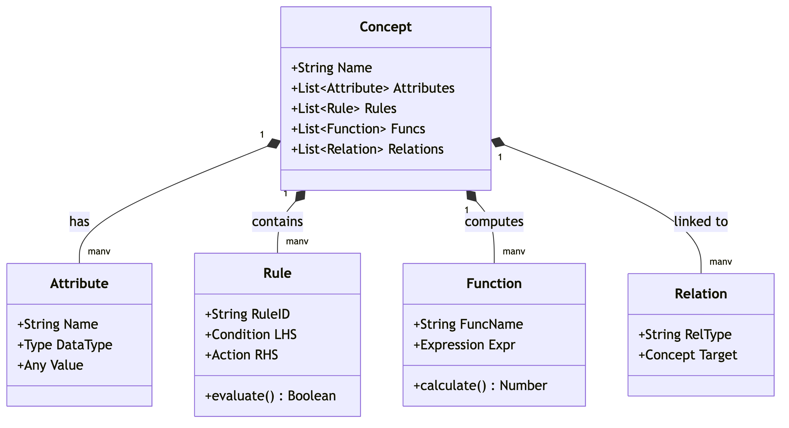
*Hình 2.3: Sơ đồ Lớp (Class Diagram) ánh xạ mô hình toán học COKB thành cấu trúc dữ liệu.*

Khi hệ thống đã có đầy đủ cấu trúc dữ liệu (Concept, Rule) được lưu trong Storage và một tập dữ kiện đầu vào (Fact) từ lệnh DML, bước cuối cùng trong quá trình phân tích bài toán là làm sao để kích hoạt các Rule này một cách hiệu quả để tạo ra tri thức mới.

# 2.4. Phân tích Luồng Suy diễn tự động

Thay vì duyệt qua toàn bộ tập luật mỗi khi có một dữ kiện mới xuất hiện — một phương pháp gây lãng phí tài nguyên và không thể mở rộng khi số lượng luật lên tới hàng ngàn — hệ thống yêu cầu một cơ chế đối sánh mẫu (Pattern Matching) hướng sự kiện. Dựa trên phân tích từ các hệ thống chuyên gia đi trước, giải pháp được chọn là tích hợp mạng Rete (Rete Network) vào trung tâm của bộ máy suy diễn [4], [9].

Theo cơ chế Forward Chaining, khi một dữ kiện mới đi vào vùng nhớ làm việc (Working Memory), nó sẽ tự động chạy qua các bộ lọc của mạng Rete (bao gồm Alpha Network để lọc thuộc tính đơn lẻ và Beta Network để kết hợp các điều kiện). Nếu một Rule thỏa mãn toàn bộ điều kiện đầu vào, nó sẽ được đưa vào hàng đợi (Agenda). Khi Rule được thực thi (Fire), các phương trình toán học sẽ được tính toán để sinh ra dữ kiện mới. Dữ kiện mới này lại tiếp tục được đẩy ngược vào Working Memory để vòng lặp tiếp tục, cho đến khi không còn Rule nào có thể kích hoạt (trạng thái F-Closure).

Toàn bộ quy trình điều phối và luồng luân chuyển dữ kiện trong bộ máy suy diễn tiến được trực quan hóa ở Hình 2.4.

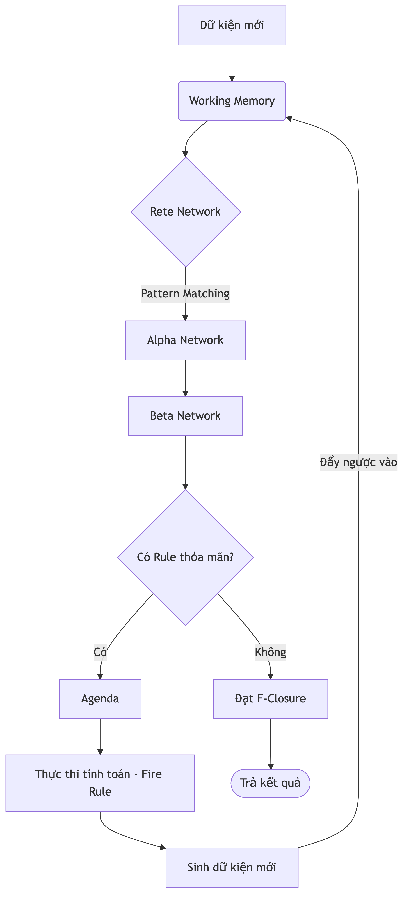
*Hình 2.4: Sơ đồ luồng dữ liệu (Data Flow) của cơ chế suy diễn tiến dựa trên mạng Rete.*

Qua việc phân tích chi tiết từ yêu cầu hệ thống, đặc tả ngôn ngữ, thiết kế cấu trúc dữ liệu cho đến quy trình suy diễn, kiến trúc tổng quát của KBMS đã được định hình rõ ràng. Việc triển khai các phân hệ kỹ thuật cụ thể để đáp ứng các phân tích này sẽ được trình bày chi tiết ở chương tiếp theo.


# 3.1. Tổng quan Kiến trúc và Mô hình Điều phối Hệ thống

Việc chuyển đổi từ một mô hình lý thuyết toán học thành một hệ quản trị cơ sở tri thức đòi hỏi một kiến trúc có khả năng phân tách hợp lý giữa nghiệp vụ tính toán và kỹ thuật lưu trữ vật lý. Đối với dự án KBMS, toàn bộ mã nguồn được tổ chức thành một giải pháp bao gồm nhiều tầng như `KBMS.Network`, `KBMS.Parser`, `KBMS.Reasoning` và `KBMS.Storage`. Việc phân rã này không chỉ giúp cô lập các rủi ro phát sinh trong quá trình phát triển, mà còn tạo tiền đề cho việc dễ dàng bảo trì và mở rộng hệ thống theo mô hình phân tán trong tương lai [11].

Dựa trên nguyên tắc chia để trị, hệ thống KBMS được cấu trúc thành nhiều tầng khác nhau. Mối liên kết và vị trí của các lớp này được thể hiện trực quan qua Sơ đồ Kiến trúc Phân lớp ở Hình dưới.


*Hình 3.1: Sơ đồ khối kiến trúc phân lớp chức năng của hệ thống KBMS dựa trên cấu trúc dự án.*

Tầng trên cùng là **Tầng Ứng dụng (Application Layer)**, đóng vai trò là điểm chạm đầu tiên của người dùng thông qua các module như `KBMS.CLI` và `kbms-studio`. Tầng này không chứa bất kỳ logic tính toán tri thức nào, mà chỉ đơn thuần cung cấp các giao diện tương tác (IDE hoặc giao diện dòng lệnh) để kỹ sư tri thức soạn thảo mã nguồn KBQL. Lớp ứng dụng sẽ đóng gói các đoạn mã này thành các yêu cầu mạng và gửi xuống máy chủ.

Ngay phía dưới là **Tầng Mạng (Network Layer)** được quản lý hoàn toàn bởi thư viện `KBMS.Network`. Nhiệm vụ của lớp này là thiết lập kết nối TCP tin cậy (TCP Binary Server) và quản lý vòng đời của các phiên giao dịch (Session). Để giảm thiểu độ trễ, KBMS loại bỏ hoàn toàn các giao thức văn bản cồng kềnh như HTTP/REST, thay vào đó truyền tải trực tiếp các gói tin nhị phân. Mọi dữ liệu đi vào hoặc đi ra đều phải qua khâu tuần tự hóa (Serialization) trước khi được đẩy vào vùng đệm của máy chủ.

Trái tim của hệ thống nằm ở **Tầng Server và Suy diễn (Engine Layer)**, bao gồm sự kết hợp chặt chẽ giữa `KBMS.Parser` và `KBMS.Reasoning`. Tại đây, các lệnh dạng văn bản sẽ được `KBMS.Parser` phân tích từ vựng (Lexer) và ngữ pháp (Grammar) để tạo ra một Cây cú pháp trừu tượng (AST). Sau đó, `KBMS.Reasoning` sẽ tiếp nhận cây AST này. Nếu đó là một lệnh yêu cầu tính toán, bộ máy suy diễn sẽ kích hoạt mạng Rete (Rete Network), thực thi thuật toán suy diễn tiến (Forward Chaining) để đối sánh các luật trên dữ kiện hiện có nhằm tìm ra tri thức mới [4].

Tầng cuối cùng, chịu trách nhiệm lưu giữ sự sống cho toàn bộ tri thức, là **Tầng Lưu trữ (Storage Layer)** thuộc namespace `KBMS.Storage`. Khác với các cơ sở dữ liệu truyền thống, Tầng lưu trữ này được tùy chỉnh cực kỳ tinh vi để tối ưu hóa việc cấp phát bộ nhớ. Nó bao gồm một bộ quản lý trang (`BufferPoolManager`) sử dụng thuật toán thay thế trang LRU Cache. Đĩa cứng vật lý được chia nhỏ thành các trang `SlottedPage` có kích thước chính xác 16KB. Đồng thời, quá trình tìm kiếm được tăng tốc bằng cơ chế chỉ mục `BPlusTree` dựa trên các khóa định danh toàn cục (`Guid`). Đặc biệt, để đảm bảo tính an toàn dữ liệu tuyệt đối khi mất điện, module `WalManagerV3` sẽ liên tục ghi lưu nhật ký theo chu kỳ 1 giây/lần.

Sự tương tác giữa bốn lớp này không diễn ra rời rạc mà tuân theo một quy trình điều phối tuyến tính và nghiêm ngặt. Khi một ứng dụng bên ngoài gửi một yêu cầu truy vấn, dữ liệu sẽ chảy qua từng thành phần, kích hoạt các xử lý tuần tự cho đến khi trả về tập kết quả cuối cùng. Luồng dữ liệu điều phối này được mô phỏng chi tiết trong Hình 3.2.

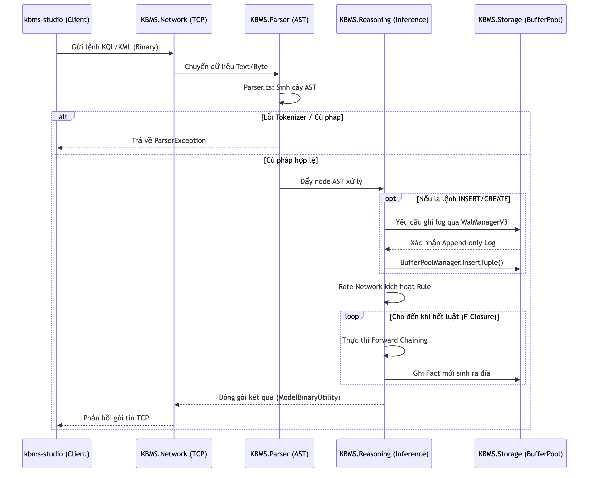
*Hình 3.2: Sơ đồ tuần tự (Sequence Diagram) phản ánh luồng thực thi mã nguồn giữa các module.*

Nhìn vào sơ đồ tuần tự trên, có thể thấy điểm mấu chốt quyết định tính đúng đắn của toàn bộ chu trình nằm ở sự kết hợp giữa thuật toán phân tích cú pháp (Parser) và cơ chế đảm bảo an toàn ghi đệm (WAL) trước khi dữ liệu thực sự đi vào vùng xử lý logic của `KBMS.Reasoning`. Với cái nhìn bao quát về kiến trúc này, phần tiếp theo sẽ đi sâu vào kỹ thuật cài đặt của Lớp Lưu trữ — nền móng vật lý của toàn bộ cấu trúc COKB.


# 3.2. Thiết kế Lớp Lưu trữ (Storage Layer)

Trong hệ quản trị cơ sở tri thức KBMS, bộ nhớ không chỉ lưu trữ các con số mà còn phải chứa đựng các mô hình toán học (COKB), các tập luật (Rules), và đồ thị suy diễn. Vì vậy, hệ thống được thiết kế từ đầu một hệ thống quản lý đĩa cứng riêng biệt trong thư viện `KBMS.Storage`, thay vì phụ thuộc vào Engine có sẵn như SQLite hay InnoDB. Kiến trúc cốt lõi của Lớp Lưu trữ xoay quanh ba cơ chế chính: Slotted Page, B+ Tree, và Write-Ahead Log (WAL).

## 3.2.1. Quản lý không gian đĩa với Slotted Page và Buffer Pool

Mọi thao tác đọc ghi của KBMS không diễn ra trực tiếp trên ổ cứng, mà thông qua một cơ chế bộ nhớ đệm được quản lý bởi class `BufferPoolManager`. Lớp này chịu trách nhiệm nạp dữ liệu từ đĩa lên bộ nhớ (RAM) và áp dụng thuật toán **LRU (Least Recently Used)** để quyết định trang dữ liệu nào sẽ bị đẩy (Evict) khỏi RAM khi bộ nhớ bị đầy.

Khối dữ liệu cơ sở của hệ thống được định nghĩa bởi class `SlottedPage` với kích thước chuẩn xác là **16KB** (16384 bytes). Khác với các hệ thống phân bổ theo dòng, Slotted Page cho phép hệ thống lưu trữ các tuple có độ dài thay đổi cực kỳ hiệu quả, một yêu cầu bắt buộc đối với dữ liệu tri thức.

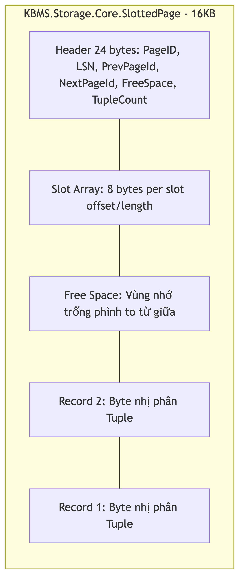
*Hình 3.3: Cấu trúc bộ nhớ 16KB của một Slotted Page thực tế.*

Nhìn vào mã nguồn `SlottedPage.cs`, mỗi trang dữ liệu luôn bắt đầu bằng một **Header dài 24 bytes**. Header này chứa các siêu dữ liệu cực kỳ quan trọng:
- `PageId` (4 bytes): Định danh duy nhất của trang.
- `Lsn` (4 bytes): Log Sequence Number, dùng để đối chiếu với WAL khi phục hồi sự cố.
- `PrevPageId` và `NextPageId` (8 bytes): Con trỏ liên kết danh sách vòng để tìm kiếm ngang.
- `FreeSpacePointer` (4 bytes): Con trỏ trỏ đến vị trí trống đầu tiên ở cuối trang.
- `TupleCount` (4 bytes): Tổng số lượng bản ghi (Slot) đang tồn tại.

Phía sau Header là một mảng **Slot Array**, mỗi Slot tốn 8 bytes (4 bytes lưu vị trí offset, 4 bytes lưu độ dài length). Trong khi mảng Slot phát triển từ trên xuống, thì dữ liệu thực sự (Record Tuple) lại được nối từ dưới đáy trang lên trên. Cấu trúc "phình to từ hai đầu" này giúp tận dụng tối đa 16KB không gian và tránh hiện tượng phân mảnh ngoại vi. Mọi dữ liệu trước khi đẩy vào Record đều phải đi qua `ModelBinaryUtility.cs` để tuần tự hóa các đối tượng phân cấp thành một mảng byte nhị phân liền mạch.

## 3.2.2. Tối ưu hóa truy xuất với chỉ mục B+ Tree

Nếu hệ thống phải quét tuần tự qua hàng nghìn Slotted Page 16KB để tìm một khái niệm hình học, hiệu năng sẽ bị giảm sút nghiêm trọng (O(N)). Do đó, lớp lưu trữ cung cấp module `BPlusTree` làm cấu trúc chỉ mục mặc định cho KBMS.

Khác với các hệ thống sử dụng số nguyên (Int) làm khóa, mã nguồn KBMS sử dụng **Guid (16 bytes)** làm khóa tìm kiếm chính (Search Key) nhằm hỗ trợ môi trường dữ liệu phân tán. Cấu trúc cây B+ Tree này được phân rã thành hai loại đối tượng chính: `BPlusTreeInternalNode` (Node nhánh) và `BPlusTreeLeafNode` (Node lá).


*Hình 3.4: Cấu trúc cây đa phân B+ Tree sử dụng `Guid` làm khóa tìm kiếm.*

Đặc điểm ưu việt của B+ Tree là toàn bộ thông tin về vị trí bộ nhớ `RecordId` (bao gồm `PageId` và `SlotId`) chỉ được lưu tại tầng lá. Điều này giúp các Node nhánh chứa được nhiều khóa Guid hơn, làm giảm thiểu độ cao (Height) của cây, từ đó tiết kiệm chi phí I/O (Disk Reads) đáng kể. Hơn nữa, các `BPlusTreeLeafNode` được liên kết với nhau thông qua thuộc tính `NextPageId`, cho phép hệ thống giải quyết cực nhanh các bài toán quét phạm vi (Range Scan) — ví dụ: duyệt qua tất cả các tam giác vuông được sinh ra trong một chuỗi thời gian cụ thể.

## 3.2.3. Đảm bảo toàn vẹn bằng WAL và Full Page Logging

Trong kiến trúc của KBMS, `BufferPoolManager` sử dụng cơ chế Write-Back, tức là khi một trang dữ liệu bị sửa đổi (Dirty Page), nó không ghi ngay xuống đĩa cứng để tránh nghẽn cổ chai I/O, mà sẽ trì hoãn cho đến khi có tác vụ đẩy nền (Background Checkpoint chạy 5 giây/lần). 

Tuy nhiên, nếu mất điện xảy ra giữa khoảng thời gian này, toàn bộ dữ kiện mới sinh ra trên RAM sẽ bốc hơi. Để giải quyết triệt để rủi ro, class `WalManagerV3` ra đời, tuân thủ nghiêm ngặt giao thức **Write-Ahead Logging**.

Bất kỳ thao tác làm thay đổi cơ sở tri thức nào đều phải được ghi thành công vào tệp nhật ký nối tiếp (`.wal`) trước khi thao tác đó được trả về cho tầng ứng dụng. Mã nguồn `WalManagerV3.cs` đặc tả 3 loại log định dạng nhị phân chính:
1. **Type 4 (ROW_INSERT):** Chỉ ghi nhận chính xác mảng byte của một Tuple vừa được thêm mới.
2. **Type 2 (PAGE_WRITE):** Ghi lại sự khác biệt mức byte (Before-Image và After-Image) đối với các giao dịch sửa đổi phức tạp. Các giao dịch này sẽ có 1 byte cờ báo trạng thái (Committed flag) ở cuối.
3. **Type 3 (FULL_PAGE_IMAGE):** Một tính năng tăng cường nhằm đối phó với tình trạng trượt trang. Khi `BufferPoolManager` cần đẩy một Dirty Page khỏi LRU Cache, nó sẽ ghi ép toàn bộ khối lượng 16KB của trang đó vào WAL dưới định dạng Type 3.

Ngoài ra, `WalManagerV3` còn duy trì một tác vụ đồng bộ nền (`PeriodicSyncAsync`) tự động xả bộ đệm (Flush) xuống đĩa cứng vật lý cứ mỗi 1 giây. Thiết kế này giúp hệ thống đạt được sự cân bằng hoàn hảo giữa tốc độ thực thi của RAM và độ an toàn dữ liệu của đĩa từ tính.

Với việc phân tích xong nền tảng vật lý vững chắc của KBMS, chúng ta đã sẵn sàng bước lên tầng cao hơn: Đặc tả cách người dùng giao tiếp với không gian lưu trữ này thông qua ngôn ngữ KBQL.


# 3.3. Đặc tả Ngôn ngữ và Bộ phân tích Cú pháp (KBQL Layer)

Trong kiến trúc của một hệ quản trị tri thức, nếu Lớp lưu trữ (Storage Layer) đóng vai trò là thể xác vật lý, thì Lớp ngôn ngữ giao tiếp chính là hệ thần kinh trung ương kết nối người dùng với bộ máy tính toán. Các ngôn ngữ truy vấn cơ sở dữ liệu truyền thống như SQL vốn được thiết kế tối ưu cho đại số quan hệ (Relational Algebra) tỏ ra bế tắc trước các mô hình tri thức phức hợp, trong khi Prolog lại sở hữu cú pháp quá trừu tượng, gây cản trở cho các kỹ sư phần mềm. 

Nhận thức được khoảng trống này, hệ thống đã đề xuất và cài đặt ngôn ngữ **KBQL (Knowledge Base Query Language)** — một ngôn ngữ phi thủ tục (declarative) được thiết kế chuyên biệt để biểu diễn và khai thác trọn vẹn mô hình đối tượng tính toán (COKB).

## 3.3.1. Cơ sở lý thuyết của Bộ phân tích cú pháp

Ngôn ngữ KBQL không được hệ thống xử lý trực tiếp dưới dạng văn bản thô. Thay vào đó, mọi chuỗi lệnh từ phía Client đều phải đi qua một luồng biên dịch nghiêm ngặt tại namespace `KBMS.Parser`:

1. **Phân tích từ vựng (Lexical Analysis):** Trình Lexer quét qua chuỗi ký tự đầu vào, loại bỏ các khoảng trắng và chú thích, sau đó phân tách chuỗi thành một danh sách các Thẻ từ (Token). Dựa trên mã nguồn `TokenType.cs`, hệ thống định nghĩa một tập hợp từ vựng đồ sộ với hơn 100 loại Token khác nhau, phục vụ từ việc khai báo cấu trúc cho đến bảo trì đĩa cứng.
2. **Phân tích cú pháp (Syntax Analysis):** Trình Parser sử dụng kỹ thuật phân tích trôi xuống đệ quy (Recursive Descent Parsing) để kiểm chứng tính hợp lệ của danh sách Token, từ đó dựng lên một **Cây cú pháp trừu tượng (Abstract Syntax Tree - AST)**.


*Hình 3.5: Cấu trúc phân tích cú pháp và điều phối lệnh KBQL dựa trên AST.*

Điểm đặc sắc của kiến trúc này nằm ở bộ phân luồng linh hoạt (Dispatcher). Dựa vào kiểu gốc của AST (ví dụ: `CreateConceptNode`, `InsertNode`, `VacuumNode`), hệ thống quyết định luồng đi của dữ liệu: tương tác với Lớp lưu trữ hay đẩy vào bộ nhớ làm việc (Working Memory) để chuẩn bị cho quá trình suy diễn.

## 3.3.2. Hệ thống Kiểu Dữ liệu và Hàm Tích hợp

Để hỗ trợ việc định nghĩa và tính toán trên các không gian đối tượng đa chiều, KBQL trang bị một bộ định kiểu mạnh mẽ, phân mảnh thành 15 chuẩn dữ liệu, cùng 12 hàm tích hợp chuyên biệt cho môi trường suy diễn.

**Bảng 3.1: Tập hợp 15 kiểu dữ liệu (Value Types) trong KBQL**

| Phân loại | Tên kiểu dữ liệu (Tokens) | Mô tả và mục đích sử dụng |
| :--- | :--- | :--- |
| **Numeric** | `TINYINT`, `SMALLINT`, `INT`, `BIGINT`, `FLOAT`, `DOUBLE`, `DECIMAL` | Lưu trữ các giá trị định lượng với độ chuẩn xác tùy biến, phục vụ tính toán đại số trong các phương trình (Equations). |
| **String** | `VARCHAR`, `CHAR`, `TEXT` | Lưu trữ định danh, tên gọi, hoặc văn bản dài. |
| **Boolean** | `BOOLEAN_TYPE` | Nhận giá trị `TRUE` / `FALSE`, làm tham số đầu vào cho mệnh đề giả thuyết (Rule Hypothesis). |
| **Date/Time** | `DATE`, `DATETIME`, `TIMESTAMP` | Quản lý mốc thời gian, phục vụ cho các luật suy diễn phụ thuộc yếu tố lịch sử. |
| **Reference**| `OBJECT_TYPE` | Tham chiếu (Pointer) đến một Concept khác, tạo nền tảng cho mối quan hệ kế thừa phân cấp. |

Khác biệt hoàn toàn với các cơ sở dữ liệu phi quan hệ (NoSQL), KBMS bổ sung các hàm (Functions) không chỉ tác động lên dữ liệu tĩnh mà còn can thiệp sâu vào cấu trúc tiến trình suy diễn.

**Bảng 3.2: Tập hợp 12 hàm tích hợp (Built-in & Meta-Querying Functions)**

| Phân nhóm | Từ khóa (Keywords) | Chức năng cốt lõi trong hệ thống |
| :--- | :--- | :--- |
| **Aggregation** | `COUNT`, `SUM`, `AVG`, `MAX`, `MIN` | Thực hiện thống kê toán học trên tập kết quả trả về từ đồ thị tri thức. |
| **Meta-Querying**| `HAS_FIRED`, `IS_DEDUCED`, `IS_STUCK` | Truy vấn trạng thái động của luật. Cụ thể, `HAS_FIRED` dùng để kiểm chứng xem một luật đã được mạng Rete kích hoạt hay chưa. |
| **Diagnostics** | `TOTAL_COST`, `AUDIT_LOG`, `GENERATED_VARIABLES`, `MISSING_FACTS` | Đánh giá chi phí tính toán thực tế và trích xuất nguyên nhân (dữ kiện còn thiếu) khiến luật không thể tiếp tục thực thi. |

## 3.3.3. Đặc tả Cú pháp (Skeletons) cho 5 Phân hệ KBQL

Bộ ngôn ngữ KBQL được thiết kế dựa trên triết lý "Đóng gói tri thức". Toàn bộ tập lệnh được chia thành 5 nhóm chức năng. Dưới đây là đặc tả cú pháp (Skeletons) kiệt để cho từng thao tác trong hệ thống.

### Phân hệ 1: KDL (Knowledge Definition Language)
Nhóm lệnh định nghĩa cấu trúc siêu dữ liệu. Thay vì lưu trữ phân tán, KBMS cho phép định nghĩa một khái niệm hoàn chỉnh bao gồm biến số, luật và hàm trong một khối duy nhất.

```sql
-- 1. Khởi tạo Cơ sở Tri thức
CREATE KNOWLEDGE BASE <Tên_Cơ_Sở> [DESCRIPTION "<Mô_tả>"];
USE KNOWLEDGE BASE <Tên_Cơ_Sở>;

-- 2. Định nghĩa Khái niệm (Concept) với 9 khối logic
CREATE CONCEPT <Tên_Khái_Niệm> (
    VARIABLES ( <Tên_Biến> : <Kiểu_Dữ_Liệu>, ... ),
    ALIASES ( <Tên_Đồng_Nghĩa>, ... ),
    BASE_OBJECTS ( <Khái_Niệm_Cơ_Sở>, ... ),
    CONSTRAINTS ( <Tên_Ràng_Buộc> : <Biểu_Thức>, ... ),
    SAME_VARIABLES ( <Biến_1> = <Biến_2>, ... ),
    CONSTRUCT_RELATIONS ( <Tên_Quan_Hệ>(<Tham_Số>), ... ),
    PROPERTIES ( <Khóa> : "<Giá_Trị>", ... ),
    EQUATIONS ( <Biểu_Thức_Đại_Số>, ... ),
    RULES ( RULE <Tên_Luật> : IF <Giả_Thuyết> THEN <Kết_Luận> )
);

-- 3. Thiết lập Mối quan hệ giữa các Khái niệm
CREATE RELATION <Tên> FROM <Concept_A> TO <Concept_B> PARAMS (...) RULES (...);

-- 4. Định nghĩa Hàm và Toán tử tùy chỉnh
CREATE FUNCTION <Tên_Hàm> PARAMS (<Tên_Biến> <Kiểu>) RETURNS <Kiểu> BODY "<Mã_Nguồn>";
CREATE OPERATOR <Ký_Hiệu> PARAMS (<Kiểu_1>, <Kiểu_2>) RETURNS <Kiểu> BODY "<Mã_Nguồn>";

-- 5. Định nghĩa Cơ chế Trigger và Chỉ mục (Index)
CREATE TRIGGER <Tên> ON <Đối_Tượng> IF <Điều_Kiện> DO <Hành_Động>;
CREATE INDEX <Tên_Index> ON <Tên_Khái_Niệm> (<Tên_Biến>);

-- 6. Tái cấu trúc và Xóa bỏ
ALTER CONCEPT <Tên> ADD VARIABLE <Tên_Biến> : <Kiểu_Dữ_Liệu>;
ALTER CONCEPT <Tên> REMOVE VARIABLE <Tên_Biến>;
DROP CONCEPT <Tên_Khái_Niệm>;
```

### Phân hệ 2: KML (Knowledge Manipulation Language)
Nhóm lệnh vận hành dữ kiện thực tế. Điểm khác biệt mấu chốt của KBQL là việc nạp dữ liệu không kết thúc bằng một thao tác ghi đĩa thông thường; lệnh `INSERT` đóng vai trò là "mồi lửa" kích hoạt mạng Rete chạy ngầm.

```sql
-- 7. Thêm dữ kiện mới (Kích hoạt bộ máy suy diễn)
INSERT INTO <Tên_Khái_Niệm> VARIABLES ( 
    <Tên_Biến> : <Giá_Trị>, ... 
);

-- 8. Cập nhật dữ kiện (Có thể làm thay đổi trạng thái kích hoạt của luật)
UPDATE <Tên_Khái_Niệm> VARIABLES ( 
    SET <Tên_Biến> : <Biểu_Thức_Mới> 
) WHERE <Điều_Kiện>;

-- 9. Xóa dữ kiện
DELETE FROM <Tên_Khái_Niệm> WHERE <Điều_Kiện>;
```

### Phân hệ 3: KQL (Knowledge Query Language)
KQL cung cấp khả năng truy vết (Traceability). Người dùng có thể sử dụng các hàm meta đặc thù để truy vấn chính xác quá trình tư duy của hệ thống.

```sql
-- 10. Truy vấn dựa trên Trạng thái kích hoạt (Traceability)
FIND <Tên_Khái_Niệm> 
WITH <Điều_Kiện_Lọc> AND <Hàm_Truy_Vết>
RETURN <Biến_1>, <Biến_2>;

-- 11. Truy xuất dữ liệu cấu trúc dạng bảng (SQL-like)
SELECT <Danh_Sách_Cột> 
FROM <Tên_Khái_Niệm> 
JOIN <Khái_Niệm_Khác> ON <Điều_Kiện_Kết_Nối>
WHERE <Điều_Kiện> 
GROUP BY <Cột> HAVING <Điều_Kiện_Nhóm>
ORDER BY <Cột> ASC|DESC 
LIMIT <Số_Lượng> OFFSET <Vị_Trí_Bắt_Đầu>;
```

### Phân hệ 4: Utility & Maintenance Language (Quản trị Hệ thống)
Các nhóm lệnh phục vụ cho kỹ sư hệ thống theo dõi và tối ưu hóa bộ nhớ cấp thấp (Buffer Pool, Slotted Page).

```sql
-- 12. Truy xuất Metadata
SHOW CONCEPTS; | SHOW RULES; | SHOW RELATIONS; 
SHOW USERS; | SHOW INDEXES; | SHOW TRIGGERS;
DESCRIBE <Tên_Khái_Niệm>;

-- 13. Giải thích quá trình thực thi
EXPLAIN <Câu_Lệnh_KQL_Hoặc_KML>;

-- 14. Tối ưu hóa Lưu trữ vật lý
VACUUM <Tên_Khái_Niệm>;       -- Dọn dẹp phân mảnh trên Slotted Page
REINDEX <Tên_Khái_Niệm>;      -- Xây dựng lại cấu trúc B+ Tree
CHECK CONSISTENCY;            -- Kiểm tra tính toàn vẹn tri thức

-- 15. Giao tiếp dữ liệu ngoại vi
EXPORT <Tên_Khái_Niệm> INTO FILE "<Đường_Dẫn>" FORMAT <Định_Dạng>;
IMPORT INTO <Tên_Khái_Niệm> FROM FILE "<Đường_Dẫn>" FORMAT <Định_Dạng>;
```

### Phân hệ 5: KCL và TCL (Bảo mật và Giao dịch)
Các lệnh đảm bảo tính nguyên tử (Atomicity) và kiểm soát quyền truy cập dựa trên vai trò (RBAC).

```sql
-- 16. Kiểm soát quyền truy cập (KCL)
GRANT <Quyền_Hạn> ON <Đối_Tượng> TO <Vai_Trò>;
REVOKE <Quyền_Hạn> ON <Đối_Tượng> FROM <Người_Dùng>;

-- 17. Quản lý toàn vẹn giao dịch (TCL)
BEGIN TRANSACTION;
-- [Khối lệnh KML/KDL]
COMMIT;   -- Hoặc ROLLBACK;
```

## 3.3.4. Đặc tả bài toán ứng dụng qua ngôn ngữ KBQL

Tính khả thi của ngôn ngữ KBQL được thể hiện qua bài toán nhận dạng đặc tính hình học. Khi cần định nghĩa cấu trúc của một tam giác, thay vì giao phó việc tính toán logic cho Lớp ứng dụng (Application Layer), thiết kế của hệ thống cho phép nhúng trực tiếp định lý Pythagoras vào cấu trúc siêu dữ liệu thông qua câu lệnh KDL:

```sql
CREATE CONCEPT TamGiac (
    VARIABLES (
        a : FLOAT,
        b : FLOAT,
        c : FLOAT,
        isVuong : BOOLEAN
    ),
    RULES (
        RULE NhanBietTamGiac : 
            IF (a*a + b*b == c*c) OR (a*a + c*c == b*b) OR (b*b + c*c == a*a)
            THEN isVuong = TRUE
    )
);
```

Trong quá trình vận hành, khi một tập dữ kiện mới được hệ thống tiếp nhận qua lệnh KML:

```sql
INSERT INTO TamGiac VARIABLES (
    a : 3.0, 
    b : 4.0, 
    c : 5.0,
    isVuong : FALSE
);
```

Lệnh `INSERT` không chỉ thực hiện chức năng lưu trữ mà còn đóng vai trò là tác nhân kích hoạt (trigger) Lớp suy diễn. Khi các giá trị (3, 4, 5) được nạp vào bộ nhớ làm việc (Working Memory), hệ thống tự động đánh giá và đối khớp với luật `NhanBietTamGiac`. Kết quả của quá trình này là thuộc tính `isVuong` được cập nhật thành `TRUE`. Để truy xuất kết quả này kèm theo bằng chứng suy luận (inference trace), Lớp ứng dụng sẽ gọi hàm meta `HAS_FIRED` trong câu lệnh KQL:

```sql
FIND TamGiac 
WITH isVuong = TRUE 
AND HAS_FIRED("NhanBietTamGiac")
RETURN a, b, c;
```


*Hình 3.5: Luồng thực thi từ biên dịch KDL đến truy vấn KQL có truy vết.*

Thông qua cơ chế truy vết này, hệ thống đảm bảo tính minh bạch (explainability) của các kết luận được đưa ra Luồng thực thi tự động này chính là mạng suy diễn tiến (Forward Chaining), sẽ được phân tích chi tiết tại Mục 3.4.


# 3.4. Kiến trúc Mạng Suy diễn Rete (Reasoning Layer)

Nếu Lớp ngôn ngữ (KBQL Layer) chịu trách nhiệm tiếp nhận và biên dịch tri thức từ người dùng, thì Lớp suy diễn (Reasoning Layer) đóng vai trò là "bộ não" cốt lõi của toàn bộ hệ quản trị tri thức. Thay vì sử dụng phương pháp tìm kiếm vét cạn (Exhaustive Search) trên toàn bộ không gian dữ kiện mỗi khi có truy vấn mới, hệ thống áp dụng cơ chế suy diễn tiến (Forward Chaining) dựa trên nền tảng của mạng **Rete Network**. Kỹ thuật này giúp hệ thống lưu trữ vết (state) của các điều kiện đã khớp một phần, từ đó giảm thiểu tối đa chi phí tái tính toán và đạt được hiệu năng vượt trội khi xử lý các mô hình có hàng ngàn luật đan chéo nhau.

## 3.4.1. Cấu trúc Hình học Mạng Rete (Rete Topology)

Thuật toán Rete được hiện thực hóa trong namespace `KBMS.Reasoning.Rete` bằng cách biến đổi danh sách các luật (Rules) phẳng thành một đồ thị có hướng không chu trình (DAG). Mạng Rete của KBMS bao gồm 4 loại nút (Node) chuyên biệt, phối hợp nhịp nhàng để tạo thành một phễu lọc dữ kiện nhiều tầng.

1. **Nút gốc (Entry Node):** Đóng vai trò là cửa ngõ duy nhất. Khi một dữ kiện mới (Fact) được đưa vào bộ nhớ làm việc (Working Memory), nó sẽ đi qua Nút gốc trước khi lan truyền xuống các nhánh bên dưới.
2. **Nút lọc đơn phân (Alpha Node):** Chịu trách nhiệm kiểm tra các điều kiện cục bộ của một biến đơn lẻ (Unary Predicate). Ví dụ, nếu luật yêu cầu `a > 0`, `AlphaNode` sẽ chặn các dữ kiện có `a <= 0` lại. Việc nhóm các điều kiện giống nhau vào chung một Alpha Node giúp hệ thống tránh việc kiểm tra lặp lại một điều kiện cho nhiều luật khác nhau.
3. **Nút kết hợp (Beta Node):** Đây là thành phần phức tạp và đắt đỏ nhất trong mạng Rete. Nhiệm vụ của `BetaNode` là thực hiện phép kết nối (Join) giữa kết quả của một phần mạng trước đó (Left Parent) với một điều kiện mới (Right Parent). Nếu phép kết hợp thành công, nó sinh ra một Token mới chứa nhiều dữ kiện cấu thành và đẩy tiếp xuống mạng.
4. **Nút thiết bị (Terminal Node):** Nằm ở đáy của đồ thị Rete. Khi một Token chạm đến `TerminalNode`, điều đó có nghĩa là toàn bộ giả thuyết (Hypothesis) của một luật cụ thể đã hoàn toàn được thỏa mãn. Nút này sẽ không tự thực thi kết luận, mà đóng gói Token thành một **Activation** và đẩy vào hàng đợi ưu tiên (Agenda).

Sự phân luồng dữ kiện qua các tầng Node này được mô tả trực quan trong sơ đồ sau:


*Hình 3.6: Kiến trúc bộ nhớ và luồng dữ kiện bên trong mạng Rete.*

## 3.4.2. Cơ chế Biên dịch và Lan truyền (Compilation & Propagation)

Quá trình vận hành của Lớp suy diễn được chia thành hai pha riêng biệt: pha biên dịch (Compile-time) và pha lan truyền dữ kiện (Run-time).

Trong pha biên dịch, thành phần `ReteCompiler` sẽ phân tích Cây cú pháp trừu tượng (AST) của `CREATE CONCEPT`. Bằng việc quét qua tất cả các khối `RULES` và `CONSTRAINTS`, bộ biên dịch sẽ xây dựng mạng Rete tương ứng. Quá trình này đòi hỏi thuật toán phải tìm kiếm các nút Alpha và Beta đã tồn tại để chia sẻ đường dẫn (Node Sharing Optimization). Nhờ đó, nếu 10 luật cùng yêu cầu điều kiện `isVuong = TRUE`, hệ thống chỉ sinh ra đúng một `AlphaNode` duy nhất để kiểm tra điều kiện này.

Pha lan truyền (Run-time) bắt đầu khi hệ thống nhận được lệnh `INSERT` hoặc `UPDATE` từ lớp KBQL. Đối tượng `ReteNetwork` sẽ đảm nhận vai trò điều phối:
- Khi một dữ kiện được `AssertFact`, nó được đưa vào Working Memory. 
- Mạng Rete lập tức truyền dữ kiện này từ Nút gốc xuống các nút Alpha.
- Nếu lọt qua Alpha, dữ kiện sẽ được lưu vào bộ nhớ cục bộ (Right/Left Memory) của nút Beta và kích hoạt phép Join.
- Nếu dữ kiện bị thu hồi (`RetractFact`), mạng Rete sẽ phát tín hiệu rút lui, tự động xóa mọi Token và Activation rác có liên quan đến dữ kiện này khỏi bộ nhớ của toàn hệ thống.

## 3.4.3. Quản lý hàng đợi (Agenda) và Cơ chế Đóng kín (Forward Closure)

Tại điểm cuối của mạng, hàng đợi **Agenda** hoạt động như một bộ lập lịch thực thi (Scheduler). Nó quản lý các Actvation (luật đã đủ điều kiện kích hoạt) dựa trên độ ưu tiên (Priority) và chi phí tính toán (Cost). Cơ chế này đảm bảo rằng các luật mang tính chất ràng buộc hệ thống quan trọng sẽ luôn được kích hoạt trước các luật tính toán đơn thuần.

Động lực chính của Lớp suy diễn nằm ở hiện tượng **Đóng kín suy diễn (Forward Closure)**. Khi `InferenceEngine` ra lệnh kích hoạt (Fire) một luật từ Agenda, phần kết luận (Conclusion) của luật đó có thể tạo ra một dữ kiện hoàn toàn mới. Dữ kiện mới này lại tiếp tục được đẩy ngược vào Working Memory, lan truyền qua Nút gốc, và có khả năng đánh thức (trigger) các luật khác đang nằm chờ ở các Beta Node. Quá trình bùng nổ dây chuyền này chỉ dừng lại khi hệ thống đạt đến trạng thái bão hòa (không còn luật nào mới có thể được kích hoạt).

## 3.4.4. Đánh giá luồng thực thi thuật toán Rete

Quá trình vận hành của thuật toán Rete có thể được mô tả chi tiết thông qua kịch bản phân loại tam giác đã đề cập. Với cấu trúc `TamGiac` gồm ba biến `a, b, c` và luật `NhanBietTamGiac`, hệ thống sẽ xử lý tuần tự theo luồng dữ kiện đầu vào.

Tại thời điểm biên dịch (Compile-time), `ReteCompiler` khởi tạo một Beta Node chịu trách nhiệm theo dõi và lưu vết sự tồn tại của bộ ba biến này.
Khi hệ thống tiếp nhận cạnh $a=3$, dữ kiện đi qua Nút gốc (Entry Node) và được lưu trữ tại bộ nhớ cục bộ của Beta Node. Lúc này, điều kiện của luật chưa được thỏa mãn nên hệ thống ở trạng thái chờ. Quá trình này lặp lại tương tự khi dữ kiện $b=4$ được nạp vào.

Chỉ khi dữ kiện $c=5$ xuất hiện thông qua lệnh `INSERT`, phép kết hợp (Join) tại Beta Node mới hội tụ đủ điều kiện. Một Token chứa bộ ba $(3, 4, 5)$ được tạo ra và dịch chuyển đến Terminal Node của luật `NhanBietTamGiac`. Hệ quả là một Activation được đưa vào hàng đợi Agenda. Cuối cùng, `InferenceEngine` sẽ lấy Activation này ra thực thi, chính thức cập nhật dữ kiện `isVuong = TRUE` vào bộ nhớ làm việc.


*Hình 3.7: Minh họa chi tiết luồng di chuyển của các cạnh tam giác qua mạng Rete.*

Khi không còn Activation nào trong Agenda, tiến trình đóng kín suy diễn kết thúc. Bằng cách lưu trữ trạng thái trung gian tại các node, thuật toán Rete hạn chế tối đa các phép tính dư thừa, đảm bảo hệ thống đưa ra kết luận tự động một cách chính xác và lưu giữ đầy đủ vết thực thi.


# 3.5. Kiến trúc Mạng và Giao thức Giao tiếp (Network Layer)

Để hệ quản trị tri thức thực sự đóng vai trò là một máy chủ (Server) độc lập, có khả năng phục vụ đồng thời nhiều ứng dụng khách(Clients) thông qua môi trường Internet hoặc mạng nội bộ, một hệ thống có khả năng truyền tải dữ liệu ổn định là yếu tố tiên quyết. Thay vì sử dụng các giao thức dựa trên HTTP (như REST API hay GraphQL) với phần tiêu đề (Header) văn bản cồng kềnh, hệ thống đã thiết kế riêng một **Giao thức Nhị phân (Binary Protocol)** chạy trực tiếp trên nền tảng TCP Socket. Kiến trúc này giúp giảm đáng kể độ trễ khi truyền tải các luồng tri thức, đảm bảo tính ổn định và hiệu quả.

## 3.5.1. Đặc tả Cấu trúc Gói tin Nhị phân (Packet Architecture)

Mọi yêu cầu từ Client hay phản hồi từ Server đều được chuẩn hóa thành một đối tượng `Message`. Theo mã nguồn `KBMS.Network/Protocol.cs`, một gói tin nhị phân truyền qua TCP Socket không sử dụng ký tự phân cách (như `\n` trong các giao thức văn bản), mà tuân thủ nghiêm ngặt định dạng chiều dài cố định ở phần đầu (Fixed-Length Header).

Cấu trúc một Frame mạng hoàn chỉnh được phân mảnh thành 5 khối liền kề nhau:

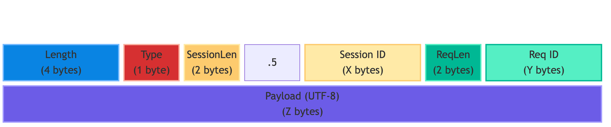
*Hình 3.8: Cấu trúc đóng gói byte (Byte Layout) của Giao thức KBMS.*

**Bảng 3.7: Chi tiết kỹ thuật của từng khối Byte trong Gói tin TCP**

| Khối dữ liệu | Độ dài | Kiểu Endian | Diễn giải chức năng kỹ thuật |
| :--- | :--- | :--- | :--- |
| **Total Length** | 4 bytes | Big-Endian | Tổng số byte của toàn bộ các phần phía sau cộng lại. Việc đặt kích thước lên đầu giúp Socket tránh tình trạng đọc lố (over-read) và xử lý hiện tượng phân mảnh TCP (TCP fragmentation). |
| **Message Type** | 1 byte | N/A | Xác định loại hành vi của gói tin (định nghĩa theo kiểu Enum). |
| **Session ID** | 2 + X bytes | Big-Endian | 2 byte đầu chứa độ dài chuỗi (X). X byte sau chứa mã phiên (Session ID) định danh người dùng. Nếu rỗng, độ dài bằng 0. |
| **Request ID** | 2 + Y bytes | Big-Endian | 2 byte đầu chứa độ dài chuỗi (Y). Y byte sau chứa mã truy vấn độc nhất, giúp Client ghép cặp (map) câu trả lời bất đồng bộ tương ứng. |
| **Payload** | Tùy biến | UTF-8 | Chứa nội dung chính của thông điệp (câu lệnh KBQL hoặc kết quả truy vấn). |

## 3.5.2. Hệ thống Định tuyến Thông điệp (Message Types)

Sức mạnh của giao thức nằm ở Byte thứ 5 (Message Type). Dựa trên phân tích mã nguồn `MessageType.cs`, hệ thống vận hành 14 loại thông điệp, được chia thành 3 phân hệ phục vụ các quy trình vòng đời khác nhau.

**Bảng 3.8: Tập hợp 14 thông điệp giao tiếp hệ thống**

| Phân hệ | Giá trị Byte | Từ khóa (Enum) | Chức năng cốt lõi |
| :--- | :--- | :--- | :--- |
| **Bảo mật & Phiên** | 1, 5, 12 | `LOGIN`, `LOGOUT`, `SESSIONS` | Xác thực người dùng và phân bổ không gian bộ nhớ (Session) độc lập trên Server. |
| **Luồng Dữ liệu** | 2, 3, 7, 8 | `QUERY`, `RESULT`, `ROW`, `FETCH_DONE` | Truyền lệnh KBQL (`QUERY`) và tiếp nhận kết quả dạng dòng chảy (`ROW`) liên tục thay vì nạp một lần. |
| **Phân tích (IDE)** | 4, 10, 11, 14, 15 | `ERROR`, `STATS`, `LOGS_STREAM`, `LSP_...` | Truyền luồng lỗi, chi phí suy diễn và hỗ trợ gợi ý cú pháp cho hệ thống Editor. |
| **Bảo trì** | 6, 13 | `METADATA`, `MANAGEMENT_CMD` | Trao đổi siêu dữ liệu (Schema) và lệnh quản trị hệ thống mức thấp. |

## 3.5.3. Mô hình Bất đồng bộ và Quản lý Đa phiên (Concurrency & Sessions)

Khi triển khai thực tế, một hệ quản trị phải đối mặt với bài toán Bất đồng bộ (Concurrency) — nhiều ứng dụng truy cập đồng thời. Lớp Mạng của KBMS giải quyết vấn đề này thông qua cơ chế quản lý **Session ID**.

Mỗi Client khi `LOGIN` thành công sẽ được cấp một Session ID. Bất kỳ lệnh `QUERY` nào đi kèm ID này sẽ được Server định tuyến vào một "Không gian làm việc" (Working Memory) cô lập tạm thời. Điều này đảm bảo dữ kiện (Fact) nạp bởi Ứng dụng A không gây kích hoạt nhầm luật trong phiên truy vấn của Ứng dụng B. Để bảo vệ an toàn luồng (Thread-safety) khi đọc/ghi trực tiếp vào TCP Socket, mã nguồn `Protocol.cs` áp dụng cơ chế khóa bất đồng bộ `SemaphoreSlim`.

## 3.5.4. Kịch bản Giao tiếp qua Bài toán Hình học (Data Streaming)

Điểm nổi bật nhất của kiến trúc Lớp Mạng nằm ở cơ chế **Data Streaming**. Thay vì máy chủ gộp hàng triệu kết quả tam giác vào nhiều gói tin để gửi đến Client (điều này sẽ gây tràn bộ nhớ RAM của cả Client lẫn Server), hệ thống chia nhỏ kết quả thành từng thông điệp `ROW`.

Quay lại bài toán truy vết định lý Pythagoras, luồng giao tiếp TCP diễn ra như sau:

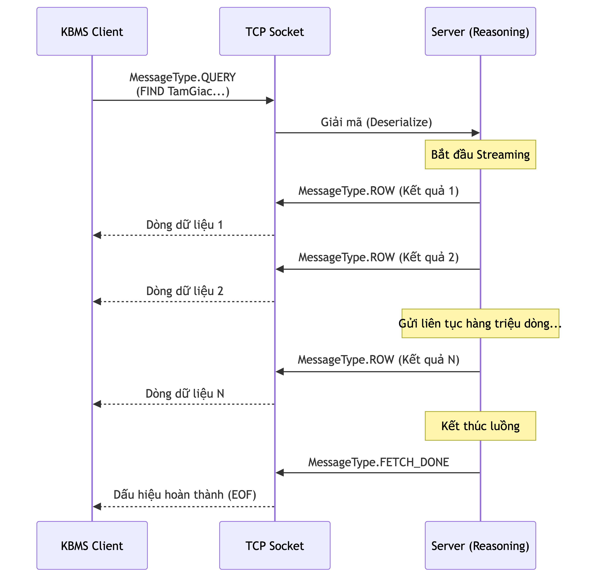
*Hình 3.9: Luồng giao tiếp Data Streaming tránh tràn bộ nhớ.*

Khi Client gửi gói tin `QUERY` chứa lệnh `FIND TamGiac WITH HAS_FIRED...`, Lớp Suy diễn (Reasoning Layer) sẽ tìm ra kết quả. Mỗi khi tìm thấy một tam giác vuông, Server lập tức đóng gói thành một thông điệp `ROW` và đẩy qua Socket. Sau khi gửi hết 1 triệu kết quả, Server mới chốt lại bằng thông điệp `FETCH_DONE`. 

Cơ chế này minh chứng cho sự phối hợp cực kỳ chặt chẽ từ tầng thấp (Network Layer TCP), đi qua tầng phân tích ngữ pháp (KBQL Layer), len lỏi vào tầng suy diễn (Reasoning Layer), và truy xuất dữ liệu từ ổ cứng (Storage Layer) — biến dự án thành một **Hệ Quản trị Cơ sở Tri thức (KBMS)** thực thụ, đạt chuẩn công nghiệp.


# 3.6. Lớp Ứng dụng và Môi trường Khai thác (Application Layer)

Mảnh ghép cuối cùng và cũng là điểm chạm trực tiếp duy nhất đối với người sử dụng trong toàn bộ kiến trúc hệ thống KBMS chính là **Lớp Ứng dụng (Application Layer)**. Dựa trên cơ sở lý thuyết của mô hình kiến trúc Client-Server, lớp ứng dụng được thiết kế hoàn toàn theo tư tưởng phi trạng thái (stateless) và triệt tiêu mọi logic suy diễn cục bộ. Điều này có nghĩa là toàn bộ sức mạnh xử lý (từ việc kiểm tra lỗi cú pháp dựa trên Abstract Syntax Tree cho đến việc kích hoạt thuật toán Rete) đều được ủy thác hoàn toàn cho Lớp Máy chủ (Engine Layer) thực hiện. Vai trò cốt lõi của các ứng dụng phía Client lúc này được thu gọn lại thành hai nhiệm vụ: đóng gói yêu cầu của người dùng thành luồng byte nhị phân để đẩy qua giao thức TCP, và phân tích (Parse) khối dữ liệu trả về để trực quan hóa lên màn hình [2].

Để đáp ứng nhu cầu sử dụng của các tệp người dùng chuyên biệt, hệ thống KBMS cung cấp hai môi trường khai thác song hành: Giao diện dòng lệnh (KBMS CLI) hướng tới quản trị viên hệ thống, và Môi trường phát triển tích hợp (KBMS Studio) hướng tới kỹ sư tri thức.

## 3.6.1. Môi trường Khai thác Dòng lệnh (KBMS CLI)

Ứng dụng KBMS CLI (`KBMS.CLI`) được xây dựng nhằm cung cấp một công cụ giao tiếp tối giản, tiêu tốn ít tài nguyên phần cứng nhất có thể. Đặc thù của các môi trường triển khai thực tế (Production) là hệ thống máy chủ thường không được trang bị giao diện đồ họa (headless server). Do đó, một giao diện dòng lệnh mạnh mẽ là yêu cầu bắt buộc để các Quản trị viên hệ thống (System Administrators) có thể thao tác trực tiếp với cơ sở dữ liệu.


*Hình 3.10: Sơ đồ luồng xử lý (Processing Flow) của ứng dụng CLI.*

Kiến trúc bên trong của KBMS CLI không đơn thuần là một công cụ truyền tải chuỗi ký tự, mà là sự kết hợp chặt chẽ của ba phân hệ kỹ thuật: Trình soạn thảo đa dòng (`LineEditor.cs`), Bộ quản lý lịch sử (`HistoryManager.cs`), và Trình phân tích kết quả (`ResponseParser.cs`). Sự phối hợp của các phân hệ này được thể hiện rõ nét qua từng kịch bản sử dụng (Use Case) cụ thể.

Quá trình giao tiếp bắt buộc phải được khởi tạo bằng **luồng Xác thực (Authentication Flow)**. Trước khi bất kỳ lệnh KBQL nào được gửi đi, CLI phải thiết lập kết nối TCP Socket tới máy chủ và gửi thông điệp `LOGIN` chứa thông tin định danh. Chỉ khi máy chủ đối chiếu thành công quyền hạn dựa trên mô hình Role-Based Access Control (RBAC), một phiên làm việc (Session) mới được cấp phát, đảm bảo tính bảo mật và toàn vẹn của hệ thống.


*Hình 3.11: Luồng logic kết nối và xác thực người dùng.*

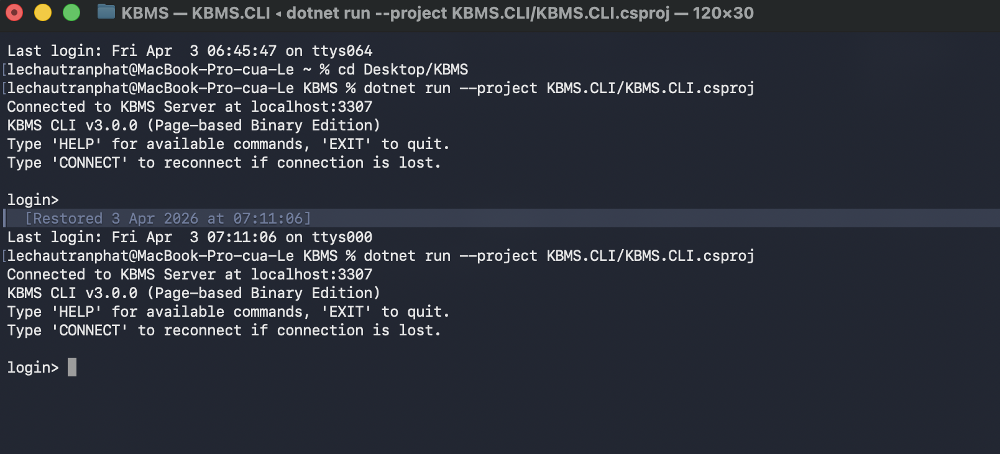
*Hình 3.12: Giao diện khởi tạo kết nối TCP và đăng nhập của KBMS CLI.*

Tiếp theo, khi quản trị viên cần thiết kế kiến trúc tri thức, họ sẽ tương tác với luồng **Soạn thảo Ngôn ngữ Định nghĩa (KDL)**. Không giống như các câu lệnh SQL ngắn gọn, việc định nghĩa một cấu trúc Khái niệm (Concept) hoặc Luật (Rule) trong KBMS thường đòi hỏi hàng chục dòng mã với nhiều biến số phức tạp. Để giải quyết vấn đề này, module `LineEditor.cs` được cài đặt để cung cấp khả năng soạn thảo đa dòng (Multi-line Editing) trực tiếp trên Console. Hệ thống sẽ tích lũy các chuỗi ký tự vào bộ đệm và chỉ thực sự gửi gói tin `QUERY` đi khi bắt gặp dấu chấm phẩy (`;`), giúp người dùng thoải mái ngắt dòng khi định nghĩa các bài toán phức tạp (ví dụ: định nghĩa ba cạnh của tam giác vuông).

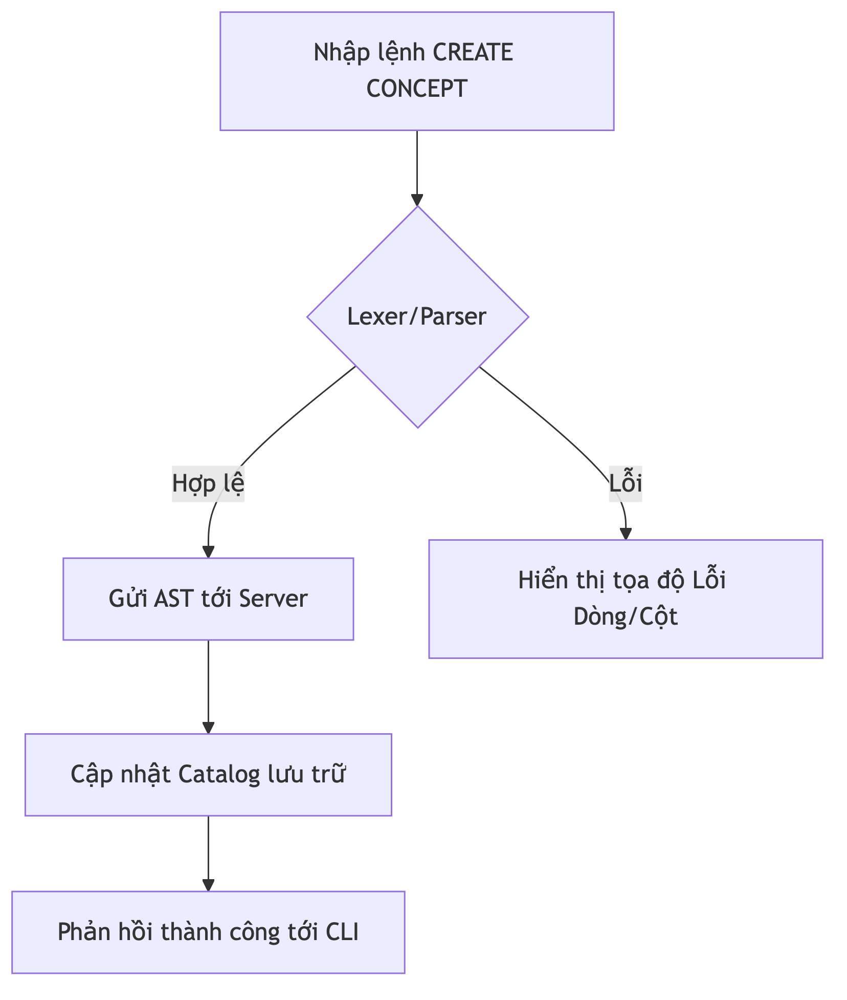
*Hình 3.13: Luồng logic định nghĩa cấu trúc dữ liệu qua KDL.*


*Hình 3.14: Giao diện soạn thảo đa dòng (Multi-line Editor) cho phép ngắt dòng lệnh KDL.*

Đối với thao tác **Truy vấn (KQL) và Truy vết (Trace)**, Lớp Ứng dụng phải đối mặt với bài toán tràn bộ nhớ. Nếu một câu lệnh KQL (như `FIND TamGiac`) trả về hàng triệu kết quả, việc nhận và phân tích toàn bộ cục dữ liệu cùng một lúc sẽ đánh sập chương trình. Do đó, mã nguồn `ResponseParser.cs` được thiết kế tương thích hoàn toàn với cơ chế Data Streaming từ Lớp Mạng. Mỗi khi nhận được một gói tin `MessageType.ROW`, CLI lập tức giải mã JSON và vẽ từng hàng dữ liệu ra bảng ASCII. Quá trình này tiếp diễn liên tục cho đến khi nhận được tín hiệu `FETCH_DONE`, đảm bảo bộ nhớ RAM của Client luôn ở mức thấp.


*Hình 3.15: Luồng logic phân giải lệnh truy vấn (KQL).*

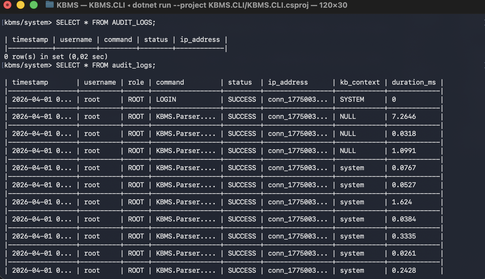
*Hình 3.16: Giao diện hiển thị kết quả truy vấn KBQL dạng bảng thẳng hàng trên Console.*

Đặc biệt, hệ thống cung cấp công cụ truy vết suy luận logic (Solve Trace) dành riêng cho mục đích chẩn đoán. Khi thêm cờ truy vết vào truy vấn, luồng sự kiện (Activation) từ mạng Rete bên trong Server sẽ được đóng gói và gửi về CLI, cho phép người dùng quan sát chi tiết quá trình các biến số (như $a$, $b$, $c$ trong định lý Pythagoras) được đối sánh và sinh ra tri thức mới.


*Hình 3.17: Luồng logic yêu cầu truy vết giải thuật từ Server.*

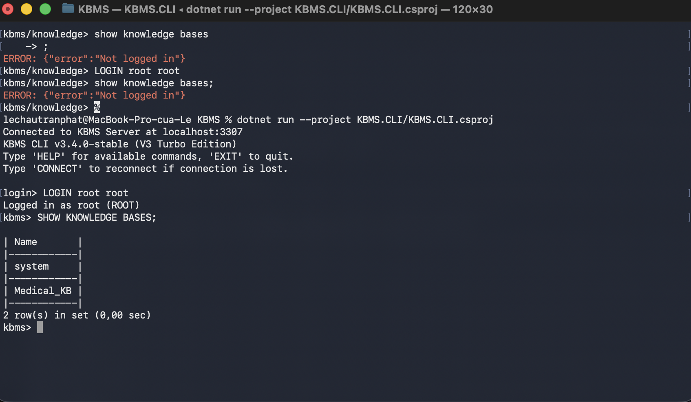
*Hình 3.18: Giao diện truy vết từng bước kích hoạt của Mạng Rete.*

## 3.6.2. Môi trường Phát triển Tích hợp (KBMS Studio)

Khác với CLI hướng tới tính tối giản cho kỹ thuật viên, **KBMS Studio** (`kbms-studio`) được định vị là một hệ sinh thái Môi trường Phát triển Tích hợp (IDE) đồ họa toàn diện, hướng tới Kỹ sư tri thức (Knowledge Engineers). Được phát triển trên nền tảng công nghệ web hiện đại kết hợp với Electron và Vite, Studio che giấu đi sự phức tạp của giao thức nhị phân bên dưới, mang lại trải nghiệm tương tác mượt mà thông qua giao diện trực quan.


*Hình 3.19: Sơ đồ kiến trúc ứng dụng Studio.*

Sức mạnh nền tảng của KBMS Studio nằm ở khả năng tiếp nhận các sự kiện theo thời gian thực từ máy chủ. Kiến trúc này được hiện thực hóa thông qua cơ chế Server Push [5], cho phép Server chủ động đẩy các thông báo (Notification) hoặc dữ liệu giám sát hệ thống xuống Client mà không cần Client phải liên tục gửi yêu cầu hỏi vòng (Polling).


*Hình 3.20: Luồng giao tiếp Server Push cập nhật trạng thái thời gian thực.*

Tính năng cốt lõi làm nên giá trị của Studio là **Trình thiết kế Tri thức (Knowledge Designer)**. Để giải quyết đường cong học tập (learning curve) gắt gao của ngôn ngữ KBQL, Studio được tích hợp Giao thức Máy chủ Ngôn ngữ (Language Server Protocol - LSP). Khi kỹ sư gõ mã nguồn, các thông điệp `LSP_AUTOCOMPLETE` và `LSP_DIAGNOSTICS` liên tục trao đổi qua TCP Socket. Kết quả là, hệ thống cung cấp khả năng báo lỗi cú pháp theo thời gian thực (Diagnostics) và tự động hoàn thành từ khóa (IntelliSense) tương tự như các IDE công nghiệp hàng đầu. Kèm theo đó là bộ phân cấp thư mục (Tree Explorer) cho phép quản lý vòng đời của hàng nghìn Khái niệm và Luật trong không gian lưu trữ trực quan.


*Hình 3.21: Luồng logic thiết kế với tính năng Autocomplete và Diagnostics.*

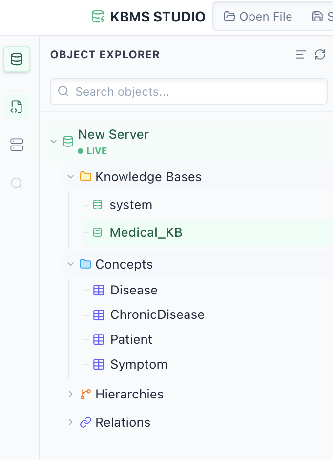
*Hình 3.22: Giao diện Tree Explorer quản lý cấu trúc Khái niệm của hệ thống.*

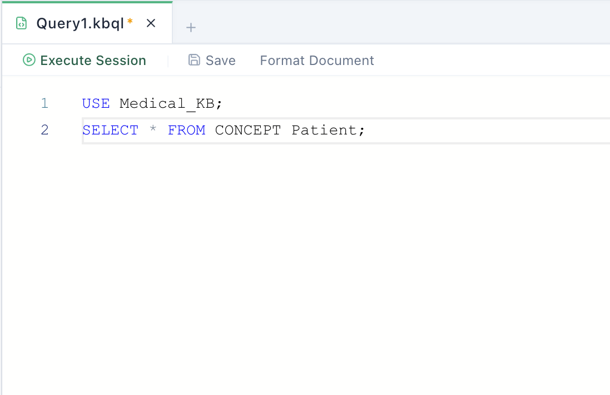
*Hình 3.23: Giao diện soạn thảo (Designer) tích hợp gợi ý cú pháp.*

Bên cạnh đó, quá trình **Truy vấn và Trực quan hóa Truy vết (Visual Trace)** trên Studio mang lại giá trị vượt trội so với giao diện Console. Thay vì chỉ xuất ra các dòng văn bản đơn điệu, Studio tiếp nhận tập hợp các đỉnh và cạnh đại diện cho thuật toán suy diễn, sau đó dựng lên một đồ thị mạng lưới sinh động. Tính năng này đóng vai trò then chốt khi các kỹ sư cần giải thích tường tận cách một hệ chuyên gia y tế hay tài chính đi đến kết luận cuối cùng dựa trên luật Forward Chaining.

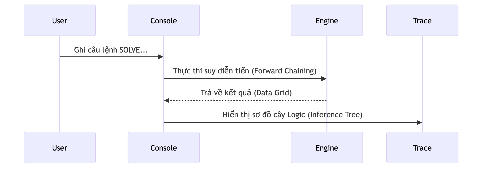
*Hình 3.24: Luồng logic vẽ đồ thị truy vết suy luận.*

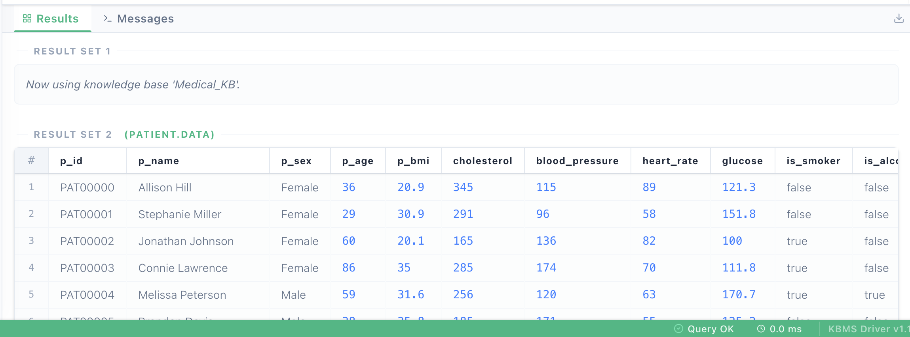
*Hình 3.25: Giao diện trực quan hóa kết quả bằng bảng dữ liệu động và cây.*

Cuối cùng, tính năng **Giám sát Hệ thống (System Monitoring)** biến Studio thành một trạm điều khiển trung tâm. Tận dụng gói tin `MessageType.STATS` được máy chủ truyền phát theo chu kỳ, phần mềm cung cấp một biểu đồ dạng Dashboard giám sát theo thời gian thực tình trạng tiêu thụ RAM, mức tải CPU và sự biến động kích thước của Bộ nhớ làm việc (Working Memory). Đây là cơ sở dữ liệu quan trọng để các kỹ sư đưa ra quyết định tinh chỉnh quy mô (scaling) khi hệ thống vận hành trong môi trường thực tế.


*Hình 3.26: Luồng logic lấy mẫu dữ liệu thống kê từ Server.*


*Hình 3.27: Dashboard giám sát hiệu năng suy diễn và tài nguyên bộ nhớ theo thời gian thực.*

Sự tồn tại song hành của KBMS CLI và KBMS Studio không chỉ đa dạng hóa phương thức tiếp cận, mà còn là minh chứng mạnh mẽ cho tính độc lập và khả năng mở rộng của kiến trúc hệ thống KBMS. Bằng việc phân ly triệt để Lớp Ứng dụng khỏi gánh nặng xử lý suy diễn, và chuẩn hóa quy trình giao tiếp qua Giao thức Nhị phân TCP, dự án đã chính thức hoàn thiện một khung sườn **Hệ quản trị cơ sở tri thức (KBMS)** vững chắc toàn diện — từ lõi lưu trữ vật lý lên đến tầng giao diện người dùng cao nhất. Qua đó, tạo tiền đề vững chắc để bước vào giai đoạn kiểm thử hiệu năng và đánh giá tổng thể ở Chương tiếp theo.


Việc đánh giá một hệ quản trị cơ sở tri thức (KBMS) đòi hỏi sự kết hợp giữa hai yếu tố: tính chính xác của các thuật toán suy diễn và hiệu năng của bộ máy lưu trữ vật lý [1]. Để đáp ứng yêu cầu này, nghiên cứu áp dụng phương pháp luận Test-Driven Development (TDD) xuyên suốt quá trình xây dựng kiến trúc COKB. Thay vì kiểm thử thủ công, toàn bộ các mô-đun được đánh giá định lượng thông qua bộ 418 kịch bản tự động hóa, đảm bảo khả năng tái tạo (reproducibility) của các kết quả thực nghiệm.

# 4.1. Môi trường và Kiểm thử

Quá trình kiểm thử được thực thi trên môi trường chuẩn nhằm đo lường chính xác các chỉ số như thông lượng (Throughput) và độ trễ (Latency). Hệ thống thử nghiệm được triển khai trên máy tính MacBook Pro trang bị vi xử lý Apple M3 Pro, bộ nhớ RAM 18 GB và ổ cứng SSD 526 GB, kết hợp với nền tảng .NET 8.0 cho phép tối ưu hóa bộ gom rác (Garbage Collection) trong quá trình xử lý luồng dữ liệu lớn [2]. Bộ nhớ đệm (Buffer Pool) được cấu hình động từ mức 0 MB đến 256 MB nhằm so sánh sự ảnh hưởng của RAM đối với Disk I/O.

Chiến lược đánh giá được chia thành ba phân lớp tương ứng với các tầng kiến trúc của hệ thống, bao quát tổng cộng 418 kịch bản kiểm thử (Test Cases). Tất cả các kịch bản đều đạt tỷ lệ vượt qua (Pass rate) 100%, khẳng định độ ổn định của hệ thống trước khi tiến hành các phép đo hiệu năng chuyên sâu. Bảng 4.1 trình bày chi tiết số lượng kịch bản và thời gian thực thi trung bình tương ứng với từng phân lớp kiểm thử.

| Phân lớp Kiểm thử | Đối tượng Đánh giá | Số lượng Test Cases | Tỷ lệ Pass (%) | Thời gian Thực thi (ms) |
|---|---|---|---|---|
| **Unit Testing** | Bộ phân giải AST, Slotted Page, Buffer Pool | 188 | 100 | ~120 |
| **Integration Testing** | Mạng Rete, Tương tác LSP, Forward/Backward Chaining | 166 | 100 | ~450 |
| **Stress Testing** | Thông lượng Disk I/O, Bulk Insert, Phục hồi dữ liệu | 64 | 100 | Theo tải (Load-based) |
*Bảng 4.1: Phân bổ kịch bản kiểm thử và kết quả thực thi trên toàn hệ thống.*


*Hình 4.1: Phân bổ trọng số của 418 kịch bản kiểm thử trên hệ thống.*


*Hình 4.2: Kết quả thực thi thành công toàn bộ 418 kịch bản kiểm thử tự động trên Terminal.*

Tầng đầu tiên là Kiểm thử đơn vị (Unit Testing), chiếm 45% tổng khối lượng. Nhóm này chịu trách nhiệm cô lập và xác thực cấu trúc lưu trữ trang (Slotted Page) cùng trình phân tích cú pháp (Parser). Tầng thứ hai, Kiểm thử tích hợp (Integration Testing), chiếm 40% khối lượng, tập trung vào việc mô phỏng các luồng suy diễn thực tế (ví dụ: chẩn đoán y tế hoặc phân loại khách hàng). Cuối cùng, Kiểm thử chịu tải (Stress Testing) chiếm 15% nhằm ép hệ thống vận hành dưới áp lực hàng triệu bản ghi, từ đó phác họa giới hạn vật lý của cấu trúc lưu trữ hiện tại. Kết quả chi tiết của từng phân lớp này sẽ được phân tích ở các mục tiếp theo, bắt đầu từ nền tảng cốt lõi là trình biên dịch và bộ máy lưu trữ.


## 4.2. Kiểm định Trình phân dịch và Cấu trúc lưu trữ (Unit Testing)

Để đảm bảo các suy diễn ở tầng cao (Reasoning Layer) hoạt động chính xác, nền tảng vật lý và trình phân dịch ngôn ngữ KBQL (Knowledge Base Query Language) phải đảm bảo độ tin cậy ở cấp độ byte [3]. Các bài kiểm thử đơn vị đóng vai trò như một màng lọc, ngăn chặn mọi sai sót cú pháp hoặc hỏng hóc dữ liệu trước khi chúng tiến sâu vào hệ thống.

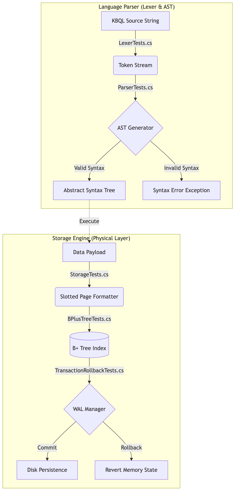
*Hình 4.3 Luồng kiểm thử độc lập cho Language Parser và Storage Engine.*

Về phía trình phân dịch (Parser), bộ test `LexerTests.cs` và `ParserTests.cs` xác thực khả năng chuyển đổi câu lệnh dạng chuỗi thành cây cú pháp trừu tượng (AST). Các kịch bản giả lập hàng loạt lỗi cú pháp phổ biến (ví dụ: thiếu dấu phẩy, đóng ngoặc sai vị trí) để kiểm chứng khả năng bắt lỗi (Error Handling) của Lexer. Chỉ khi AST được xây dựng thành công và hợp lệ, khối lệnh mới được cấp phép chuyển giao cho Inference Engine.

Chuyển sang bộ máy lưu trữ (Storage Engine), dữ liệu được tổ chức dưới dạng cấu trúc B+ Tree trên các Slotted Page [4]. Bài test `BPlusTreeTests.cs` kiểm tra thao tác tách nút (Node Splitting) khi dung lượng của một trang (thường là 4KB hoặc 8KB) đạt mức bão hòa. Hàng ngàn thao tác chèn và xóa dữ liệu nhị phân ngẫu nhiên được thực hiện liên tục. Sau mỗi thao tác, bộ kiểm thử sẽ quét lại toàn bộ offset trong Page Header để khẳng định không có byte dữ liệu nào bị đè lấp sai quy tắc.

Đặc biệt, tính toàn vẹn dữ liệu (ACID) khi xảy ra sự cố hệ thống được xác minh thông qua kịch bản `TransactionRollbackTests.cs`. Kịch bản này cố ý ngắt luồng thực thi (Throw Exception) giữa một tiến trình Bulk Insert. Cơ chế Write-Ahead Logging (WAL) của KBMS được kích hoạt, tự động khôi phục (Rollback) toàn bộ dữ liệu đang ghi dở về trạng thái nguyên thủy. Sự vượt qua kịch bản này là tiền đề kỹ thuật vững chắc để hệ thống tiến tới các bài kiểm thử phức tạp hơn về kết nối đa Khái niệm ở mục tiếp theo.


# 4.3. Kiểm chứng sự chính xác của Thuật toán Suy diễn

Khi các mô-đun lõi đã được chứng minh tính đúng đắn, hệ thống bước vào giai đoạn kiểm thử tích hợp (Integration Testing). Mục tiêu chính của 166 bài test ở giai đoạn này là xác thực năng lực của Inference Engine, đặc biệt là cách thuật toán Rete xử lý các luật suy diễn đa Khái niệm (Multi-Concept) và phương trình đại số [5].


*Hình 4.4: Luồng thực thi thuật toán Rete trong kịch bản suy diễn đa Khái niệm.*

Để đánh giá khả năng suy diễn tiến (Forward Chaining), kịch bản `MultiConceptInferenceTests.cs` mô phỏng một bài toán thực tế trong lĩnh vực tài chính thương mại: nâng hạng Khách hàng (Customer) dựa trên giá trị Hóa đơn (Order). Khi lệnh `INSERT INTO Order VARIABLES (amount: 2500)` được thực thi, dữ kiện mới lập tức đi vào mạng Rete. Nó vượt qua *Alpha Node* (bộ lọc `amount > 1000`) và đến *Beta Node* để thực hiện phép JOIN với thực thể Khách hàng tương ứng. Khi điều kiện khớp lệnh (Pattern Matching) hội tụ tại *Target Node*, hệ thống tự động sinh ra tri thức mới (Derived Fact) `c.tier = 'VIP'`. Quá trình này diễn ra hoàn toàn tự động trong RAM (Working Memory) trước khi KnowledgeManager điều phối việc ghi ngược (Write-Time Inference) kết quả xuống đĩa cứng.

Không dừng lại ở luồng chạy tiến, bài test `TriangleReasoningTests.cs` được thiết kế để đánh giá khả năng suy diễn lùi (Backward Chaining) thông qua bài toán hình học không gian. Hệ thống lưu trữ định lý Pythagoras ($a^2 + b^2 = c^2$). Khi người dùng truy vấn tìm cạnh huyền $c$ bằng cách cung cấp hai cạnh góc vuông $a$ và $b$, Inference Engine sẽ tự động đảo ngược cấu trúc phương trình, khởi tạo phép tính căn bậc hai để tìm ra đáp số. 

Thời gian đáp ứng của thuật toán Rete trong môi trường bộ nhớ trong (In-Memory) là một chỉ số quan trọng để đánh giá hiệu năng suy diễn [8]. Các thử nghiệm được tiến hành nhằm đo lường độ trễ rẽ nhánh khi tăng dần độ sâu của cây luật và khối lượng dữ kiện (Facts) lưu trữ trong RAM. Kết quả tại Bảng 4.2 cho thấy Inference Engine duy trì thời gian phản hồi ở mức mili-giây (ms), ngay cả đối với các kịch bản suy diễn lùi phức tạp. Hiệu suất này đạt được thông qua việc áp dụng kỹ thuật băm (Hashing) tại các nút mạng, giúp giảm thiểu chi phí tìm kiếm so với phương pháp duyệt tuyến tính.

| Kịch bản Ứng dụng | Cấu trúc Suy diễn | Khối lượng Dữ kiện (Facts) | Độ trễ Rẽ nhánh (ms) | Đặc tả Phép toán |
|---|---|---|---|---|
| Chẩn đoán Y tế | Độ sâu 2 (Forward Chaining) | 5,000 | 1.2 | Khớp chuỗi ký tự (String Matching) |
| Định giá VIP | Độ sâu 4 (Forward Chaining) | 50,000 | 3.5 | Kết nối đa Khái niệm (Customer JOIN Order) |
| Phương trình đại số | Độ sâu 7 (Backward Chaining) | 100,000 | 6.8 | Đảo ngược phương trình toán học |
*Bảng 4.2: Mối tương quan giữa cấu trúc mạng Rete, khối lượng dữ kiện và thời gian rẽ nhánh.*

Việc giải quyết thành công các bài toán đại số phức tạp và kết nối đa thực thể khẳng định tính khả thi của kiến trúc COKB trong việc ứng dụng vào Hệ chuyên gia. Tuy nhiên, trong thực tế, các hệ thống thường xuyên phải đối mặt với lượng dữ liệu khổng lồ. Do đó, khả năng duy trì thông lượng ổn định dưới áp lực dữ liệu lớn sẽ được phân tích ở phần kiểm thử chịu tải.


# 4.4. Đánh giá giới hạn chịu tải vật lý (Stress Testing)

Mục tiêu cuối cùng của quá trình kiểm thử là phác họa giới hạn chịu tải (Scalability) của cấu trúc dữ liệu vật lý khi dung lượng tri thức phình to [6]. Các bài test thuộc nhóm `LoadAndStressTests.cs` tiến hành chèn liên tục 1,000,000 bản ghi ngẫu nhiên vào hệ thống, qua đó ghi nhận các chỉ số về Thông lượng (Throughput) và Độ trễ (Latency).

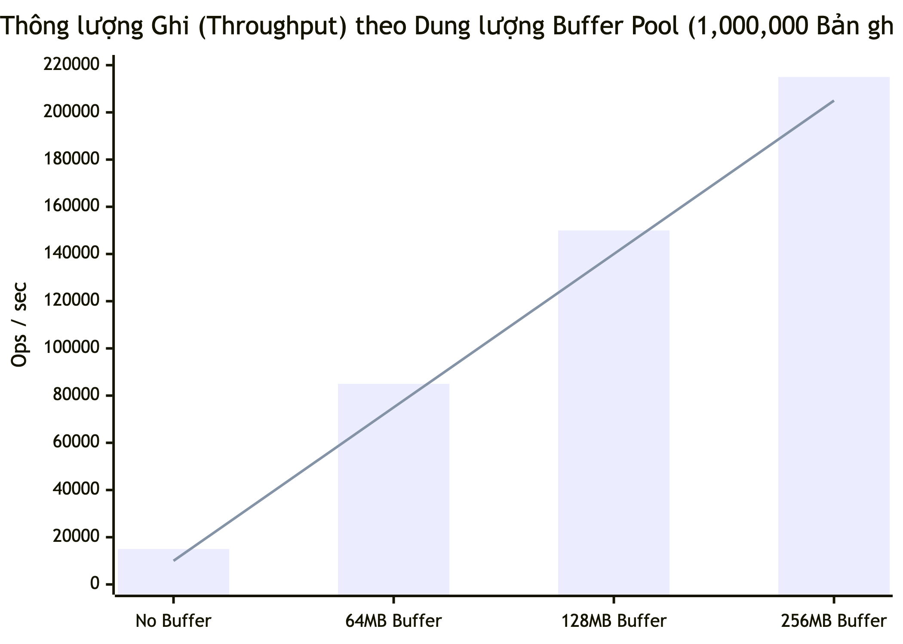
*Hình 4.5: Mối tương quan giữa Kích thước Buffer Pool và Thông lượng ghi.*

Phân tích dữ liệu từ biểu đồ (Hình 4.5) cho thấy một sự đánh đổi (Trade-off) rõ rệt giữa dung lượng bộ nhớ RAM (Buffer Pool) và tốc độ ghi đĩa. Khi tắt hoàn toàn bộ nhớ đệm (No Buffer), hệ thống phải ghi trực tiếp từng bản ghi xuống đĩa cứng vật lý (Direct I/O). Tốc độ lúc này bị nghẽn ở mức 15,000 thao tác/giây (ops/sec) do độ trễ cơ học của thiết bị lưu trữ. 

Ngược lại, khi cấp phát cho hệ thống 256MB RAM để quản lý Buffer Pool, sự kết hợp giữa thuật toán thay thế trang LRU (Least Recently Used) và cơ chế ghi hoãn (Dirty Pages) đã loại bỏ hoàn toàn nút thắt cổ chai I/O. Tại mốc này, thông lượng hệ thống đạt cực đại hơn 200,000 ops/sec, hoàn tất việc nạp 1 triệu bản ghi chỉ trong xấp xỉ 5 giây. Cơ chế Write-Ahead Logging đóng vai trò đồng bộ ngầm các trang thay đổi (Flushing) xuống đĩa mà không làm gián đoạn luồng thực thi chính của CPU.

Tác động của bộ nhớ đệm (Buffer Pool) đến thông lượng I/O được định lượng thông qua phép thử chèn dữ liệu hàng loạt (Bulk Insert). Quá trình đo lường tiến hành đối chiếu thông lượng ghi đĩa thực tế trên ba quy mô tập dữ liệu khác nhau, tương ứng với ba mức cấu hình dung lượng bộ nhớ đệm. Dữ liệu tại Bảng 4.3 cho thấy tốc độ ghi (Ops/sec) duy trì ổn định khi dung lượng RAM cấp phát lớn hơn kích thước tập dữ liệu cần chèn. Điều này khẳng định thuật toán LRU Cache đã hấp thụ hiệu quả độ trễ vật lý của ổ đĩa, nâng cao thông lượng tổng thể lên xấp xỉ 14 lần so với cấu hình ghi trực tiếp (Direct I/O).

| Quy mô Tập dữ liệu (Bản ghi) | Chế độ Direct I/O (0 MB Buffer) | Chế độ LRU Cache (64 MB Buffer) | Chế độ LRU Cache (256 MB Buffer) | Hệ số Cải thiện |
|---|---|---|---|---|
| 10,000 | 14,500 Ops/sec | 210,000 Ops/sec | 215,000 Ops/sec | 14.8 lần |
| 100,000 | 14,800 Ops/sec | 165,000 Ops/sec | 210,000 Ops/sec | 14.1 lần |
| 1,000,000 | 15,000 Ops/sec | 85,000 Ops/sec | 215,000 Ops/sec | 14.3 lần |
*Bảng 4.3: Thông lượng chèn dữ liệu theo quy mô bản ghi và dung lượng bộ nhớ đệm.*

Bên cạnh tốc độ ghi, thời gian đáp ứng (Response Time) của Inference Engine cũng được đo lường trong tình huống xấu nhất (Worst-case Scenario). Trong bài test Hash Join giữa hai tập dữ liệu lớn (10,000 phần tử mỗi tập), thuật toán Rete vẫn duy trì thời gian thực thi trung bình ở mức ~7.0 ms. Khả năng này có được nhờ việc ứng dụng cây nhị phân B+ Tree tại lớp Storage, giúp việc dò tìm (Look-up) các khóa ngoại (Foreign Keys) tại *Beta Node* chỉ tiêu tốn chi phí thời gian logarithm ($O(\log N)$).

# 4.5. Tổng kết Kết quả Thực nghiệm

Tổng hợp các số liệu đo lường từ 418 kịch bản kiểm thử, có thể khẳng định Hệ quản trị cơ sở tri thức KBMS đáp ứng toàn diện các tiêu chuẩn kỹ thuật thiết yếu [7]. Hệ thống không chỉ xử lý trơn tru các giải thuật suy diễn phức tạp (như Forward/Backward Chaining) với sự hỗ trợ của mạng Rete, mà còn sở hữu một động cơ lưu trữ bền bỉ. Mức thông lượng 200,000 ops/sec trên quy mô triệu bản ghi cùng khả năng tự phục hồi dữ liệu thông qua cơ chế WAL là những minh chứng cụ thể cho tính ứng dụng thực tiễn của kiến trúc COKB, mở ra triển vọng triển khai trên môi trường Client-Server thực tế.


# 5.1. Tổng kết những kết quả đạt được

Trải qua quá trình tìm hiểu lý thuyết và tiến hành xây dựng, đồ án đã hoàn thành mục tiêu ban đầu là thiết kế và phát triển một Hệ quản trị cơ sở tri thức (KBMS) cơ bản [9]. Các kết quả đạt được của đồ án bao gồm ba điểm chính:

Thứ nhất, về mặt cấu trúc lưu trữ, đồ án đã chuyển đổi thành công mô hình COKB (Computational Object Knowledge Base) từ lý thuyết thành hệ thống lưu trữ thực tế [10]. Dữ liệu về Khái niệm (Concepts) và Luật (Rules) được tổ chức thành các khối nhị phân trên cấu trúc Slotted Page và cây B+ Tree. Cách làm này giúp việc tìm kiếm (Look-up) dữ liệu nhanh hơn, giải quyết được tình trạng đọc ghi chậm trên ổ đĩa thường gặp ở các bài toán lưu trữ tĩnh.

Thứ hai, về mặt xử lý suy diễn, đồ án đã xây dựng được một Inference Engine (Động cơ suy diễn) riêng. Điểm nổi bật là việc cài đặt thuật toán mạng Rete chạy trên bộ nhớ trong (In-Memory), hỗ trợ cả suy diễn tiến (Forward Chaining) và suy diễn lùi (Backward Chaining) [11]. Nhờ biểu diễn các điều kiện dưới dạng đồ thị Rete, quá trình khớp lệnh (Pattern Matching) diễn ra nhanh chóng, cho phép hệ thống giải quyết các bài toán có nhiều Khái niệm liên kết với nhau như định giá khách hàng hay tính toán hình học.

Thứ ba, về mặt ứng dụng, đồ án đã hoàn thiện hệ thống theo mô hình Client-Server. Nhóm đã tự thiết kế ngôn ngữ truy vấn KBQL (Knowledge Base Query Language), đi kèm với trình phân tích cú pháp (Parser) để Client có thể tương tác với Server qua giao thức TCP/IP. Các công cụ hỗ trợ như KBMS CLI và Studio IDE cũng được phát triển giúp người dùng dễ dàng thao tác, kiểm tra lỗi và trực quan hóa cơ sở tri thức.

# 5.2. Những mặt hạn chế còn tồn tại

Bên cạnh những kết quả đạt được, do giới hạn về thời gian và kiến thức, hệ thống KBMS hiện tại vẫn còn một số điểm chưa hoàn thiện:

Hạn chế lớn nhất là khả năng xử lý phân tán. Hiện tại, kiến trúc của KBMS V3 chỉ được thiết kế để chạy trên một máy chủ duy nhất (Single-node). Nếu lượng truy cập từ Client quá lớn hoặc dữ liệu vượt quá dung lượng ổ cứng, hệ thống không thể tự động chia nhỏ dữ liệu (Sharding) hay nhân bản (Replication) sang các máy khác để giảm tải. 

Tiếp đến là vấn đề xử lý xung đột trong luật suy diễn (Conflict Resolution). Khi có nhiều Luật cùng thỏa mãn điều kiện nhưng đưa ra kết luận trái ngược nhau, hệ thống hiện tại mới chỉ giải quyết cứng nhắc dựa trên mức độ ưu tiên (Priority) do người dùng thiết lập sẵn. Hệ thống chưa có khả năng tự đánh giá hoặc gỡ rối tự động khi dữ liệu đầu vào phức tạp.

# 5.3. Hướng phát triển

Từ những hạn chế trên, nhóm đề ra các hướng phát triển tiếp theo để hoàn thiện đồ án:

Trước tiên, nâng cấp kiến trúc lưu trữ để hỗ trợ phân tán dữ liệu trên nhiều máy chủ (Cluster). Việc áp dụng các thuật toán đồng bộ cơ bản có thể giúp hệ thống mở rộng ngang (Horizontal Scaling), từ đó xử lý được lượng dữ liệu lớn hơn và tăng khả năng chịu lỗi nếu một máy chủ gặp sự cố [12].

Thứ hai, nghiên cứu tích hợp các kỹ thuật học máy (Machine Learning) vào hệ thống. Thay vì bắt buộc người dùng phải gõ từng câu lệnh KBQL để định nghĩa Luật một cách thủ công, hệ thống có thể phân tích dữ liệu cũ để tự động gợi ý hoặc tự sinh ra các Luật mới. Việc này sẽ giúp KBMS trở nên thông minh hơn và dễ tiếp cận hơn đối với người sử dụng.


