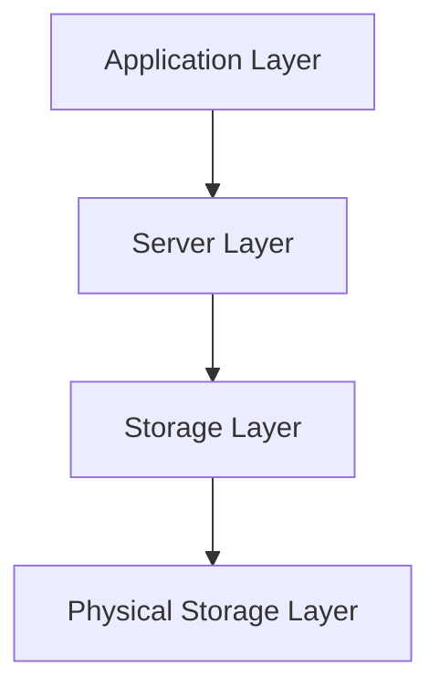

# Tổng Quan Kiến Trúc KBMS (4-Tier Architecture)

Hệ thống KBMS v1.0 được xây dựng dựa trên mô hình kiến trúc 4 tầng hiện đại, giúp tách biệt các trách nhiệm và tối ưu hóa hiệu năng xử lý tri thức.

## 1. Sơ Đồ Kiến Trúc Tổng Thể

### 1.1. Tầng Ứng dụng (Application Layer)
- **CLI Client**: Giao diện dòng lệnh giúp người dùng nhập câu lệnh KBQL.
- **TCP Client**: Đảm nhận việc kết nối và truyền tin qua giao thức TCP/IP tới Server.
- **JSON Protocol**: Dữ liệu được đóng gói dưới dạng JSON để đảm bảo tính linh hoạt.

### 1.2. Tầng Máy chủ (Server Layer - Lõi Xử lý)
- **Connection Manager**: Quản lý các kết nối đồng thời từ nhiều Client.
- **Authentication**: Xác thực người dùng và phân quyền (RBAC).
- **Parser & Lexer**: Dịch câu lệnh KBQL thành cây AST (Abstract Syntax Tree).
- **Reasoning Engine**: Bộ não của hệ thống, thực hiện suy luận Forward/Backward Chaining.
- **Knowledge Manager**: Điều phối các hoạt động giữa tầng Server và tầng Storage.

### 1.3. Tầng Quản lý Lưu trữ (Storage Layer)
- **Buffer Pool (Cache)**: Lưu trữ các đối tượng tri thức trên RAM để truy xuất tức thời.
- **WAL Manager**: Ghi nhận mọi thay đổi vào nhật ký giao dịch (`.klf`) trước khi ghi xuống đĩa.
- **Index Manager**: Quản lý các cây chỉ mục (`.kif`) để tăng tốc độ tìm kiếm.
- **Transaction Manager**: Đảm bảo các giao dịch tuân thủ tính chất ACID (Atomicity, Consistency, Isolation, Durability).

### 1.4. Tầng Lưu trữ Vật lý (Physical Storage Layer)
- **.kmf (Metadata)**: Lưu trữ cấu trúc Concept, Rules, và thông tin CSDL.
- **.kdf (Data)**: Lưu trữ các đối tượng (instances) thực tế.
- **.klf (Log)**: Lưu nhật ký giao dịch để phục hồi sau sự cố.
- **.kif (Index)**: Lưu trữ chỉ mục tăng lực.

---

## 2. Luồng Xử Lý Một Câu Lệnh (Query Workflow)

1.  **Gửi yêu cầu**: Client gửi chuỗi KBQL qua TCP.
2.  **Xác thực**: Server kiểm tra quyền hạn của người dùng đối với CSDL mục tiêu.
3.  **Biên dịch**: Parser xây dựng cây AST từ câu lệnh.
4.  **Tối ưu**: Query Optimizer phân tích xem có thể dùng Index hay không.
5.  **Thực thi & Suy luận**: Reasoning Engine tính toán dữ liệu mới nếu cần.
6.  **Ghi Log (WAL)**: Nếu là lệnh thay đổi dữ liệu, hành động được ghi vào file `.klf`.
7.  **Kết quả**: Server trả về JSON thông báo thành công hoặc dữ liệu kết quả cho Client.

---
*Kiến trúc này đảm bảo KBMS có thể mở rộng lên đến hàng triệu Object mà vẫn giữ được độ trễ thấp.*
