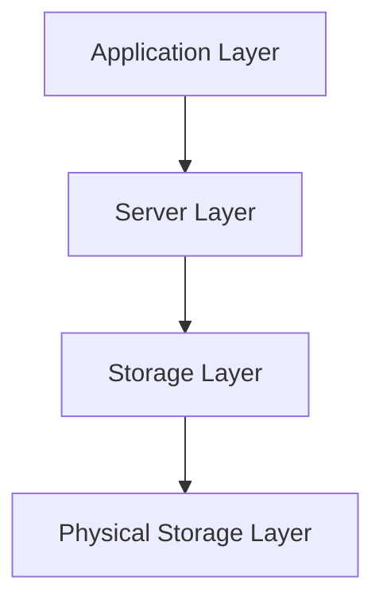

# Tổng Quan Kiến Trúc KBMS (4-Tier Architecture)

Hệ thống KBMS v1.1 được xây dựng dựa trên mô hình kiến trúc 4 tầng hiện đại, tách biệt trách nhiệm và tối ưu hóa hiệu năng xử lý tri thức thông qua giao thức truyền dữ liệu dòng (Streaming).

## 1. Sơ Đồ Kiến Trúc Tổng Thể

### 1.1. Tầng Ứng dụng (Application Layer)
- **CLI Client**: Giao diện dòng lệnh giúp người dùng nhập câu lệnh KBQL.
- **TCP Client**: Đảm nhận việc kết nối và truyền tin qua giao thức TCP/IP tới Server.
- **Message Parser**: Phân tách các Message (METADATA, ROW, RESULT) từ Server và render lên giao diện bảng hoặc card.

### 1.2. Tầng Máy chủ (Server Layer - Lõi Xử lý)
- **Multi-Query Dispatcher**: Tiếp nhận chuỗi câu lệnh cách nhau bởi dấu `;` và điều phối thực thi tuần tự.
- **Parser & Lexer**: Dịch câu lệnh KBQL thành cây AST.
- **Reasoning Engine**: Thực hiện suy luận Forward/Backward Chaining với hệ thống **True Typing** (bảo toàn độ chính xác DECIMAL).
- **Streaming Pipeline**: Chuyển đổi kết quả từ Knowledge Manager thành luồng ROW gửi về Client ngay lập tức.

### 1.3. Tầng Quản lý Lưu trữ (Storage Layer)
- **Buffer Pool (Cache)**: Lưu trữ các đối tượng tri thức trên RAM để truy xuất tức thời.
- **WAL Manager**: Ghi nhận mọi thay đổi vào nhật ký giao dịch trước khi ghi xuống đĩa.
- **Index Manager**: Quản lý các cây chỉ mục (.kif) để tăng tốc độ tìm kiếm.
- **Transaction Manager**: Đảm bảo các giao dịch tuân thủ tính chất ACID.

### 1.4. Tầng Lưu trữ Vật lý (Physical Storage Layer)
- **.kmf (Metadata)**: Lưu trữ cấu trúc Concept, Rules, và thông tin CSDL.
- **.kdf (Data)**: Lưu trữ các đối tượng (instances) thực tế.
- **.klf (Log)**: Lưu nhật ký giao dịch để phục hồi sau sự cố.

---

## 2. Luồng Xử Lý Một Câu Lệnh (Query Workflow)

1.  **Gửi yêu cầu**: Client gửi một hoặc nhiều câu lệnh KBQL qua TCP.
2.  **Biên dịch**: Parser xây dựng cây AST. Nếu là nhiều lệnh, chúng được đưa vào hàng đợi thực thi.
3.  **Thực thi**:
    - Đối với lệnh thay đổi (INSERT, CREATE): Ghi log WAL và trả về thông báo thành công (`RESULT`).
    - Đối với lệnh truy vấn (SELECT, SHOW, DESCRIBE):
        - Gửi `METADATA` mô tả các cột và kiểu dữ liệu chuẩn (INT, DECIMAL, STRING...).
        - Stream từng `ROW` dữ liệu từ Buffer Pool/Disk về Client.
        - Gửi `FETCH_DONE` khi kết thúc.
4.  **Dừng khi lỗi (Stop on Error)**: Nếu một lệnh trong chuỗi bị lỗi, Server sẽ gửi `ERROR` và dừng toàn bộ quá trình xử lý batch.

---
*Kiến trúc v1.1 đảm bảo tính toàn vẹn dữ liệu cực cao và khả năng phản hồi tức thời cho các truy vấn dữ liệu lớn.*
