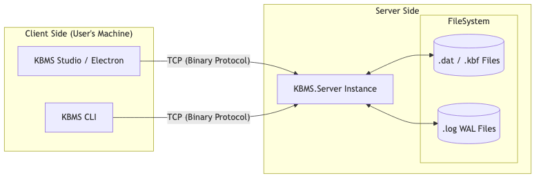

Để đưa KBMS vào môi trường sản xuất (Production), bạn cần thực hiện các bước triển khai tiêu chuẩn và tối ưu hóa các tham số cấu hình để đạt hiệu suất cao nhất.

## 1. Mô hình Triển khai (Deployment Topology)

Sơ đồ dưới đây mô tả cách các thành phần của KBMS tương tác trong một môi trường thực tế:


*Hình: diagram_70718088.png*

---

## 1. Container hóa với Docker

Sử dụng Docker giúp KBMS chạy ổn định và nhất quán trên mọi môi trường.

### Dockerfile Mẫu
```dockerfile
FROM mcr.microsoft.com/dotnet/sdk:6.0 AS build
WORKDIR /app

# Copy and build components
COPY . .
RUN dotnet publish KBMS.Server/KBMS.Server.csproj -c Release -o /out

# Runtime image
FROM mcr.microsoft.com/dotnet/aspnet:6.0
WORKDIR /app
COPY --from=build /out .

# Expose connection port
EXPOSE 3307

# Start KBMS Server
ENTRYPOINT ["dotnet", "KBMS.Server.dll"]
```

---

## 2. Tối ưu hóa cấu hình (kbms.ini Tuning)

File `kbms.ini` chứa các tham số quan trọng ảnh hưởng trực tiếp đến hiệu năng và độ ổn định của hệ thống.

### Các tham số quan trọng:

*   **max_connections (Mặc định: 100):** 
    *   Tăng giá trị này nếu bạn có nhiều Client (Studio/CLI) kết nối cùng lúc. 
    *   *Khuyến nghị:* 250 cho các hệ thống trung bình.
*   **default_timeout (Mặc định: 60s):** 
    *   Thời gian tối đa cho một phiên suy diễn. 
    *   *Tuning:* Tăng lên 120s nếu bài toán có tập luật (Rules) cực kỳ phức tạp.
*   **enable_audit_logs (true/false):** 
    *   Bật nhật ký kiểm toán giúp truy vết hành động nhưng sẽ làm chậm I/O.
    *   *Tuning:* Chuyển về `false` trong môi trường High-Performance nếu không cần thiết.

---

## 3. Bảo mật khóa Master (Master Key Security)

Tham số `master_key` trong `kbms.ini` được sử dụng cho thuật toán mã hóa AES-256 trên đĩa cứng.

> [!CAUTION]
> **CẢNH BÁO QUAN TRỌNG:**
> Nếu bạn thay đổi `master_key` sau khi đã có dữ liệu, toàn bộ các tệp `.dat` và `.kbf` sẽ trở nên **không thể đọc được**. Hãy sao lưu khóa này ở một nơi an toàn (như Vault hoặc Password Manager).

---

## 4. Khuyến nghị Phần cứng (Hardware Recommendation)

Dựa trên các bài kiểm tra hiệu năng, chúng tôi khuyến nghị cấu hình sau cho server KBMS:

| Thành phần | Cấu hình đề nghị | Lý do |
| :--- | :--- | :--- |
| **CPU** | 4 Cores+ | Xử lý song song các yêu cầu Network và Parsing. |
| **RAM** | 4GB - 8GB | Đảm bảo Buffer Pool có đủ không gian để cache các trang B+ Tree nóng. |
| **Disk** | SSD / NVMe | Giảm thiểu độ trễ khi ghi nhật ký WAL và trích xuất dữ liệu. |
