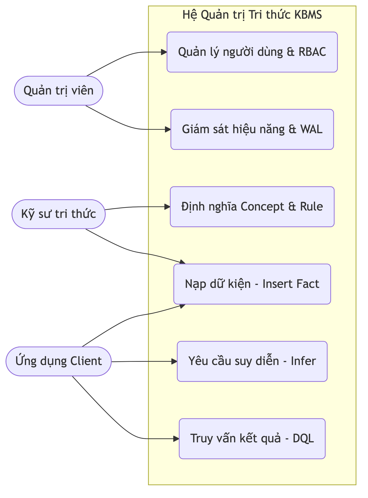
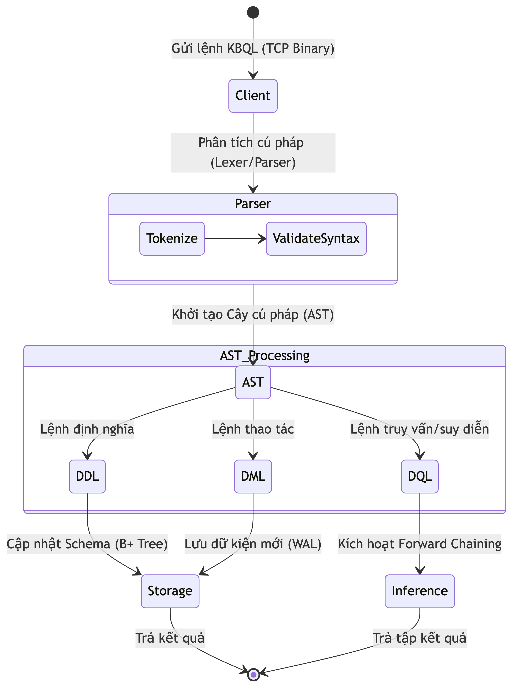

# 2.1. Phân tích và Đặc tả Yêu cầu Hệ thống

Để chuyển hóa mô hình lý thuyết COKB thành một hệ thống thực tiễn, việc xây dựng một bộ máy quản trị chuyên biệt là điều bắt buộc. Hệ thống phần mềm này không chỉ đảm nhiệm việc lưu giữ cấu trúc toán học của các đối tượng mà còn phải cung cấp môi trường thực thi cho các tác vụ tính toán. Từ góc độ phân tích bài toán, yêu cầu cốt lõi của hệ quản trị tri thức được chia thành hai nhóm chính: yêu cầu chức năng và yêu cầu phi chức năng.

Về mặt chức năng, hệ thống phải cung cấp công cụ để người dùng định nghĩa khái niệm (Concept), xây dựng tập luật (Rules) và nạp dữ kiện đầu vào (Facts). Tiếp đó, trung tâm của hệ thống là bộ máy suy diễn (Inference Engine) hoạt động theo cơ chế Forward Chaining. Khi nhận được dữ kiện đầu vào — ví dụ như độ dài ba cạnh của một tam giác — hệ thống tự động kích hoạt các phương trình toán học tương ứng để suy ra các dữ kiện mới (diện tích, bán kính đường tròn). Cuối cùng, để phục vụ môi trường đa người dùng, cơ chế phân quyền RBAC (Role-Based Access Control) phải được áp dụng để đảm bảo chỉ những kỹ sư được cấp quyền mới có thể thay đổi tập luật của hệ thống [7].

Về mặt phi chức năng, hệ thống phải đáp ứng khả năng chịu tải và tính toàn vẹn dữ liệu. Yêu cầu này bắt buộc kiến trúc lưu trữ phải sử dụng cơ chế cấp phát trang (Slotted Page) kết hợp với cấu trúc B+ Tree để tối ưu hóa truy xuất. Đồng thời, mọi thay đổi trên cơ sở tri thức phải được bảo vệ khỏi sự cố thông qua cơ chế ghi nhật ký trước (WAL - Write-Ahead Logging) [5]. Hệ thống cũng phải tuân thủ mô hình Client-Server, sử dụng kết nối TCP Binary để đảm bảo độ trễ thấp nhất trong quá trình giao tiếp giữa ứng dụng máy khách và máy chủ.

Nhằm trực quan hóa sự tương tác giữa các nhóm người dùng và các nhóm chức năng vừa phân tích, Sơ đồ Use Case tổng quát của hệ thống được mô tả trong Hình 2.1.

*Hình 2.1: Sơ đồ Use Case tổng quát phân định quyền hạn và tương tác của các nhóm người dùng.*

Sơ đồ trên cho thấy, trong khi quản trị viên tập trung vào các nghiệp vụ cấu hình hệ thống, thì Kỹ sư tri thức và Ứng dụng Client cần một phương thức chung để giao tiếp với lõi suy diễn. Điều này đặt ra yêu cầu phải thiết kế một ngôn ngữ truy vấn riêng biệt cho hệ thống.

# 2.2. Phân tích và Đặc tả Ngôn ngữ KBQL

Các ngôn ngữ truy vấn truyền thống như SQL chỉ phù hợp để thao tác trên dữ liệu quan hệ có cấu trúc tĩnh. Ngược lại, ngôn ngữ dùng trong các hệ chuyên gia hiện có (như Prolog hay CycL) lại mang nặng tính logic hình thức, gây khó khăn cho việc biểu diễn các phương trình toán học phức tạp [1], [6]. Để giải quyết bài toán này, hệ thống đề xuất ngôn ngữ KBQL (Knowledge Base Query Language).

Ngôn ngữ KBQL được thiết kế bao gồm ba nhóm lệnh cơ bản. Nhóm lệnh định nghĩa (DDL) dùng để khai báo cấu trúc của một khái niệm mới; ví dụ, lệnh `CREATE CONCEPT Triangle` sẽ định nghĩa các thuộc tính và tập luật toán học của hình tam giác. Nhóm lệnh thao tác (DML) được dùng để nạp các dữ kiện cụ thể vào bộ nhớ, chẳng hạn `INSERT FACT Triangle (a=3, b=4, c=5)`. Cuối cùng, nhóm lệnh truy vấn suy diễn (DQL) được sử dụng khi Ứng dụng Client gửi yêu cầu tính toán, ví dụ lệnh `SOLVE` sẽ buộc hệ thống chạy bộ máy suy diễn để tìm ra kết quả cuối cùng.

Luồng thực thi vòng đời của một câu lệnh KBQL từ lúc được Client gửi đi cho đến khi nhận lại kết quả được mô tả chi tiết trong Hình 2.2.

*Hình 2.2: Sơ đồ hoạt động (Activity Diagram) luồng phân tích và thực thi câu lệnh KBQL.*

Như được minh họa trong luồng xử lý trên, khi lệnh KBQL đi qua bộ phân tích cú pháp (Parser), kết quả đầu ra là một Cây cú pháp trừu tượng (AST). Cây AST này mang trong mình thông tin về các thực thể cấu trúc tri thức. Vấn đề đặt ra tiếp theo là làm thế nào để ánh xạ cây AST này vào các đối tượng dữ liệu trong bộ nhớ máy tính.

# 2.3. Phân tích Mô hình Thực thể và Tổ chức Dữ liệu

Dựa trên mô hình toán học của COKB, tri thức được cấu thành từ sáu thành phần cơ bản: Tập khái niệm (C), Hệ phân cấp (H), Tập quan hệ (R), Tập toán tử (Ops), Tập hàm (Funcs) và Tập luật (Rules) [2]. Để lưu trữ khối tri thức này trên máy tính, chúng tôi tiến hành ánh xạ các thành phần toán học thành một mô hình lớp (Class Model) trong lập trình hướng đối tượng.

Mô hình thực thể lấy đối tượng Concept làm trung tâm. Mỗi Concept tương ứng với một không gian khái niệm độc lập (ví dụ: hình học phẳng, chẩn đoán y khoa). Bên trong một Concept chứa danh sách các Attribute (thuộc tính), Function (hàm tính toán rời rạc) và Rule (tập luật). Đặc biệt, thành phần Rule chứa điều kiện kích hoạt (LHS) và hành động thực thi (RHS). Khi ánh xạ vào bộ nhớ vật lý, các thực thể này không nằm rời rạc mà được đóng gói thành các cấu trúc nhị phân và ghi xuống đĩa cứng qua sự quản lý của Buffer Pool [10].

Cấu trúc phân cấp và mối quan hệ giữa các thực thể phần mềm cấu thành nên cơ sở tri thức được thể hiện qua Sơ đồ Lớp ở Hình 2.3.

*Hình 2.3: Sơ đồ Lớp (Class Diagram) ánh xạ mô hình toán học COKB thành cấu trúc dữ liệu.*

Khi hệ thống đã có đầy đủ cấu trúc dữ liệu (Concept, Rule) được lưu trong Storage và một tập dữ kiện đầu vào (Fact) từ lệnh DML, bước cuối cùng trong quá trình phân tích bài toán là làm sao để kích hoạt các Rule này một cách hiệu quả để tạo ra tri thức mới.

# 2.4. Phân tích Luồng Suy diễn tự động

Thay vì duyệt qua toàn bộ tập luật mỗi khi có một dữ kiện mới xuất hiện — một phương pháp gây lãng phí tài nguyên và không thể mở rộng khi số lượng luật lên tới hàng ngàn — hệ thống yêu cầu một cơ chế đối sánh mẫu (Pattern Matching) hướng sự kiện. Dựa trên phân tích từ các hệ thống chuyên gia đi trước, giải pháp được chọn là tích hợp mạng Rete (Rete Network) vào trung tâm của bộ máy suy diễn [4], [9].

Theo cơ chế Forward Chaining, khi một dữ kiện mới đi vào vùng nhớ làm việc (Working Memory), nó sẽ tự động chạy qua các bộ lọc của mạng Rete (bao gồm Alpha Network để lọc thuộc tính đơn lẻ và Beta Network để kết hợp các điều kiện). Nếu một Rule thỏa mãn toàn bộ điều kiện đầu vào, nó sẽ được đưa vào hàng đợi (Agenda). Khi Rule được thực thi (Fire), các phương trình toán học sẽ được tính toán để sinh ra dữ kiện mới. Dữ kiện mới này lại tiếp tục được đẩy ngược vào Working Memory để vòng lặp tiếp tục, cho đến khi không còn Rule nào có thể kích hoạt (trạng thái F-Closure).

Toàn bộ quy trình điều phối và luồng luân chuyển dữ kiện trong bộ máy suy diễn tiến được trực quan hóa ở Hình 2.4.

*Hình 2.4: Sơ đồ luồng dữ liệu (Data Flow) của cơ chế suy diễn tiến dựa trên mạng Rete.*

Qua việc phân tích chi tiết từ yêu cầu hệ thống, đặc tả ngôn ngữ, thiết kế cấu trúc dữ liệu cho đến quy trình suy diễn, kiến trúc tổng quát của KBMS đã được định hình rõ ràng. Việc triển khai các phân hệ kỹ thuật cụ thể để đáp ứng các phân tích này sẽ được trình bày chi tiết ở chương tiếp theo.
