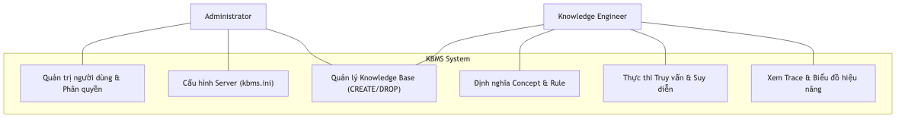

# Kiến trúc Hệ thống (System Architecture)

KBMS được thiết kế theo kiến trúc phân tầng (Layered Architecture) nhằm tách biệt rõ ràng giữa việc giao tiếp, xử lý ngôn ngữ, suy diễn tri thức và lưu trữ dữ liệu.

## 1. Luồng Dữ liệu Tổng quát (Data Flow)

Mọi yêu cầu từ người dùng đều đi qua một chu trình khép kín giữa các thành phần:

1.  **Client Layer (Studio/CLI):** Người dùng nhập câu lệnh KBQL.
2.  **Network Layer:** Đóng gói câu lệnh vào Binary Packet và gửi qua TCP.
3.  **Server Layer:** Tiếp nhận kết nối, xác thực và điều phối (Orchestration).
4.  **Parser Layer:** Phân tích cú pháp câu lệnh thành cây AST.
5.  **Reasoning/Execution Layer:** Lập kế hoạch thực thi, gọi bộ máy suy diễn nếu cần thiết.
6.  **Storage Layer:** Truy xuất hoặc cập nhật dữ liệu xuống đĩa cứng thông qua B+ Tree.
7.  **Response:** Kết quả được đóng gói ngược lại và trả về cho Client.

---

## 2. Các Tầng Kiến trúc Chính

### Tầng Giao tiếp (Communication Layer)
Chịu trách nhiệm duy trì kết nối ổn định và truyền tải thông điệp giữa Client và Server. Tầng này đảm bảo tính toàn vẹn của dữ liệu thông qua giao thức Binary tùy chỉnh.

### Tầng Xử lý Ngôn ngữ (Language Processing Layer)
Sử dụng bộ Parser mạnh mẽ để hiểu mã KBQL. Tầng này không chỉ kiểm tra cú pháp mà còn đảm bảo các tham chiếu đến Khái niệm (Concept) và Biến (Variable) là hợp lệ về mặt ngữ nghĩa.

### Tầng Tri thức và Suy diễn (Knowledge & Reasoning Layer)
Được coi là "bộ não" của hệ thống. Đây là nơi chứa các thuật toán suy diễn tiến/lùi và các bộ giải phương trình toán học. Tầng này biến đổi các dữ liệu thô thành thông tin có ý nghĩa logic.

### Tầng Lưu trữ (Storage Layer)
Đảm bảo tính bền vững (Durability) của tri thức. Sử dụng các kỹ thuật tiên tiến như Buffer Pool, WAL và Indexing để đạt hiệu suất tương đương với các hệ quản trị CSDL công nghiệp.

---

## 3. Sơ đồ Use Case Hệ thống

Sơ đồ này mô tả các tương tác của các tác nhân (Actors) đối với hệ thống KBMS:

*Hình: 3. Sơ đồ Use Case Hệ thống*

---

## 4. Sơ đồ Thực thi Phân tầng (Layered Execution)

Mô tả sự tương tác giữa các tầng kiến trúc trong một chu kỳ xử lý:

*Hình: diagram_27597dc8.png*
