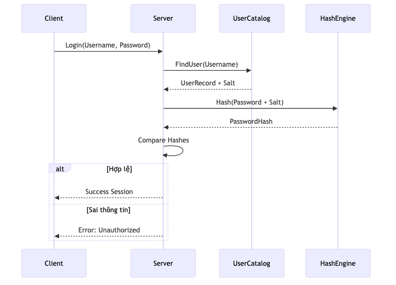

# Bảo mật & Quản lý Người dùng

Hệ quản trị KBMS tích hợp sẵn các tính năng bảo mật để bảo vệ tri thức và kiểm soát quyền truy cập của người dùng đối với các Cơ sở Tri thức (KB).

## 1. Cơ chế Xác thực (Authentication)

KBMS sử dụng cơ chế băm mật khẩu (Password Hashing) để đảm bảo an toàn cho thông tin đăng nhập.

### Luồng Xác thực (Authentication Flow)

*Hình: diagram_d1119335.png*

---

## 2. Phân quyền dựa trên Vai trò (Role-Based Access Control - RBAC)

Mỗi người dùng trong KBMS được gán một trong hai vai trò chính:

| Vai trò | Quyền hạn |
| :--- | :--- |
| **ROOT** (System Admin) | Có toàn quyền trên hệ thống, bao gồm tạo/xóa người dùng, quản trị tất cả các KB. |
| **USER** | Chỉ có quyền thao tác trên các KB mà họ được cấp phép. |

---

## 3. Đặc quyền trên Knowledge Base (Privileges)

KBMS cho phép phân quyền chi tiết cho từng người dùng trên mỗi KB cụ thể:

*   **READ:** Cho phép người dùng thực hiện các lệnh `SELECT`, `INFER`, `ASK`.
*   **WRITE:** Bao gồm quyền `READ` và cho phép thực hiện `INSERT`, `UPDATE`, `DELETE`.
*   **ADMIN:** Có toàn quyền quản trị đối với KB đó (bao gồm `DROP CONCEPT`, `CREATE RULE`).

---

## 4. Quản lý Người dùng qua CLI/Studio

Người dùng có quyền **ROOT** có thể quản lý danh sách người dùng thông qua các lệnh hệ thống (hoặc giao diện Studio):

*   **Tạo người dùng:** `CREATE USER 'username' IDENTIFIED BY 'password' WITH ROLE 'USER';`
*   **Cấp quyền:** `GRANT PRIVILEGE 'READ' ON KB 'MedicalKB' TO 'username';`
*   **Thu hồi quyền:** `REVOKE PRIVILEGE ON KB 'MedicalKB' FROM 'username';`

---

## 5. Lưu trữ User Catalog

Tất cả thông tin người dùng được lưu trữ bền vững trong một tập tin hệ thống đặc biệt (`system:users`). Cấu trúc này được quản lý bởi `UserCatalog`, một thành phần của Storage Layer, để đảm bảo việc đăng nhập và kiểm tra quyền được thực hiện nhanh nhất.
