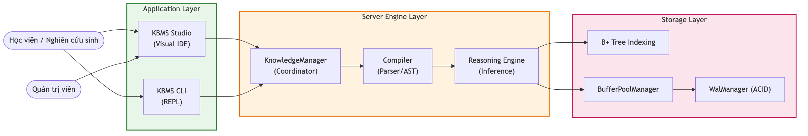
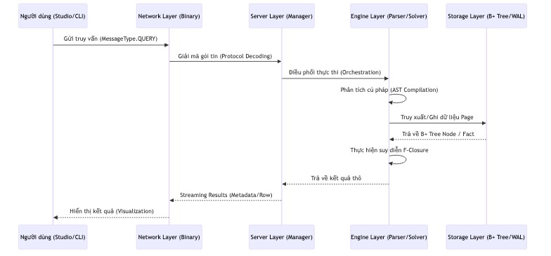

# 03.3. Sơ đồ Hoạt động Tổng quát

Tài liệu này trình bày cái nhìn tổng quan về cách các thành phần tương tác và luồng dữ liệu xuyên suốt 4 tầng kiến trúc của [KBMS](../00-glossary/01-glossary.md#kbms).

## 1. Sơ đồ Use Case Tổng quát

Mô tả sự tương tác giữa các tác nhân bên ngoài và các dịch vụ lõi của hệ thống:

*Hình 3.1: Sơ đồ Use Case tổng quát sự tương tác giữa người dùng và các dịch vụ lõi.*

*   **Interaction**: Người dùng tương tác thông qua hai môi trường ([CLI](../00-glossary/01-glossary.md#cli)/Studio).
*   **Service Core**: Các yêu cầu được gửi tới Server để kích hoạt bộ suy diễn (RE), quản lý dữ liệu ([KDL](../00-glossary/01-glossary.md#kdl)) hoặc bảo trì ([KML](../00-glossary/01-glossary.md#kml)).

## 2. Sơ đồ Sequence Hệ thống

Mô tả luồng "sinh mệnh" của một yêu cầu từ khi xuất phát tại App Layer cho tới khi được lưu trữ bền vững tại Storage Layer:

*Hình 3.2: Sơ đồ Sequence mô tả luồng sinh mệnh của một yêu cầu trong hệ thống.*

### Các giai đoạn chính:
1.  **Request Stage**: App đóng gói yêu cầu nhị phân và gửi qua Network.
2.  **Computing Stage**: 
    - **Parsing**: Server điều phối [Parser](../00-glossary/01-glossary.md#parser) để xây dựng cây cú pháp trừu tượng ([AST](../00-glossary/01-glossary.md#ast)).
    - **Optimization**: [Query Optimizer](../00-glossary/01-glossary.md#query-optimizer) phân tích [AST](../00-glossary/01-glossary.md#ast) và lược đồ hệ thống để thiết lập **[Execution Plan](../00-glossary/01-glossary.md#execution-plan)** tối ưu dựa trên mô hình chi phí (CBO).
    - **Execution**: Engine thực thi các toán tử vật lý (Scan, Filter, Join) theo mô hình **Volcano**.
3.  **I/O Stage**: Các toán tử tương tác với Storage Layer thông qua hệ thống Paging để truy xuất hoặc biến đổi trang dữ liệu nhị phân.
4.  **Response Stage**: Kết quả được "[Streaming](../00-glossary/01-glossary.md#streaming)" ngược lại cho máy khách theo định dạng [Tuple](../00-glossary/01-glossary.md#tuple) nhị phân để tối ưu hóa băng thông.

- Sự phân tách rõ rệt này giúp hệ thống đạt được hiệu năng cao và dễ dàng bảo trì hoặc mở rộng từng phần độc lập.