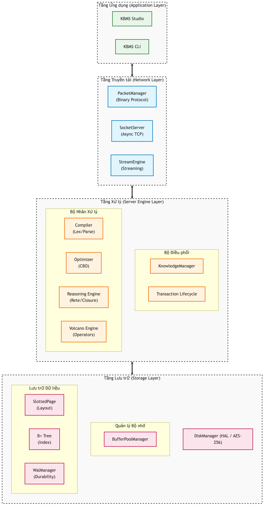

# 03.3. Sơ đồ Hoạt động Tổng quát

Tài liệu này trình bày cấu trúc chi tiết và quy trình vận hành phân tầng của hệ thống KBMS.

## 1. Kiến trúc Hệ thống Chi tiết (Detailed System Architecture)

Hệ thống KBMS được xây dựng dựa trên kiến trúc 4 tầng logic với các module thành phần được thiết kế để hoạt động độc lập và phối hợp chặt chẽ:

*Hình 3.1: Sơ đồ cấu trúc thành phần chi tiết của hệ thống KBMS Server.*

*   **Application Layer**: Cung cấp giao diện tương tác qua KBMS Studio (IDE với Monaco Editor, VGE) và CLI (REPL).
*   **Network Layer**: Quản lý giao thức nhị phân (PacketManager) và luồng dữ liệu (StreamEngine) qua Socket TCP.
*   **Server Engine Layer**: "Bộ não" điều phối (KnowledgeManager), phân tích (Compiler), tối ưu (Optimizer) và thực thi (Reasoning/Volcano Engine).
*   **Storage Layer**: Đảm bảo an toàn dữ liệu qua BufferPool, SlottedPage, B+ Tree và WalManager (ACID).

## 2. Sơ đồ Use Case Hệ thống

Mô tả sự tương tác giữa tác nhân người dùng và các module chức năng chính bên trong hệ thống:

*Hình 3.2: Sơ đồ Use Case tổng quát sự tương tác giữa người dùng và các dịch vụ lõi.*

Quy trình tương tác được chuẩn hóa từ lớp ứng dụng (App Layer) thông qua bộ điều phối (KnowledgeManager) để kích hoạt các dịch vụ tri thức (Compiler/Engine) và lưu trữ bền vững (Storage Layer).

## 3. Sơ đồ Sequence Hệ thống (Request Life Cycle)

Mô tả luồng "sinh mệnh" (Life cycle) của một yêu cầu truy vấn tri thức, từ khi xuất phát tại lớp ứng dụng cho tới khi được lưu trữ và phản hồi:

*Hình 3.3: Sơ đồ Sequence mô tả quy trình xử lý yêu cầu phân tầng trong KBMS V3.*

### 3.1. Các giai đoạn xử lý kĩ thuật:

1.  **Giai đoạn Tiếp nhận (Request Stage)**: Ứng dụng khách tuần tự hóa câu lệnh KBQL thành gói tin nhị phân và gửi qua Custom Binary Protocol.
2.  **Giai đoạn Tính toán & Suy diễn (Computing Stage)**: 
    - **Parsing**: Chuyển đổi byte stream thành AST thông qua Compiler.
    - **Optimization**: Áp dụng mô hình **CBO** để thiết lập kế hoạch thực thi tối ưu.
    - **Execution Engine**: Vận hành toán tử theo mô hình **Volcano Iterator** và bộ máy suy diễn Rete.
3.  **Giai đoạn Tương tác Lưu trữ (I/O Stage)**: Truy xuất trang dữ liệu qua `BufferPoolManager` và ghi nhật ký **WAL** để đảm bảo tính bền vững ACID.
4.  **Giai đoạn Phản hồi (Response Stage)**: Trả kết quả về client dưới dạng **Data Streaming** nhị phân.