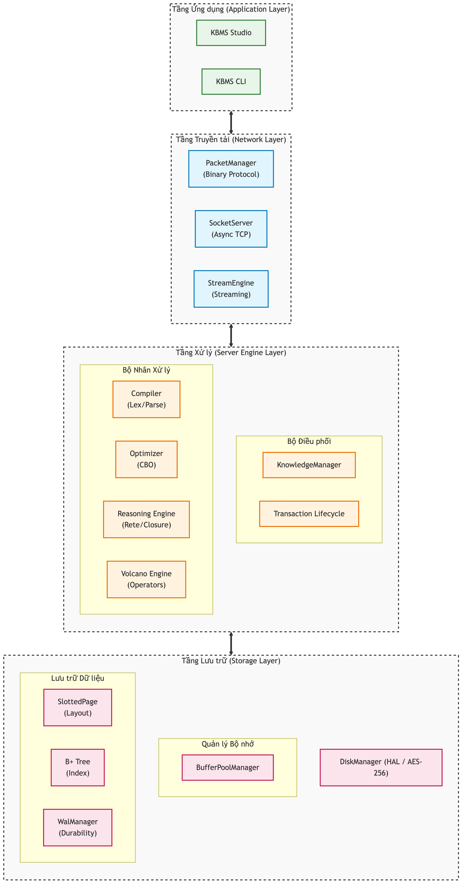

# 3.1. Tổng quan Kiến trúc và Mô hình Điều phối Hệ thống

Việc chuyển đổi từ một mô hình lý thuyết toán học thành một hệ quản trị cơ sở tri thức đòi hỏi một kiến trúc có khả năng phân tách hợp lý giữa nghiệp vụ tính toán và kỹ thuật lưu trữ vật lý. Đối với dự án KBMS, toàn bộ mã nguồn được tổ chức thành một giải pháp bao gồm nhiều tầng như `KBMS.Network`, `KBMS.Parser`, `KBMS.Reasoning` và `KBMS.Storage`. Việc phân rã này không chỉ giúp cô lập các rủi ro phát sinh trong quá trình phát triển, mà còn tạo tiền đề cho việc dễ dàng bảo trì và mở rộng hệ thống theo mô hình phân tán trong tương lai [11].

Dựa trên nguyên tắc chia để trị, hệ thống KBMS được cấu trúc thành nhiều tầng khác nhau. Mối liên kết và vị trí của các lớp này được thể hiện trực quan qua Sơ đồ Kiến trúc Phân lớp ở Hình dưới.

*Hình 3.1: Sơ đồ khối kiến trúc phân lớp chức năng của hệ thống KBMS dựa trên cấu trúc dự án.*

Tầng trên cùng là **Tầng Ứng dụng (Application Layer)**, đóng vai trò là điểm chạm đầu tiên của người dùng thông qua các module như `KBMS.CLI` và `kbms-studio`. Tầng này không chứa bất kỳ logic tính toán tri thức nào, mà chỉ đơn thuần cung cấp các giao diện tương tác (IDE hoặc giao diện dòng lệnh) để kỹ sư tri thức soạn thảo mã nguồn KBQL. Lớp ứng dụng sẽ đóng gói các đoạn mã này thành các yêu cầu mạng và gửi xuống máy chủ.

Ngay phía dưới là **Tầng Mạng (Network Layer)** được quản lý hoàn toàn bởi thư viện `KBMS.Network`. Nhiệm vụ của lớp này là thiết lập kết nối TCP tin cậy (TCP Binary Server) và quản lý vòng đời của các phiên giao dịch (Session). Để giảm thiểu độ trễ, KBMS loại bỏ hoàn toàn các giao thức văn bản cồng kềnh như HTTP/REST, thay vào đó truyền tải trực tiếp các gói tin nhị phân. Mọi dữ liệu đi vào hoặc đi ra đều phải qua khâu tuần tự hóa (Serialization) trước khi được đẩy vào vùng đệm của máy chủ.

Trái tim của hệ thống nằm ở **Tầng Server và Suy diễn (Engine Layer)**, bao gồm sự kết hợp chặt chẽ giữa `KBMS.Parser` và `KBMS.Reasoning`. Tại đây, các lệnh dạng văn bản sẽ được `KBMS.Parser` phân tích từ vựng (Lexer) và ngữ pháp (Grammar) để tạo ra một Cây cú pháp trừu tượng (AST). Sau đó, `KBMS.Reasoning` sẽ tiếp nhận cây AST này. Nếu đó là một lệnh yêu cầu tính toán, bộ máy suy diễn sẽ kích hoạt mạng Rete (Rete Network), thực thi thuật toán suy diễn tiến (Forward Chaining) để đối sánh các luật trên dữ kiện hiện có nhằm tìm ra tri thức mới [4].

Tầng cuối cùng, chịu trách nhiệm lưu giữ sự sống cho toàn bộ tri thức, là **Tầng Lưu trữ (Storage Layer)** thuộc namespace `KBMS.Storage`. Khác với các cơ sở dữ liệu truyền thống, Tầng lưu trữ này được tùy chỉnh cực kỳ tinh vi để tối ưu hóa việc cấp phát bộ nhớ. Nó bao gồm một bộ quản lý trang (`BufferPoolManager`) sử dụng thuật toán thay thế trang LRU Cache. Đĩa cứng vật lý được chia nhỏ thành các trang `SlottedPage` có kích thước chính xác 16KB. Đồng thời, quá trình tìm kiếm được tăng tốc bằng cơ chế chỉ mục `BPlusTree` dựa trên các khóa định danh toàn cục (`Guid`). Đặc biệt, để đảm bảo tính an toàn dữ liệu tuyệt đối khi mất điện, module `WalManagerV3` sẽ liên tục ghi lưu nhật ký theo chu kỳ 1 giây/lần.

Sự tương tác giữa bốn lớp này không diễn ra rời rạc mà tuân theo một quy trình điều phối tuyến tính và nghiêm ngặt. Khi một ứng dụng bên ngoài gửi một yêu cầu truy vấn, dữ liệu sẽ chảy qua từng thành phần, kích hoạt các xử lý tuần tự cho đến khi trả về tập kết quả cuối cùng. Luồng dữ liệu điều phối này được mô phỏng chi tiết trong Hình 3.2.

*Hình 3.2: Sơ đồ tuần tự (Sequence Diagram) phản ánh luồng thực thi mã nguồn giữa các module.*

Nhìn vào sơ đồ tuần tự trên, có thể thấy điểm mấu chốt quyết định tính đúng đắn của toàn bộ chu trình nằm ở sự kết hợp giữa thuật toán phân tích cú pháp (Parser) và cơ chế đảm bảo an toàn ghi đệm (WAL) trước khi dữ liệu thực sự đi vào vùng xử lý logic của `KBMS.Reasoning`. Với cái nhìn bao quát về kiến trúc này, phần tiếp theo sẽ đi sâu vào kỹ thuật cài đặt của Lớp Lưu trữ — nền móng vật lý của toàn bộ cấu trúc COKB.
