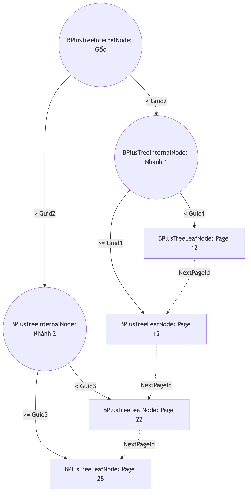

# 3.2. Thiết kế Lớp Lưu trữ (Storage Layer)

Trong hệ quản trị cơ sở tri thức KBMS, bộ nhớ không chỉ lưu trữ các con số mà còn phải chứa đựng các mô hình toán học (COKB), các tập luật (Rules), và đồ thị suy diễn. Vì vậy, hệ thống được thiết kế từ đầu một hệ thống quản lý đĩa cứng riêng biệt trong thư viện `KBMS.Storage`, thay vì phụ thuộc vào Engine có sẵn như SQLite hay InnoDB. Kiến trúc cốt lõi của Lớp Lưu trữ xoay quanh ba cơ chế chính: Slotted Page, B+ Tree, và Write-Ahead Log (WAL).

## 3.2.1. Quản lý không gian đĩa với Slotted Page và Buffer Pool

Mọi thao tác đọc ghi của KBMS không diễn ra trực tiếp trên ổ cứng, mà thông qua một cơ chế bộ nhớ đệm được quản lý bởi class `BufferPoolManager`. Lớp này chịu trách nhiệm nạp dữ liệu từ đĩa lên bộ nhớ (RAM) và áp dụng thuật toán **LRU (Least Recently Used)** để quyết định trang dữ liệu nào sẽ bị đẩy (Evict) khỏi RAM khi bộ nhớ bị đầy.

Khối dữ liệu cơ sở của hệ thống được định nghĩa bởi class `SlottedPage` với kích thước chuẩn xác là **16KB** (16384 bytes). Khác với các hệ thống phân bổ theo dòng, Slotted Page cho phép hệ thống lưu trữ các tuple có độ dài thay đổi cực kỳ hiệu quả, một yêu cầu bắt buộc đối với dữ liệu tri thức.

*Hình 3.3: Cấu trúc bộ nhớ 16KB của một Slotted Page thực tế.*

Nhìn vào mã nguồn `SlottedPage.cs`, mỗi trang dữ liệu luôn bắt đầu bằng một **Header dài 24 bytes**. Header này chứa các siêu dữ liệu cực kỳ quan trọng:
- `PageId` (4 bytes): Định danh duy nhất của trang.
- `Lsn` (4 bytes): Log Sequence Number, dùng để đối chiếu với WAL khi phục hồi sự cố.
- `PrevPageId` và `NextPageId` (8 bytes): Con trỏ liên kết danh sách vòng để tìm kiếm ngang.
- `FreeSpacePointer` (4 bytes): Con trỏ trỏ đến vị trí trống đầu tiên ở cuối trang.
- `TupleCount` (4 bytes): Tổng số lượng bản ghi (Slot) đang tồn tại.

Phía sau Header là một mảng **Slot Array**, mỗi Slot tốn 8 bytes (4 bytes lưu vị trí offset, 4 bytes lưu độ dài length). Trong khi mảng Slot phát triển từ trên xuống, thì dữ liệu thực sự (Record Tuple) lại được nối từ dưới đáy trang lên trên. Cấu trúc "phình to từ hai đầu" này giúp tận dụng tối đa 16KB không gian và tránh hiện tượng phân mảnh ngoại vi. Mọi dữ liệu trước khi đẩy vào Record đều phải đi qua `ModelBinaryUtility.cs` để tuần tự hóa các đối tượng phân cấp thành một mảng byte nhị phân liền mạch.

## 3.2.2. Tối ưu hóa truy xuất với chỉ mục B+ Tree

Nếu hệ thống phải quét tuần tự qua hàng nghìn Slotted Page 16KB để tìm một khái niệm hình học, hiệu năng sẽ bị giảm sút nghiêm trọng (O(N)). Do đó, lớp lưu trữ cung cấp module `BPlusTree` làm cấu trúc chỉ mục mặc định cho KBMS.

Khác với các hệ thống sử dụng số nguyên (Int) làm khóa, mã nguồn KBMS sử dụng **Guid (16 bytes)** làm khóa tìm kiếm chính (Search Key) nhằm hỗ trợ môi trường dữ liệu phân tán. Cấu trúc cây B+ Tree này được phân rã thành hai loại đối tượng chính: `BPlusTreeInternalNode` (Node nhánh) và `BPlusTreeLeafNode` (Node lá).

*Hình 3.4: Cấu trúc cây đa phân B+ Tree sử dụng `Guid` làm khóa tìm kiếm.*

Đặc điểm ưu việt của B+ Tree là toàn bộ thông tin về vị trí bộ nhớ `RecordId` (bao gồm `PageId` và `SlotId`) chỉ được lưu tại tầng lá. Điều này giúp các Node nhánh chứa được nhiều khóa Guid hơn, làm giảm thiểu độ cao (Height) của cây, từ đó tiết kiệm chi phí I/O (Disk Reads) đáng kể. Hơn nữa, các `BPlusTreeLeafNode` được liên kết với nhau thông qua thuộc tính `NextPageId`, cho phép hệ thống giải quyết cực nhanh các bài toán quét phạm vi (Range Scan) — ví dụ: duyệt qua tất cả các tam giác vuông được sinh ra trong một chuỗi thời gian cụ thể.

## 3.2.3. Đảm bảo toàn vẹn bằng WAL và Full Page Logging

Trong kiến trúc của KBMS, `BufferPoolManager` sử dụng cơ chế Write-Back, tức là khi một trang dữ liệu bị sửa đổi (Dirty Page), nó không ghi ngay xuống đĩa cứng để tránh nghẽn cổ chai I/O, mà sẽ trì hoãn cho đến khi có tác vụ đẩy nền (Background Checkpoint chạy 5 giây/lần). 

Tuy nhiên, nếu mất điện xảy ra giữa khoảng thời gian này, toàn bộ dữ kiện mới sinh ra trên RAM sẽ bốc hơi. Để giải quyết triệt để rủi ro, class `WalManagerV3` ra đời, tuân thủ nghiêm ngặt giao thức **Write-Ahead Logging**.

Bất kỳ thao tác làm thay đổi cơ sở tri thức nào đều phải được ghi thành công vào tệp nhật ký nối tiếp (`.wal`) trước khi thao tác đó được trả về cho tầng ứng dụng. Mã nguồn `WalManagerV3.cs` đặc tả 3 loại log định dạng nhị phân chính:
1. **Type 4 (ROW_INSERT):** Chỉ ghi nhận chính xác mảng byte của một Tuple vừa được thêm mới.
2. **Type 2 (PAGE_WRITE):** Ghi lại sự khác biệt mức byte (Before-Image và After-Image) đối với các giao dịch sửa đổi phức tạp. Các giao dịch này sẽ có 1 byte cờ báo trạng thái (Committed flag) ở cuối.
3. **Type 3 (FULL_PAGE_IMAGE):** Một tính năng tăng cường nhằm đối phó với tình trạng trượt trang. Khi `BufferPoolManager` cần đẩy một Dirty Page khỏi LRU Cache, nó sẽ ghi ép toàn bộ khối lượng 16KB của trang đó vào WAL dưới định dạng Type 3.

Ngoài ra, `WalManagerV3` còn duy trì một tác vụ đồng bộ nền (`PeriodicSyncAsync`) tự động xả bộ đệm (Flush) xuống đĩa cứng vật lý cứ mỗi 1 giây. Thiết kế này giúp hệ thống đạt được sự cân bằng hoàn hảo giữa tốc độ thực thi của RAM và độ an toàn dữ liệu của đĩa từ tính.

Với việc phân tích xong nền tảng vật lý vững chắc của KBMS, chúng ta đã sẵn sàng bước lên tầng cao hơn: Đặc tả cách người dùng giao tiếp với không gian lưu trữ này thông qua ngôn ngữ KBQL.
