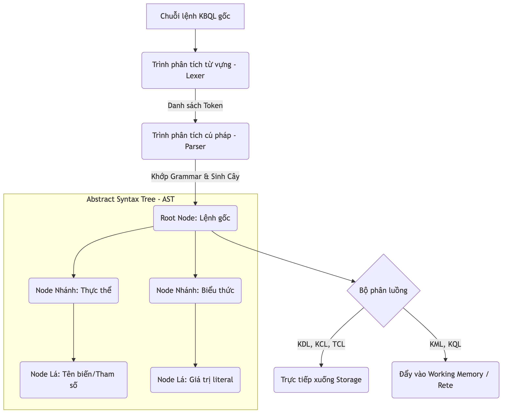
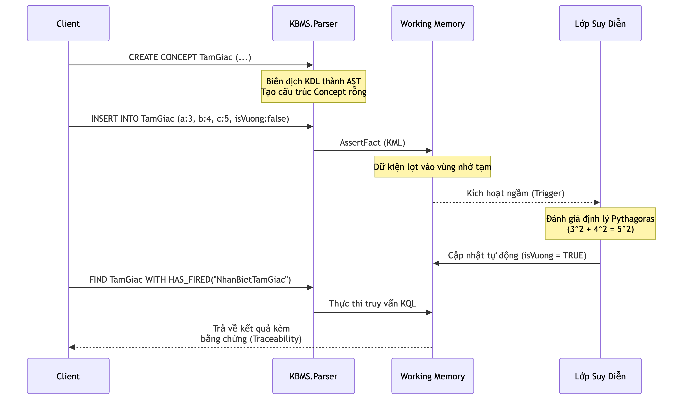

# 3.3. Đặc tả Ngôn ngữ và Bộ phân tích Cú pháp (KBQL Layer)

Trong kiến trúc của một hệ quản trị tri thức, nếu Lớp lưu trữ (Storage Layer) đóng vai trò là thể xác vật lý, thì Lớp ngôn ngữ giao tiếp chính là hệ thần kinh trung ương kết nối người dùng với bộ máy tính toán. Các ngôn ngữ truy vấn cơ sở dữ liệu truyền thống như SQL vốn được thiết kế tối ưu cho đại số quan hệ (Relational Algebra) tỏ ra bế tắc trước các mô hình tri thức phức hợp, trong khi Prolog lại sở hữu cú pháp quá trừu tượng, gây cản trở cho các kỹ sư phần mềm. 

Nhận thức được khoảng trống này, hệ thống đã đề xuất và cài đặt ngôn ngữ **KBQL (Knowledge Base Query Language)** — một ngôn ngữ phi thủ tục (declarative) được thiết kế chuyên biệt để biểu diễn và khai thác trọn vẹn mô hình đối tượng tính toán (COKB).

## 3.3.1. Cơ sở lý thuyết của Bộ phân tích cú pháp

Ngôn ngữ KBQL không được hệ thống xử lý trực tiếp dưới dạng văn bản thô. Thay vào đó, mọi chuỗi lệnh từ phía Client đều phải đi qua một luồng biên dịch nghiêm ngặt tại namespace `KBMS.Parser`:

1. **Phân tích từ vựng (Lexical Analysis):** Trình Lexer quét qua chuỗi ký tự đầu vào, loại bỏ các khoảng trắng và chú thích, sau đó phân tách chuỗi thành một danh sách các Thẻ từ (Token). Dựa trên mã nguồn `TokenType.cs`, hệ thống định nghĩa một tập hợp từ vựng đồ sộ với hơn 100 loại Token khác nhau, phục vụ từ việc khai báo cấu trúc cho đến bảo trì đĩa cứng.
2. **Phân tích cú pháp (Syntax Analysis):** Trình Parser sử dụng kỹ thuật phân tích trôi xuống đệ quy (Recursive Descent Parsing) để kiểm chứng tính hợp lệ của danh sách Token, từ đó dựng lên một **Cây cú pháp trừu tượng (Abstract Syntax Tree - AST)**.


*Hình 3.5: Cấu trúc phân tích cú pháp và điều phối lệnh KBQL dựa trên AST.*

Điểm đặc sắc của kiến trúc này nằm ở bộ phân luồng linh hoạt (Dispatcher). Dựa vào kiểu gốc của AST (ví dụ: `CreateConceptNode`, `InsertNode`, `VacuumNode`), hệ thống quyết định luồng đi của dữ liệu: tương tác với Lớp lưu trữ hay đẩy vào bộ nhớ làm việc (Working Memory) để chuẩn bị cho quá trình suy diễn.

## 3.3.2. Hệ thống Kiểu Dữ liệu và Hàm Tích hợp

Để hỗ trợ việc định nghĩa và tính toán trên các không gian đối tượng đa chiều, KBQL trang bị một bộ định kiểu mạnh mẽ, phân mảnh thành 15 chuẩn dữ liệu, cùng 12 hàm tích hợp chuyên biệt cho môi trường suy diễn.

**Bảng 3.1: Tập hợp 15 kiểu dữ liệu (Value Types) trong KBQL**

| Phân loại | Tên kiểu dữ liệu (Tokens) | Mô tả và mục đích sử dụng |
| :--- | :--- | :--- |
| **Numeric** | `TINYINT`, `SMALLINT`, `INT`, `BIGINT`, `FLOAT`, `DOUBLE`, `DECIMAL` | Lưu trữ các giá trị định lượng với độ chuẩn xác tùy biến, phục vụ tính toán đại số trong các phương trình (Equations). |
| **String** | `VARCHAR`, `CHAR`, `TEXT` | Lưu trữ định danh, tên gọi, hoặc văn bản dài. |
| **Boolean** | `BOOLEAN_TYPE` | Nhận giá trị `TRUE` / `FALSE`, làm tham số đầu vào cho mệnh đề giả thuyết (Rule Hypothesis). |
| **Date/Time** | `DATE`, `DATETIME`, `TIMESTAMP` | Quản lý mốc thời gian, phục vụ cho các luật suy diễn phụ thuộc yếu tố lịch sử. |
| **Reference**| `OBJECT_TYPE` | Tham chiếu (Pointer) đến một Concept khác, tạo nền tảng cho mối quan hệ kế thừa phân cấp. |

Khác biệt hoàn toàn với các cơ sở dữ liệu phi quan hệ (NoSQL), KBMS bổ sung các hàm (Functions) không chỉ tác động lên dữ liệu tĩnh mà còn can thiệp sâu vào cấu trúc tiến trình suy diễn.

**Bảng 3.2: Tập hợp 12 hàm tích hợp (Built-in & Meta-Querying Functions)**

| Phân nhóm | Từ khóa (Keywords) | Chức năng cốt lõi trong hệ thống |
| :--- | :--- | :--- |
| **Aggregation** | `COUNT`, `SUM`, `AVG`, `MAX`, `MIN` | Thực hiện thống kê toán học trên tập kết quả trả về từ đồ thị tri thức. |
| **Meta-Querying**| `HAS_FIRED`, `IS_DEDUCED`, `IS_STUCK` | Truy vấn trạng thái động của luật. Cụ thể, `HAS_FIRED` dùng để kiểm chứng xem một luật đã được mạng Rete kích hoạt hay chưa. |
| **Diagnostics** | `TOTAL_COST`, `AUDIT_LOG`, `GENERATED_VARIABLES`, `MISSING_FACTS` | Đánh giá chi phí tính toán thực tế và trích xuất nguyên nhân (dữ kiện còn thiếu) khiến luật không thể tiếp tục thực thi. |

## 3.3.3. Đặc tả Cú pháp (Skeletons) cho 5 Phân hệ KBQL

Bộ ngôn ngữ KBQL được thiết kế dựa trên triết lý "Đóng gói tri thức". Toàn bộ tập lệnh được chia thành 5 nhóm chức năng. Dưới đây là đặc tả cú pháp (Skeletons) kiệt để cho từng thao tác trong hệ thống.

### Phân hệ 1: KDL (Knowledge Definition Language)
Nhóm lệnh định nghĩa cấu trúc siêu dữ liệu. Thay vì lưu trữ phân tán, KBMS cho phép định nghĩa một khái niệm hoàn chỉnh bao gồm biến số, luật và hàm trong một khối duy nhất.

```sql
-- 1. Khởi tạo Cơ sở Tri thức
CREATE KNOWLEDGE BASE <Tên_Cơ_Sở> [DESCRIPTION "<Mô_tả>"];
USE KNOWLEDGE BASE <Tên_Cơ_Sở>;

-- 2. Định nghĩa Khái niệm (Concept) với 9 khối logic
CREATE CONCEPT <Tên_Khái_Niệm> (
    VARIABLES ( <Tên_Biến> : <Kiểu_Dữ_Liệu>, ... ),
    ALIASES ( <Tên_Đồng_Nghĩa>, ... ),
    BASE_OBJECTS ( <Khái_Niệm_Cơ_Sở>, ... ),
    CONSTRAINTS ( <Tên_Ràng_Buộc> : <Biểu_Thức>, ... ),
    SAME_VARIABLES ( <Biến_1> = <Biến_2>, ... ),
    CONSTRUCT_RELATIONS ( <Tên_Quan_Hệ>(<Tham_Số>), ... ),
    PROPERTIES ( <Khóa> : "<Giá_Trị>", ... ),
    EQUATIONS ( <Biểu_Thức_Đại_Số>, ... ),
    RULES ( RULE <Tên_Luật> : IF <Giả_Thuyết> THEN <Kết_Luận> )
);

-- 3. Thiết lập Mối quan hệ giữa các Khái niệm
CREATE RELATION <Tên> FROM <Concept_A> TO <Concept_B> PARAMS (...) RULES (...);

-- 4. Định nghĩa Hàm và Toán tử tùy chỉnh
CREATE FUNCTION <Tên_Hàm> PARAMS (<Tên_Biến> <Kiểu>) RETURNS <Kiểu> BODY "<Mã_Nguồn>";
CREATE OPERATOR <Ký_Hiệu> PARAMS (<Kiểu_1>, <Kiểu_2>) RETURNS <Kiểu> BODY "<Mã_Nguồn>";

-- 5. Định nghĩa Cơ chế Trigger và Chỉ mục (Index)
CREATE TRIGGER <Tên> ON <Đối_Tượng> IF <Điều_Kiện> DO <Hành_Động>;
CREATE INDEX <Tên_Index> ON <Tên_Khái_Niệm> (<Tên_Biến>);

-- 6. Tái cấu trúc và Xóa bỏ
ALTER CONCEPT <Tên> ADD VARIABLE <Tên_Biến> : <Kiểu_Dữ_Liệu>;
ALTER CONCEPT <Tên> REMOVE VARIABLE <Tên_Biến>;
DROP CONCEPT <Tên_Khái_Niệm>;
```

### Phân hệ 2: KML (Knowledge Manipulation Language)
Nhóm lệnh vận hành dữ kiện thực tế. Điểm khác biệt mấu chốt của KBQL là việc nạp dữ liệu không kết thúc bằng một thao tác ghi đĩa thông thường; lệnh `INSERT` đóng vai trò là "mồi lửa" kích hoạt mạng Rete chạy ngầm.

```sql
-- 7. Thêm dữ kiện mới (Kích hoạt bộ máy suy diễn)
INSERT INTO <Tên_Khái_Niệm> VARIABLES ( 
    <Tên_Biến> : <Giá_Trị>, ... 
);

-- 8. Cập nhật dữ kiện (Có thể làm thay đổi trạng thái kích hoạt của luật)
UPDATE <Tên_Khái_Niệm> VARIABLES ( 
    SET <Tên_Biến> : <Biểu_Thức_Mới> 
) WHERE <Điều_Kiện>;

-- 9. Xóa dữ kiện
DELETE FROM <Tên_Khái_Niệm> WHERE <Điều_Kiện>;
```

### Phân hệ 3: KQL (Knowledge Query Language)
KQL cung cấp khả năng truy vết (Traceability). Người dùng có thể sử dụng các hàm meta đặc thù để truy vấn chính xác quá trình tư duy của hệ thống.

```sql
-- 10. Truy vấn dựa trên Trạng thái kích hoạt (Traceability)
FIND <Tên_Khái_Niệm> 
WITH <Điều_Kiện_Lọc> AND <Hàm_Truy_Vết>
RETURN <Biến_1>, <Biến_2>;

-- 11. Truy xuất dữ liệu cấu trúc dạng bảng (SQL-like)
SELECT <Danh_Sách_Cột> 
FROM <Tên_Khái_Niệm> 
JOIN <Khái_Niệm_Khác> ON <Điều_Kiện_Kết_Nối>
WHERE <Điều_Kiện> 
GROUP BY <Cột> HAVING <Điều_Kiện_Nhóm>
ORDER BY <Cột> ASC|DESC 
LIMIT <Số_Lượng> OFFSET <Vị_Trí_Bắt_Đầu>;
```

### Phân hệ 4: Utility & Maintenance Language (Quản trị Hệ thống)
Các nhóm lệnh phục vụ cho kỹ sư hệ thống theo dõi và tối ưu hóa bộ nhớ cấp thấp (Buffer Pool, Slotted Page).

```sql
-- 12. Truy xuất Metadata
SHOW CONCEPTS; | SHOW RULES; | SHOW RELATIONS; 
SHOW USERS; | SHOW INDEXES; | SHOW TRIGGERS;
DESCRIBE <Tên_Khái_Niệm>;

-- 13. Giải thích quá trình thực thi
EXPLAIN <Câu_Lệnh_KQL_Hoặc_KML>;

-- 14. Tối ưu hóa Lưu trữ vật lý
VACUUM <Tên_Khái_Niệm>;       -- Dọn dẹp phân mảnh trên Slotted Page
REINDEX <Tên_Khái_Niệm>;      -- Xây dựng lại cấu trúc B+ Tree
CHECK CONSISTENCY;            -- Kiểm tra tính toàn vẹn tri thức

-- 15. Giao tiếp dữ liệu ngoại vi
EXPORT <Tên_Khái_Niệm> INTO FILE "<Đường_Dẫn>" FORMAT <Định_Dạng>;
IMPORT INTO <Tên_Khái_Niệm> FROM FILE "<Đường_Dẫn>" FORMAT <Định_Dạng>;
```

### Phân hệ 5: KCL và TCL (Bảo mật và Giao dịch)
Các lệnh đảm bảo tính nguyên tử (Atomicity) và kiểm soát quyền truy cập dựa trên vai trò (RBAC).

```sql
-- 16. Kiểm soát quyền truy cập (KCL)
GRANT <Quyền_Hạn> ON <Đối_Tượng> TO <Vai_Trò>;
REVOKE <Quyền_Hạn> ON <Đối_Tượng> FROM <Người_Dùng>;

-- 17. Quản lý toàn vẹn giao dịch (TCL)
BEGIN TRANSACTION;
-- [Khối lệnh KML/KDL]
COMMIT;   -- Hoặc ROLLBACK;
```

## 3.3.4. Đặc tả bài toán ứng dụng qua ngôn ngữ KBQL

Tính khả thi của ngôn ngữ KBQL được thể hiện qua bài toán nhận dạng đặc tính hình học. Khi cần định nghĩa cấu trúc của một tam giác, thay vì giao phó việc tính toán logic cho Lớp ứng dụng (Application Layer), thiết kế của hệ thống cho phép nhúng trực tiếp định lý Pythagoras vào cấu trúc siêu dữ liệu thông qua câu lệnh KDL:

```sql
CREATE CONCEPT TamGiac (
    VARIABLES (
        a : FLOAT,
        b : FLOAT,
        c : FLOAT,
        isVuong : BOOLEAN
    ),
    RULES (
        RULE NhanBietTamGiac : 
            IF (a*a + b*b == c*c) OR (a*a + c*c == b*b) OR (b*b + c*c == a*a)
            THEN isVuong = TRUE
    )
);
```

Trong quá trình vận hành, khi một tập dữ kiện mới được hệ thống tiếp nhận qua lệnh KML:

```sql
INSERT INTO TamGiac VARIABLES (
    a : 3.0, 
    b : 4.0, 
    c : 5.0,
    isVuong : FALSE
);
```

Lệnh `INSERT` không chỉ thực hiện chức năng lưu trữ mà còn đóng vai trò là tác nhân kích hoạt (trigger) Lớp suy diễn. Khi các giá trị (3, 4, 5) được nạp vào bộ nhớ làm việc (Working Memory), hệ thống tự động đánh giá và đối khớp với luật `NhanBietTamGiac`. Kết quả của quá trình này là thuộc tính `isVuong` được cập nhật thành `TRUE`. Để truy xuất kết quả này kèm theo bằng chứng suy luận (inference trace), Lớp ứng dụng sẽ gọi hàm meta `HAS_FIRED` trong câu lệnh KQL:

```sql
FIND TamGiac 
WITH isVuong = TRUE 
AND HAS_FIRED("NhanBietTamGiac")
RETURN a, b, c;
```


*Hình 3.5: Luồng thực thi từ biên dịch KDL đến truy vấn KQL có truy vết.*

Thông qua cơ chế truy vết này, hệ thống đảm bảo tính minh bạch (explainability) của các kết luận được đưa ra Luồng thực thi tự động này chính là mạng suy diễn tiến (Forward Chaining), sẽ được phân tích chi tiết tại Mục 3.4.
