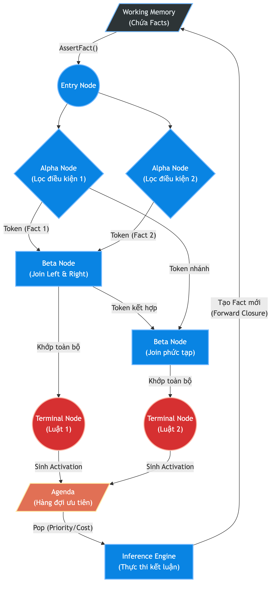
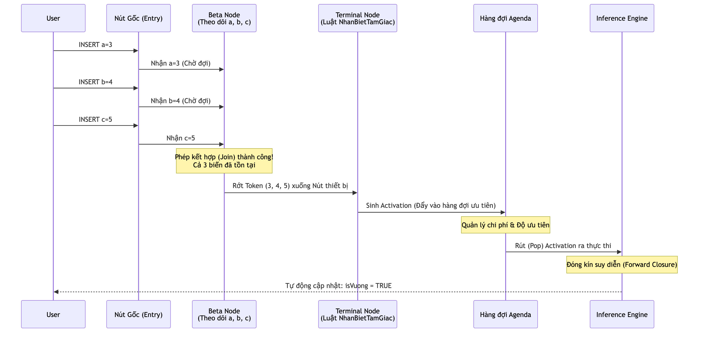

# 3.4. Kiến trúc Mạng Suy diễn Rete (Reasoning Layer)

Nếu Lớp ngôn ngữ (KBQL Layer) chịu trách nhiệm tiếp nhận và biên dịch tri thức từ người dùng, thì Lớp suy diễn (Reasoning Layer) đóng vai trò là "bộ não" cốt lõi của toàn bộ hệ quản trị tri thức. Thay vì sử dụng phương pháp tìm kiếm vét cạn (Exhaustive Search) trên toàn bộ không gian dữ kiện mỗi khi có truy vấn mới, hệ thống áp dụng cơ chế suy diễn tiến (Forward Chaining) dựa trên nền tảng của mạng **Rete Network**. Kỹ thuật này giúp hệ thống lưu trữ vết (state) của các điều kiện đã khớp một phần, từ đó giảm thiểu tối đa chi phí tái tính toán và đạt được hiệu năng vượt trội khi xử lý các mô hình có hàng ngàn luật đan chéo nhau.

## 3.4.1. Cấu trúc Hình học Mạng Rete (Rete Topology)

Thuật toán Rete được hiện thực hóa trong namespace `KBMS.Reasoning.Rete` bằng cách biến đổi danh sách các luật (Rules) phẳng thành một đồ thị có hướng không chu trình (DAG). Mạng Rete của KBMS bao gồm 4 loại nút (Node) chuyên biệt, phối hợp nhịp nhàng để tạo thành một phễu lọc dữ kiện nhiều tầng.

1. **Nút gốc (Entry Node):** Đóng vai trò là cửa ngõ duy nhất. Khi một dữ kiện mới (Fact) được đưa vào bộ nhớ làm việc (Working Memory), nó sẽ đi qua Nút gốc trước khi lan truyền xuống các nhánh bên dưới.
2. **Nút lọc đơn phân (Alpha Node):** Chịu trách nhiệm kiểm tra các điều kiện cục bộ của một biến đơn lẻ (Unary Predicate). Ví dụ, nếu luật yêu cầu `a > 0`, `AlphaNode` sẽ chặn các dữ kiện có `a <= 0` lại. Việc nhóm các điều kiện giống nhau vào chung một Alpha Node giúp hệ thống tránh việc kiểm tra lặp lại một điều kiện cho nhiều luật khác nhau.
3. **Nút kết hợp (Beta Node):** Đây là thành phần phức tạp và đắt đỏ nhất trong mạng Rete. Nhiệm vụ của `BetaNode` là thực hiện phép kết nối (Join) giữa kết quả của một phần mạng trước đó (Left Parent) với một điều kiện mới (Right Parent). Nếu phép kết hợp thành công, nó sinh ra một Token mới chứa nhiều dữ kiện cấu thành và đẩy tiếp xuống mạng.
4. **Nút thiết bị (Terminal Node):** Nằm ở đáy của đồ thị Rete. Khi một Token chạm đến `TerminalNode`, điều đó có nghĩa là toàn bộ giả thuyết (Hypothesis) của một luật cụ thể đã hoàn toàn được thỏa mãn. Nút này sẽ không tự thực thi kết luận, mà đóng gói Token thành một **Activation** và đẩy vào hàng đợi ưu tiên (Agenda).

Sự phân luồng dữ kiện qua các tầng Node này được mô tả trực quan trong sơ đồ sau:

*Hình 3.6: Kiến trúc bộ nhớ và luồng dữ kiện bên trong mạng Rete.*

## 3.4.2. Cơ chế Biên dịch và Lan truyền (Compilation & Propagation)

Quá trình vận hành của Lớp suy diễn được chia thành hai pha riêng biệt: pha biên dịch (Compile-time) và pha lan truyền dữ kiện (Run-time).

Trong pha biên dịch, thành phần `ReteCompiler` sẽ phân tích Cây cú pháp trừu tượng (AST) của `CREATE CONCEPT`. Bằng việc quét qua tất cả các khối `RULES` và `CONSTRAINTS`, bộ biên dịch sẽ xây dựng mạng Rete tương ứng. Quá trình này đòi hỏi thuật toán phải tìm kiếm các nút Alpha và Beta đã tồn tại để chia sẻ đường dẫn (Node Sharing Optimization). Nhờ đó, nếu 10 luật cùng yêu cầu điều kiện `isVuong = TRUE`, hệ thống chỉ sinh ra đúng một `AlphaNode` duy nhất để kiểm tra điều kiện này.

Pha lan truyền (Run-time) bắt đầu khi hệ thống nhận được lệnh `INSERT` hoặc `UPDATE` từ lớp KBQL. Đối tượng `ReteNetwork` sẽ đảm nhận vai trò điều phối:
- Khi một dữ kiện được `AssertFact`, nó được đưa vào Working Memory. 
- Mạng Rete lập tức truyền dữ kiện này từ Nút gốc xuống các nút Alpha.
- Nếu lọt qua Alpha, dữ kiện sẽ được lưu vào bộ nhớ cục bộ (Right/Left Memory) của nút Beta và kích hoạt phép Join.
- Nếu dữ kiện bị thu hồi (`RetractFact`), mạng Rete sẽ phát tín hiệu rút lui, tự động xóa mọi Token và Activation rác có liên quan đến dữ kiện này khỏi bộ nhớ của toàn hệ thống.

## 3.4.3. Quản lý hàng đợi (Agenda) và Cơ chế Đóng kín (Forward Closure)

Tại điểm cuối của mạng, hàng đợi **Agenda** hoạt động như một bộ lập lịch thực thi (Scheduler). Nó quản lý các Actvation (luật đã đủ điều kiện kích hoạt) dựa trên độ ưu tiên (Priority) và chi phí tính toán (Cost). Cơ chế này đảm bảo rằng các luật mang tính chất ràng buộc hệ thống quan trọng sẽ luôn được kích hoạt trước các luật tính toán đơn thuần.

Động lực chính của Lớp suy diễn nằm ở hiện tượng **Đóng kín suy diễn (Forward Closure)**. Khi `InferenceEngine` ra lệnh kích hoạt (Fire) một luật từ Agenda, phần kết luận (Conclusion) của luật đó có thể tạo ra một dữ kiện hoàn toàn mới. Dữ kiện mới này lại tiếp tục được đẩy ngược vào Working Memory, lan truyền qua Nút gốc, và có khả năng đánh thức (trigger) các luật khác đang nằm chờ ở các Beta Node. Quá trình bùng nổ dây chuyền này chỉ dừng lại khi hệ thống đạt đến trạng thái bão hòa (không còn luật nào mới có thể được kích hoạt).

## 3.4.4. Đánh giá luồng thực thi thuật toán Rete

Quá trình vận hành của thuật toán Rete có thể được mô tả chi tiết thông qua kịch bản phân loại tam giác đã đề cập. Với cấu trúc `TamGiac` gồm ba biến `a, b, c` và luật `NhanBietTamGiac`, hệ thống sẽ xử lý tuần tự theo luồng dữ kiện đầu vào.

Tại thời điểm biên dịch (Compile-time), `ReteCompiler` khởi tạo một Beta Node chịu trách nhiệm theo dõi và lưu vết sự tồn tại của bộ ba biến này.
Khi hệ thống tiếp nhận cạnh $a=3$, dữ kiện đi qua Nút gốc (Entry Node) và được lưu trữ tại bộ nhớ cục bộ của Beta Node. Lúc này, điều kiện của luật chưa được thỏa mãn nên hệ thống ở trạng thái chờ. Quá trình này lặp lại tương tự khi dữ kiện $b=4$ được nạp vào.

Chỉ khi dữ kiện $c=5$ xuất hiện thông qua lệnh `INSERT`, phép kết hợp (Join) tại Beta Node mới hội tụ đủ điều kiện. Một Token chứa bộ ba $(3, 4, 5)$ được tạo ra và dịch chuyển đến Terminal Node của luật `NhanBietTamGiac`. Hệ quả là một Activation được đưa vào hàng đợi Agenda. Cuối cùng, `InferenceEngine` sẽ lấy Activation này ra thực thi, chính thức cập nhật dữ kiện `isVuong = TRUE` vào bộ nhớ làm việc.

*Hình 3.7: Minh họa chi tiết luồng di chuyển của các cạnh tam giác qua mạng Rete.*

Khi không còn Activation nào trong Agenda, tiến trình đóng kín suy diễn kết thúc. Bằng cách lưu trữ trạng thái trung gian tại các node, thuật toán Rete hạn chế tối đa các phép tính dư thừa, đảm bảo hệ thống đưa ra kết luận tự động một cách chính xác và lưu giữ đầy đủ vết thực thi.
