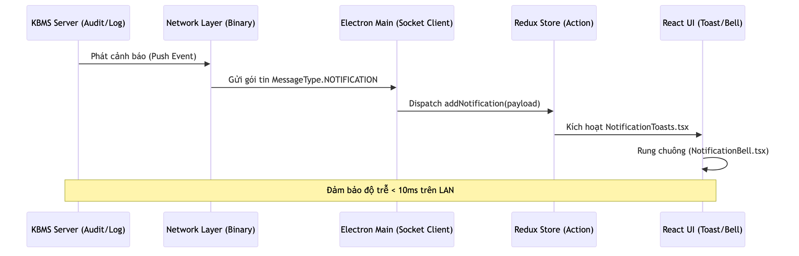

# 3.6. Lớp Ứng dụng và Môi trường Khai thác (Application Layer)

Mảnh ghép cuối cùng và cũng là điểm chạm trực tiếp duy nhất đối với người sử dụng trong toàn bộ kiến trúc hệ thống KBMS chính là **Lớp Ứng dụng (Application Layer)**. Dựa trên cơ sở lý thuyết của mô hình kiến trúc Client-Server, lớp ứng dụng được thiết kế hoàn toàn theo tư tưởng phi trạng thái (stateless) và triệt tiêu mọi logic suy diễn cục bộ. Điều này có nghĩa là toàn bộ sức mạnh xử lý (từ việc kiểm tra lỗi cú pháp dựa trên Abstract Syntax Tree cho đến việc kích hoạt thuật toán Rete) đều được ủy thác hoàn toàn cho Lớp Máy chủ (Engine Layer) thực hiện. Vai trò cốt lõi của các ứng dụng phía Client lúc này được thu gọn lại thành hai nhiệm vụ: đóng gói yêu cầu của người dùng thành luồng byte nhị phân để đẩy qua giao thức TCP, và phân tích (Parse) khối dữ liệu trả về để trực quan hóa lên màn hình [2].

Để đáp ứng nhu cầu sử dụng của các tệp người dùng chuyên biệt, hệ thống KBMS cung cấp hai môi trường khai thác song hành: Giao diện dòng lệnh (KBMS CLI) hướng tới quản trị viên hệ thống, và Môi trường phát triển tích hợp (KBMS Studio) hướng tới kỹ sư tri thức.

## 3.6.1. Môi trường Khai thác Dòng lệnh (KBMS CLI)

Ứng dụng KBMS CLI (`KBMS.CLI`) được xây dựng nhằm cung cấp một công cụ giao tiếp tối giản, tiêu tốn ít tài nguyên phần cứng nhất có thể. Đặc thù của các môi trường triển khai thực tế (Production) là hệ thống máy chủ thường không được trang bị giao diện đồ họa (headless server). Do đó, một giao diện dòng lệnh mạnh mẽ là yêu cầu bắt buộc để các Quản trị viên hệ thống (System Administrators) có thể thao tác trực tiếp với cơ sở dữ liệu.

*Hình 3.10: Sơ đồ luồng xử lý (Processing Flow) của ứng dụng CLI.*

Kiến trúc bên trong của KBMS CLI không đơn thuần là một công cụ truyền tải chuỗi ký tự, mà là sự kết hợp chặt chẽ của ba phân hệ kỹ thuật: Trình soạn thảo đa dòng (`LineEditor.cs`), Bộ quản lý lịch sử (`HistoryManager.cs`), và Trình phân tích kết quả (`ResponseParser.cs`). Sự phối hợp của các phân hệ này được thể hiện rõ nét qua từng kịch bản sử dụng (Use Case) cụ thể.

Quá trình giao tiếp bắt buộc phải được khởi tạo bằng **luồng Xác thực (Authentication Flow)**. Trước khi bất kỳ lệnh KBQL nào được gửi đi, CLI phải thiết lập kết nối TCP Socket tới máy chủ và gửi thông điệp `LOGIN` chứa thông tin định danh. Chỉ khi máy chủ đối chiếu thành công quyền hạn dựa trên mô hình Role-Based Access Control (RBAC), một phiên làm việc (Session) mới được cấp phát, đảm bảo tính bảo mật và toàn vẹn của hệ thống.

*Hình 3.11: Luồng logic kết nối và xác thực người dùng.*

*Hình 3.12: Giao diện khởi tạo kết nối TCP và đăng nhập của KBMS CLI.*

Tiếp theo, khi quản trị viên cần thiết kế kiến trúc tri thức, họ sẽ tương tác với luồng **Soạn thảo Ngôn ngữ Định nghĩa (KDL)**. Không giống như các câu lệnh SQL ngắn gọn, việc định nghĩa một cấu trúc Khái niệm (Concept) hoặc Luật (Rule) trong KBMS thường đòi hỏi hàng chục dòng mã với nhiều biến số phức tạp. Để giải quyết vấn đề này, module `LineEditor.cs` được cài đặt để cung cấp khả năng soạn thảo đa dòng (Multi-line Editing) trực tiếp trên Console. Hệ thống sẽ tích lũy các chuỗi ký tự vào bộ đệm và chỉ thực sự gửi gói tin `QUERY` đi khi bắt gặp dấu chấm phẩy (`;`), giúp người dùng thoải mái ngắt dòng khi định nghĩa các bài toán phức tạp (ví dụ: định nghĩa ba cạnh của tam giác vuông).

*Hình 3.13: Luồng logic định nghĩa cấu trúc dữ liệu qua KDL.*

*Hình 3.14: Giao diện soạn thảo đa dòng (Multi-line Editor) cho phép ngắt dòng lệnh KDL.*

Đối với thao tác **Truy vấn (KQL) và Truy vết (Trace)**, Lớp Ứng dụng phải đối mặt với bài toán tràn bộ nhớ. Nếu một câu lệnh KQL (như `FIND TamGiac`) trả về hàng triệu kết quả, việc nhận và phân tích toàn bộ cục dữ liệu cùng một lúc sẽ đánh sập chương trình. Do đó, mã nguồn `ResponseParser.cs` được thiết kế tương thích hoàn toàn với cơ chế Data Streaming từ Lớp Mạng. Mỗi khi nhận được một gói tin `MessageType.ROW`, CLI lập tức giải mã JSON và vẽ từng hàng dữ liệu ra bảng ASCII. Quá trình này tiếp diễn liên tục cho đến khi nhận được tín hiệu `FETCH_DONE`, đảm bảo bộ nhớ RAM của Client luôn ở mức thấp.

*Hình 3.15: Luồng logic phân giải lệnh truy vấn (KQL).*

*Hình 3.16: Giao diện hiển thị kết quả truy vấn KBQL dạng bảng thẳng hàng trên Console.*

Đặc biệt, hệ thống cung cấp công cụ truy vết suy luận logic (Solve Trace) dành riêng cho mục đích chẩn đoán. Khi thêm cờ truy vết vào truy vấn, luồng sự kiện (Activation) từ mạng Rete bên trong Server sẽ được đóng gói và gửi về CLI, cho phép người dùng quan sát chi tiết quá trình các biến số (như $a$, $b$, $c$ trong định lý Pythagoras) được đối sánh và sinh ra tri thức mới.

*Hình 3.17: Luồng logic yêu cầu truy vết giải thuật từ Server.*

*Hình 3.18: Giao diện truy vết từng bước kích hoạt của Mạng Rete.*

## 3.6.2. Môi trường Phát triển Tích hợp (KBMS Studio)

Khác với CLI hướng tới tính tối giản cho kỹ thuật viên, **KBMS Studio** (`kbms-studio`) được định vị là một hệ sinh thái Môi trường Phát triển Tích hợp (IDE) đồ họa toàn diện, hướng tới Kỹ sư tri thức (Knowledge Engineers). Được phát triển trên nền tảng công nghệ web hiện đại kết hợp với Electron và Vite, Studio che giấu đi sự phức tạp của giao thức nhị phân bên dưới, mang lại trải nghiệm tương tác mượt mà thông qua giao diện trực quan.

*Hình 3.19: Sơ đồ kiến trúc ứng dụng Studio.*

Sức mạnh nền tảng của KBMS Studio nằm ở khả năng tiếp nhận các sự kiện theo thời gian thực từ máy chủ. Kiến trúc này được hiện thực hóa thông qua cơ chế Server Push [5], cho phép Server chủ động đẩy các thông báo (Notification) hoặc dữ liệu giám sát hệ thống xuống Client mà không cần Client phải liên tục gửi yêu cầu hỏi vòng (Polling).

*Hình 3.20: Luồng giao tiếp Server Push cập nhật trạng thái thời gian thực.*

Tính năng cốt lõi làm nên giá trị của Studio là **Trình thiết kế Tri thức (Knowledge Designer)**. Để giải quyết đường cong học tập (learning curve) gắt gao của ngôn ngữ KBQL, Studio được tích hợp Giao thức Máy chủ Ngôn ngữ (Language Server Protocol - LSP). Khi kỹ sư gõ mã nguồn, các thông điệp `LSP_AUTOCOMPLETE` và `LSP_DIAGNOSTICS` liên tục trao đổi qua TCP Socket. Kết quả là, hệ thống cung cấp khả năng báo lỗi cú pháp theo thời gian thực (Diagnostics) và tự động hoàn thành từ khóa (IntelliSense) tương tự như các IDE công nghiệp hàng đầu. Kèm theo đó là bộ phân cấp thư mục (Tree Explorer) cho phép quản lý vòng đời của hàng nghìn Khái niệm và Luật trong không gian lưu trữ trực quan.

*Hình 3.21: Luồng logic thiết kế với tính năng Autocomplete và Diagnostics.*

*Hình 3.22: Giao diện Tree Explorer quản lý cấu trúc Khái niệm của hệ thống.*

*Hình 3.23: Giao diện soạn thảo (Designer) tích hợp gợi ý cú pháp.*

Bên cạnh đó, quá trình **Truy vấn và Trực quan hóa Truy vết (Visual Trace)** trên Studio mang lại giá trị vượt trội so với giao diện Console. Thay vì chỉ xuất ra các dòng văn bản đơn điệu, Studio tiếp nhận tập hợp các đỉnh và cạnh đại diện cho thuật toán suy diễn, sau đó dựng lên một đồ thị mạng lưới sinh động. Tính năng này đóng vai trò then chốt khi các kỹ sư cần giải thích tường tận cách một hệ chuyên gia y tế hay tài chính đi đến kết luận cuối cùng dựa trên luật Forward Chaining.

*Hình 3.24: Luồng logic vẽ đồ thị truy vết suy luận.*

*Hình 3.25: Giao diện trực quan hóa kết quả bằng bảng dữ liệu động và cây.*

Cuối cùng, tính năng **Giám sát Hệ thống (System Monitoring)** biến Studio thành một trạm điều khiển trung tâm. Tận dụng gói tin `MessageType.STATS` được máy chủ truyền phát theo chu kỳ, phần mềm cung cấp một biểu đồ dạng Dashboard giám sát theo thời gian thực tình trạng tiêu thụ RAM, mức tải CPU và sự biến động kích thước của Bộ nhớ làm việc (Working Memory). Đây là cơ sở dữ liệu quan trọng để các kỹ sư đưa ra quyết định tinh chỉnh quy mô (scaling) khi hệ thống vận hành trong môi trường thực tế.

*Hình 3.26: Luồng logic lấy mẫu dữ liệu thống kê từ Server.*

*Hình 3.27: Dashboard giám sát hiệu năng suy diễn và tài nguyên bộ nhớ theo thời gian thực.*

Sự tồn tại song hành của KBMS CLI và KBMS Studio không chỉ đa dạng hóa phương thức tiếp cận, mà còn là minh chứng mạnh mẽ cho tính độc lập và khả năng mở rộng của kiến trúc hệ thống KBMS. Bằng việc phân ly triệt để Lớp Ứng dụng khỏi gánh nặng xử lý suy diễn, và chuẩn hóa quy trình giao tiếp qua Giao thức Nhị phân TCP, dự án đã chính thức hoàn thiện một khung sườn **Hệ quản trị cơ sở tri thức (KBMS)** vững chắc toàn diện — từ lõi lưu trữ vật lý lên đến tầng giao diện người dùng cao nhất. Qua đó, tạo tiền đề vững chắc để bước vào giai đoạn kiểm thử hiệu năng và đánh giá tổng thể ở Chương tiếp theo.
