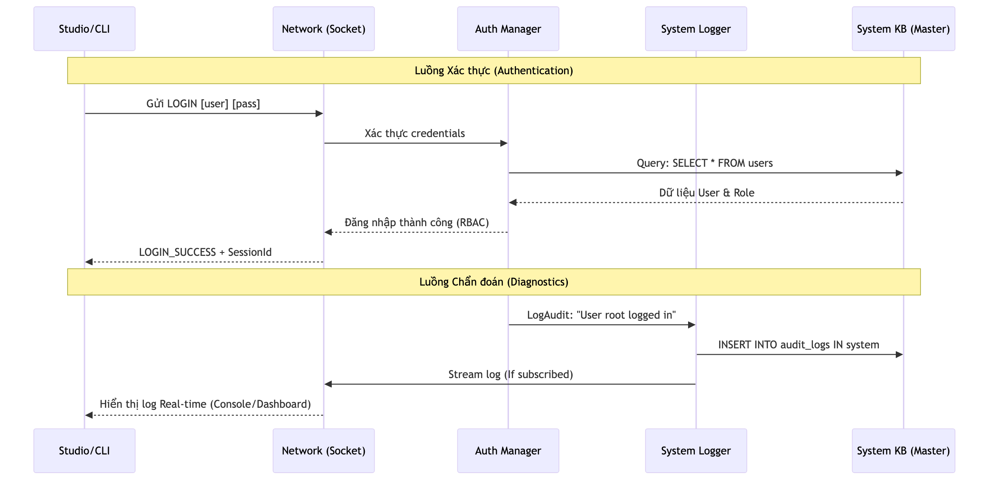

# 04.1. Tổng quan Kiến trúc và Luồng Xử lý Tri thức

Hệ thống [KBMS](../00-glossary/01-glossary.md#kbms) (phiên bản V3) được thiết kế dựa trên mô hình kiến trúc 4 tầng (4-Tier Architecture) hiện đại [1]. Kiến trúc này đảm bảo tính phân tách nhiệm vụ (Separation of Concerns) chặt chẽ giữa các thành phần giao tiếp mạng, xử lý ngôn ngữ, suy diễn logic và lưu trữ vật lý [3]. 

Mục tiêu của Chương 4 là trình bày chi tiết cách KBMS chuyển hóa mô hình lý thuyết COKB thành một hệ thống phần mềm hoàn chỉnh, có khả năng phân tích cú pháp, quản trị dữ liệu ở mức byte và thực thi suy luận tự động.

## 4.1.1. Kiến trúc Hệ thống Chi tiết (Detailed System Architecture)

Hệ thống KBMS V3 được hiện thực hóa dựa trên cấu trúc module hóa chặt chẽ, chia tách thành 4 tầng chức năng hoạt động như các assembly độc lập. Sự phân tầng này không chỉ đảm bảo tính thẩm mỹ về mặt thiết kế mà còn tối ưu hóa quy trình triển khai và bảo trì mã nguồn:

*Hình 4.1: Sơ đồ cấu trúc thành phần chi tiết của hệ thống KBMS Server.*

*   **Application Layer**: Phân hệ tương tác người dùng, tích hợp các công cụ chuyên dụng như Monaco Editor và [VGE](../00-glossary/01-glossary.md#vge) để quản trị tri thức.
*   **Network Layer**: Đảm nhiệm việc tuần tự hóa dữ liệu nhị phân (Binary Serialization) và quản lý phiên kết nối (Session Management) qua Socket TCP.
*   **Server Engine Layer**: Hạt nhân điều phối logic, nơi thực hiện việc chuyển đổi câu lệnh thành **Cây cú pháp trừu tượng (AST)** để điều hướng các tác vụ tính toán và suy luận.
*   **Storage Layer**: Phân hệ quản trị lưu trữ vật lý, vận hành các cấu trúc dữ liệu hiệu năng cao như Slotted Page và B+ Tree để đảm bảo tính [ACID](../00-glossary/01-glossary.md#acid).

Luồng vận hành của hệ thống được gắn kết hữu cơ thông qua sự luân chuyển của đối tượng AST xuyên suốt các tầng kiến trúc:

*Hình 4.2: Sơ đồ Sequence mô tả quy trình xử lý yêu cầu phân tầng trong KBMS V3.*

Trong quá trình triển khai, mỗi giai đoạn của AST định hình một pha xử lý kỹ thuật riêng biệt. Từ việc phân tích cú pháp đệ quy tại lớp Server cho tới việc đối sánh mẫu trên mạng Rete hoặc truy xuất trang dữ liệu tại lớp Storage, kiến trúc 4 tầng đảm bảo mọi thành phần đều hoạt động với sự cô lập cao nhất nhưng vẫn giữ được tính nhất quán toàn vẹn của dữ liệu tri thức.

## 4.1.2. Khung Giám sát và Chẩn đoán

Đi song song với 3 pha xử lý trên là "mạch quản trị" (Diagnostic Circuit) vận hành cô lập. Mạch này bảo đảm an ninh (Security Integrity) theo thời gian thực và ghi nhận kiểm tra truy vết (Audit Logging).

*Hình 4.3: Sơ đồ luồng bảo mật và chẩn đoán hệ thống song song.*

Bảng đặc tả kỹ thuật dưới đây liệt kê sơ lược các thành phần công nghệ nền tảng thống nhất cho KBMS V3:

*Bảng 4.1: Đặc tả kỹ thuật và kiến trúc mã nguồn theo phân tầng*
| Tầng Kiến trúc | Phạm vi Hệ thống & Mã nguồn | Thuật toán / Công nghệ Lõi (Core Tech) |
| :--- | :--- | :--- |
| **Application** | `kbms-studio-ui`, `KBMS.CLI` | ReactJS, TypeScript, Monaco Editor |
| **Network** | `KBMS.Server.Network` | Non-blocking TCP, Mã hóa đối xứng AES-256 |
| **Server** | `KBMS.Parser`, `KnowledgeManager`| Đệ quy đi xuống LL(k), Xử lý đa luồng (TAP) |
| **Reasoning** | `KBMS.Reasoning.InferenceEngine`| Forward Chaining, đối sánh mẫu mạng Rete |
| **Storage** | `KBMS.Storage.V3` (DiskManager) | V3 Slotted Page, đánh chỉ mục B+ Tree, WAL |
