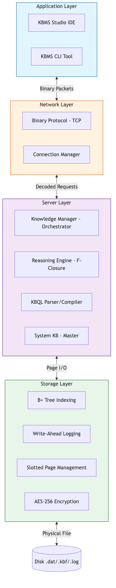
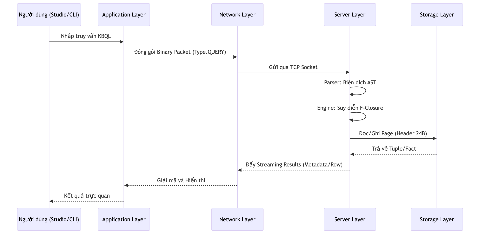

# 04.1. Tổng quan Kiến trúc (System Overview)

Hệ thống KBMS (phiên bản V3) được thiết kế dựa trên mô hình kiến trúc 4 tầng (4-Tier Architecture) hiện đại [1]. Cấu trúc này giúp tách biệt rõ ràng trách nhiệm giữa việc tương tác người dùng, truyền dẫn mạng, xử lý logic và lưu trữ vật lý [3].

## 1. Mô hình Kiến trúc 4 Tầng

Cấu trúc phân tầng của KBMS bao gồm:

*Hình 4.1: Kiến trúc 4 tầng chuẩn hóa của hệ thống KBMS V3.*

1.  **Application Layer**: Giao diện người dùng (Studio/CLI), chịu trách nhiệm thu thập yêu cầu và hiển thị kết quả.
2.  **Network Layer**: Giao thức truyền dẫn nhị phân, đảm bảo kết nối ổn định và hiệu năng cao.
3.  **Server Layer**: "Bộ não" của hệ thống, thực hiện biên dịch ngôn ngữ KBQL và suy diễn tri thức.
4.  **Storage Layer**: Quản lý dữ liệu bền vững trên đĩa cứng thông qua các thuật toán B+ Tree và WAL.

## 2. Luồng Yêu cầu Tổng quát

Mọi yêu cầu từ người dùng đều đi xuyên suốt qua 4 tầng này để đạt được kết quả cuối cùng:

*Hình 4.2: Luồng xử lý yêu cầu đi xuyên suốt 4 tầng kiến trúc.*

## 3. Bảo mật & Chẩn đoán Hệ thống

Bên cạnh luồng dữ liệu chính, KBMS duy trì một "mạch quản trị" song song để đảm bảo tính an toàn và minh bạch:

*Hình 4.3: Sơ đồ luồng bảo mật và chẩn đoán hệ thống song song.*

## 4. Công nghệ Sử dụng (Technology Stack)

| Tầng | Thành phần chính | Công nghệ & Thư viện |
| :--- | :--- | :--- |
| **Application** | Studio IDE | React, Electron, Monaco Editor, Tailwind CSS |
| **Network** | Binary Protocol | TCP Sockets, UTF-8 Encoding, Little-Endian |
| **Server** | Core Engine | .NET Core 8, C#, F-Closure Algorithm |
| **Storage** | Physical Layer | B+ Tree, WAL, Slotted Page, AES-256 Encryption |

---

> [!TIP]
> **Khả năng mở rộng**: Với kiến trúc 4 tầng chuẩn hóa, KBMS dễ dàng hỗ trợ các ứng dụng bên thứ ba tích hợp thông qua Giao thức Mạng mà không cần can thiệp vào mã nguồn Server.
