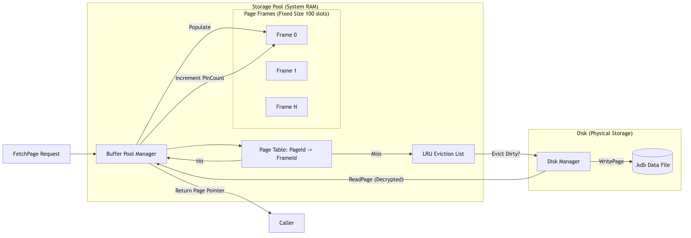

# 4.3.2 Quản lý Trang và Bộ nhớ đệm (Disk & Buffer Management)

Hệ thống quản trị KBMS [K00] thực hiện việc phân tách giữa cấu trúc lưu trữ vật lý trên thiết bị ngoại vi và cấu trúc lưu trữ logic trong bộ nhớ RAM thông qua hai phân hệ: Bộ quản lý đĩa (`DiskManager`) và Bộ quản lý bộ nhớ đệm (`BufferPoolManager`). Cơ chế này cho phép hệ thống vận hành với các tập dữ liệu có quy mô lớn hơn dung lượng bộ nhớ vật lý khả dụng của máy chủ.

## 4.3.2.1 Disk Manager: Phân hệ Trẻu tượng Hóa Lưu trữ vật lý

Phân hệ `DiskManager` chịu trách nhiệm tương tác trực tiếp với hệ thống tệp tin của hệ điều hành để thực thi các thao tác đọc và ghi dữ liệu theo đơn vị trang (Pages) có kích thước cố định.

1.  **Cơ chế Truy cập Ngẫu nhiên ($O(1)$)**: Hệ thống sử dụng phương thức định vị con trỏ tệp tin (`Seek`) để truy xuất trực tiếp vị trí vật lý của trang dữ liệu thông qua định danh trang (`PageId`). Địa chỉ offset vật lý được xác định theo công thức:
    $$Offset = PageId \times PageSize_{Physical}$$
    Trong đó, $PageSize_{Physical}$ bao gồm 16,384 Bytes dữ liệu logic và 32 Bytes dữ liệu mã hóa AES.
2.  **Mã hóa Dữ liệu tĩnh (Encryption at Rest)**: Các trang dữ liệu được mã hoá theo chuẩn **AES-256-CBC** trước khi thực hiện thao tác ghi xuống thiết bị lưu trữ. Khi phân hệ `ReadPage` được kích hoạt, dữ liệu sẽ được giải mã trước khi chuyển nạp vào khung trang trong bộ nhớ đệm, đảm bảo tính bảo mật toàn vẹn cho thông tin tri thức.

## 4.3.2.2 Buffer Pool Manager: Phân hệ Điều phối Bộ nhớ RAM

Phân hệ `BufferPoolManager` đóng vai trò là lớp quản lý bộ nhớ đệm, duy trì một danh sách các khung trang (Page Frames) trong RAM nhằm tối ưu hóa các thao tác nhập/xuất đĩa cứng (Disk I/O).

*Hình 4.12: Quy trình điều phối trang dữ liệu giữa bộ nhớ RAM và thiết bị lưu trữ vật lý.*

1.  **Giải thuật Thay thế LRU (Least Recently Used)**: Khi dung lượng bộ nhớ đệm đạt mức giới hạn, hệ thống thực thi giải thuật LRU để xác định trang dữ liệu ít được truy cập nhất trong thời gian gần nhất để thực hiện quy trình giải phóng bộ nhớ. Nếu trang dữ liệu đã bị thay đổi nội dung (`IsDirty == true`), hệ thống thực hiện quy trình đồng bộ hóa ghi xuống đĩa trước khi xóa bản ghi khỏi khung trang.
2.  **Cơ chế Ghim trang (Pinning)**: Để duy trì tính nhất quán của dữ liệu trong quá trình xử lý, KBMS sử dụng tham số `PinCount`. Các trang đang trong quá trình truy xuất hoặc sửa đổi bởi các phân hệ cấp cao sẽ được tăng giá trị `PinCount`. Phân hệ quản lý bộ nhớ đệm cam kết không giải phóng các trang có `PinCount > 0`, ngay cả khi trang đó thỏa mãn điều kiện giải phóng của giải thuật LRU.

## 4.3.2.3 Đặc tả Thông số Kĩ thuật của Tầng Lưu trữ

Dưới đây là các thông số định cấu hình tiêu chuẩn của hệ thống lưu trữ:

*Bảng 4.1: Đặc tả thông số kĩ thuật của hệ thống lưu trữ*
| Tham số | Giá trị | Mô tả kĩ thuật |
| :--- | :--- | :--- |
| **Page Size (Logic)** | 16,384 Bytes | Kích thước dữ liệu logic của một Slotted Page. |
| **Block Size (Disk)** | 16,416 Bytes | Kích thước vật lý bao gồm dữ liệu và Metadata mã hóa. |
| **Default Pool Size** | 100 Frames | Số lượng khung trang tối đa được cấp phát trong bộ nhớ đệm. |
| **Encryption Type** | AES-256-CBC | Thuật toán mã hóa dữ liệu tri thức trên phương tiện lưu trữ. |
