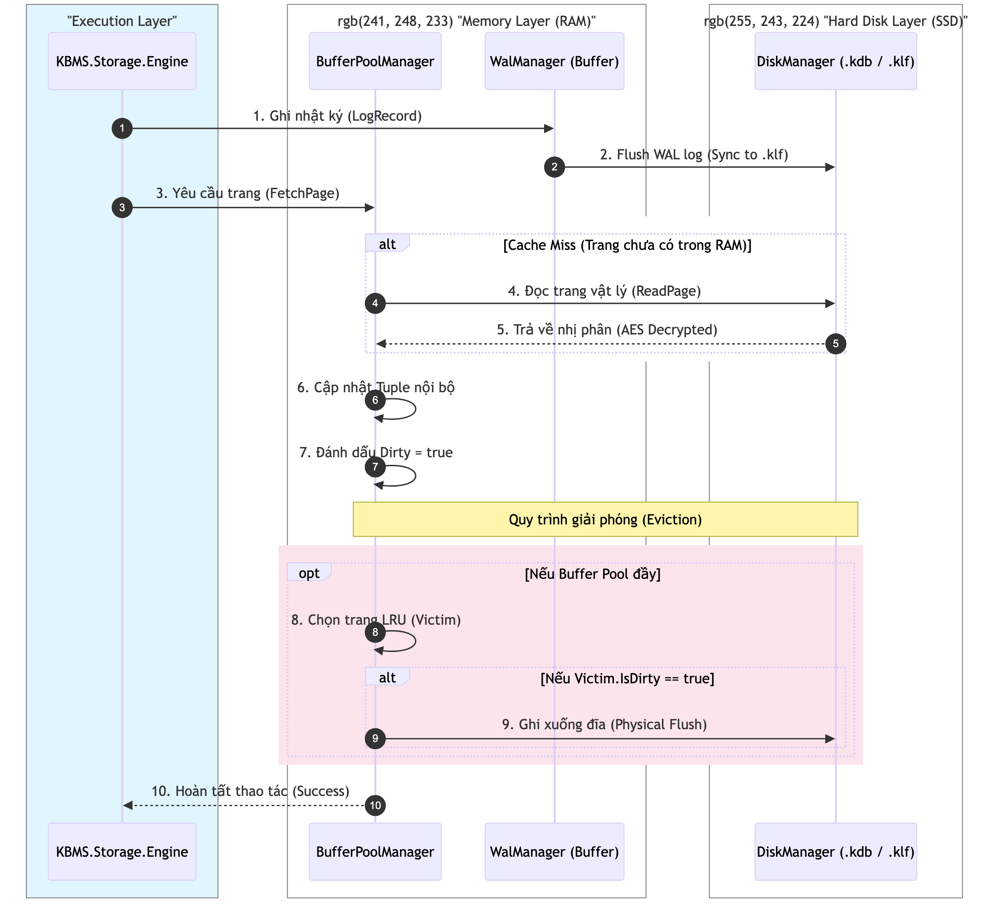
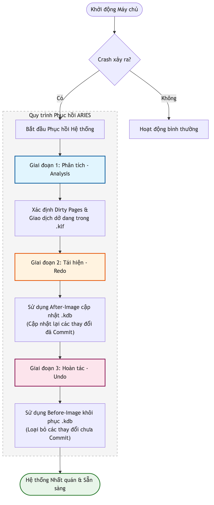

# 4.3.5 Tính Bền vững và Giao thức WAL (Durability & Consistency)

Tính bền vững (Durability) của các thực thể tri thức trong mọi kịch bản vận hành được đảm bảo bởi phân hệ `WalManagerV3`. Phân hệ này thực thi giao thức **Write-Ahead Logging (WAL)** nhằm duy trì trạng thái nhất quán của hệ thống theo tiêu chuẩn [ACID](../../00-glossary/01-glossary.md#acid).

## 4.3.5.1 Nguyên lý Hoạt động của Giao thức Write-Ahead Logging

Giao thức WAL quy định mọi thay đổi dữ liệu phải được lưu trữ vĩnh viễn trong tệp nhật ký giao dịch trước khi được áp dụng vào cấu trúc dữ liệu chính trong tệp cơ sở dữ liệu:

1.  **Thứ tự Ghi dữ liệu (Log-before-Data)**: Trước khi một trang dữ liệu bị sửa đổi (Dirty Page) được đồng bộ hóa từ bộ nhớ đệm xuống tệp tin `.kdb`, bản ghi nhật ký (LogRecord) tương ứng phải được ghi thành công vào tệp tập tin nhật ký `.klf`.
2.  **Mô hình Ghi Tuần tự (Append-only)**: Nhật ký giao dịch được triển khai theo mô hình ghi nối đuôi để tối ưu hóa hiệu suất thiết bị lưu trữ bằng cách thực thi các thao tác I/O tuần tự.

*Hình 4.15: Quy trình quản lý nhật ký giao dịch và đồng bộ hóa trang dữ liệu (I/O Pipeline).*

## 4.3.5.2 Cơ chế Quản lý Log Sequence Number (LSN)

Hệ thống sử dụng tham số **[LSN](../../00-glossary/01-glossary.md#lsn)** để định mức phiên bản và quản lý trình tự thời gian của các thay đổi:

-   **LSN Toàn cục**: Tham số được duy trì bởi `WalManagerV3`, giá trị tăng dần sau mỗi thao tác ghi nhật ký mới.
-   **LSN Trang**: Tham số được lưu trữ trong Header của mỗi trang Slotted Page, đại diện cho LSN của bản ghi nhật ký cuối cùng làm biến đổi nội dung của trang đó.
-   **Ràng buộc Nhất quán**: Một trang dữ liệu chỉ được phép đồng bộ hóa ghi xuống thiết bị lưu trữ nếu LSN của trang đó nhỏ hơn hoặc bằng LSN lớn nhất đã được ghi an toàn trên đĩa (`FlushedLSN`).

## 4.3.5.3 Quy trình Phục hồi Hệ thống (Recovery Process)

Trong trường hợp xảy ra sự cố ngừng hệ thống đột ngột, quy trình phục hồi sẽ tự động kích hoạt dựa trên tệp nhật ký `.klf` để tái thiết lập trạng thái nhất quán cho cơ sở tri thức.

*Hình 4.16: Lưu đồ các giai đoạn phục hồi dữ liệu dựa trên giải thuật ARIES.*

Quy trình phục hồi được chia thành 3 giai đoạn kĩ thuật:
1.  **Giai đoạn Phân tích (Analysis)**: Xác định danh sách các trang bị thay đổi và danh sách các giao dịch chưa hoàn tất tại thời điểm xảy ra sự cố thông qua quy trình quét tệp nhật ký.
2.  **Giai đoạn Tái hiện (Redo)**: Sử dụng các bản ghi After-Image trong nhật ký để thực thi lại các thay đổi vào các trang dữ liệu trong tệp `.kdb`, đảm bảo tính bền vững cho các giao dịch đã xác nhận.
3.  **Giai đoạn Hoàn tác (Undo)**: Sử dụng các bản ghi Before-Image để khôi phục trạng thái nguyên thủy của các trang bị ảnh hưởng bởi các giao dịch chưa hoàn tất, loại bỏ các thay đổi không hợp lệ.

## 4.3.5.4 Đặc tả Cấu trúc Bản ghi Nhật ký

Mỗi bản ghi nhật ký trong tệp `.klf` chứa các tham số kĩ thuật cần thiết cho quy trình phục hồi dữ liệu:

*Bảng 4.3: Đặc tả các trường dữ liệu của bản ghi LogRecord*
| Thành phần | Kiểu dữ liệu | Kích thước | Mô tả kĩ thuật |
| :--- | :--- | :--- | :--- |
| **TransactionID** | Guid | 16 Bytes | Mã định danh duy nhất của giao dịch. |
| **PageId** | Int32 | 4 Bytes | Chỉ số trang chịu tác động của thay đổi dữ liệu. |
| **BeforeLen** | Int32 | 4 Bytes | Độ dài vùng dữ liệu nguyên bản (phục vụ Undo). |
| **BeforeImage** | Binary | Biến thiên | Trạng thái trang trước khi thực hiện thay đổi. |
| **AfterLen** | Int32 | 4 Bytes | Độ dài vùng dữ liệu sửa đổi (phục vụ Redo). |
| **AfterImage** | Binary | Biến thiên | Trạng thái trang sau khi thực hiện thay đổi. |
| **IsCommitted** | Boolean | 1 Byte | Trạng thái xác nhận của giao dịch liên quan. |
