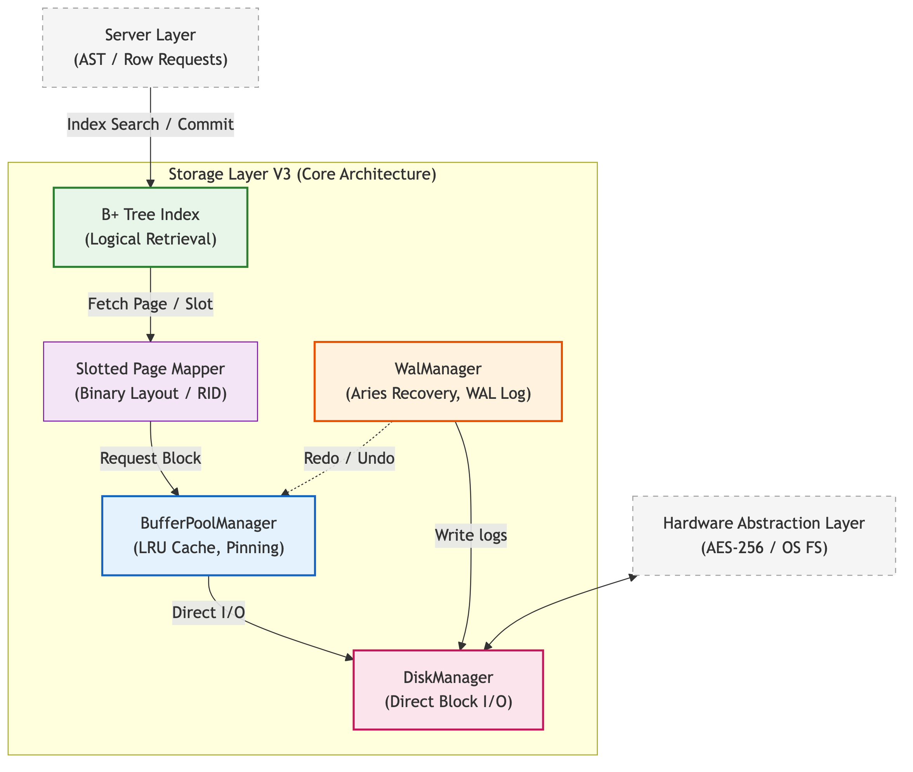

# Đặc tả Kiến trúc và Luồng Dữ liệu Tầng Lưu trữ

Kiến trúc lưu trữ của hệ quản trị **[KBMS](../../../00-glossary/01-glossary.md#kbms)** được thiết kế theo mô hình phân trang (**Paging**) hướng hiệu năng, thay thế các mô thức lưu trữ hướng đối tượng truyền thống để đáp ứng các bài toán tri thức quy mô lớn. Tầng lưu trữ không chỉ đóng vai trò là nơi lưu giữ dữ liệu, mà còn là một phân hệ điều phối giữa bộ nhớ tạm thời và thiết bị vật lý nhằm đảm bảo tính toàn vẹn và tốc độ truy xuất tối ưu.

## 1. Các Thành phần Chức năng và Phân lớp

Kiến trúc nội tại của Tầng Lưu trữ được phân rã thành các lớp chức năng chuyên biệt, phối hợp chặt chẽ để thực thi các yêu cầu từ Tầng Máy chủ. Sơ đồ dưới đây minh họa cấu trúc phân tầng thực tế của bộ máy lưu trữ:

*Hình 4.11: Sơ đồ phân tầng chức năng và điều phối các thành phần trong Tầng Lưu trữ KBMS.*

Theo thiết kế hệ thống, các thành phần được phân bổ theo các lớp chức năng sau:

1.  **Chỉ mục và Truy xuất Logic (Indexing)**: Sử dụng cấu trúc cây B+ (**B+ Tree**) làm thành phần then chốt để định vị nhanh chóng các bản ghi tri thức. Lớp này đóng vai trò cầu nối giữa yêu cầu truy vấn logic và vị trí vật lý của dữ liệu trên đĩa.
2.  **Phân trang và Bố cục Nhị phân (Slotted Page)**: Thành phần `Slotted Page Mapper` chịu trách nhiệm tổ chức dữ liệu bên trong mỗi trang 16KB. Thiết kế này cho phép quản lý linh hoạt các bản ghi có độ dài biến thiên mà không gây lãng phí không gian lưu trữ vật lý.
3.  **Điều phối Vùng đệm (Buffer Pool)**: Lớp `BufferPoolManager` thực hiện quản trị vùng nhớ đệm, áp dụng thuật toán thay thế trang LRU (Least Recently Used) và cơ chế ghim trang (Pinning) để giảm thiểu tối đa số lượng thao tác đọc/ghi trực tiếp từ thiết bị lưu trữ.
4.  **Đảm bảo Tính bền vững (Durability)**: Thành phần `WalManager` thực thi giao thức Nhật ký ghi trước (**Write-Ahead Logging - WAL**) theo chuẩn ARIES, đảm bảo mọi thay đổi tri thức được lưu vết an toàn trước khi cập nhật chính thức vào tệp tin cơ sở dữ liệu.
5.  **Giao tiếp Vật lý (Disk I/O)**: `DiskManager` đảm nhiệm vai trò tương tác trực tiếp với hệ điều hành, thực hiện các thao tác đọc/ghi khối dữ liệu (Block I/O) và quản lý cấu trúc tệp tin dữ liệu (.dat) cùng tệp tin nhật ký (.log).

## 2. Nguyên lý Vận hành và Đặc tính Kỹ thuật

Hệ thống lưu trữ của KBMS được xây dựng dựa trên các nguyên lý kỹ thuật hiện đại của hệ quản trị cơ sở dữ liệu quan hệ và tri thức:

-   **Cơ chế Nạp trang theo yêu cầu (Demand Paging)**: Dữ liệu chỉ được nạp vào bộ nhớ RAM khi có yêu cầu truy xuất, cho phép xử lý các cơ sở tri thức có dung lượng thực tế vượt ngưỡng giới hạn của bộ nhớ vật lý.
-   **Tính bền vững Tuyệt đối**: Thông qua giao thức nhật ký ghi trước, hệ thống có khả năng phục hồi hoàn toàn trạng thái tri thức ngay cả khi xảy ra các sự cố gián đoạn đột ngột về nguồn điện hoặc hệ thống.
-   **Tối ưu hóa Truy xuất Song hành**: Cấu trúc phân trang cho phép nhiều luồng xử lý truy cập độc lập vào các trang dữ liệu khác nhau, tối ưu hóa hiệu suất thực thi trong môi trường đa nhiệm.

Các nội dung tiếp theo sẽ đi sâu vào đặc tả chi tiết về cấu trúc dữ liệu nhị phân và logic triển khai của từng thành phần nêu trên.
