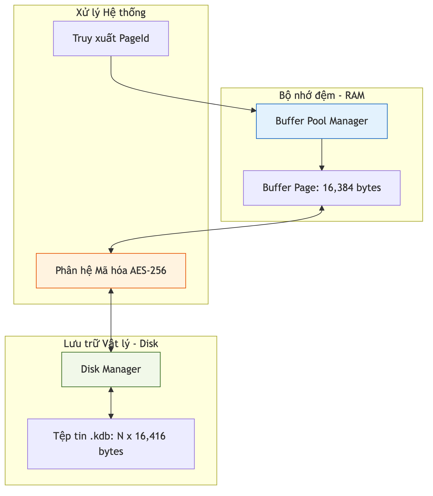

# Kiến trúc Tầng Lưu trữ

Tầng Lưu trữ là phân hệ thấp nhất của hệ quản trị KBMS, chịu trách nhiệm quản lý việc ghi dữ liệu tri thức xuống các thiết bị lưu trữ vật lý. Phân hệ này đảm bảo tính bền vững (Durability) và khả năng truy xuất ngẫu nhiên hiệu quả thông qua cấu trúc phân trang.

## 4.4.1. Sơ đồ Cấu trúc Phân hệ Storage

Kiến trúc tầng lưu trữ được tổ chức thành các thành phần chính sau:

1.  **Disk Manager**: Thành phần giao tiếp trực tiếp với hệ điều hành để thực hiện các thao tác đọc/ghi byte thô trên tệp tin `.kdb`.
2.  **Buffer Pool Manager**: Bộ quản lý vùng đệm trên RAM, giúp giảm thiểu số lượng thao tác I/O bằng cách giữ các trang dữ liệu thường xuyên truy cập trong bộ nhớ.
3.  **Page Management**: Định nghĩa cấu trúc vật lý của các khối dữ liệu 16KB, bao gồm Header và vùng dữ liệu Slotted Page.
4.  **Log Manager (WAL)**: Ghi lại mọi thay đổi vào tệp nhật ký trước khi thực hiện ghi lên đĩa, đảm bảo an toàn dữ liệu kể cả khi hệ thống gặp sự cố mất điện.

*Hình 4.9: Cấu trúc phân lớp và điều phối luồng dữ liệu tại Tầng Lưu trữ.*

## 4.4.2. Nguyên lý Truy xuất theo Trang (Page-based Access)

Hệ thống không đọc dữ liệu theo dòng (Stream) mà đọc theo từng khối cố định. Mỗi yêu cầu truy xuất dữ liệu từ các tầng trên đều được ánh xạ về một `PageId` cụ thể. 

Công thức tính toán vị trí vật lý trên đĩa (Offset):
$$Offset = PageId \times 16416$$

Kích thước 16,416 byte bao gồm 16KB dữ liệu logic và 32 byte dành cho phần bù mã hóa AES. Việc sử dụng kích thước cố định cho phép hệ thống thực hiện phép nhảy trực tiếp (`Seek`) đến vị trí cần thiết với độ phức tạp $O(1)$, không phụ thuộc vào kích thước tệp tin.

Cấu trúc này là nền tảng để triển khai các thuật toán chỉ mục phức tạp như Cây B+ và quản lý không gian trống một cách hiệu quả.
