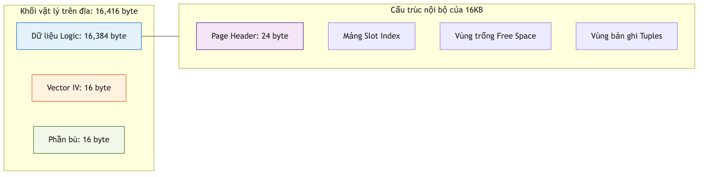

# Quản lý Trang Dữ liệu

Trang dữ liệu (Page) là đơn vị nhỏ nhất trong tiến trình đọc/ghi của KBMS. Chương này phân tích cấu trúc vật lý và logic của một khối dữ liệu 16KB khi lưu trữ trên đĩa cứng.

## 4.4.3. Cấu trúc vật lý của Trang Dữ liệu

KBMS định nghĩa một cấu trúc phân cấp cho một trang dữ liệu để đảm bảo việc bóc tách dữ liệu nhanh chóng và an toàn:

### Cụm trang vật lý (Physical Page Layout)

Mỗi trang khi được lưu trữ trên đĩa có kích thước thực tế là **16,416 byte**, được chia thành các phần sau:

1.  **Dữ liệu logic**: 16,384 byte (16KB) chứa các bản ghi tri thức và siêu dữ liệu của hệ thống.
2.  **Phần bù AES (IV & Padding)**: 32 byte bổ sung phục vụ cho quá trình mã hóa AES-256 (bao gồm 16 byte Vector khởi tạo IV và 16 byte phần bù dữ liệu).

### Cấu trúc nội bộ của Trang logic (16KB)

Bên trong 16,384 byte dữ liệu logic, KBMS chia thành 3 vùng chức năng chính:
-   **Page Header (24B)**: Chứa các thông tin quản trị như `PageId`, `LSN` (Log Sequence Number), và các con trỏ trang liên kết (`PrevPageId`, `NextPageId`).
-   **Slot Array**: Danh sách các con trỏ (Offset và Length) trỏ tới vị trí thực tế của từng bản ghi dữ liệu trong trang.
-   **Data Area**: Vùng chứa các chuỗi nhị phân (Tuples) đại diện cho các thực thể tri thức.

*Hình 4.10: Sơ đồ phân rã các vùng chức năng trong một trang dữ liệu 16KB.*

## 4.4.4. Phân rã Kích thước vật lý

Bảng dưới đây đặc tả chi tiết dung lượng chiếm dụng của từng thành phần trong một trang khi ở trạng thái lưu trữ tĩnh:

*Bảng 4.1: Đặc tả kích thước vật lý của một trang dữ liệu nhị phân*
| Thành phần | Kích thước (Bytes) | Vai trò |
| :--- | :--- | :--- |
| **Logic Data** | 16,384 | Dữ liệu tri thức thực tế (Slotted Page). |
| **AES IV** | 16 | Vector khởi tạo cho thuật toán AES-256. |
| **AES Padding** | 16 | Phần bù để đảm bảo kích thước khối 16 bytes. |
| **Tổng thể** | **16,416** | **Kích thước thực tế trên đĩa cứng**. |

Việc tách biệt rõ ràng giữa kích thước logic và vật lý cho phép `DiskManager` quản lý tệp tin một cách đồng nhất, trong khi `Encryption` có thể thực hiện bảo mật dữ liệu ở mức độ trang một cách độc lập.
