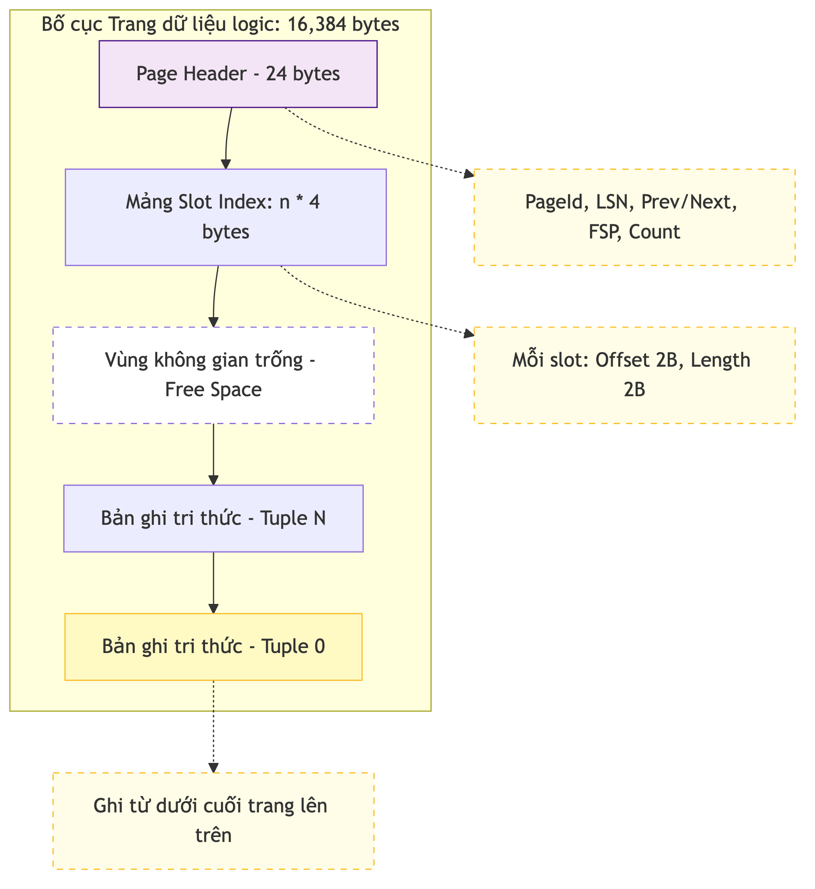

# Bố cục Dữ liệu và Slotted Page

KBMS sử dụng mô hình Slotted Page để quản lý các bản ghi (Tuples) có độ dài biến thiên trong một trang cố định 16KB. Chương này cung cấp ví dụ thực tế về cách dữ liệu được ánh xạ vào các ô nhớ nhị phân.

## 4.4.5. Cơ chế Ánh xạ Ô nhớ (Slotted Page Mapping)

Trong mô hình Slotted Page, dữ liệu bản ghi được ghi từ cuối trang ngược lên phía đầu trang. Vùng không gian trống (Free Space) nằm ở giữa Header và các bản ghi:

-   **Header**: Chứa thông tin về số lượng bản ghi và con trỏ vùng trống.
-   **Slot Array**: Các cặp `[Offset, Length]` trỏ đến dữ liệu thực tế.
-   **Tuples**: Dữ liệu tri thức nhị phân của các đối tượng.


*Hình 4.11: Minh họa vị trí thực tế của một thực thể tri thức trong bộ nhớ nhị phân.*

## 4.4.6. Ví dụ Phân rã mã Hex (Hex Dump)

Giả sử một trang dữ liệu (`PageId=101`) chứa một thực thể `Employee` có kích thước 43 byte. Dưới đây là mô phỏng 64 byte đầu tiên của trang (khi đã giải mã):

```text
Offset    00 01 02 03 04 05 06 07 08 09 0A 0B 0C 0D 0E 0F    Giải mã
-------------------------------------------------------------------------
; --- Header của Trang (Bắt đầu trang) ---
00000000  65 00 00 00 00 00 00 00 FF FF FF FF FF FF FF FF    ........
          [ PageId: 101 ] [ LSN: 0  ] [ PrevPageId: -1    ]
00000010  FF FF FF FF D5 3F 00 00 01 00 00 00 D5 3F 00 00    .....?.......?..
          [ Next: -1  ] [ FSP:16341] [ Count: 1 ] [Slot0: Off=16341, Len=43]

[...] (Vùng trống điền giá trị 0x00)

; --- Dữ liệu Tuple (Cuối trang, tại Offset 16341) ---
00003FD0  00 00 00 00 00 04 00 1A 00 28 00 2A 00 2B 00 99    ................
          [ T-Head (Len=4) ][ F0 Off ][ F1 Off ][ F2 Off ][ F3 Off ]
00003FE0  99 99 99 88 88 77 77 66 66 55 55 55 55 55 55 61    .....wwffUUUUUUa
          [ Field 0: ObjID GUID (16 bytes)                ]
```

### Phân tích cấu trúc Hex (Storage Logic)

Phân đoạn Hex trên mô tả cách KBMS lưu trữ tri thức một cách "linh hoạt trong sự cố định":

- **Page Header**: Trường `0x65` (Hex) tại Offset 0 xác định định danh trang ($101_{10}$). Trường `FSP = 16341` (Hex: `D5 3F`) đặc biệt quan trọng: nó báo hiệu rằng dữ liệu bản ghi tiếp theo sẽ được ghi vào vùng trống bắt đầu từ byte thứ 16341, đảm bảo không ghi đè lên Header hoặc Slot Array.
- **Slot Array (Offset 28)**: Chứa giá trị `[D5 3F 2B 00]`. Điều này có nghĩa: bản ghi số 0 (Slot 0) nằm tại Offset 16341 (Hex: `D5 3F`) và có độ dài 43 byte (Hex: `2B`). 
- **Dữ liệu Tuple (Offset cuối trang)**: Bản ghi Employee không nằm ngay sau Header mà nằm ở cuối cùng của trang logic ($16383 - 42$). Cách bố trí "đầu Header - cuối Data" cho phép không gian trống ở giữa co dãn linh hoạt khi số lượng bản ghi thay đổi, tối ưu hóa dung lượng lưu trữ đĩa.

### Giải thích các con số:
-   **Page Header**: `PageId=65` (101 trong hệ thập phân), `FSP=16341` (Vị trí bắt đầu vùng trống).
-   **Slot Array**: `Slot0` chỉ ra rằng bản ghi đầu tiên nằm ở vị trí 16341 và dài 43 byte.
-   **Tuple Payload**: Chứa mã GUID định danh đối tượng và các giá trị thuộc tính đã được tuần tự hóa.

Cấu trúc Slotted Page giúp KBMS có thể thực hiện các thao tác thêm, xóa và cập nhật tri thức một cách linh hoạt mà không cần phải di chuyển toàn bộ dữ liệu trong tệp tin lưu trữ.
