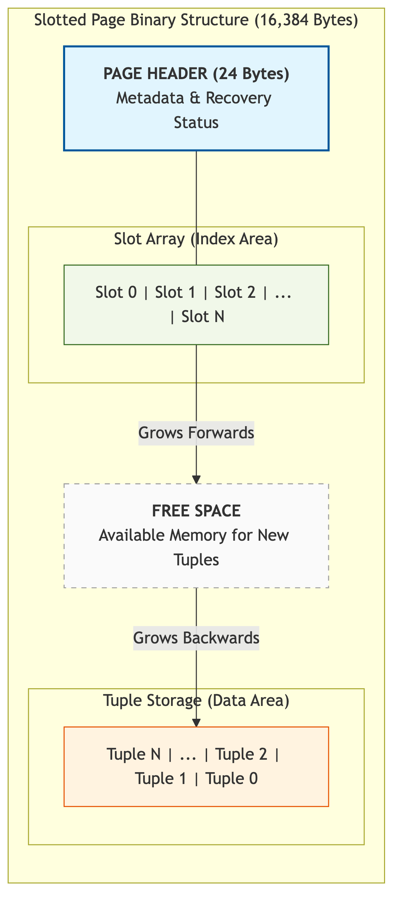

# Đặc tả Cấu trúc Dữ liệu Phân khe (Slotted Page)

Hệ thống **[KBMS](../../../00-glossary/01-glossary.md#kbms)** sử dụng cấu trúc **Trang phân khe** (**Slotted Page**) làm đơn vị phân trang cơ sở. Mô hình này được áp dụng nhằm quản trị các thực thể tri thức có kích thước biến thiên và tối ưu hóa việc phân bổ không gian lưu trữ thực tế bên trong mỗi trang dữ liệu nhị phân.

## 1. Tổ chức Phân vùng Dữ liệu Nội tại

Một trang dữ liệu tiêu chuẩn có dung lượng **16,384 Bytes** (16 KB) được cấu trúc thành các phân vùng chức năng sau:

*Hình 4.13: Sơ đồ tổ chức phân vùng dữ liệu trong cấu trúc trang phân khe.*

1.  **Tiêu đề Trang (Page Header - 24 Bytes)**: Chứa các trường dữ liệu điều phối, định danh trang và các liên kết cấu trúc phục vụ quản lý chuỗi trang (Sequential Access).
2.  **Mảng Khe lưu trữ (Slot Array)**: Danh sách các con trỏ logic (Slots), mỗi khe có kích thước cố định 8 Bytes (`[Địa chỉ dời (Offset): 4B | Độ dài (Length): 4B]`). Vùng này phát triển tịnh tiến từ sau phần Tiêu đề.
3.  **Vùng không gian nhớ trống (Free Space)**: Vùng nhớ khả dụng nằm giữa Mảng khe lưu trữ và vùng lưu trữ dữ liệu thực tế.
4.  **Vùng lưu trữ Bản ghi (Record Storage)**: Vùng lưu trữ các thực thể tri thức dưới định dạng nhị phân, được cấp phát từ cuối trang (High-address) và phát triển ngược về phía đầu trang (Low-address).

## 2. Đặc tả Kỹ thuật của Tiêu đề Trang (Page Header)

Tiêu đề trang lưu trữ các tham số kỹ thuật trọng yếu để duy trì cấu trúc cây B+ và hỗ trợ các giao thức phục hồi dữ liệu:

*Bảng 4.2: Đặc tả cấu trúc Page Header và ý nghĩa các trường dữ liệu*
| Byte Offset | Trường dữ liệu | Kiểu | Đặc tả Chức năng |
| :--- | :--- | :--- | :--- |
| **0 - 3** | **PageId** | Int32 | Định danh vật lý duy nhất của trang trong cơ sở tri thức. |
| **4 - 7** | **LSN** | Int32 | Số tuần tự nhật ký (Log Sequence Number) đánh dấu phiên bản giao dịch. |
| **8 - 11** | **PrevPageId** | Int32 | Định danh trang liền trước trong cấu trúc liên kết kép. |
| **12 - 15** | **NextPageId** | Int32 | Định danh trang kế tiếp trong cấu trúc liên kết kép. |
| **16 - 19** | **FreeSpacePtr**| Int32 | Con trỏ đánh dấu vị trí bắt đầu của vùng nhớ trống khả dụng. |
| **20 - 23** | **SlotCount** | Int32 | Tổng số lượng khe lưu trữ hiện hữu trong trang dữ liệu. |

## 3. Cơ chế Quản lý Thực thể Tri thức

Cấu trúc trang phân khe hỗ trợ các thao tác quản lý dữ liệu với hiệu quả thực thi tối ưu:

-   **Thao tác Chèn (Insertion)**: Dữ liệu nhị phân được ghi vào vùng nhớ trống theo cơ chế cấp phát ngược chiều. Một khe lưu trữ mới được khởi tạo để lưu trữ địa chỉ dời và độ dài thực tế. Định danh bản ghi (RID) được xác định trực tiếp bằng bộ giá trị `(PageId, SlotId)`.
-   **Thao tác Truy xuất (Access)**: Hệ thống sử dụng Mảng khe lưu trữ như một bảng chỉ mục nội tại. Việc truy xuất dữ liệu thông qua `SlotId` đạt độ phức tạp thời gian **$O(1)$** nhờ khả năng tính toán địa chỉ tuyệt đối trực tiếp.
-   **Thao tác Thu hồi và Tái cấu trúc (Vacuuming & Compaction)**: Khi một bản ghi bị loại bỏ, khe tương ứng sẽ được đánh dấu trạng thái trống. Hệ thống thực hiện quy trình tái cấu trúc dữ liệu (**Compaction**) để thu hồi không gian nhớ liên tục khi có yêu cầu cấp phát mới hoặc theo định kỳ quản trị.

Cấu trúc tiêu đề cố định kết hợp với cơ chế cấp phát ngược chiều đảm bảo tính linh hoạt tối đa cho các thay đổi về kích thước dữ liệu mà không làm phá vỡ các tham chiếu logic đến thực thể.
