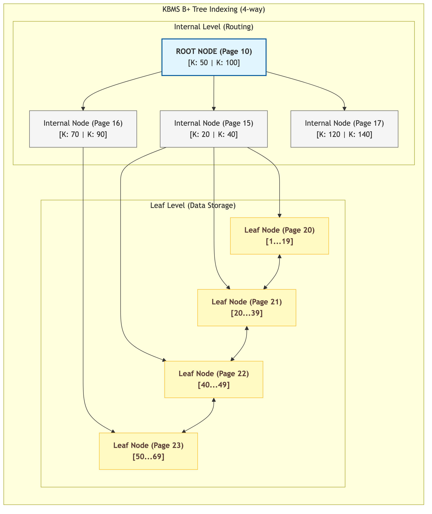

# Đặc tả Module Chỉ mục Cây B+

Hệ quản trị **[KBMS](../../../00-glossary/01-glossary.md#kbms)** quản lý việc lưu trữ và truy xuất các thực thể tri thức dựa trên cấu trúc dữ liệu **Cây B+** (B+ Tree). Đây là một cấu trúc cây cân bằng đa cấp được tối ưu hóa cho các hệ thống lưu trữ phân trang, giúp duy trì hiệu năng cao cho các thao tác truy vấn tri thức quy mô lớn.

## 1. Cấu trúc Nốt và Ràng buộc Hệ thống

Cấu trúc Cây B+ bao gồm các nốt trung gian (Internal Nodes) và các nốt lá (Leaf Nodes). Mỗi nốt được triển khai dưới dạng một trang phân khe độc lập. Sự phân cấp này đảm bảo hiệu quả truy xuất và khả năng mở rộng của hệ thống chỉ mục:

-   **Nốt Trung gian**: Lưu trữ các cặp dữ liệu `[Khóa (Key) | ID Trang con (Child PageId)]`. Chức năng chính là điều phối quy trình điều hướng trong các thao tác tìm kiếm khóa.
-   **Nốt Lá**: Lưu trữ các cặp dữ liệu `[Khóa (Key) | Định danh bản ghi (RID)]`. Các nốt lá được liên kết thông qua cấu trúc danh sách liên kết kép (`PrevPageId` và `NextPageId`), hỗ trợ các truy vấn quét phạm vi (Range Scans).

Các ràng buộc cấu trúc cốt lõi:
1.  **Tính Cân bằng (Balanced Property)**: Mọi nốt lá trong cây luôn nằm ở cùng một độ sâu (Depth), đảm bảo tính nhất quán của độ phức tạp truy xuất dữ liệu.
2.  **Độ Phức tạp Thời gian**: Hiệu năng của các thao tác tìm kiếm, chèn và xóa dữ liệu được duy trì ở mức **$O(\log_b n)$**, với $b$ là bậc (Fan-out) của nốt. Với kích thước trang 16KB, hệ thống đạt được bậc phân hướng cao ($b \approx 500$), giúp duy trì độ sâu cây ở mức thấp ngay cả với tập dữ liệu hàng triệu thực thể.

## 2. Quy trình Phân tách Trang và Tái cân bằng

Khi một nốt đạt giới hạn dung lượng khả dụng trong quá trình chèn dữ liệu mới, hệ thống thực thi quy trình **Phân tách Trang** (Page Splitting) để tái lập tính cân bằng:

1.  **Khởi tạo Trang mới**: Một trang nhị phân mới được cấp phát thông qua module quản lý vùng đệm.
2.  **Phân bổ Dữ liệu**: Một nửa số lượng bản ghi của nốt hiện tại được chuyển sang trang mới để giải phóng không gian nhớ.
3.  **Cập nhật Nốt cha**: Khóa phân tách (Separator Key) và định danh của trang mới sẽ được chèn vào nốt cấp trên tương ứng. Quy trình này được thực thi đệ quy ngược lên cho đến nốt gốc (Root).

*Hình 4.14: Sơ đồ phân cấp cấu trúc và cơ chế liên kết nốt lá trong hệ thống chỉ mục Cây B+.*

## 3. Cơ chế Duyệt và Truy xuất Tri thức

Cấu trúc Cây B+ đóng vai trò là module điều phối trung gian hiệu quả giữa yêu cầu truy vấn logic và tầng thực thi vật lý:

-   **Định vị Thực thể**: Hệ thống sử dụng định danh của **[Concept](../../../00-glossary/01-glossary.md#concept)** và **[Fact](../../../00-glossary/01-glossary.md#fact)** làm khóa chính, cho phép định vị dữ liệu thực thể thông qua một chu trình duyệt cây duy nhất.
-   **Truy vấn Quét phạm vi**: Nhờ sự liên kết trực tiếp giữa các nốt lá, các thao tác liệt kê thực thể hoặc truy vấn tập hợp được thực thi tối ưu mà không tiêu tốn chi phí tái duyệt cấu trúc cây từ nốt gốc.
