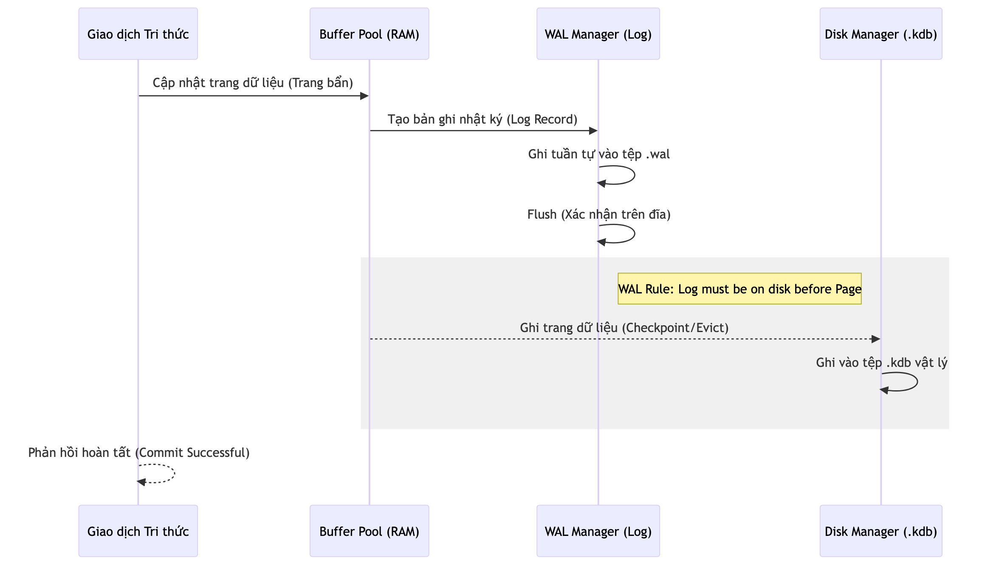

# Nhật ký Ghi trước (WAL) và Tính bền vững

Nhật ký Ghi trước (Write-Ahead Logging - WAL) là kỹ thuật quan trọng nhất để đảm bảo các thuộc tính ACID cho hệ quản trị KBMS. Phương pháp này giúp hệ thống khôi phục hoàn toàn dữ liệu tri thức sau các sự cố phần cứng hoặc phần mềm.

## 4.4.9. Nguyên lý Hoạt động của WAL

Mọi thay đổi trên các trang dữ liệu trong Buffer Pool đều không được ghi ngay xuống tệp tin `.kdb` chính. Thay vào đó:

1.  **Ghi nhật ký**: Bản ghi thay đổi (Log Record) được tạo ra và ghi vào tệp nhật ký `.wal` tuần tự.
2.  **Số LSN (Log Sequence Number)**: Mỗi trang dữ liệu được gán một số LSN tương ứng với bản ghi nhật ký mới nhất tác động lên nó.
3.  **Quy luật WAL**: Không có trang dữ liệu nào được phép ghi xuống đĩa nếu các bản ghi nhật ký có LSN nhỏ hơn hoặc bằng LSN của trang đó chưa được lưu trữ an toàn trên đĩa.

*Hình 4.13: Sơ đồ luồng dữ liệu giữa Buffer Pool, tệp Log và tệp dữ liệu chính.*

## 4.4.10. Phục hồi Dữ liệu (Recovery)

Khi hệ thống khởi động lại sau một sự cố, phân hệ `Storage` sẽ thực hiện quy trình phục hồi gồm 3 giai đoạn:

-   **Phân tích (Analysis)**: Quét tệp nhật ký để xác định các trang dữ liệu "bẩn" (Dirty Pages) chưa được ghi xuống đĩa chính.
-   **Tái hiện (Redo)**: Thực hiện lại các thao tác đã được ghi trong nhật ký để khôi phục trạng thái mới nhất của cơ sở tri thức trên RAM.
-   **Hoàn tác (Undo)**: Hủy bỏ các thay đổi từ các giao dịch chưa kịp hoàn tất (Commit) trước thời điểm xảy ra sự cố.

Nhờ có WAL, KBMS có thể duy trì hiệu năng ghi dữ liệu cao thông qua truy cập đĩa tuần tự (Sequential I/O) mà vẫn đảm bảo tính an toàn tuyệt đối cho kho t thức.
