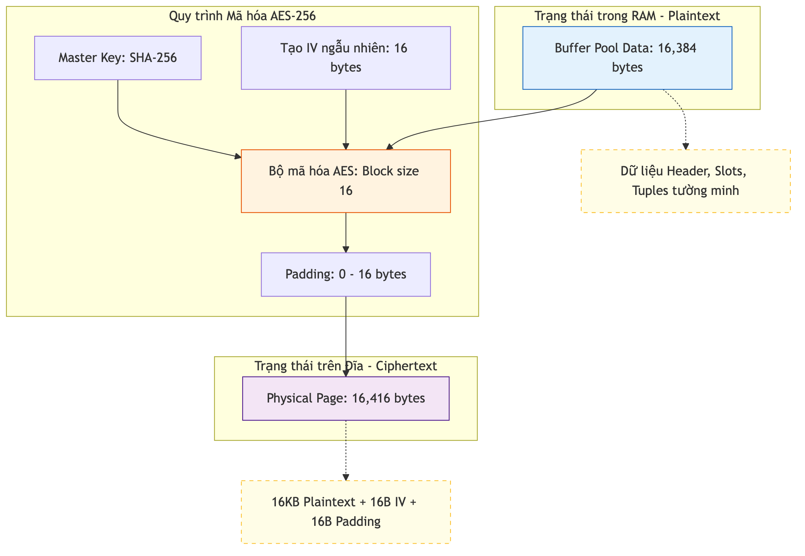

# Mã hóa Dữ liệu tĩnh (AES-256)

Tầng thấp nhất của phân hệ Storage chịu trách nhiệm bảo vệ dữ liệu tĩnh (Data-at-Rest) thông qua các thuật toán mã hóa hiện đại. Điều này đảm bảo rằng các tệp tin cơ sở tri thức `.kdb` không thể bị đọc hoặc khai thác trái phép nếu bị đánh cắp vật lý.

## 4.4.13. Cơ chế Mã hóa mức Trang (Page-level Encryption)

Hệ quản trị KBMS thực hiện mã hóa dữ liệu ở mức độ từng trang (Page) trước khi ghi xuống đĩa cứng. Quy trình này diễn ra hoàn toàn trong bộ nhớ RAM an toàn trước khi dữ liệu chạm tới lớp trình điều khiển tệp tin.

-   **Thuật toán**: AES-256 (Advanced Encryption Standard).
-   **Khóa mã hóa**: Được băm (`Hashing`) từ khóa bí mật của người dùng bằng thuật toán SHA256.
-   **Cơ chế IV**: Mỗi trang dữ liệu khi ghi xuống đều được gán một Vector khởi tạo (IV) riêng biệt dài 16 byte để đảm bảo tính ngẫu nhiên, ngăn chặn các cuộc tấn công dựa trên sự lặp lại của dữ liệu.


*Hình 4.14: Sơ đồ biến đổi dữ liệu giữa Buffer Pool (Plaintext) và Disk Manager (Ciphertext).*

## 4.4.14. So sánh Dữ liệu: Trước và Sau khi Giải mã

Dưới đây là minh họa sự khác biệt giữa dữ liệu được lưu trữ "tĩnh" trên đĩa (Ciphertext) và dữ liệu "động" trong bộ nhớ RAM sau khi đã giải mã (Plaintext):

### A. Dữ liệu trên Đĩa (Ciphertext)
Đây là dữ liệu thô mà kẻ tấn công nhìn thấy khi mở file bằng công cụ Hex Editor chuyên dụng.

```text
Offset    00 01 02 03 04 05 06 07 08 09 0A 0B 0C 0D 0E 0F    Dữ liệu tĩnh
----------------------------------------------------------------------------
00000000  4A 8F 22 C1 90 EB 44 12 AE 33 01 99 FF 2B 73 88    <- 16B IV Part 1
00000010  C2 10 93 42 11 00 55 EF 88 23 12 77 66 11 9A BB    <- 16B IV Part 2
00000020  7F 1A 2C ... (Dòng dữ liệu bị xáo trộn mã hóa)     <- AES Payload
```
Do được mã hóa, dữ liệu trên đĩa không có cấu trúc định dạng. Các trường thông tin quan trọng như `PageId` hay nội dung tri thức hoàn toàn ở trạng thái "rác vô nghĩa".

### B. Dữ liệu trong RAM (Decrypted Plaintext)
Sau khi `DiskManager` đọc tệp, tách IV và giải mã, dữ liệu trở về trạng thái có cấu trúc để sẵn sàng phục vụ xử lý tri thức tại tầng Server.

```text
Offset    00 01 02 03 04 05 06 07 08 09 0A 0B 0C 0D 0E 0F    Dữ liệu động
----------------------------------------------------------------------------
00000000  65 00 00 00 00 00 00 00 FF FF FF FF FF FF FF FF    <- [PageId: 101]
00000010  FF FF FF FF D2 3F 00 00 01 00 00 00 D2 3F 00 00    <- [FSP: 16k...]
```
### Phân tích Bảo mật Dữ liệu (Encryption Logic)

So sánh hai khối Hex trên minh họa cơ chế bảo vệ "đa lớp" tại Tầng Lưu trữ của KBMS:

1.  **Dải Nhiễu Ngẫu nhiên (Disk Layout)**: Ở dạng Ciphertext, dữ liệu hoàn toàn không có dấu vết của các cấu trúc quen thuộc (như `PageId` hay `LSN`). Byte đầu tiên là một phần của IV chứ không phải ID của trang. Điều này ngăn chặn việc đọc trộm các thông tin nhạy cảm ngay cả khi tệp tin bị truy cập ngoài hệ thống.
2.  **Khôi phục Cấu trúc (RAM Logic)**: Sau khi qua bộ giải mã con trỏ, dữ liệu trở lại dạng `0x65 0x00...` tại đúng Offset 0. Điều này cho phép `BufferPoolManager` làm việc với dữ liệu tường minh một cách hiệu quả nhất, trong khi vẫn duy trì sự an toàn ở mức vật lý.
3.  **Toàn vẹn Dữ liệu**: Việc sử dụng AES-256 kết hợp IV ngẫu nhiên cho từng trang đảm bảo rằng cùng một nội dung tri thức nếu ghi vào hai trang khác nhau sẽ cho ra hai chuỗi Byte Ciphertext hoàn toàn khác nhau trên đĩa.

Cơ chế này đạt được sự cân bằng tối ưu giữa tính bảo mật tuyệt đối cho dữ liệu tri thức và hiệu năng truy xuất thực tế của hệ thống.
```

## 4.4.15. Tính toán Dung lượng và Hiệu năng

Việc tích hợp mã hóa ở tầng thấp yêu cầu một khoản chi phí về dung lượng tốn kém (Overhead) nhưng đổi lại là tính bảo mật dữ liệu tuyệt đối:

-   **Dung lượng gia tăng**: ~0.2% (32 byte cho mỗi trang 16KB).
-   **Hiệu năng CPU**: Tác động không đáng kể nhờ sự hỗ trợ của tập lệnh tăng tốc phần cứng AES-NI trên các vi xử lý hiện đại.

Cơ chế này đảm bảo dữ liệu tri thức luôn an toàn xuyên suốt vòng đời từ khi được tạo ra cho đến khi được lưu trữ vĩnh viễn trên thiết bị.
