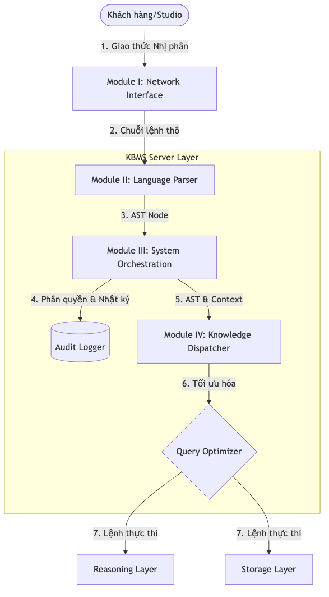

# 4.5.1. Tổng quan Kiến trúc Tầng Máy chủ (KBMS Server Layer)

Tầng Máy chủ của [KBMS](../../../00-glossary/01-glossary.md#kbms) được thiết kế như một hệ sinh thái xử lý tri thức hợp nhất, chịu trách nhiệm điều phối luồng dữ liệu giữa người dùng và các tầng lưu trữ/suy diễn cấp thấp. Kiến trúc này được chuẩn hóa nhằm đảm bảo tính toàn vẹn của tri thức, hiệu suất xử lý đồng thời (concurrency) và khả năng tự quản trị (Self-managed).

## 1. Bản đồ Hành trình của một Truy vấn (Request Journey)

Quy trình vận hành được minh họa thông qua hành trình của một yêu cầu tri thức, đi qua các lớp trừu tượng từ thô đến tinh:

*Hình 4.xx: Sơ đồ Master Architecture của tầng Máy chủ KBMS V3.*

## 2. Các Phân hệ Thành phần (Modular Decomposition)

Kiến trúc Tầng Máy chủ được phân rã thành 4 phân hệ logic chính với các trách nhiệm biệt lập:

*Bảng: Phân bổ trách nhiệm các phân hệ thuộc Tầng Máy chủ*
| Phân hệ (Module) | Thành phần C# Chính | Vai trò Lõi | Đầu vào | Đầu ra |
| :--- | :--- | :--- | :--- | :--- |
| **I. Network Layer** | `KbmsServer.cs`, `Protocol.cs` | Quản trị kết nối TCP & Giao thức nhị phân | Byte thô | Chuỗi lệnh KBQL |
| **II. Language Parser** | `Lexer.cs`, `Parser.cs` | Phân tích cú pháp & Xây dựng AST | Chuỗi lệnh | Cây AST Node |
| **III. System Core** | `ServerOrchestrator.cs` | Điều phối đa luồng, RBAC & Audit Log | Cây AST | AST đã xác thực |
| **IV. Query Engine** | `KnowledgeManager.cs` | Định tuyến tri thức & Tối ưu kế hoạch | Cây AST | Lệnh thực thi |

1.  **Phân hệ I: Giao diện mạng & Giao thức**: Thiết lập kênh truyền dẫn tin cậy, thực hiện giải mã gói tin nhị phân và duy trì phiên giao dịch (Session).
2.  **Phân hệ II: Trình phân tích Ngôn ngữ**: Đóng vai trò là "cơ quan cảm giác", chuyển hóa ngôn ngữ tự nhiên từ người dùng thành các đối tượng logic lập trình được (AST).
3.  **Phân hệ III: Hạ tầng Điều phối & Giám sát**: Đảm nhiệm vai trò "xương sống" quản lý tài nguyên hệ thống, bảo mật RBAC và cơ chế ghi nhật ký tự thân (Self-logging).
4.  **Phân hệ IV: Điều hướng và Tối ưu hóa**: Thành phần hạt nhân chịu trách nhiệm lựa chọn kế hoạch thực thi (Execution Plan) tối ưu nhất trước khi chuyển tới các tầng dữ liệu.

Trong các tiểu mục tiếp theo, các đặc tả kỹ thuật và cơ chế vận hành của từng phân hệ sẽ được trình bày chi tiết theo đúng trình tự của một đường ống xử lý tri thức. Phân hệ đầu tiên cần xem xét là Tầng Mạng, nơi thiết lập nền móng giao tiếp giữa Client và Server.
