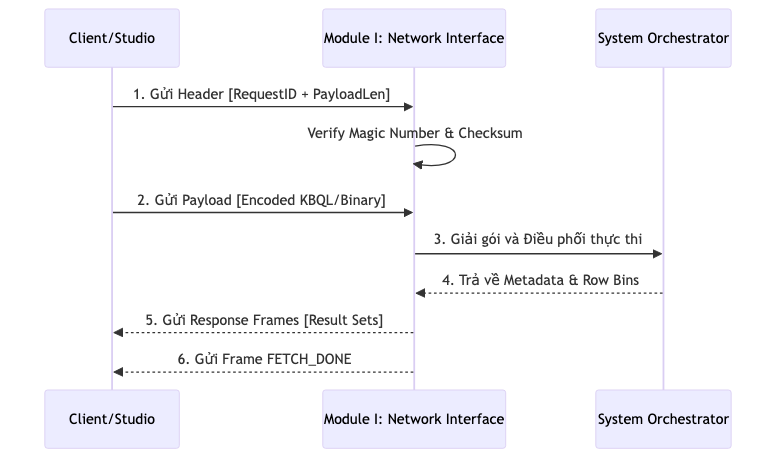

# 4.5.2.1. Giao tiếp và Giao thức Nhị phân (Binary Protocol Layer)

Phân hệ I (Network Layer) của Tầng Máy chủ chịu trách nhiệm tiếp nhận các luồng byte thô từ kết nối TCP, thực hiện giải mã và xác thực gói tin trước khi bàn giao nội dung cho các bộ xử lý ngôn ngữ. Để đạt được hiệu năng tối ưu và khả năng tương thích cao giữa Server (C#), [CLI](../../00-glossary/01-glossary.md#cli) và Studio (Node.js/[Electron](../../00-glossary/01-glossary.md#electron)), [KBMS](../../00-glossary/01-glossary.md#kbms) V3 sử dụng một giao thức truyền tải nhị phân ([Binary Protocol](../../00-glossary/01-glossary.md#binary-protocol)) tùy chỉnh chạy trên nền TCP.

## 1. Luồng Trao đổi Thông điệp Nhị phân (Protocol Flow)

Quy trình tương tác giữa Client và Server được chuẩn hóa thông qua các khung (Frames) nhị phân, đảm bảo tính toàn vẹn và tốc độ xử lý:

*Hình 4.xx: Sơ đồ trình tự trao đổi thông điệp nhị phân giữa Client và Module I.*

---

## 2. Cấu trúc Gói tin (Binary Frame Structure)

Mọi thông điệp trao đổi giữa Client và Server đều được đóng gói theo định dạng nhị phân với [Header](../../00-glossary/01-glossary.md#header) cố định và Payload biến thiên. Cấu trúc này giúp giảm thiểu chi phí phân tích (parsing overhead) so với các giao thức dựa trên văn bản như HTTP/REST.

### Đặc tả Header nhị phân:

*Bảng: Đặc tả Header của Giao thức truyền tải nhị phân*
| Byte Offset | Trường dữ liệu | Kiểu | Mô tả |
| :--- | :--- | :--- | :--- |
| **0 - 3** | **Total Length**| Int32 | Tổng kích thước gói tin (Big-Endian). |
| **4** | **Message Type**| Byte | Loại thông điệp (LOGIN, QUERY, RESULT, ...). |
| **5 - 6** | **SessionLen** | UInt16 | Độ dài của Session ID chuỗi. |
| **7 - N** | **Session ID** | String | Định danh phiên làm việc (UTF-8). |
| **N+1 - N+2**| **RequestLen** | UInt16 | Độ dài của Request ID chuỗi. |
| **N+3 - M** | **Request ID** | String | Định danh yêu cầu (Dùng để bắt cặp phản hồi). |
| **M+1 - End** | **Payload** | String | Nội dung chính của thông điệp (JSON/Text/Binary). |

---

## 3. Danh mục Loại thông điệp (Command Codes)

Hệ thống sử dụng các mã lệnh (Command Codes) để định nghĩa ngữ cảnh xử lý cho từng gói tin:

*Bảng: Danh mục Command Codes và Phân loại loại thông điệp*
| Giá trị | Tên loại | Mục đích sử dụng |
| :--- | :--- | :--- |
| **1** | **LOGIN** | Gửi thông tin đăng nhập (User/Pass). |
| **2** | **QUERY** | Gửi mã nguồn KBQL để thực hiện suy diễn/truy vấn. |
| **3** | **RESULT** | Trả về thông tin kết quả đơn lẻ hoặc thông báo thành công. |
| **4** | **ERROR** | Trả về thông tin lỗi (Runtime, Parser, Auth). |
| **6** | **METADATA** | Trả về định nghĩa cột và dữ liệu thống kê của tập kết quả. |
| **7** | **ROW** | Trả về một lô (Batch) dữ liệu kết quả dưới dạng lưới. |
| **8** | **FETCH_DONE** | Thông báo đã hoàn tất việc gửi dữ liệu cho một Request. |
| **10** | **STATS** | Yêu cầu/Trả về thông số hiệu năng hệ thống (ROOT only). |
| **11** | **LOGS_STREAM** | Đăng ký nhận luồng log thời gian thực từ Server (ROOT only). |

---

## 4. Quy trình Trao đổi (Handshake & Pipelining)

1.  **Xác thực Phiên (Handshake)**: Client khởi tạo gói `LOGIN`. Hệ thống kiểm tra thông tin định danh và trả về `RESULT:SUCCESS` kèm theo một `Session ID` duy nhất để sử dụng cho các yêu cầu tiếp theo.
2.  **Đa luồng hóa Yêu cầu (Pipelining)**: Nhờ có `RequestId`, Client có khả năng gửi nhiều yêu cầu đồng thời mà không cần chờ đợi phản hồi tuần tự (Asynchronous Multiplexing). Mỗi phản hồi từ Server sẽ mang theo `RequestId` tương ứng để Client bóc tách dữ liệu chính xác.
3.  **Hỗ trợ đa ngôn ngữ**: Toàn bộ chuỗi ký tự (SessionID, Payload) được mã hóa theo chuẩn UTF-8, đảm bảo tính nhất quán của tri thức tiếng Việt khi truyền dẫn giữa các nền tảng (C#, Node.js).

Sau khi Module I hoàn tất việc giải mã Payload từ giao thức nhị phân, nội dung này sẽ được chuyển giao cho các bộ xử lý logic cấp cao hơn để bắt đầu vòng đời thực thi của một truy vấn tri thức.
