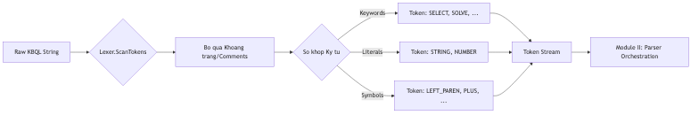

# 4.5.3.1. Phân tích Từ vựng (Lexical Analysis)

Phân hệ II (Language Parser) tiếp nhận chuỗi ký tự KBQL thô đã được giải mã từ Module I (Network Layer). Thành phần đầu tiên của phân hệ này là `Lexer.cs`, chịu trách nhiệm thực hiện quá trình quét chuỗi (Scanning) với độ phức tạp thời gian $O(L)$ (với $L$ là độ dài chuỗi) để phân rã văn bản thành một danh sách các đơn vị ngôn ngữ cơ bản gọi là **Tokens**.

## 1. Dòng chảy Phân tích Từ vựng (Lexing Flow)

Bộ Lexer vận hành như một máy trạng thái hữu hạn (Finite State Machine), đảm bảo mọi ký tự đều được định danh hoặc báo lỗi kịp thời dựa trên bộ quy tắc ngôn ngữ:

*Hình 4.xx: Sơ đồ máy trạng thái điều phối luồng phân tách Token.*

### Ví dụ minh họa luồng biến đổi:
Để hiểu rõ vai trò của Lexer, xét câu lệnh KBQL sau:
`SELECT canh_a FROM TamGiac;`

Quy trình bóc tách của Lexer sẽ tạo ra chuỗi Token Stream tương ứng:
1.  `KW_SELECT` (Từ khóa SELECT)
2.  `IDENTIFIER("canh_a")` (Định danh biến)
3.  `KW_FROM` (Từ khóa FROM)
4.  `IDENTIFIER("TamGiac")` (Định danh Concept)
5.  `SEMICOLON` (Dấu chấm phẩy kết thúc)
6.  `EOF` (Kết thúc tệp/chuỗi)

---

## 2. Cơ chế Quét Máy trạng thái (State Machine)

`Lexer.cs` duy trì trạng thái quét thông qua hai con trỏ con trỏ chỉ vị trí: `_start` (vị trí bắt đầu của lexeme hiện tại) và `_current` (vị trí ký tự đang được xem xét).

### Quy trình xử lý hạt nhân (`ScanToken`):
*   **Loại bỏ nhiễu (Noise Reduction)**: Tự động bỏ qua các khoảng trắng, tab và ký tự xuống dòng. Khi phát hiện ký tự xuống dòng (`\n`), hệ thống cập nhật chỉ số dòng (`_line`) và cột (`_column`) để phục vụ việc định vị lỗi chính xác cho người dùng.
*   **Nhận diện Ký tự đơn**: Các ký pháp toán học và cú pháp đơn giản (`(`, `)`, `,`, `;`, `+`, `-`) được định danh ngay lập tức.
*   **So khớp Toán tử (Look-ahead)**: Sử dụng cơ chế xem trước một ký tự tiếp theo để phân biệt các toán tử đơn và kép (Ví dụ: phân biệt `>` và `>=`).
*   **Xử lý Chú thích (Comments)**: Mọi ký tự đứng sau ký hiệu `--` cho đến hết dòng đều bị loại bỏ khỏi luồng xử lý logic.

---

## 3. Xử lý Hằng số và Hóa thân Dữ liệu (Literal Extraction)

Lexer không chỉ phân loại mà còn thực hiện trích xuất giá trị thực từ các hằng số (Literals):

### 3.1. Hằng số Số học (Numerics)
Hệ thống hỗ trợ đa dạng định dạng số, bao gồm số nguyên, số thực và ký pháp khoa học (ví dụ: `1.23e-10`). Việc chuyển đổi được thực hiện qua `double.TryParse` với định dạng `InvariantCulture` để đảm bảo tính nhất quán dữ liệu trên toàn cầu.

### 3.2. Hằng số Chuỗi (Strings)
Hỗ trợ văn bản bao đóng trong nháy đơn (`'`) hoặc nháy kép (`"`). Lexer xử lý các ký tự thoát (escape sequences) và cho phép chuỗi trải dài trên nhiều dòng, bảo toàn nguyên vẹn các ký tự định dạng văn bản bên trong.

---

## 4. Quản lý Hệ thống Từ khóa (Keywords Registry)

KBMS V3 sở hữu bộ từ điển từ khóa mở rộng với hơn **190 Token Types**, chia thành các nhóm chức năng:

*Bảng: Phân loại hệ thống từ khóa và Token của ngôn ngữ KBQL*
| Nhóm chức năng | Các Token điển hình |
| :--- | :--- |
| **Thao tác Tri thức (DML)** | `SELECT`, `INSERT`, `UPDATE`, `DELETE`, `SOLVE` |
| **Định nghĩa Cấu trúc (DDL)** | `CREATE`, `DROP`, `ALTER`, `CONCEPT`, `RULE` |
| **Kiểu dữ liệu (Types)** | `INT`, `DECIMAL`, `VARCHAR`, `BOOLEAN`, `DATE` |
| **Kiểm soát Giao dịch (TCL)** | `BEGIN`, `COMMIT`, `ROLLBACK` |

Việc tra cứu từ khóa được thực hiện theo cơ chế `OrdinalIgnoreCase`, giúp tăng tốc độ xử lý và giảm thiểu sai sót do quy tắc viết hoa/thường của người dùng. Một khi chuỗi Token đã được làm sạch và định danh, chúng sẽ được chuyển giao cho bộ phận điều phối Parser để xây dựng cấu trúc logic AST.

