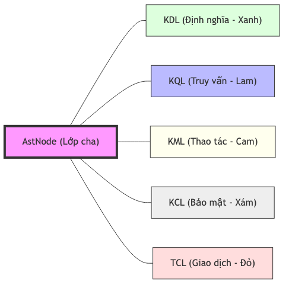

# 4.5.3.3. Hệ thống Cây cú pháp Trừu tượng (AST Nodes)

Cây cú pháp trừu tượng (Abstract Syntax Tree - AST) là đại diện logic hoàn chỉnh cho tri thức sau khi được biên dịch. Trong kiến trúc KBMS V3, mỗi câu lệnh được bóc tách thành một hoặc nhiều `AstNode` chuyên biệt, kế thừa từ lớp cơ sở `AstNode.cs`. Các nút này được phân loại thành 5 hệ phả ngôn ngữ chính, tương ứng với các phân hệ chức năng trong mã nguồn `KBMS.Parser/Ast`.

*Hình 4.xx: Sơ đồ phả hệ các nút AST trong hệ thống tri thức KBMS.*

---

## 1. Hệ phả Định nghĩa Tri thức (KDL Nodes)

Đây là phân hệ phức tạp nhất, chịu trách nhiệm kiến tạo cấu trúc của các thực thể tri thức:

*   **Knowledge Base**: Bao gồm `CreateKnowledgeBaseNode`, `DropKbNode`, `UseKbNode`. These nodes manage the lifecycle of knowledge repositories.
*   **Concepts & Variables**: `CreateConceptNode`, `AddVariableNode`. Quản lý việc định nghĩa các khái niệm và thuộc tính.
*   **Advanced Logic**: `CreateRuleNode`, `AddComputationNode`, `CreateTriggerNode`. Định nghĩa các luật suy diễn và các điểm kích hoạt logic trong mạng Rete.

---

## 2. Hệ phả Truy vấn và Thao tác (KQL & KML Nodes)

Phân hệ này điều phối các hoạt động tương tác và bảo trì dữ liệu tri thức:

### 2.1. Nhóm Truy vấn (KQL)
*   **`SelectNode`**: Chịu trách nhiệm trích xuất thông tin dựa trên các điều kiện lọc và phép chiếu thuộc tính.
*   **`SolveNode`**: Thành phần cốt lõi của giao diện suy diễn, chứa các mệnh đề giả thiết (`Given`) và mục tiêu (`Find`).
*   **`ExplainNode`**: Cung cấp khả năng truy vết logic, cho phép hệ thống giải thích các bước suy luận dẫn đến kết quả.

### 2.2. Nhóm Thao tác (KML)
*   **`InsertNode`**: Thực hiện nạp các bản ghi tri thức mới vào tầng lưu trữ vật lý.
*   **`UpdateNode` / `DeleteNode`**: Quản lý vòng đời của các thực thể dữ liệu hiện hữu.
*   **`MaintenanceNode`**: Điều phối các tác vụ hạ tầng như tái lập chỉ mục (`REINDEX`) hoặc thu dọn bộ nhớ (`VACUUM`).

---

## 3. Hệ phả Kiểm soát và Giao dịch (KCL & TCL Nodes)

Đảm bảo tính bảo mật và toàn vẹn của hệ thống thông qua các cơ chế quản trị:

*   **Kiểm soát Truy cập (KCL)**: `GrantNode`, `RevokeNode`, `CreateUserNode`. Quản lý quyền hạn người dùng dựa trên mô hình RBAC.
*   **Quản trị Giao dịch (TCL)**: `BeginTransactionNode`, `CommitNode`, `RollbackNode`. Đảm bảo tính ACID cho các thao tác tri thức phức tạp.

---

## 4. Đặc điểm Kỹ thuật Chung (Core Node Features)

Mọi biến thể của `AstNode` đều tuân thủ các nguyên lý thiết kế thống nhất:
1.  **Vị trí nguồn (Source Mapping)**: Lưu trữ chính xác dòng (`Line`) và cột (`Column`) của mã nguồn gốc, hỗ trợ báo lỗi chính xác tới người dùng.
2.  **Định danh Loại (Type Identification)**: Thuộc tính `Type` cho phép Module III (System Core) thực hiện điều hướng (routing) nhanh chóng mà không cần kiểm tra kiểu dữ liệu tại runtime (type checking).
3.  **Khả năng Tái cấu trúc (Reverse Engineering)**: Phương thức `ToQueryString()` cho phép chuyển đổi ngược từ cây AST về mã nguồn KBQL ban đầu.

Sau khi cấu trúc AST được Parser Module hoàn thiện và xác thực về mặt cú pháp, toàn bộ cây logic này được bàn giao cho Module III (System Core). Đây là nơi hệ thống bắt đầu quy trình kiểm tra quyền hạn, ghi nhật ký kiểm toán và điều phối tài nguyên máy chủ để thực thi yêu cầu.
