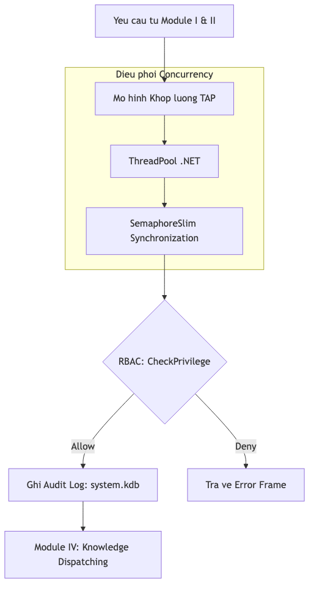
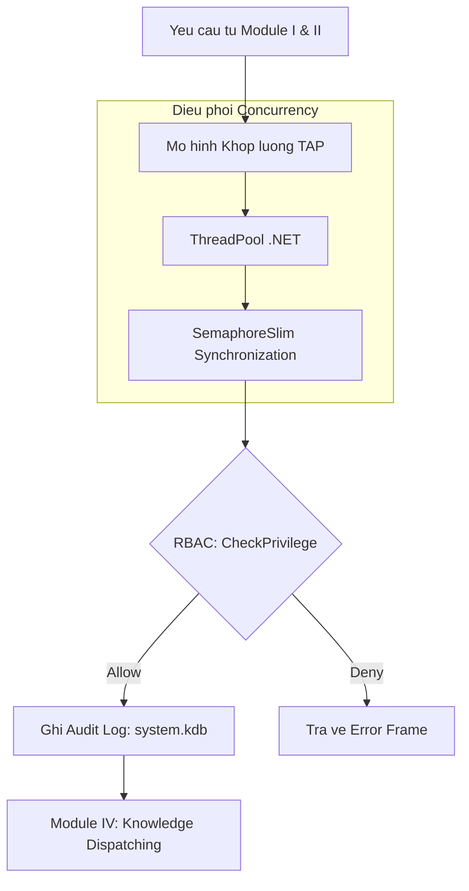

# 4.5.4.1. Phân hệ Điều phối và Hạ tầng Máy chủ (Server Orchestration)

Máy chủ [KBMS](../../../00-glossary/01-glossary.md#kbms) V3 (thực thi tại `KbmsServer.cs`) đóng vai trò là "hệ điều hành" trung tâm của mạng lưới tri thức. Phân hệ III (System Core) được thiết kế dựa trên các nguyên lý xử lý hiệu năng cao, tích hợp khả năng điều phối luồng bất đồng bộ và cơ chế quản trị tri thức tự thân (Self-managed) thông qua mô hình tri thức hệ thống.

## 1. Dòng chảy Điều phối và Giám sát (Orchestration Flow)

Toàn bộ quy trình quản trị kết nối và thực thi yêu cầu được chuẩn hóa để đảm bảo tính an toàn, minh bạch và khả năng phục hồi:


*Hình 4.xx: Quy trình điều phối yêu cầu từ tiếp nhận đến ghi nhật ký kiểm toán.*

<details>
<summary>Xem mã nguồn Mermaid</summary>



</details>

---

Người quản trị ([DBA](../../../00-glossary/01-glossary.md#dba)) có khả năng truy vấn trạng thái máy chủ ngay bằng ngôn ngữ KBQL, ví dụ:
```sql
-- Thống kê các truy vấn có thời gian xử lý > 500ms để tối ưu hóa
SELECT username, command, duration_ms 
FROM audit_logs 
WHERE duration_ms > 500 
IN system;
```
Cơ chế này mang lại khả năng quản trị đồng nhất: mọi thứ trong KBMS đều là tri thức, ngay cả chính nhật ký vận hành của nó.
