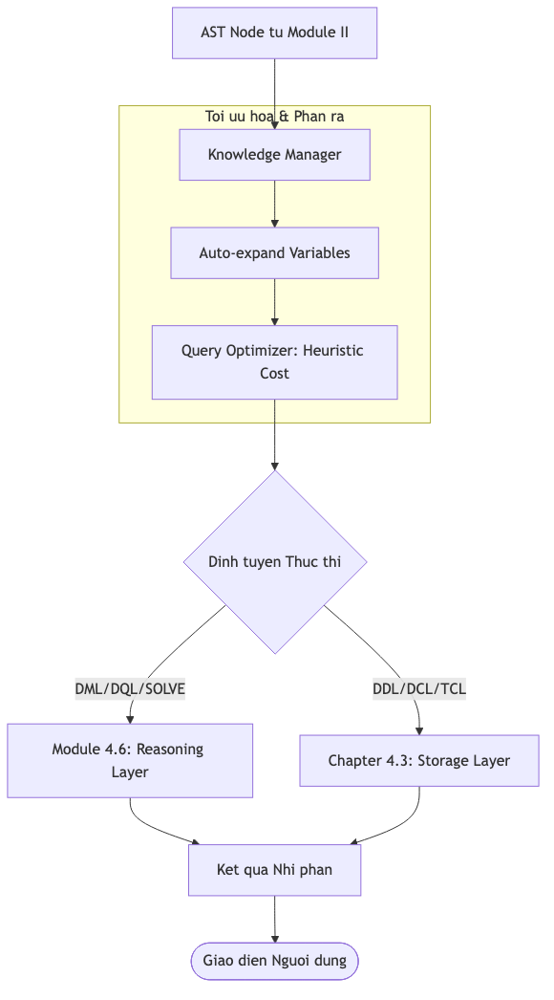

# 4.5.5.1. Phân hệ Điều động Tri thức (Knowledge Dispatcher)

Phân hệ IV (Query Engine) là thành phần hạt nhân, đóng vai trò "bộ não" điều phối toàn diện cho hệ thống [KBMS](../../../00-glossary/01-glossary.md#kbms). Thành phần thực thi tại `KnowledgeManager.cs` thiết lập sự liên kết chặt chẽ giữa Tầng Phân tích Ngôn ngữ (Phân hệ II) và các Tầng Thực thi/Lưu trữ cấp thấp (Reasoning/Storage Layers), đảm bảo mọi yêu cầu tri thức đều được định tuyến và xử lý tối ưu.

## 1. Vòng đời Truy vấn và Luồng Điều phối (Query Dispatching Flow)

Hành trình của một yêu cầu tri thức sau khi vượt qua các lớp hạ tầng sẽ đi qua các công đoạn thẩm định quyền hạn và định tuyến logic nghiêm ngặt:

*Hình 4.xx: Quy trình điều phối từ cây AST đến các bộ máy thực thi chuyên biệt.*

### Cơ chế thực thi lõi (Execution Pipeline)
Sau khi `KBMS.Parser` chuyển đổi câu lệnh thành cấu trúc cây cú pháp trừu tượng (AST), `KnowledgeManager` thực hiện duyệt đệ quy và kích hoạt phương thức `Execute(ast, user, currentKb)`. Quy trình này bao gồm các bước:

1.  **Định tuyến Tri thức (Knowledge Routing)**: Xác thực và điều hướng câu lệnh tới Cơ sở tri thức (KB) mục tiêu dựa trên ngữ cảnh phiên làm việc hoặc tham số định danh trong AST.
2.  **Kiểm soát Quyền thực thi (Access Control)**: Sử dụng phương thức `CheckPrivilege` để đối soát quyền hạn của người dùng (`ROOT`, `ADMIN`, `WRITE`, `SELECT`) với hành động yêu cầu, ngăn chặn truy cập trái phép trước khi tác động xuống dữ liệu.
3.  **Điều hướng Logic đa phân hệ**: Phương thức `ExecuteQuery` đóng vai trò là bộ định tuyến cho hơn 50 loại nút AST, phân phối công việc tới bộ máy Suy diễn (nếu là lệnh `SOLVE`) hoặc bộ máy Lưu trữ (nếu là lệnh `INSERT`/`SELECT`).

---

## 2. Các Công nghệ Tối ưu hóa và Liên kết Tri thức

Bộ điều động tích hợp các cơ chế hiện đại nhằm đảm bảo hiệu năng thực thi trong môi trường tri thức quy mô lớn:

*   **Tự động Phân rã Biến (Auto-expand Variables)**: Đối với các Concept có cấu trúc lồng nhau, hệ thống thực hiện quy trình phân rã tự động các thuộc tính phức tạp thành các biến nguyên thủy. Cơ chế này cho phép mạng lưới suy diễn thực hiện lan truyền dữ kiện trực tiếp mà không tốn chi phí phân tích lại cấu trúc đối tượng (parsing overhead) tại thời điểm thực thi.
*   **Đăng ký và Kích hoạt Trình kích hoạt (Triggers Registry)**: Quản lý danh sách các `Trigger` thuộc về mô hình tri thức. Ngay sau khi các thao tác đột biến dữ liệu được xác nhận, hệ thống kích hoạt hàm `FireTriggers`, tạo ra các luồng lan truyền trạng thái gia tăng trong mạng lưới Rete.
*   **Trừu tượng hóa Truy xuất V3 (V3 Data Router)**: Quá trình tương tác vật lý được trừu tượng hóa qua thành phần `V3DataRouter`, chịu trách nhiệm định vị và quản lý luồng dữ liệu nhị phân trên các tệp tin lưu trữ phân tán, hỗ trợ kiến trúc đa cơ sở tri thức (Multi-KB).

---

## 3. Kiểm soát Giao dịch và Tính nhất quán (Transaction Integrity)

Bộ điều phối hỗ trợ đầy đủ các nguyên lý ACID thông qua nhóm ngôn ngữ kiểm soát giao dịch (TCL):
*   **Atomic Operations**: Sử dụng `BeginTransaction` để khởi tạo ngữ cảnh giao dịch và bộ đệm thay đổi tạm thời.
*   **Duy trì trạng thái Nhất quán**: Lệnh `COMMIT` thực thi quy trình đồng bộ dữ liệu bền vững qua cơ chế Ghi trước nhật ký (WAL), trong khi `ROLLBACK` cho phép hủy bỏ các thay đổi và đưa trạng thái mạng lưới tri thức về điểm an toàn gần nhất.

Hiệu năng của Phân hệ IV không chỉ nằm ở khả năng điều phối mà còn phụ thuộc mật thiết vào các chiến lược tối ưu hóa kế hoạch thực thi, đảm bảo con đường truy xuất tri thức luôn là ngắn nhất và tốn ít tài nguyên nhất.
