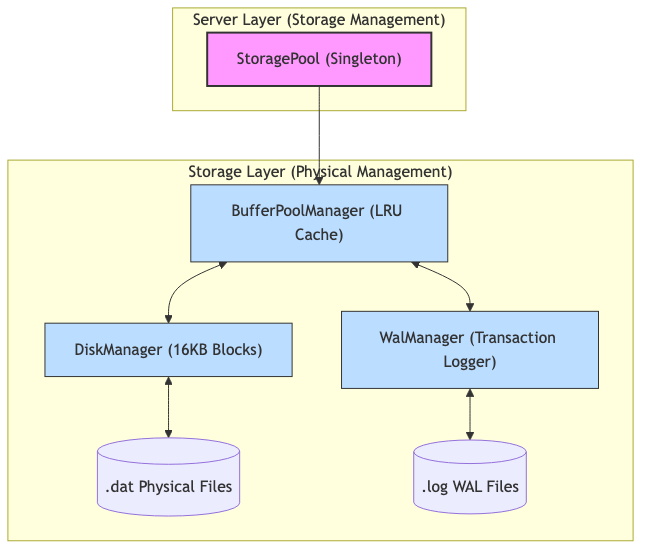

# 04.5. Tầng Lưu trữ (Storage Layer)

Tầng Lưu trữ chịu trách nhiệm đảm bảo tính bền vững (Durability), an toàn (Security) và điều phối truy cập đồng thời cho tri thức.

## 1. Ánh xạ Thành phần Hệ thống

Hệ thống quản lý việc lưu trữ qua một phân cấp các Manager chuyên biệt:

*Hình 4.4: Bản đồ giải phẫu thành phần tầng lưu trữ vật lý.*

*   **StoragePool (Singleton)**: Quản lý danh sách các KBs đang nạp và đảm bảo Thread-safety khi truy cập đa luồng.
*   **BufferPoolManager (LRU Cache)**: Điều phối bộ nhớ đệm RAM theo từng trang (Page).
*   **DiskManager (Physical Handler)**: Giao tiếp trực tiếp với hệ điều hành để đọc/ghi tệp nạp theo khối (16KB).
*   **WalManager (Transaction Logger)**: Quản lý tệp nhật ký `.log` để đảm bảo ACID.

## 1. Quản lý Trang (Physical Paging)

*   **Slotted Page Layout**: Sử dụng cấu trúc trang 16KB với **24 Bytes Header** (PageId, LSN, Prev, Next, FreePtr, Count).
*   **Hệ thống Slot**: Cho phép quản lý các bản ghi có độ dài thay đổi cực kỳ hiệu quả mà không làm phân mảnh đĩa.

## 2. Cấu trúc Chỉ mục (B+ Tree Indexing)

*   **Hiệu năng**: Tìm kiếm và truy xuất bản ghi với độ phức tạp $O(\log n)$.
*   **Clustered Index**: Tích hợp dữ liệu trực tiếp vào các nút lá (Leaf Nodes) của cây B+ Tree để tối thiểu hóa số lần đọc đĩa.

## 4. Điều phối Truy cập Đồng thời (Latching & Pinning)

Hệ thống hỗ trợ đa người dùng thao tác cùng lúc thông qua cơ chế Page Latching:
*   **Page Pinning**: Khi một Query cần dữ liệu, Bpm sẽ cung cấp một Frame trong RAM và tăng `PinCount`. Trang có `PinCount > 0` sẽ bị khóa vĩnh viễn trong RAM (Pinned), thuật toán LRU không thể loại bỏ nó cho tới khi được `Unpin`.
*   **LRU Eviction**: Khi Cache đầy, các trang có `PinCount = 0` và ít được sử dụng nhất sẽ bị trục xuất (Evicted) sau khi đã được đẩy (Flush) xuống đĩa nếu là trang bẩn (Dirty).
*   **Write-Ahead Logging (WAL)**: Mọi thay đổi dữ liệu đều được ghi nhật ký trước khi thực hiện trên RAM, đảm bảo khả năng phục hồi (Recovery) bất chấp mọi sự cố nguồn điện.

## 4. Bảo mật Dữ liệu (Encryption)

*   **AES-256**: Mã hóa toàn diện dữ liệu tĩnh (At-rest). Tệp dữ liệu thô trên đĩa hoàn toàn không thể đọc được nếu không có Master Key của hệ thống.

---

> [!IMPORTANT]
> **Dữ liệu & Tri thức**: Tầng lưu trữ tách biệt tệp dữ liệu thực thể (.dat) và tệp định nghĩa tri thức (.kbf) để tối ưu hóa quá trình nạp và truy vấn.
