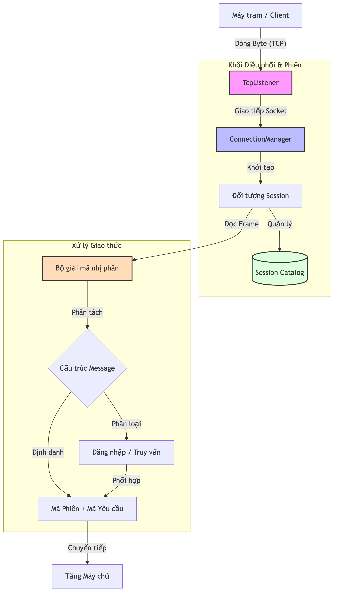

# Thiết kế Kiến trúc Tầng Mạng

Tầng Mạng là lớp biên dưới cùng của hệ thống KBMS, chịu trách nhiệm thiết lập kết nối, quản lý luồng dữ liệu thô và đảm bảo tính toàn vẹn của các gói tin nhị phân giữa máy chủ và máy khách.

## 4.5.1. Mô hình Phân lớp và Điều phối Mạng

Kiến trúc mạng được xây dựng dựa trên giao thức TCP/IP, sử dụng cổng mặc định 3307. Luồng dữ liệu được điều phối qua các thành phần chức năng sau:

-   **Lớp Tiếp nhận**: Sử dụng `TcpListener` để lắng nghe các yêu cầu kết nối mới từ phía máy khách.
-   **Lớp Quản lý Kết nối**: `ConnectionManager` khởi tạo các luồng đọc/ghi bất đồng bộ cho từng Socket riêng biệt.
-   **Lớp Giải mã Giao thức**: Thực hiện việc chuyển đổi từ dòng Byte thô sang đối tượng Tin nhắn có cấu trúc.

*Hình 4.14: Sơ đồ phân lớp và điều phối luồng dữ liệu tại Tầng Mạng.*

## 4.5.2. Ví dụ về Tiến trình Xử lý Gói tin

Bảng dưới đây mô tả chi tiết các bước biến đổi dữ liệu từ dòng Byte trên đường truyền vật lý thành đối tượng logic trong bộ nhớ:

*Bảng 4.7: Quy trình biến đổi và giải cấu trúc gói tin tại Tầng Mạng*
| Giai đoạn | Hành động Kỹ thuật | Trạng thái Dữ liệu | Thành phần Xử lý |
| :--- | :--- | :--- | :--- |
| **1. Tiếp nhận** | `Socket.ReadAsync()` | Dòng Byte thô (Raw) | `NetworkStream` |
| **2. Phân tách** | Đọc 4 byte đầu tiên | Độ dài khung tin (Length) | `BinaryDecoder` |
| **3. Định danh** | Đọc byte tiếp theo | Loại tin nhắn (Type) | `Protocol.cs` |
| **4. Ánh xạ** | Giải mã chuỗi UTF-8 | Mã Phiên & Mã Yêu cầu| 5 | `Message Object` | Chuyển đổi mảng Byte thành đối tượng truy vấn cấp cao. |
| **Kết quả** | - | **Sẵn sàng để đưa vào Parser (Tầng Server).** |

### Phân tích tiến trình Xử lý (Network Logic)

Tiến trình trên cho thấy bộ phận mạng của KBMS được tối ưu hóa cho các thao tác IO bất đồng bộ:

- **Giai đoạn Đệm (Bước 1-2)**: Thay vì xử lý byte thô từng byte một, KBMS sử dụng `NetworkStream` để đọc nguyên một khối dữ liệu dựa trên giá trị độ dài 4 byte đầu tiên. Điều này giúp giảm thiểu số lượng lời gọi hệ thống (Syscalls).
- **Giai đoạn Giải cấu trúc (Bước 3-4)**: `BinaryDecoder` thực hiện bóc tách Header (loại gói tin, ID phiên) một cách trực tiếp thông qua các phép toán Bitwise và dịch chuyển con trỏ, đảm bảo thời gian xử lý gần như tức thời ($O(1)$).
- **Tính Bất đồng bộ**: Mọi tác vụ từ bước 1 tới bước 5 đều sử dụng cơ chế `async/await` và `Task-based Asynchronous Pattern (TAP)`. Luồng (Thread) quản lý socket sẽ được giải phóng ngay sau khi gói tin được đưa vào hàng đợi xử lý, cho phép hệ thống duy trì hàng nghìn kết nối đồng thời.

Quy trình này đảm bảo rằng Tầng Server luôn nhận được các dữ liệu đã được chuẩn hóa, giúp tách biệt hoàn toàn logic mạng khỏi logic xử lý tri thức.
