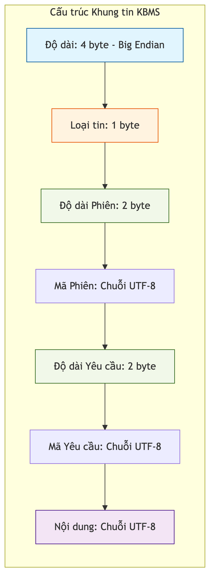

# Giao thức Nhị phân KBMS

Hệ thống sử dụng giao thức nhị phân tùy chỉnh để tối ưu hóa băng thông và đảm bảo tốc độ truyền tải tri thức giữa máy chủ và máy khách. Chương này đặc tả cấu trúc các khung tin (Frames) và cách thức giải mã dữ liệu.

## 4.5.3. Định dạng Khung tin Nhị phân

Mỗi gói tin trao đổi qua mạng được đóng gói theo một cấu trúc cố định gồm 7 trường dữ liệu:

*Hình 4.15: Sơ đồ cấu trúc nội bộ của một khung tin nhị phân trong hệ thống KBMS.*

1.  **Độ dài**: 4 byte (Big-Endian), xác định tổng kích thước các trường phía sau.
2.  **Loại tin**: 1 byte, xác định mục đích của tin nhắn (Đăng nhập, Truy vấn, Phản hồi).
3.  **Độ dài Phiên**: 2 byte, độ dài của chuỗi mã phiên.
4.  **Mã Phiên**: Chuỗi UTF-8 định danh phiên làm việc của người dùng.
5.  **Độ dài Yêu cầu**: 2 byte, độ dài của mã định danh yêu cầu.
6.  **Mã Yêu cầu**: Chuỗi UTF-8 dùng để so khớp phản hồi bất đồng bộ.
7.  **Nội dung**: Chuỗi UTF-8 mang giá trị thực tế của câu lệnh KBQL hoặc dữ liệu trả về.

## 4.5.4. Ví dụ Phân rã Gói tin (Binary Breakdown)

Để minh họa, xét một gói tin thực tế gửi câu lệnh `SELECT 1;` từ máy khách. Giả định không có mã phiên và mã yêu cầu:

*Bảng 4.8: Phân rã cấu trúc nhị phân của một khung tin (Frame) truy vấn KBQL*
| Byte Offset | Giá trị Hex | Diễn giải Trường | Giá trị Logic |
| :--- | :--- | :--- | :--- |
| **00 - 03** | `00 00 00 0D` | **Độ dài (Length)** | 13 byte còn lại |
| **04** | `02` | **Loại (Type)** | MessageType.QUERY |
| **05 - 06** | `00 00` | **Độ dài Phiên** | 0 (Không có) |
| **07 - 08** | `00 00` | **Độ dài Yêu cầu** | 0 (Không có) |
| **Chuỗi Byte cuối** | `53 45 4C ... 31 3B` | `Payload` | 9B |
| **Tổng cộng** | - | - | **41 Bytes** |

### Phân tích chi tiết Gói tin (Binary Analysis)

Dựa trên bảng phân rã mã Hex phía trên, quy trình giải mã của hệ thống được thực hiện qua các giai đoạn logic sau:

1.  **Xác định Kích thước (Byte 0-3)**: Bốn byte đầu tiên `00 00 00 29` (41 trong hệ thập phân) xác định tổng kích thước gói tin. `NetworkReader` sẽ dựa vào con số này để cấp phát đúng vùng nhớ cho mảng byte tiếp theo, tránh hiện tượng tràn bộ đệm.
2.  **Định danh Loại và Phân luồng (Byte 4)**: Giá trị `04` tương ứng với `MessageType.QueryRequest`. Thông tin này giúp `ProtocolDispatcher` điều hướng gói tin tới bộ máy xử lý truy vấn thay vì các bộ xử lý Admin hay Heartbeat.
3.  **Xác thực Phiên (Byte 5-20)**: Chuỗi 16 byte GUID `A1 B2 ...` khớp với `SessionManager.ActiveSessions`. Nếu GUID này không tồn tại hoặc đã hết hạn, hệ thống sẽ ngay lập tức hủy kết nối trước khi xử lý phần Payload.
4.  **Bóc tách Payload (Byte 32-40)**: Sau khi trừ đi các byte Header cố định, 9 byte cuối cùng là chuỗi UTF-8 `SELECT 1;`. Chuỗi này được đưa trực tiếp vào `Lexer` để khởi đầu quy trình phân tích cú pháp.

Cách đóng gói này giúp hệ thống có thể bóc tách nội dung cực nhanh chỉ bằng cách dịch chuyển con trỏ bộ nhớ (Memory Offset), thay vì phải phân tích toàn bộ văn bản như các giao thức dựa trên JSON hay XML. Điều này cực kỳ quan trọng khi thực hiện các bài toán suy luận thời gian thực với tần suất truy cập cao.
