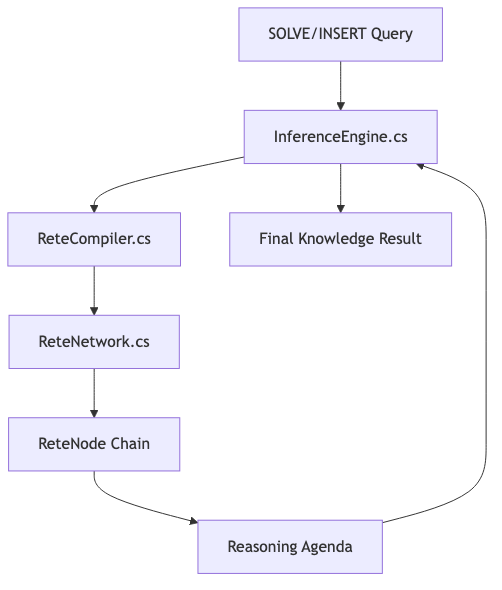
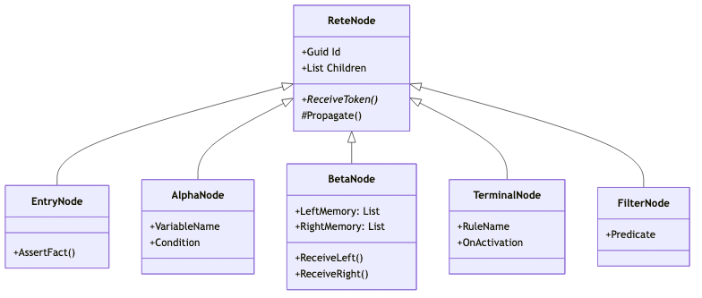

# 4.6.1. Kiến trúc Hệ thống Suy luận

Hệ thống Suy luận trong KBMS V3 được xây dựng dựa trên thuật toán **Rete**, một cơ chế so khớp mẫu hiệu quả cao cho các hệ luật chuyên gia. Kiến luận này tách biệt hoàn toàn giữa việc định nghĩa tri thức (Rules/Equations) và cơ chế thực thi ([Inference Engine](../../../00-glossary/01-glossary.md#i10)).

## 4.6.1.1. Sơ đồ Kiến trúc Tổng quan

Toàn bộ quy trình suy luận được điều phối bởi lớp `InferenceEngine.cs` ([Inference Engine](../../../00-glossary/01-glossary.md#i10)), kết hợp với mạng lưới thực thi `ReteNetwork.cs` ([Rete Network](../../../00-glossary/01-glossary.md#r15)).

*Hình 4.53: Kiến trúc phân tầng của Hệ thống Suy luận KBMS.*

1.  **InferenceEngine.cs**: Đóng vai trò là bộ điều phối (Orchestrator). Khi nhận được yêu cầu `SOLVE` hoặc dữ liệu mới từ `INSERT`, Engine sẽ kích hoạt quy trình suy luận.
2.  **ReteCompiler.cs**: Bộ biên dịch tri thức. Nó phân tích các `ConceptRule`, `Equation`, và `Constraint` để xây dựng nên cấu trúc đồ thị các nốt Rete ([Rete Compilation](../../../00-glossary/01-glossary.md#r16)).
3.  **ReteNetwork.cs**: Lưu trữ đồ thị các nốt và quản lý bộ nhớ làm việc ([Working Memory](../../../00-glossary/01-glossary.md#w01)).
4.  **Agenda**: Danh sách các luật đã thỏa mãn điều kiện nhưng chưa được thực thi ([Agenda](../../../00-glossary/01-glossary.md#a16)). Hệ thống sử dụng cơ chế này để quản lý thứ tự ưu tiên khi có nhiều luật cùng được kích hoạt.

## 4.6.1.2. Phân loại Nốt trong Mạng Rete

Dựa trên mã nguồn triển khai tại `KBMS.Reasoning/Rete/`, hệ thống phân chia các nốt thành một hệ cấp bậc chặt chẽ bắt nguồn từ lớp cơ sở `ReteNode`.

*Hình 4.54: Hệ thống phân cấp các lớp nốt Rete trong mã nguồn KBMS.*

### Các loại nốt chính:
- **EntryNode**: Nốt gốc của mạng lưới ([Root Node](../../../00-glossary/01-glossary.md#r17)). Mọi dữ kiện ([Fact](../../../00-glossary/01-glossary.md#f04)) mới đi vào hệ thống đều bắt đầu từ đây và được lan truyền xuống các nốt Alpha.
- **AlphaNode**: Thực hiện lọc các dữ kiện dựa trên tên biến (`VariableName`) và điều kiện đơn nhất (`Condition`) ([Alpha Node](../../../00-glossary/01-glossary.md#a15)).
- **BetaNode**: Thực hiện phép nối (Join) dữ liệu ([Beta Node](../../../00-glossary/01-glossary.md#b15)). Nốt này sở hữu `LeftMemory` và `RightMemory` ([Beta Memory](../../../00-glossary/01-glossary.md#b16)) để lưu trữ các kết quả khớp một phần (Partial Matches).
- **TerminalNode**: Nốt kết thúc ([Terminal Node](../../../00-glossary/01-glossary.md#t18)). Khi nhận được một [Token](../../../00-glossary/01-glossary.md#t17) hoàn chỉnh (thỏa mãn toàn bộ giả thuyết), nốt này sẽ kích hoạt hành động (`OnActivation`) để đẩy kết quả vào [Agenda](../../../00-glossary/01-glossary.md#a16).
- **FilterNode**: Nốt lọc bổ trợ ([Filter Node](../../../00-glossary/01-glossary.md#f11)), được dùng để kiểm tra các biểu thức logic phức tạp sau khi các phép nối Beta đã hoàn thành.
