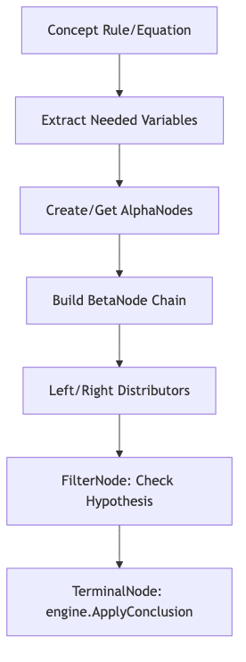

# 4.6.2. Cấu trúc Hình học và Kết nối Nốt

Mạng Rete trong KBMS được xây dựng thông qua quy trình nối chuỗi các nốt, đảm bảo tối ưu hóa việc chia sẻ các phần điều kiện giống nhau giữa nhiều luật khác nhau.

## 4.6.2.1. Quy trình Biên dịch (Compilation Flow)

Theo mã nguồn tại `ReteCompiler.cs` ([Rete Compilation](../../../00-glossary/01-glossary.md#r16)), quá trình biên dịch (Compile) một khái niệm bao gồm việc phân tích các biểu thức giả thuyết (`Hypothesis`) để xây dựng các chuỗi nốt Alpha và Beta.

*Hình 4.55: Quy trình biên dịch tri thức thành đồ thị nốt Rete.*

1.  **Extract Variables**: Trích xuất tất cả các biến xuất hiện trong giả thuyết. Mỗi biến sẽ tương ứng với một `AlphaNode`.
2.  **Alpha/Beta Chaining**: Các nốt Alpha được nối với nhau thông qua `BetaNode`. Đối với những phương trình có $N$ biến, hệ thống sẽ xây dựng các đường dẫn song song để có thể suy luận ra bất kỳ biến nào khi $N-1$ biến còn lại đã biết.
3.  **Distributor Pattern**: Do `AlphaNode` có tính chất một chiều, hệ thống sử dụng các nốt trung gian `LeftDistributor` và `RightDistributor` ([Distributor Node](../../../00-glossary/01-glossary.md#d10)) để chuyển đổi lời gọi `ReceiveToken` vào đúng cổng `ReceiveLeft/Right` của nốt Beta.
4.  **Filter/Terminal**: Cuối chuỗi là một `FilterNode` ([Filter Node](../../../00-glossary/01-glossary.md#f11)) để kiểm tra lại toàn bộ biểu thức logic của giả thuyết trước khi đưa vào `TerminalNode` ([Terminal Node](../../../00-glossary/01-glossary.md#t18)).

## 4.6.2.2. Cơ chế Lưu trữ Bộ nhớ (Memory Structure)

Khác với các hệ thống suy luận đơn giản, nốt Beta trong KBMS sở hữu trạng thái bộ nhớ riêng ([Beta Memory](../../../00-glossary/01-glossary.md#b16)):

- **LeftMemory**: Chứa các [Token](../../../00-glossary/01-glossary.md#t17) (tập hợp các dữ kiện) đã khớp được một phần từ phía bên trái của đồ thị.
- **RightMemory**: Chứa các dữ kiện mới khớp từ nốt Alpha tương ứng bên phải.

Cơ chế này cho phép nốt Beta thực hiện phép nối gia tăng (Incremental Join) mà không cần phải tính toán lại toàn bộ dữ liệu từ đầu khi có một dữ kiện mới được thêm vào.
