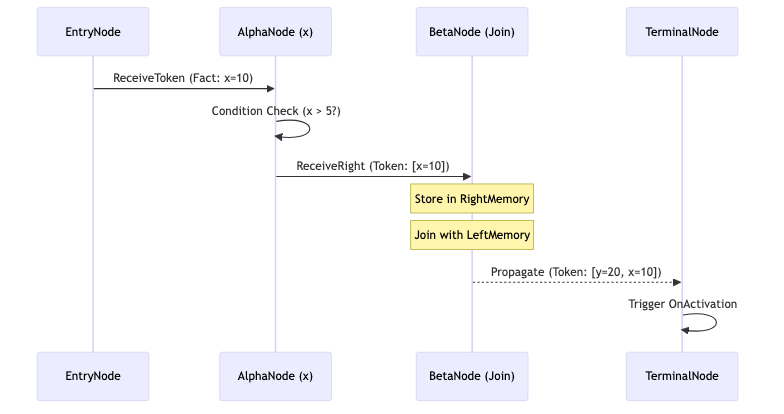

# 4.6.3. Giải thuật Lan truyền và Nối Token

Trái tim của cơ chế Rete trong KBMS là việc lan truyền các đối tượng `Token` ([Token Propagation](../../../00-glossary/01-glossary.md#t16)) thông qua mạng lưới. Một Token đóng vai trò là một "vật chứa" các dữ kiện ([Fact](../../../00-glossary/01-glossary.md#f04)) đã khớp partially hoặc fully.

## 4.6.3.1. Vòng đời của một Token (Token Lifecycle)

Dựa trên lớp `Token.cs` ([Token (Rete)](../../../00-glossary/01-glossary.md#t17)), một Token không chỉ là một giá trị đơn lẻ mà là một danh sách các bản ghi `Fact(Name, Value)`.


*Hình 4.56: Sơ đồ tuần tự lan truyền Token qua các nốt Rete.*

1.  **Creation**: Khi một dữ kiện mới (ví dụ: `x=10`) được nạp vào qua `EntryNode.AssertFact`, một Token mới chứa duy nhất Fact này được khởi tạo.
2.  **Filtering**: Nốt Alpha nhận Token này và thực hiện kiểm tra điều kiện. Nếu thỏa mãn, Token được đẩy tiếp xuống nốt Beta.
3.  **Joining**: Nốt Beta nhận Token từ nốt Alpha (Right Parent). Nó thực hiện so sánh với toàn bộ các Token hiện có trong `LeftMemory`. Nếu các biến không xung đột, một Token mới được tạo ra bằng cách gộp tất cả các Fact từ Token bên trái và dữ kiện mới từ bên phải.
4.  **Activation**: Khi Token đi tới `TerminalNode` ([Terminal Node](../../../00-glossary/01-glossary.md#t18)), nó chứa đầy đủ tất cả các dữ kiện cần thiết của một giả thuyết. Nốt Terminal sẽ gọi hàm `OnActivation`, đưa Token này vào hàng đợi thực thi ([Agenda](../../../00-glossary/01-glossary.md#a16)).

## 4.6.3.2. Giải thuật So khớp Nối (Join Algorithm)

Mã nguồn tại `BetaNode.cs` (phương thức `CanJoin`) mô tả quy trình kiểm tra sự nhất quán giữa các Token:

```csharp
private bool CanJoin(Token left, Token right)
{
    var rightFact = right.Facts.LastOrDefault();
    if (rightFact == null) return false;
    
    // Đảm bảo không có xung đột dữ kiện cùng tên nhưng khác giá trị
    var existing = left.Facts.FirstOrDefault(f => f.Name.Equals(rightFact.Name));
    if (existing != null && !existing.Value.Equals(rightFact.Value))
        return false;

    return true;
}
```

Dựa trên phương thức `CanJoin`, luồng dữ kiện tịnh tiến (Incremental Join) được thực thi cực kỳ tối ưu khi một Token mới được kích hoạt:

```csharp
// Thuật toán: Nối gia tăng (Incremental Join) tại Beta Node
public override void ReceiveRight(Fact newFact) {
    // 1. Lưu Fact mới vào bộ đệm RightMemory
    RightMemory.Add(newFact);
    
    // 2. Incremental Join: Chỉ so khớp Fact mới với các Token đã có
    //    Thay vì lặp toàn bộ, mô hình này hạ bậc chi phí truy vấn
    foreach (var leftToken in LeftMemory) {
        if (CanJoin(leftToken, newFact)) {
            // 3. Tạo Token mới và đẩy tiếp xuống mạng lưới (Forward Chaining)
            var mergedToken = Token.Merge(leftToken, newFact);
            foreach(var child in Children) {
                child.ReceiveLeft(mergedToken);
            }
        }
    }
}
```

Cấu trúc đệm vòng lặp hạn chế này đảm bảo rằng KBMS có thể xử lý các hệ luật phức tạp về mặt ngữ nghĩa (Semantics), nơi mà sự thống nhất về mặt biến số là điều kiện tiên quyết cho việc suy luận.
