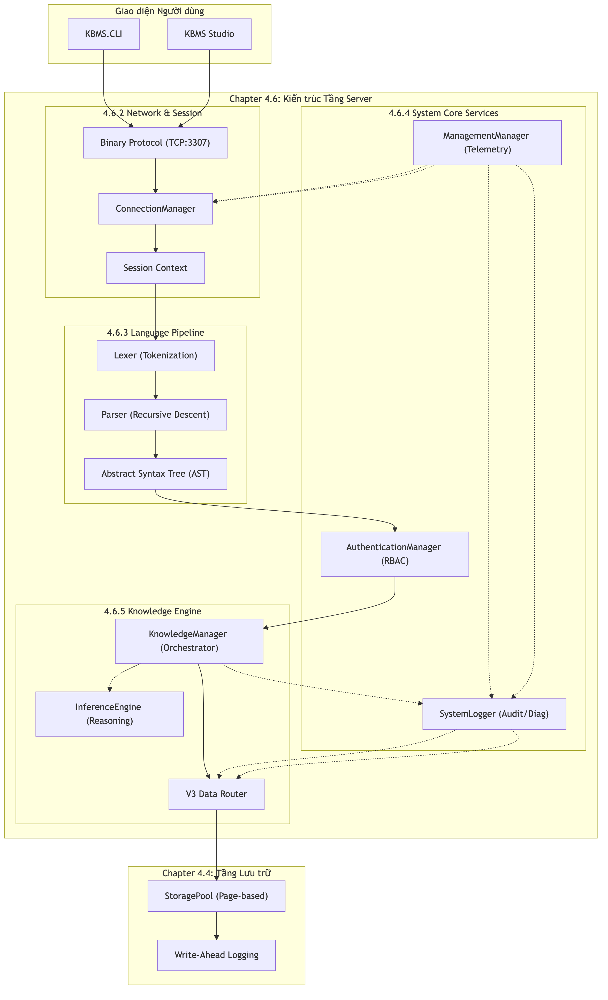

# Kiến trúc Tầng Server

Tầng Server là trung tâm điều phối của hệ quản trị KBMS, chịu trách nhiệm xử lý các yêu cầu từ phía người dùng, quản lý phiên làm việc và thực thi các logic tri thức. Hệ thống được tổ chức thành các phân hệ chức năng riêng biệt để đảm bảo tính ổn định và dễ mở rộng.

## 4.6.1. Cấu trúc các Phân hệ chính

Dựa trên sơ đồ kiến trúc, Tầng Server bao gồm 4 phân hệ hạt nhân sau:

1.  **Phân hệ Mạng và Phiên**: Quản lý kết nối TCP, giao thức nhị phân và bối cảnh của từng phiên làm việc của người dùng.
2.  **Phân hệ Đường ống ngôn ngữ**: Thực hiện việc bóc tách, phân tích cú pháp các câu lệnh KBQL và chuyển đổi thành cây cấu trúc AST.
3.  **Phân hệ Dịch vụ lõi**: Cung cấp các chức năng bổ trợ như xác thực phân quyền, ghi nhật ký hệ thống và giám sát các chỉ số vận hành.
4.  **Phân hệ Nhân tri thức**: Đây là bộ máy điều hành chính, chịu trách nhiệm định tuyến dữ liệu, quản lý giao dịch và kích hoạt bộ máy suy luận.

*Hình 4.16: Sơ đồ các phân hệ chức năng và luồng dữ liệu tại Tầng Server.*

## 4.6.2. Luồng xử lý dữ liệu tổng quát

Khi có một yêu cầu từ phía người dùng, dữ liệu sẽ được luân chuyển qua các bước sau:
-   **Tiếp nhận**: Kết nối được khởi tạo và xác thực thông qua `ConnectionManager`.
-   **Thông dịch**: Câu lệnh văn bản được chuyển qua bộ phân tích để tạo cây AST.
-   **Thực thi**: Cây AST được `KnowledgeManager` tiếp nhận để thực hiện các thao tác đọc/ghi hoặc suy luận logic.
-   **Phản hồi**: Kết quả được đóng gói và gửi trả lại phía người dùng thông qua giao thức mạng.

Cách tổ chức này giúp tách biệt rõ ràng giữa việc giao tiếp mạng, phân tích ngôn ngữ và thực thi logic, giúp hệ thống hoạt động tin cậy trong các kịch bản thực tế.
