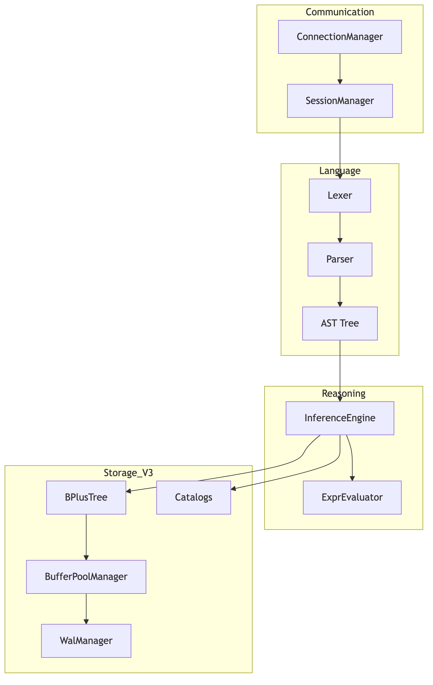

# Sơ đồ các thành phần chi tiết

Chương này trình bày chi tiết về các thành phần cấu thành nên Tầng Server của KBMS và cách thức tương tác nội bộ giữa các phân hệ.

## 4.6.3. Phân rã thành phần chức năng

Bên trong Tầng Server, các thành phần được kết nối với nhau thông qua cơ chế chuyển giao dữ liệu trực tiếp:

-   **Mạng và Phiên**: Phụ trách bởi `ConnectionManager`, chịu trách nhiệm duy trì trạng thái kết nối TCP (Cổng 3307) và giải mã giao thức nhị phân.
-   **Đường ống ngôn ngữ**: Bao gồm `Lexer` để bóc tách từ vựng và `Parser` để xây dựng cấu trúc cây AST từ mã nguồn KBQL.
-   **Dịch vụ lõi**: Bao gồm `AuthenticationManager` để kiểm soát quyền hạn người dùng dựa trên vai trò (RBAC) và `SystemLogger` để ghi nhận các nhật ký vận hành.
-   **Nhân tri thức**: Phụ trách chính bởi `KnowledgeManager`, thực hiện việc điều phối AST tới các bộ phận xử lý dữ liệu vật lý hoặc bộ máy suy luận.

*Hình 4.17: Sơ đồ chi tiết các thành phần và luồng tương tác nội bộ của Server.*

## 4.6.4. Giao thức tương tác nội bộ

Hệ thống sử dụng mô hình chuyển giao thực thể để đảm bảo tính toàn vẹn của thông tin:
1.  **Chuyển giao AST**: Bộ phân tích cú pháp chuyển cây AST sang phân hệ xác thực và nhân tri thức.
2.  **Thông tin Phiên**: Các thông tin bối cảnh của người dùng được đính kèm trong mỗi yêu cầu xử lý.
3.  **Kết quả Thực thi**: Dữ liệu từ tầng lưu trữ được trả về dưới dạng `ResultSet` và sau đó được đóng gói vào các khung tin nhị phân.

Cấu trúc thành phần này đảm bảo mỗi module chỉ tập trung vào một nhiệm vụ duy nhất, giúp tối ưu hóa hiệu năng tổng thể của hệ thống.
