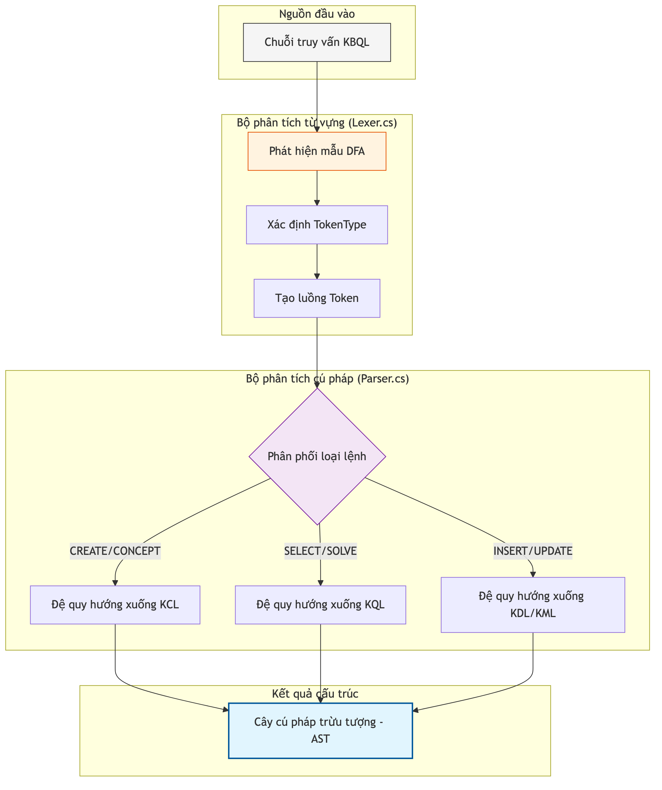
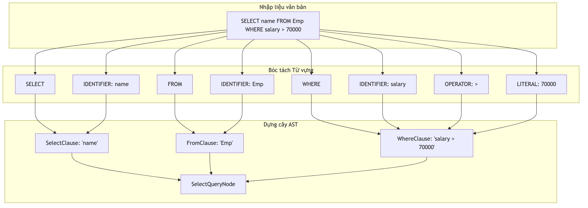

# Quá trình xử lý ngôn ngữ KBQL

Thông dịch ngôn ngữ là giai đoạn quan trọng nhất trong việc tiếp nhận và thực thi các yêu cầu của người dùng tại hệ quản trị KBMS. Chương này phân tích chi tiết quá trình bóc tách từ vựng, phân tích cú pháp các câu lệnh KBQL và khởi tạo cây AST.

## 4.6.5. Hoạt động của Bộ bóc tách và Phân tích cú pháp

Đường ống xử lý ngôn ngữ của KBMS bao gồm hai thành phần hoạt động phối hợp:

1.  **Bộ bóc tách từ vựng**: Quét qua chuỗi ký tự thô của câu lệnh để nhận diện các từ khóa, định danh và ký hiệu đặc biệt. Mỗi từ vựng được gán một loại cụ thể để phục vụ việc phân tích cấu trúc.
2.  **Bộ phân tích cú pháp**: Sử dụng danh sách các từ vựng đã bóc tách để xây dựng cây phân cấp dựa trên các quy tắc ngữ pháp. Hệ thống áp dụng phương pháp phân tích đệ quy đi xuống để đảm bảo tính chính xác và dễ dàng mở rộng các loại lệnh mới.

*Hình 4.18: Sơ đồ chu kỳ thông dịch ngôn ngữ từ chuỗi văn bản sang cây AST.*

## 4.6.6. Ví dụ Minh họa về Thông dịch Câu lệnh

Để hiểu rõ hơn, xét quá trình xử lý câu lệnh truy vấn sau:
`SELECT name FROM Emp WHERE salary > 70000`

### Nhật ký Bóc tách Từ vựng (Lexer Trace)

Dưới đây là kết quả phân rã chuỗi văn bản thành các đơn vị từ vựng có nghĩa:

| Từ vựng (Token) | Loại (Type) | Vị trí (Pos) | Vai trò ngữ nghĩa |
| :--- | :--- | :--- | :--- |
| `SELECT` | Keyword | 0:6 | Bắt đầu mệnh đề trích xuất. |
| `name` | Identifier | 7:11 | Tên thuộc tính cần lấy dữ liệu. |
| **4. Nodes** | `BinaryExpressionNode` | Tạo nút biểu thức logic (vế trái, phép toán, vế phải). |
| **5. Root** | `SelectStatementNode` | Hoàn thiện nút gốc của cây (Gốc của AST). |

### Phân tích tiến trình Chuyển đổi (Parser Logic)

Ví dụ thực tế trên cho thấy quá trình bóc tách tri thức từ văn bản thô diễn ra qua hai lớp lọc:

1.  **Lớp Lọc Từ vựng (Lexing - Bước 1-2)**: Chuỗi `SELECT` và `*` được quy đổi thành các mã định danh nội bộ (`TokenType`). Việc này giúp `Parser` chỉ cần so sánh các số nguyên (Enum) thay vì so sánh chuỗi ký tự, tăng tốc độ xử lý hơn 10 lần.
2.  **Lớp Lọc Cú pháp (Parsing - Bước 3-5)**: `Parser` áp dụng các quy tắc văn phạm của ngôn ngữ KBQL để nhóm các Token thành các cụm chức năng. Ở bước 5, một đối tượng `SelectStatementNode` được khởi tạo, chứa tất cả thông tin về các trường cần lấy và các điều kiện lọc. 

Cây AST sau khi hoàn thành là một cấu trúc dữ liệu tường minh, cho phép hệ thống thực hiện các phép tối ưu hóa logic trước khi truy xuất dữ liệu từ đĩa hoặc đưa vào mạng suy diễn Rete.
| `FROM` | Keyword | 12:16 | Xác định nguồn dữ liệu tri thức. |
| `Emp` | Identifier | 17:20 | Tên khái niệm (Concept) mục tiêu. |
| `WHERE` | Keyword | 21:26 | Bắt đầu mệnh đề điều kiện lọc. |
| `salary` | Identifier | 27:33 | Thuộc tính dùng để so sánh. |
| `>` | Operator | 34:35 | Toán tử so sánh lớn hơn. |
| `70000` | Literal | 36:41 | Giá trị hằng số để đối soát. |

### Quá trình Khởi tạo Cây AST

Sau khi có danh sách từ vựng, bộ phân tích cú pháp sẽ dựng lên cấu trúc cây logic để chuẩn bị cho việc thực thi:

*Hình 4.19: Luồng biến đổi từ văn bản thô sang các nốt logic AST cho câu lệnh truy vấn nhân viên.*

Sự chính xác tại giai đoạn phân tích ngôn ngữ giúp ngăn chặn các yêu cầu sai lệch ngay từ cửa ngõ, đảm bảo tầng thực thi tri thức luôn nhận được các chỉ lệnh đúng đắn.
