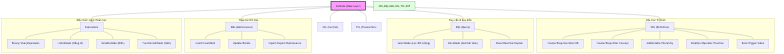

# Cấu trúc cây AST

Cây cú pháp trừu tượng (AST) là cầu nối trung gian giữa câu lệnh văn bản KBQL và thực thi logic tại tầng hệ thống. Chương này phân tích cách thức tổ chức các nốt AST để phục vụ quá trình điều phối tri thức.

## 4.6.7. Phân nhóm các Nốt AST theo Chức năng

Các nốt trong cây AST được kế thừa từ một lớp nốt cơ sở và được chia thành các nhóm lệnh chính:

1.  **Nhóm lệnh Định nghĩa**: Các nốt dành cho việc tạo hoặc xóa các thực thể tri thức như `CreateConceptNode`, `DropConceptNode`.
2.  **Nhóm lệnh Thao tác**: Các nốt thực hiện cập nhật hoặc truy vấn dữu kiện như `InsertFactNode`, `SelectQueryNode`.
3.  **Nhóm lệnh Điều phối**: Các nốt quản lý giao dịch và bối cảnh thực thi như `BeginTransactionNode`, `CommitNode`.
4.  **Nhóm lệnh Suy luận**: Nốt kích hoạt bộ máy suy diễn logic như `SolveNode`.

*Hình 4.19: Sơ đồ phân cấp các đối tượng nốt AST phục vụ điều phối tri thức.*

## 4.6.8. Lưu trữ Thông tin và Ngữ cảnh trong Nốt

Mỗi nốt AST mang theo đầy đủ các thông tin cần thiết cho việc xử lý:
-   **Tên Thực thể**: Đối tượng tri thức (Concept, Thuộc tính) chịu tác động.
-   **Tham số**: Các giá trị cụ thể, biểu thức logic hoặc các mối quan hệ được định nghĩa.
-   **Vị trí Câu lệnh**: Thông tin về dòng/cột để chẩn đoán lỗi trong mã nguồn.

Việc chuẩn hóa các nốt AST giúp hệ thống kiểm soát quyền hạn ngay trên cây phân cấp, tạo điều kiện thuận lợi cho bộ tối ưu hóa truy vấn xây dựng các kế hoạch thực thi hiệu quả.
