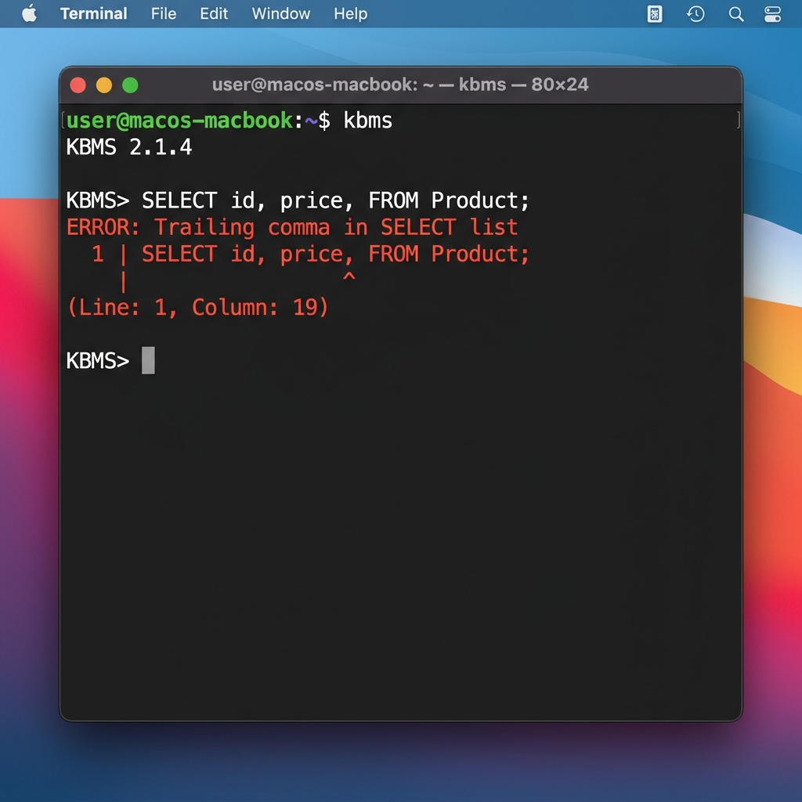

# Xác thực cú pháp và Báo lỗi

Việc kiểm tra tính đúng đắn của câu lệnh tại bộ phân tích cú pháp là bước quan trọng để đảm bảo tính an toàn cho hệ thống. Chương này phân tích các phương pháp xác thực cú pháp và cơ chế báo lỗi người dùng của KBMS.

## 4.6.9. Xác thực Ngữ pháp và Các ràng buộc

Bộ phân tích cú pháp của KBMS thực hiện kiểm tra đồng thời với quá trình xây dựng cây AST:
-   **Kỳ vọng Từ vựng**: Khi gặp một từ khóa nhất định, hệ thống sẽ chờ đợi mã lệnh tiếp theo phải là một định danh hoặc tham số phù hợp. Trình tự này đảm bảo câu lệnh KBQL luôn tuân thủ ngữ pháp chính quy.
-   **Kiểm tra Ràng buộc Sớm**: Một số kiểm tra về loại dữ liệu cơ bản được thực hiện ngay tại đây nhằm giảm tải cho các bộ phận xử lý chuyên sâu ở tầng dưới.

## 4.6.10. Cơ chế Báo lỗi và Chẩn đoán

Khi phát hiện sai sót, hệ thống sẽ cung cấp các thông tin chẩn đoán chi tiết:
1.  **Mã Lỗi**: Mỗi loại lỗi cú pháp được gán một mã riêng biệt để dễ dàng tra cứu.
2.  **Vị trí Báo lỗi**: Thông báo bao gồm số dòng và cột nơi lỗi phát sinh trong mã nguồn.
3.  **Hủy Thực thi**: Mọi lỗi cú pháp đều khiến tiến trình điều phối cây AST bị dừng ngay lập tức, đảm bảo không có lệnh sai lệch nào được gửi tới nhân tri thức.

*Hình 4.20: Ví dụ về cơ chế báo lỗi cú pháp và chỉ dẫn vị trí lỗi tại giao diện dòng lệnh.*

Sự ổn định của bộ phân tích cú pháp tạo điều kiện cho người sử dụng viết các câu lệnh tri thức phức tạp mà vẫn nhận được phản hồi chính xác khi có sai sót phát sinh.
