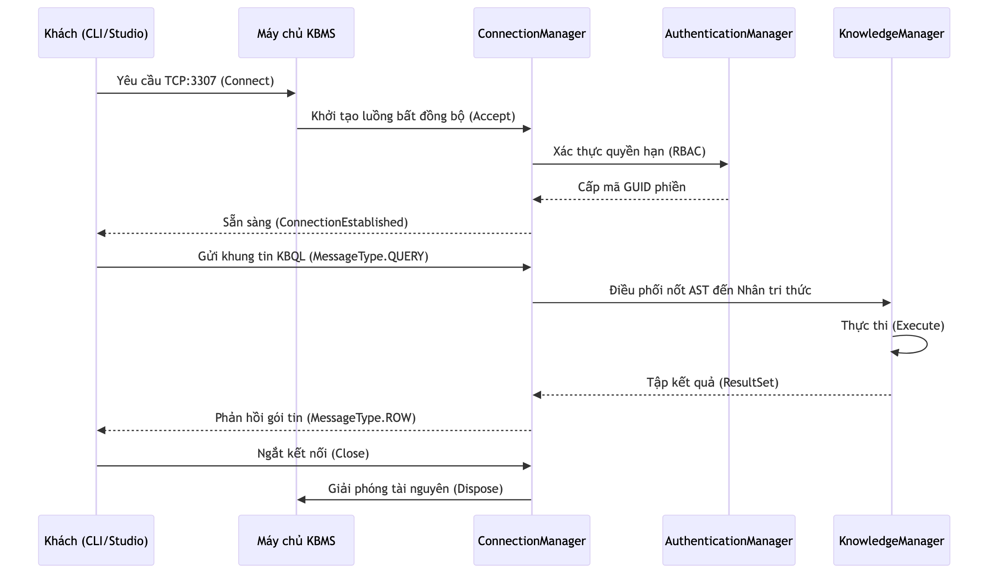

# Quản lý phân luồng và kết nối

Phân hệ Dịch vụ lõi đóng vai trò quan trọng trong việc vận hành máy chủ KBMS, chịu trách nhiệm quản lý vòng đời các kết nối và điều phối tài nguyên thông qua mô hình lập trình bất đồng bộ. Chương này phân tích cơ chế xử lý luồng và quản trị phiên làm việc trong môi trường đa người dùng [5].

## 4.6.11. Mô hình Xử lý Bất đồng bộ

Để tối ưu hóa hiệu năng và phục vụ hàng ngàn kết nối đồng thời, KBMS triển khai mô hình lập trình bất đồng bộ thay vì sử dụng một luồng cho mỗi kết nối truyền thống. Việc sử dụng các câu lệnh `async` và `await` cho phép giải phóng luồng xử lý quay lại bộ tài nguyên hệ thống trong khi chờ đợi dữ liệu mạng hoặc truy xuất đĩa cứng.

Cách tiếp cận này giúp giảm thiểu chi phí chuyển đổi ngữ cảnh và tiết kiệm bộ nhớ RAM, đồng thời duy trì khả năng phản hồi cao cho hệ quản trị tri thức.

*Hình 4.21: Sơ đồ phân bổ và điều phối các luồng xử lý bất đồng bộ tại Tầng Server.*

## 4.6.12. Vòng đời Kết nối và Điều phối Phiên

Mọi tương tác từ phía người dùng đến máy chủ đều được chuẩn hóa qua một chu trình sống khép kín:

### Sơ đồ Trình tự Kết nối (Sequence Flow)

Dưới đây là các tương tác cụ thể giữa máy khách và các thành phần hạt nhân của Server:

*Hình 4.22: Sơ đồ các giai đoạn từ tiếp nhận kết nối đến thực thi câu lệnh và đóng phiên làm việc.*

### Nhật ký Hoạt động của Máy chủ (Core Server Trace)

Bảng dưới đây mô phỏng nhật ký các bước xử lý của `KbmsServer` đối với một kết nối mới:

*Bảng 4.9: Nhật ký điều phối vòng đời một kết nối bất đồng bộ trên Server*
| Giai đoạn | Hành động Hệ thống | Thành phần Xử lý | Kết quả / Trạng thái |
| :--- | :--- | :--- | :--- |
| **Bắt đầu** | `AcceptTcpClientAsync` | `KbmsServer` | Chấp nhận kết nối từ IP:127.0.0.1 |
| **Xác thực** | `AuthorizeSession` | `AuthenticationManager` | Quyền: Admin, Mã GUID: 8a2f... |
| **Tiếp nhận** | `BeginReceivePacket` | `ConnectionManager` | Luồng mạng sẵn sàng đọc tin. |
| **Điều phối** | `DispatchToEngine` | `KnowledgeManager` | Cây AST đã được chuyển giao. |
| **Thực thi** | `ExecuteAsyncTask` | `InferenceEngine` | Bắt đầu suy diễn trên Rete. |
| **Hoàn tất** | `DisposeConnection`| 5 | `Connection.Dispose()` | Xóa đối tượng, giải phóng RAM và Socket. |
| **Kết quả** | - | **Tài nguyên hệ thống được thu hồi triệt để.** |

### Phân tích tiến trình Điều phối (Orchestration Logic)

Vòng đời kết nối trên cho thấy cách Server Engine quản lý tài nguyên một cách tối ưu:

- **Bước 2 (Authentication Layer)**: Việc kiểm tra GUID phiên xảy ra ngay sau khi kết nối được thiết lập, ngăn chặn các cuộc tấn công từ chối dịch vụ (DoS) bằng cách ngắt kết nối không hợp lệ sớm nhất có thể.
- **Bước 3 (Task Allocation)**: Thay vì tạo một luồng (Thread) mới cho mỗi kết nối, Server sử dụng `Task.Run` kết hợp với `ThreadPool`. Điều này cho phép hàng nghìn kết nối đồng thời chỉ với một số ít luồng CPU thực tế.
- **Bước 5 (Safe Disposal)**: KBMS đảm bảo mọi đối tượng `Session` và `Socket` đều được giải phóng qua khối lệnh `try...finally` hoặc `using`, tránh rò rỉ bộ nhớ (Memory Leak) trong các kịch bản chạy liên tục (24/7).

Cơ chế quản lý phân luồng và kết nối này đảm bảo máy chủ luôn duy trì được sự ổn định và có thể mở rộng linh hoạt khi số lượng người dùng tăng cao.
