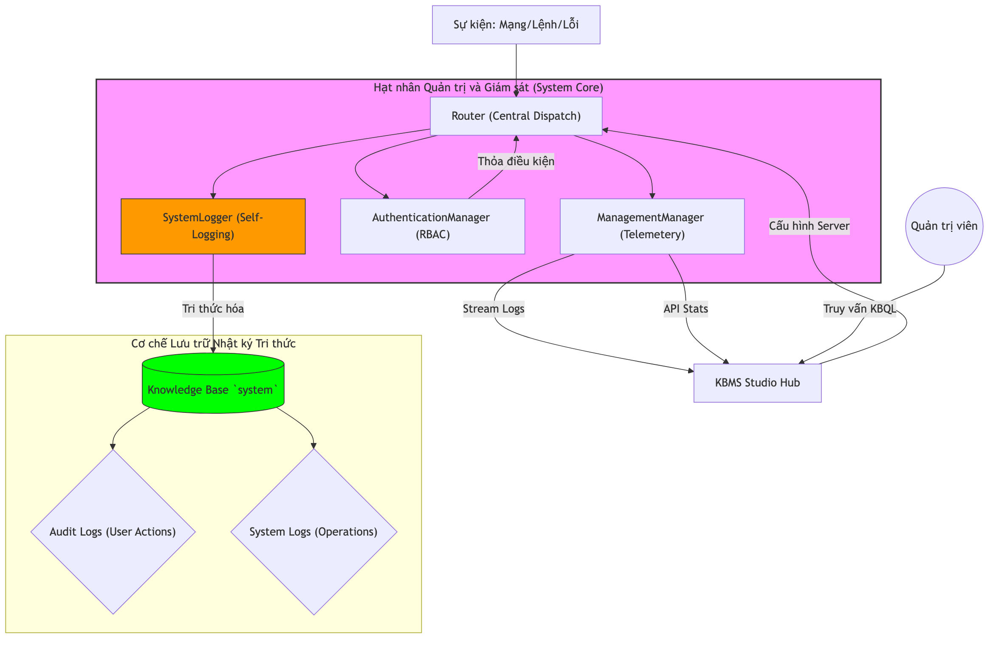

# Giám sát hệ thống và Nhật ký

Phân hệ Dịch vụ lõi cung cấp các chức năng giám sát vận hành và ghi nhật ký kiểm toán để duy trì tính an ninh và độ tin cậy của máy chủ. Chương này trình bày về các chỉ số giám sát và chiến lược ghi nhận dấu vết hệ thống.

## 4.6.13. Các Chỉ số Giám sát Vận hành

Hệ thống thu thập và phân cập các điểm dữ liệu định lượng về trạng thái máy chủ bao gồm:
-   **Kết nối Hiện tại**: Số lượng phiên làm việc đang hoạt động.
-   **Thời gian Vận hành**: Thời gian máy chủ chạy liên tục kể từ khi khởi động.
-   **Tỷ lệ Đệm Dữ liệu**: Hiệu quả truy xuất trang dữ liệu từ bộ nhớ đệm so với đĩa cứng.

Người dùng có thể sử dụng các lệnh quản trị để truy xuất các báo cáo thống kê này phục vụ việc đánh giá hiệu năng hệ thống.

## 4.6.14. Cơ chế Ghi Nhật ký Kiểm toán

KBMS áp dụng phương pháp ghi nhận đồng thời các sự kiện hệ thống:
1.  **Nhật ký Tệp vật lý**: Ghi mã nguồn và các thông tin chẩn đoán lỗi vào các tệp tin trên đĩa. Cách này giúp kiểm tra sự cố ngay cả khi cơ sở dữ liệu gặp lỗi.
2.  **Nhật ký Cơ sở Tri thức**: Các sự kiện được chuyển hóa thành dữ kiện tri thức bên trong Concept mang tên `Log`.

Cách tổ chức này cho phép quản trị viên sử dụng chính ngôn ngữ truy vấn KBQL để thực hiện các thống kê trên nhật ký, chẳng hạn như liệt kê các người dùng thực hiện nhiều truy cập nhất trong một khoảng thời gian nhất định.

*Hình 4.22: Luồng công việc của phân hệ giám sát và cơ chế ghi nhật ký đa tầng.*

## 4.6.15. Truyền phát Nhật ký Thời gian thực

Hệ thống hỗ trợ việc đăng ký và truyền phát các sự kiện nhật ký theo thời gian thực. Khi một phiên làm việc yêu cầu luồng nhật ký, máy chủ sẽ tự động đẩy các thông tin sự kiện mới phát sinh qua kênh truyền nhị phân, đảm bảo độ trễ thấp nhất trong việc theo dõi các hoạt động của hệ quản trị tri thức.
