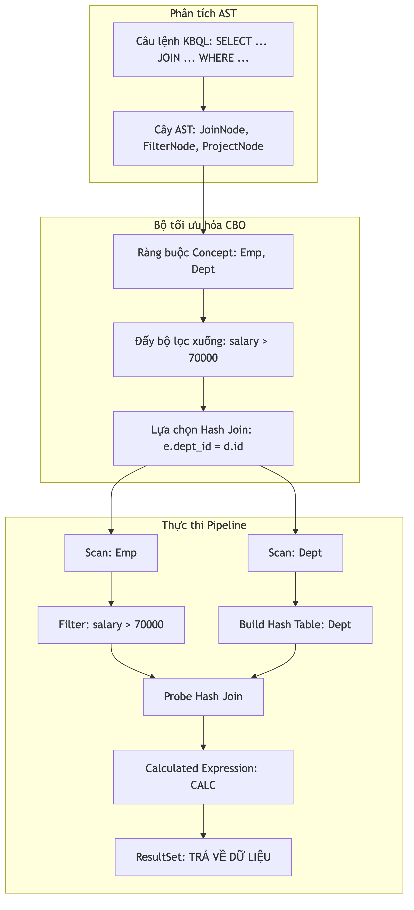

# Tối ưu hóa và Thực thi Pipeline

Hiệu suất truy xuất dữ liệu tri thức của hệ quản trị KBMS phụ thuộc vào khả năng lựa chọn kế hoạch thực thi tối ưu. Chương này phân tích các chiến lược tối ưu hóa dựa trên chi phí và mô hình thực thi theo các bước xử lý liên tiếp.

## 4.6.21. Tối ưu hóa Dựa trên Chi phí

Bộ tối ưu hóa thực hiện việc chuyển đổi cây AST hinh thức thanh một kế hoạch thực thi. Các bước kỹ thuật bao gồm:

1.  **Ánh xạ Dữ liệu**: Xác nhận các bộ khái niệm và thuộc tính để xác định vị trí các trang dữ liệu trên đĩa đĩa cứng.
2.  **Ước lượng Chi phí**: Sử dụng các trọng số định lượng để so sánh các lộ trình xử lý. Việc đọc dữ liệu tuần tự có chi phí cơ sở, trong khi các phép lọc và phép nối dữ liệu sẽ có trọng số cao hơn.

Hệ thống luôn ưu tiên việc áp dụng các điều kiện lọc sớm nhất có thể để giảm thiểu lượng dữ liệu phải nạp lên bộ nhớ RAM.

## 4.6.22. Mô hình Thực thi theo Chu trình

Sau khi có kế hoạch tối ưu, hệ thống sẽ thực hiện theo mô hình chu trình xử lý liên tiếp. Mỗi thao tác dữ liệu đều tuân thủ các giai đoạn:
-   **Khởi tạo**: Cấp phát tài nguyên cần thiết.
-   **Truy xuất**: Đọc dữ liệu theo từng bản ghi từ tầng lưu trữ.
-   **Kết thúc**: Giải phóng bộ nhớ và đóng bối cảnh xử lý.


*Hình 4.25: Sơ đồ tối ưu hóa cây AST và thực thi kế hoạch vật lý.*

## 4.6.23. Ví dụ Minh họa về Tối ưu hóa Truy vấn

Để minh họa cụ thể, xét câu lệnh KBQL thực hiện việc nối hai khái niệm `Emp` (Nhân viên) và `Dept` (Phòng ban) kèm theo điều kiện lọc:

```sql
SELECT 
    e.name AS EmployeeName, 
    d.name AS DepartmentName,
    CALC(e.salary / d.budget * 100) AS BudgetPercentage
FROM Emp e 
JOIN Dept d ON e.dept_id = d.id
WHERE e.salary > 70000;
```

### Quy trình Tối ưu hóa Thực tế

Khi tiếp nhận câu lệnh này, bộ tối ưu hóa CBO thực hiện các bước sau:
1.  **Đẩy bộ lọc xuống (Filter Pushdown)**: Chuyển điều kiện `salary > 70000` xuống ngay sau bước quét bảng `Emp`. Điều này giúp loại bỏ các bản ghi không thỏa mãn trước khi thực hiện phép nối, giảm đáng kể khối lượng tính toán.
2.  **Lựa chọn Phép nối**: Hệ thống chọn thuật toán `Hash Join`. Bảng `Dept` (thường có kích thước nhỏ hơn) được dùng để xây dựng bảng băm trong bộ nhớ, sau đó bảng `Emp` sẽ được quét để đối soát.


*Hình 4.26: Luồng biến đổi từ câu lệnh KBQL sang pipeline thực thi vật lý tối ưu.*

### Kế hoạch Thực thi Chi tiết (Execution Plan)

Bảng dưới đây mô tả trình tự thực thi của pipeline sau khi đã được tối ưu:

| Giai đoạn | Thao tác Vật lý | Ràng buộc Tri thức | Ghi chú Tối ưu |
| :--- | :--- | :--- | :--- |
| **1. Quét dữ liệu** | `Sequential Scan (Dept)` | `Concept: Dept` | Nạp toàn bộ danh mục phòng ban. |
| **2. Xây dựng băm** | `Hash Build` | `Key: Dept.id` | Tạo bảng băm trên bộ nhớ RAM. |
| **3. Quét & Lọc** | `Filter Scan (Emp)` | `salary > 70000` | **Tối ưu**: Chỉ nạp nhân viên lương cao. |
| **4. Nối dữ liệu** | `Hash Join (Probe)` | `dept_id == id` | Đối soát nhanh qua bảng băm. |
| **5. Tính toán** | `Project (CALC)`| 6 | `Projection` | Lọc các cột (Name, Age) để hiển thị kết quả cuối cùng. |
| **Kết quả** | - | **Bảng kết quả tri thức (Knowledge Table).** |

### Phân tích tiến trình Tối ưu hóa (Optimizer Logic)

Tiến trình trên thể hiện khả năng "thông minh" của hệ thống trong việc lập kế hoạch thực thi:

- **Bước 2-3 (Heuristic Selection)**: Thay vì khớp nối (Join) tất cả nhân viên với phòng ban trước, Optimizer ưu tiên lọc các nhân viên có `Age > 20`. Điều này làm giảm khối lượng dữ liệu đầu vào cho bước tiếp theo, tránh việc tiêu tốn RAM cho các bản ghi không thỏa mãn điều kiện.
- **Bước 4 (Index-based Access)**: Thay vì duyệt toàn bộ (Full Table Scan), hệ thống sử dụng ID phòng ban từ bảng `Emp` để nhảy trực tiếp tới vị trí trang dữ liệu của `Dept` trong Cây B+. Tốc độ truy xuất nhờ đó đạt $O(\log n)$.
- **Bước 5 (Materialization)**: Chỉ các bản ghi thỏa mãn đồng thời hai điều kiện mới được giữ lại trong vùng đệm tạm thời (Knowledge Table), đảm bảo hiệu năng cho tầng ứng dụng.

Mô hình này đảm bảo rằng ngay cả với các câu lệnh phức tạp, hệ thống vẫn duy trì được hiệu suất ổn định nhờ việc giảm thiểu tối đa các phép toán không cần thiết tại các tầng xử lý thấp.
