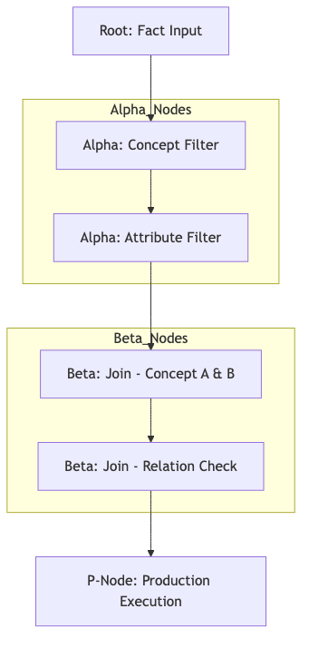

# Sơ đồ mạng lưới nốt Rete

Mạng lưới Rete là cấu trúc đồ thị các nốt được sử dụng để lọc và kết nối các dữ kiện tri thức. Chương này giải thích cách thức tổ chức các nốt Alpha và Beta để xây dựng nên một chuỗi logic thực thi luật dẫn.

## 4.7.3. Phân cấp các Loại nốt trong Đồ thị

Đồ thị Rete của KBMS bao gồm các tầng xử lý dữ liệu sau:

1.  **Nguồn Dữ kiện**: Các sự thật (Facts) được đưa vào từ cổng tiếp nhận duy nhất của đồ thị.
2.  **Alpha nốt (Bộ lọc)**: Chịu trách nhiệm kiểm tra các thuộc tính đơn lẻ của khái niệm tri thức (ví dụ: `ConceptA.name == 'Agent'`).
3.  **Beta nốt (Phép nối)**: Thực hiện việc kết nối dữ liệu từ hai nhánh khác nhau của đồ thị để hình thành các tổ hợp tri thức mới.
4.  **P-Node (Thực thi)**: Điểm cuối của chuỗi logic, nơi kích hoạt các hành động suy diễn khi toàn bộ điều kiện giả thuyết đã thỏa mãn.

*Hình 4.25: Cấu trúc hình học của các nốt Alpha, Beta và P-Node trong mạng Rete.*

## 4.7.4. Phân rã Luật dẫn và Liên kết Nốt

Qu trình xây dựng mạng lưới diễn ra thông qua việc phân tích các điều kiện trong luật dẫn:
-   **Chuỗi Alpha**: Mỗi thuộc tính trong phần giả thuyết của luật được ánh xạ tới một nốt Alpha để lọc dữ liệu.
-   **Chuỗi Beta**: Kết quả từ các nốt Alpha được đưa vào các nốt Beta để thực hiện các phép nối dữ liệu đa biến.

Cơ cấu phân tầng này giúp hệ thống chia sẻ tối đa các nốt xử lý chung giữa nhiều luật dẫn, từ đó giảm thiểu đáng kể số lượng phép toán logic cần thực hiện.
