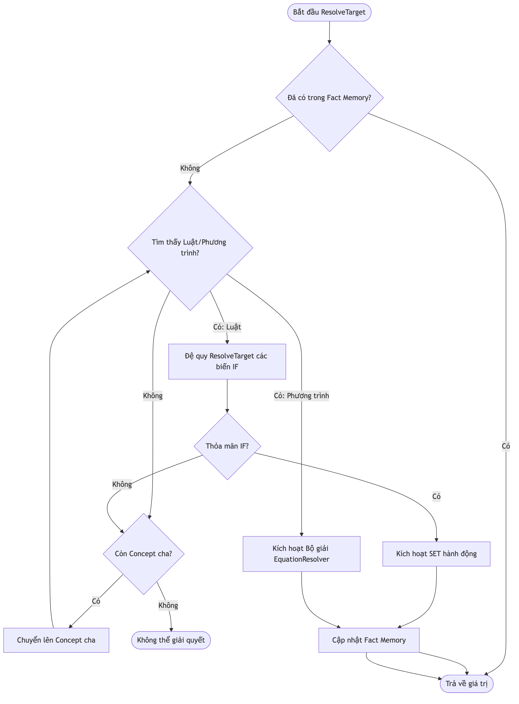

# 4.7.4. Cơ chế Nội suy và Bộ giải Hệ thức

Trong hệ quản trị KBMS, tiến trình nội suy tri thức không chỉ đơn giản là tìm kiếm thông tin có sẵn, mà còn là quá trình tự động xác định các tham số chưa biết thông qua các quy tắc logic và mô hình toán học tích hợp [1]. Hệ thống thực hiện điều này dựa trên hàm đệ quy `ResolveTarget`.

## 1. Cơ chế đệ quy ResolveTarget

Khi nhận được yêu cầu giải quyết một biến số `x` thông qua macro `SOLVE(x)`, hệ thống kích hoạt tiến trình `ResolveTarget`. Luồng quyết định được trình bày như sau:

-   **Thẩm định Sự kiện (Fact Check)**: Hệ thống trước tiên tìm kiếm giá trị của `x` trong `Fact Memory`. Nếu tồn tại, giá trị được trả về ngay lập tức để tiết kiệm chi phí tính toán.
-   **Đệ quy Luật dẫn (Rule Recursion)**: Nếu `x` chưa có giá trị, các luật dẫn (`RULES`) trong Khái niệm sẽ được duyệt qua. Hệ thống đệ quy gọi `ResolveTarget` cho các biến xuất hiện trong phần `IF` của luật. Nếu toàn bộ điều kiện `IF` được thỏa mãn, hành động `SET` sẽ cập nhật giá trị cho `x`.
-   **Tích hợp Hệ thức (Equation Solving)**: Nếu luật dẫn không đưa ra lời giải, hệ thống tìm kiếm biến số trong danh sách `EQUATIONS`. Phân hệ `EquationResolver` sẽ được kích hoạt để cô lập biến số hoặc sử dụng các bộ giải xấp xỉ.
-   **Kế thừa Phân cấp (Hierarchy)**: Nếu không tìm thấy giải pháp tại Khái niệm hiện tại, hệ thống tự động leo lên Khái niệm cha (thông qua quan hệ `IS_A`) để kế thừa các luật và phương trình cần thiết nhằm tiếp tục quá trình nội suy.

*Hình 4.25: Quy trình đệ quy và giải quyết tri thức mục tiêu trong KBMS.*

## 2. Giải thuật EquationResolver và Newton-Raphson 2D

Đối với các bài toán có hệ thức toán học phức tạp hoặc phi tuyến, KBMS tích hợp phương pháp **Newton-Raphson 2D** để xác định giá trị biến số.

1.  **Phân tích Hệ thức**: `EquationResolver` chuyển đổi các phương trình về dạng $f(x, y) = 0$.
2.  **Tính toán Đạo hàm**: Hệ thống xác định ma trận Jacobian dựa trên các đạo hàm riêng của các biến chưa biết.
3.  **Vòng lặp Newton**: Thực hiện các phép lặp để điều chỉnh giá trị của các biến cho đến khi sai số nằm trong phạm vi cho phép (thường là $10^{-6}$).

Phương thức này cho phép KBMS giải quyết được cả các bài toán "ngược" (Xác định đầu vào khi biết kết quả đầu ra), một tính năng hiếm gặp trên các hệ quản trị dữ liệu truyền thống.
